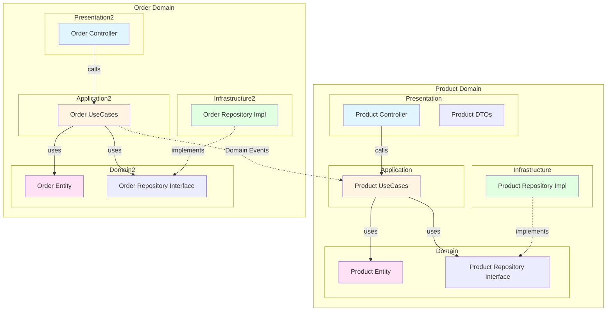
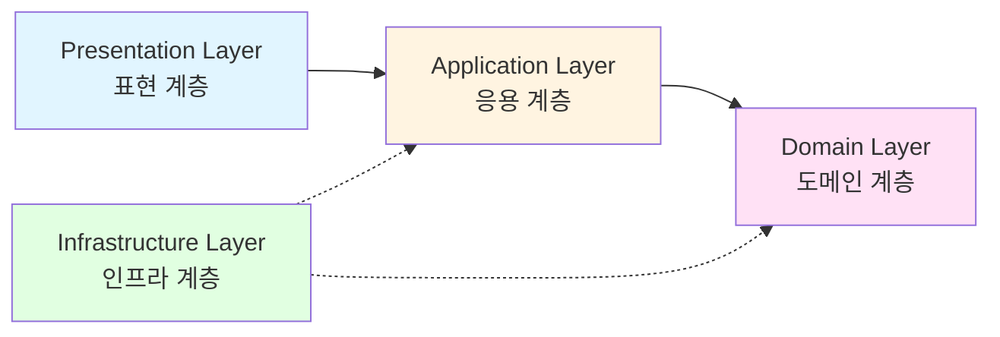
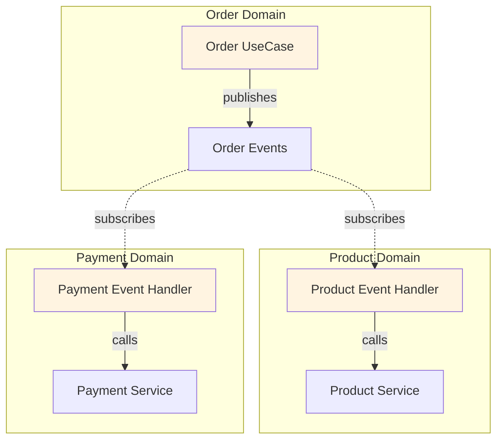
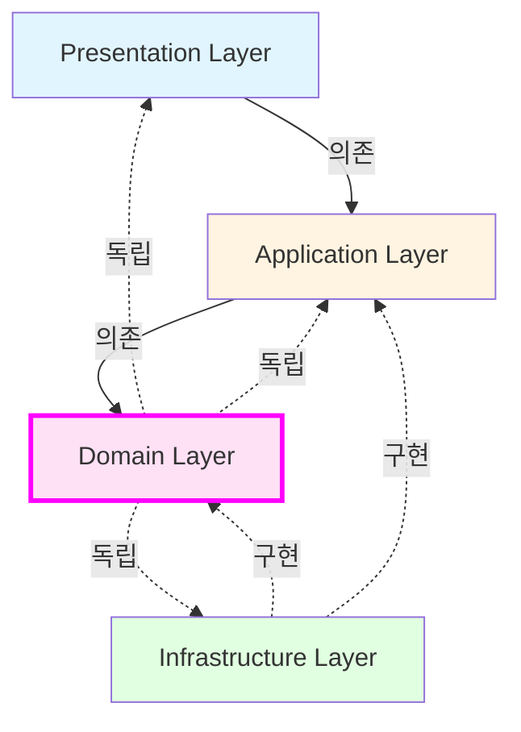
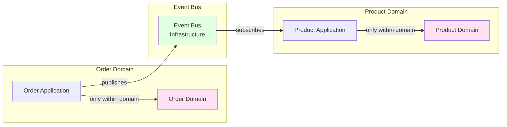
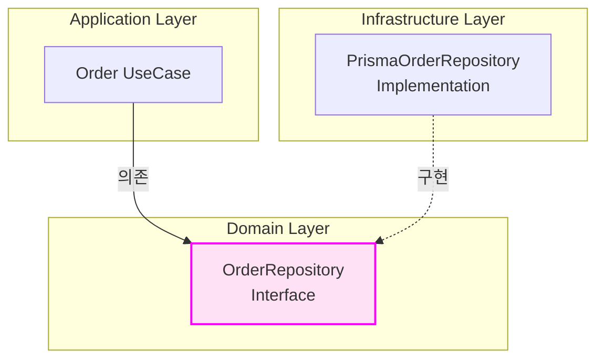
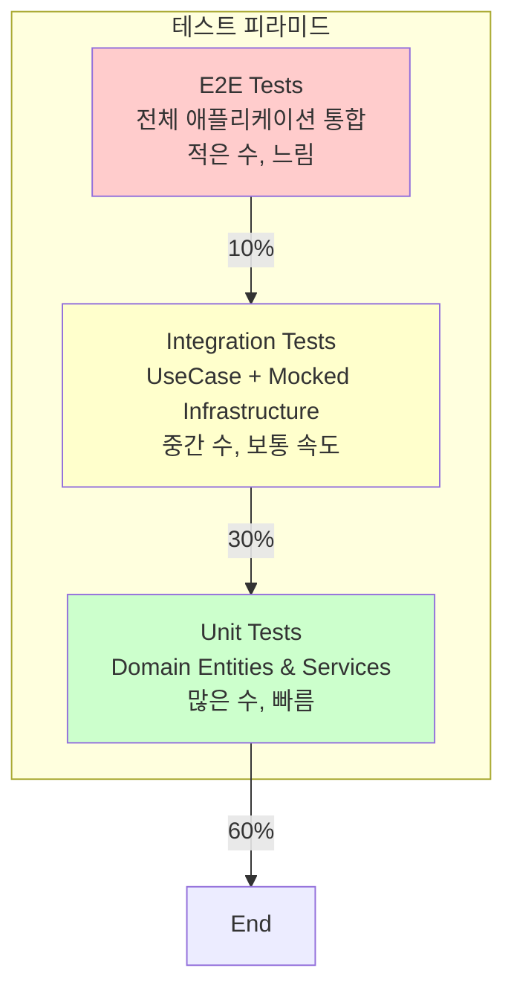
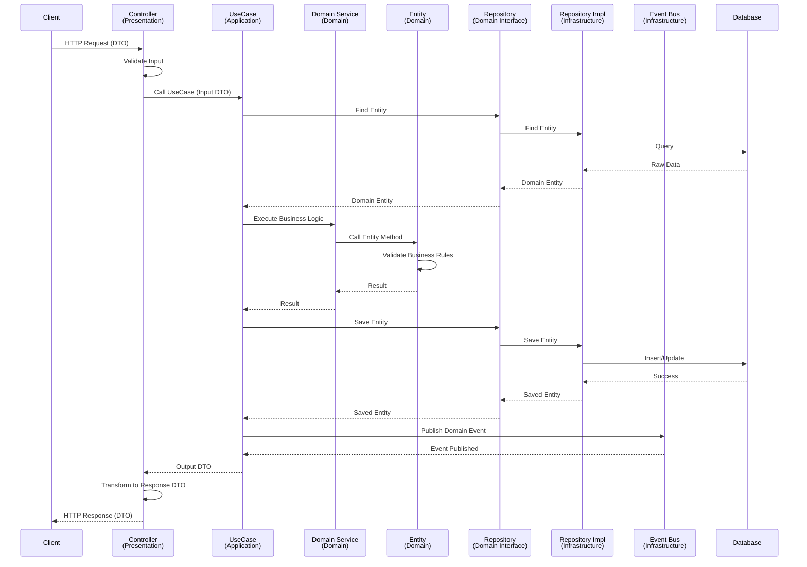

# 레이어드 아키텍처 (Layered Architecture)

**문서 정보**
- **버전**: 2.0.0
- **최종 수정일**: 2025-11-04
- **상태**: Active
- **작성자**: Development Team

---

**문서 네비게이션**
- ⬆️ 상위: [Dashboard 개요](./README.md)
- ⬅️ 이전: [데이터 모델](./data-model.md)
- ➡️ 다음: [Product 유스케이스](./product/use-cases.md)

---

## 목차
1. [개요](#1-개요)
2. [아키텍처 원칙](#2-아키텍처-원칙)
3. [계층 구조](#3-계층-구조)
4. [도메인 중심 아키텍처](#4-도메인-중심-아키텍처)
5. [계층별 상세 설명](#5-계층별-상세-설명)
6. [의존성 규칙](#6-의존성-규칙)
7. [폴더 구조](#7-폴더-구조)
8. [테스트 조직화](#8-테스트-조직화)
9. [계층 간 데이터 흐름](#9-계층-간-데이터-흐름)
10. [Best Practices](#10-best-practices)

---

## 1. 개요

### 1.1 목적
이 문서는 E-Commerce Backend Service의 레이어드 아키텍처 설계를 정의합니다. 레이어드 아키텍처를 통해 관심사의 분리(Separation of Concerns), 테스트 용이성, 유지보수성을 확보합니다.

### 1.2 아키텍처 선택 배경
- **명확한 책임 분리**: 각 계층이 특정 책임만 담당
- **도메인 중심 설계**: 비즈니스 도메인별로 코드를 조직화
- **테스트 용이성**: 계층별 독립적인 단위 테스트 가능
- **유지보수성**: 계층 간 느슨한 결합으로 변경 영향 최소화
- **확장성**: 비즈니스 로직과 기술 구현의 분리로 기술 스택 교체 용이
- **팀 협업**: 도메인별, 계층별로 작업 분담 가능
- **모듈성**: NestJS의 모듈 기반 아키텍처와 자연스러운 정렬

### 1.3 아키텍처 다이어그램



---

## 2. 아키텍처 원칙

### 2.1 핵심 원칙

#### Domain-First Organization (도메인 우선 조직화)
코드는 도메인을 기준으로 먼저 조직화되며, 각 도메인 내에서 계층을 분리합니다.

#### Separation of Concerns (관심사의 분리)
각 계층은 명확히 정의된 단일 책임을 가집니다.

#### Dependency Rule (의존성 규칙)
의존성은 항상 외부에서 내부로 향합니다. 내부 계층은 외부 계층을 알지 못합니다.

```
Presentation → Application → Domain ← Infrastructure
```

#### Domain-Centric (도메인 중심)
비즈니스 로직은 Domain Layer에 집중되며, 다른 계층은 도메인을 지원합니다.

#### Technology Agnostic Domain (기술 독립적 도메인)
Domain Layer는 프레임워크나 라이브러리에 독립적입니다.

#### Bounded Context (제한된 컨텍스트)
각 도메인은 명확한 경계를 가지며, 독립적으로 개발 및 배포 가능합니다. 도메인 간에는 직접적인 의존성을 피하고, Domain Events나 Application Services를 통해 통신합니다.

---

## 3. 계층 구조

### 3.1 계층 개요



| 계층 | 역할 | 주요 컴포넌트 |
|------|------|---------------|
| **Presentation** | 외부 인터페이스, 사용자 요청 처리 | Controller, DTO, Validator |
| **Application** | 유스케이스 구현, 비즈니스 플로우 조정 | UseCase/Service, Transaction Manager |
| **Domain** | 핵심 비즈니스 로직, 비즈니스 규칙 | Entity, Domain Service, Repository Interface |
| **Infrastructure** | 기술 구현, 외부 시스템 연동 | Repository Impl, Database, External API |

---

## 4. 도메인 중심 아키텍처

### 4.1 도메인 우선 접근의 이점

#### 1. 높은 응집도 (High Cohesion)
관련된 코드가 물리적으로 가까이 위치하여 이해하기 쉽고 변경이 용이합니다.

```
product/         # 상품 관련 모든 코드가 한 곳에
├── presentation/
├── application/
├── domain/
└── infrastructure/
```

#### 2. 명확한 경계 (Clear Boundaries)
각 도메인은 독립적인 비즈니스 영역을 나타내며, Bounded Context를 명확히 합니다.

#### 3. 확장성 (Scalability)
- 도메인 단위로 팀을 구성할 수 있음
- 새로운 도메인 추가가 기존 도메인에 영향을 주지 않음
- 필요시 도메인별로 마이크로서비스로 분리 가능

#### 4. NestJS 정렬 (NestJS Alignment)
NestJS의 모듈 기반 아키텍처와 자연스럽게 정렬됩니다.

```typescript
@Module({
  imports: [/* 다른 도메인 모듈 */],
  controllers: [/* 이 도메인의 컨트롤러 */],
  providers: [/* 이 도메인의 서비스 */],
  exports: [/* 다른 도메인에 노출할 서비스 */],
})
export class ProductModule {}
```

#### 5. 개발 효율성
- 도메인별로 독립적인 개발 가능
- 관련 파일 탐색이 빠름
- 새로운 팀원의 온보딩이 쉬움

### 4.2 도메인 식별

프로젝트의 주요 도메인:

| 도메인 | 책임 | 주요 엔티티 |
|--------|------|-------------|
| **Product** | 상품 관리, 재고 조회 | Product, Stock, Category |
| **Cart** | 장바구니 관리 | Cart, CartItem |
| **Order** | 주문 생성 및 관리 | Order, OrderItem |
| **Payment** | 결제 처리 | Payment, PaymentMethod |
| **Coupon** | 쿠폰 관리 및 적용 | Coupon, CouponUsage |
| **User** | 사용자 관리 (향후 추가) | User, UserProfile |

### 4.3 도메인 간 통신



**도메인 간 통신 원칙**:

1. **Domain Events를 통한 비동기 통신** (권장)
   - 도메인 간 결합도 최소화
   - 각 도메인이 독립적으로 진화 가능
   - 이벤트를 통한 느슨한 결합

2. **Application Service를 통한 조정**
   - 여러 도메인을 조합하는 복잡한 유스케이스
   - 트랜잭션 일관성이 필요한 경우
   - Application Layer에서 도메인 간 조율

3. **Read Model 공유** (CQRS 패턴)
   - 조회 전용 데이터는 별도 Read Model로 제공
   - 명령(Command)과 조회(Query) 분리

**금지 사항**:
- ❌ 도메인 간 Entity 직접 import
- ❌ 도메인 간 Repository 직접 의존
- ❌ 순환 의존성

---

## 5. 계층별 상세 설명

### 5.1 Presentation Layer (표현 계층)

#### 책임
- HTTP 요청/응답 처리
- 입력 데이터 검증 (형식, 타입)
- 인증/인가 확인
- DTO 변환 (Request → Application DTO, Domain → Response)
- API 문서화

#### 주요 컴포넌트

**Controller**
```typescript
// src/product/presentation/controllers/product.controller.ts
@Controller('products')
export class ProductController {
  constructor(private readonly getProductsUseCase: GetProductsUseCase) {}

  @Get()
  async getProducts(@Query() query: GetProductsDto): Promise<ProductListResponseDto> {
    // 1. 입력 검증 (Pipe/Validator)
    // 2. UseCase 호출
    const result = await this.getProductsUseCase.execute({
      page: query.page,
      limit: query.limit,
    });

    // 3. 응답 DTO 변환
    return ProductListResponseDto.from(result);
  }
}
```

**DTO (Data Transfer Object)**
```typescript
// src/product/presentation/dtos/get-products.dto.ts
export class GetProductsDto {
  @IsOptional()
  @IsInt()
  @Min(1)
  page?: number;

  @IsOptional()
  @IsInt()
  @Min(1)
  @Max(100)
  limit?: number;
}
```

#### 금지 사항
- ❌ 비즈니스 로직 포함
- ❌ 데이터베이스 직접 접근
- ❌ Domain Entity 직접 노출

---

### 5.2 Application Layer (응용 계층)

#### 책임
- 유스케이스 구현 (비즈니스 플로우 조정)
- 트랜잭션 관리
- Domain Service 및 Repository 조합
- 도메인 간 조정 (여러 도메인 사용)
- 이벤트 발행 및 구독

#### 주요 컴포넌트

**UseCase/Service**
```typescript
// src/order/application/use-cases/create-order.use-case.ts
@Injectable()
export class CreateOrderUseCase {
  constructor(
    private readonly orderRepository: OrderRepository,          // 같은 도메인
    private readonly stockRepository: StockRepository,          // 같은 도메인
    private readonly cartRepository: CartRepository,            // 같은 도메인
    private readonly eventBus: EventBus,                        // 이벤트 발행
    private readonly dataSource: DataSource,
  ) {}

  async execute(input: CreateOrderInput): Promise<CreateOrderOutput> {
    return this.dataSource.transaction(async (em) => {
      // 1. 장바구니 조회
      const cartItems = await this.cartRepository.findByUserId(input.userId, em);

      // 2. 재고 예약 (Domain Service 호출)
      await this.stockService.reserveStock(cartItems, em);

      // 3. 주문 생성 (Domain Entity 활용)
      const order = Order.create(input);
      await this.orderRepository.save(order, em);

      // 4. 장바구니 비우기
      await this.cartRepository.clearByUserId(input.userId, em);

      // 5. 도메인 이벤트 발행 (다른 도메인에 알림)
      await this.eventBus.publish(new OrderCreatedEvent({
        orderId: order.getId(),
        userId: order.getUserId(),
        totalAmount: order.getTotalAmount(),
        items: order.getItems().map(item => ({
          productId: item.getProductId(),
          quantity: item.getQuantity(),
        })),
      }));

      return CreateOrderOutput.from(order);
    });
  }
}
```

**Event Handler (도메인 간 통신)**
```typescript
// src/product/application/event-handlers/order-created.handler.ts
@Injectable()
export class OrderCreatedEventHandler {
  constructor(
    private readonly stockRepository: StockRepository,
  ) {}

  @OnEvent('order.created')
  async handle(event: OrderCreatedEvent): Promise<void> {
    // Order 도메인의 이벤트를 구독하여 Product 도메인에서 처리
    for (const item of event.items) {
      const stock = await this.stockRepository.findByProductId(item.productId);
      stock.confirmReservation(item.quantity);
      await this.stockRepository.save(stock);
    }
  }
}
```

**Input/Output DTOs**
```typescript
// src/order/application/dtos/create-order.input.ts
export class CreateOrderInput {
  userId: string;
  items: Array<{ productId: string; quantity: number }>;
  couponId?: string;
}

// src/order/application/dtos/create-order.output.ts
export class CreateOrderOutput {
  orderId: string;
  totalAmount: number;
  status: string;

  static from(order: Order): CreateOrderOutput {
    return {
      orderId: order.getId(),
      totalAmount: order.getTotalAmount(),
      status: order.getStatus(),
    };
  }
}
```

#### 특징
- **트랜잭션 경계**: Application Layer에서 트랜잭션 시작/종료
- **오케스트레이션**: 여러 Domain Service와 Repository를 조합
- **도메인 간 조정**: 여러 도메인을 사용하는 복잡한 유스케이스 구현
- **얇은 계층**: 비즈니스 로직은 Domain Layer에 위임

#### 금지 사항
- ❌ HTTP 요청/응답 직접 처리
- ❌ 복잡한 비즈니스 로직 (Domain Layer로 이동)
- ❌ Infrastructure 구현 직접 의존

---

### 5.3 Domain Layer (도메인 계층)

#### 책임
- 핵심 비즈니스 로직
- 비즈니스 규칙 검증
- 도메인 모델 정의
- 도메인 이벤트 정의
- 영속성 추상화 (Repository Interface)

#### 주요 컴포넌트

**Entity (Domain Model)**
```typescript
// src/order/domain/entities/order.entity.ts
export class Order {
  private id: string;
  private userId: string;
  private items: OrderItem[];
  private status: OrderStatus;
  private totalAmount: number;
  private createdAt: Date;

  // 팩토리 메서드
  static create(input: CreateOrderInput): Order {
    const order = new Order();
    order.id = uuidv4();
    order.userId = input.userId;
    order.items = input.items.map(item => OrderItem.from(item));
    order.status = OrderStatus.PENDING;
    order.totalAmount = order.calculateTotalAmount();
    order.createdAt = new Date();

    // 비즈니스 규칙 검증
    order.validate();

    return order;
  }

  // 비즈니스 로직
  private calculateTotalAmount(): number {
    return this.items.reduce((sum, item) => sum + item.getSubtotal(), 0);
  }

  // 비즈니스 규칙 검증
  private validate(): void {
    if (this.items.length === 0) {
      throw new DomainException('주문 상품이 없습니다.');
    }
    if (this.totalAmount <= 0) {
      throw new DomainException('주문 금액이 0보다 커야 합니다.');
    }
  }

  // 상태 변경 메서드
  complete(): void {
    if (this.status !== OrderStatus.PENDING) {
      throw new DomainException('대기 상태인 주문만 완료할 수 있습니다.');
    }
    this.status = OrderStatus.COMPLETED;
  }

  // Getters
  getId(): string { return this.id; }
  getUserId(): string { return this.userId; }
  getStatus(): OrderStatus { return this.status; }
  getTotalAmount(): number { return this.totalAmount; }
  getItems(): OrderItem[] { return [...this.items]; }
}
```

**Domain Service**
```typescript
// src/product/domain/services/stock.service.ts
export class StockService {
  constructor(private readonly stockRepository: StockRepository) {}

  // 복잡한 비즈니스 로직 (여러 Entity 협력)
  async reserveStock(
    items: { productId: string; quantity: number }[],
    em: EntityManager,
  ): Promise<void> {
    for (const item of items) {
      const stock = await this.stockRepository.findByProductIdForUpdate(
        item.productId,
        em,
      );

      if (!stock) {
        throw new DomainException(`재고를 찾을 수 없습니다: ${item.productId}`);
      }

      // Entity의 비즈니스 로직 호출
      stock.reserve(item.quantity);

      await this.stockRepository.save(stock, em);
    }
  }
}
```

**Repository Interface**
```typescript
// src/order/domain/repositories/order.repository.ts
export interface OrderRepository {
  findById(id: string, em?: EntityManager): Promise<Order | null>;
  findByUserId(userId: string, em?: EntityManager): Promise<Order[]>;
  save(order: Order, em?: EntityManager): Promise<Order>;
}
```

**Domain Event**
```typescript
// src/order/domain/events/order-created.event.ts
export class OrderCreatedEvent {
  constructor(
    public readonly orderId: string,
    public readonly userId: string,
    public readonly totalAmount: number,
    public readonly items: Array<{ productId: string; quantity: number }>,
    public readonly createdAt: Date = new Date(),
  ) {}
}
```

#### 특징
- **기술 독립적**: 프레임워크, 데이터베이스에 의존하지 않음
- **테스트 용이**: 순수 TypeScript로 테스트 가능
- **재사용 가능**: 다양한 Use Case에서 재사용
- **도메인 독립적**: 다른 도메인을 직접 의존하지 않음

#### 금지 사항
- ❌ 프레임워크 의존성 (NestJS, Prisma 등)
- ❌ HTTP, Database 직접 접근
- ❌ Infrastructure Layer 의존
- ❌ 다른 도메인 Entity 직접 import

---

### 5.4 Infrastructure Layer (인프라 계층)

#### 책임
- Repository 구현 (ORM 사용)
- 데이터베이스 연동
- 외부 API 호출
- 메시지 큐 연동
- 파일 시스템 접근
- 캐시 관리

#### 주요 컴포넌트

**Repository Implementation**
```typescript
// src/order/infrastructure/repositories/prisma-order.repository.ts
@Injectable()
export class PrismaOrderRepository implements OrderRepository {
  constructor(private readonly prisma: PrismaService) {}

  async findById(id: string, em?: EntityManager): Promise<Order | null> {
    const prismaClient = em ? em : this.prisma;

    const orderData = await prismaClient.order.findUnique({
      where: { id },
      include: { items: true },
    });

    if (!orderData) return null;

    // Prisma Model → Domain Entity 변환
    return this.toDomain(orderData);
  }

  async save(order: Order, em?: EntityManager): Promise<Order> {
    const prismaClient = em ? em : this.prisma;

    // Domain Entity → Prisma Model 변환
    const orderData = this.toPersistence(order);

    const saved = await prismaClient.order.create({
      data: orderData,
      include: { items: true },
    });

    return this.toDomain(saved);
  }

  // Domain Entity ↔ Prisma Model 변환
  private toDomain(data: PrismaOrder & { items: PrismaOrderItem[] }): Order {
    return Order.reconstitute({
      id: data.id,
      userId: data.userId,
      items: data.items.map(item => OrderItem.reconstitute({ /* ... */ })),
      status: data.status as OrderStatus,
      totalAmount: data.totalAmount,
      createdAt: data.createdAt,
    });
  }

  private toPersistence(order: Order): PrismaOrderCreateInput {
    return {
      id: order.getId(),
      userId: order.getUserId(),
      status: order.getStatus(),
      totalAmount: order.getTotalAmount(),
      items: {
        create: order.getItems().map(item => ({
          productId: item.getProductId(),
          quantity: item.getQuantity(),
          price: item.getPrice(),
        })),
      },
    };
  }
}
```

**External API Client**
```typescript
// src/payment/infrastructure/clients/external-payment.client.ts
@Injectable()
export class ExternalPaymentClient {
  constructor(private readonly httpService: HttpService) {}

  async processPayment(request: PaymentRequest): Promise<PaymentResponse> {
    const response = await this.httpService
      .post('https://api.payment.com/v1/payments', request)
      .toPromise();

    return response.data;
  }
}
```

#### 특징
- **기술 구현**: 구체적인 기술 스택 사용
- **Domain 구현**: Domain Layer의 인터페이스 구현
- **변환 책임**: Domain Model ↔ Persistence Model 변환

#### 금지 사항
- ❌ 비즈니스 로직 포함
- ❌ Domain Entity 직접 수정

---

## 6. 의존성 규칙

### 6.1 계층 간 의존성



### 6.2 의존성 규칙 상세

| 계층 | 의존 가능 | 의존 불가 |
|------|-----------|-----------|
| **Presentation** | Application | Domain, Infrastructure |
| **Application** | Domain (같은 도메인만) | Presentation, Infrastructure, 다른 도메인의 Domain |
| **Domain** | 없음 (자기 자신만) | Presentation, Application, Infrastructure, 다른 도메인 |
| **Infrastructure** | Domain, Application | Presentation |

### 6.3 도메인 간 의존성



**도메인 간 통신 패턴**:

✅ **GOOD: Domain Events를 통한 통신**
```typescript
// Order Domain - 이벤트 발행
export class CreateOrderUseCase {
  async execute(input: CreateOrderInput): Promise<CreateOrderOutput> {
    const order = Order.create(input);
    await this.orderRepository.save(order);

    // 이벤트 발행 - 다른 도메인에게 알림
    await this.eventBus.publish(new OrderCreatedEvent({
      orderId: order.getId(),
      items: order.getItems().map(item => ({
        productId: item.getProductId(),
        quantity: item.getQuantity(),
      })),
    }));

    return CreateOrderOutput.from(order);
  }
}

// Product Domain - 이벤트 구독
@Injectable()
export class OrderCreatedEventHandler {
  @OnEvent('order.created')
  async handle(event: OrderCreatedEvent): Promise<void> {
    // Product 도메인에서 자체 로직 처리
    for (const item of event.items) {
      const stock = await this.stockRepository.findByProductId(item.productId);
      stock.confirmReservation(item.quantity);
      await this.stockRepository.save(stock);
    }
  }
}
```

✅ **GOOD: Application Service를 통한 조정**
```typescript
// Application Layer에서 여러 도메인 조율
@Injectable()
export class OrderOrchestrationService {
  constructor(
    // 각 도메인의 Use Case만 의존
    private readonly createOrderUseCase: CreateOrderUseCase,
    private readonly reserveStockUseCase: ReserveStockUseCase,
    private readonly processPaymentUseCase: ProcessPaymentUseCase,
  ) {}

  async placeOrder(input: PlaceOrderInput): Promise<PlaceOrderOutput> {
    // 1. 재고 예약 (Product Domain Use Case 호출)
    await this.reserveStockUseCase.execute({
      items: input.items,
    });

    // 2. 주문 생성 (Order Domain Use Case 호출)
    const order = await this.createOrderUseCase.execute({
      userId: input.userId,
      items: input.items,
    });

    // 3. 결제 처리 (Payment Domain Use Case 호출)
    await this.processPaymentUseCase.execute({
      orderId: order.orderId,
      amount: order.totalAmount,
    });

    return PlaceOrderOutput.from(order);
  }
}
```

❌ **BAD: 도메인 간 Repository 직접 의존**
```typescript
// Order Domain에서 Product Domain Repository 직접 의존 - 잘못된 패턴!
export class CreateOrderUseCase {
  constructor(
    private readonly orderRepository: OrderRepository,
    private readonly productRepository: ProductRepository,  // ❌ 다른 도메인 의존
  ) {}
}
```

❌ **BAD: 도메인 간 Entity 직접 import**
```typescript
// Order Domain에서 Product Entity 직접 사용 - 잘못된 패턴!
import { Product } from '../../product/domain/entities/product.entity';  // ❌

export class Order {
  private products: Product[];  // ❌ 다른 도메인 Entity
}
```

### 6.4 Dependency Inversion Principle (DIP)

**문제**: Application Layer가 Infrastructure Layer에 직접 의존하면 테스트와 변경이 어려움

**해결**: Domain Layer에 인터페이스 정의, Infrastructure Layer에서 구현



**코드 예시**:
```typescript
// Domain Layer - 인터페이스 정의
// src/order/domain/repositories/order.repository.ts
export interface OrderRepository {
  findById(id: string): Promise<Order | null>;
  save(order: Order): Promise<Order>;
}

// Application Layer - 인터페이스 의존
// src/order/application/use-cases/create-order.use-case.ts
export class CreateOrderUseCase {
  constructor(private readonly orderRepository: OrderRepository) {}
  // OrderRepository는 Domain Layer의 인터페이스
}

// Infrastructure Layer - 구현
// src/order/infrastructure/repositories/prisma-order.repository.ts
export class PrismaOrderRepository implements OrderRepository {
  // 구현
}

// NestJS Module - DI 설정
// src/order/order.module.ts
@Module({
  providers: [
    {
      provide: 'OrderRepository',
      useClass: PrismaOrderRepository,
    },
    CreateOrderUseCase,
  ],
})
export class OrderModule {}
```

---

## 7. 폴더 구조

### 7.1 전체 폴더 구조 (도메인 우선)

```
src/
├── product/                   # Product Domain
│   ├── presentation/
│   │   ├── controllers/
│   │   │   └── product.controller.ts
│   │   └── dtos/
│   │       ├── get-products.dto.ts
│   │       ├── get-product-detail.dto.ts
│   │       └── product-response.dto.ts
│   ├── application/
│   │   ├── use-cases/
│   │   │   ├── get-products.use-case.ts
│   │   │   ├── get-product-detail.use-case.ts
│   │   │   └── get-popular-products.use-case.ts
│   │   ├── event-handlers/
│   │   │   └── order-created.handler.ts
│   │   └── dtos/
│   │       ├── get-products.input.ts
│   │       └── get-products.output.ts
│   ├── domain/
│   │   ├── entities/
│   │   │   ├── product.entity.ts
│   │   │   ├── stock.entity.ts
│   │   │   └── category.entity.ts
│   │   ├── services/
│   │   │   └── stock.service.ts
│   │   ├── repositories/
│   │   │   ├── product.repository.ts
│   │   │   └── stock.repository.ts
│   │   ├── events/
│   │   │   └── stock-reserved.event.ts
│   │   └── exceptions/
│   │       └── insufficient-stock.exception.ts
│   ├── infrastructure/
│   │   └── repositories/
│   │       ├── prisma-product.repository.ts
│   │       └── prisma-stock.repository.ts
│   └── product.module.ts      # NestJS Module
│
├── cart/                      # Cart Domain
│   ├── presentation/
│   │   ├── controllers/
│   │   │   └── cart.controller.ts
│   │   └── dtos/
│   │       ├── add-cart-item.dto.ts
│   │       └── cart-response.dto.ts
│   ├── application/
│   │   └── use-cases/
│   │       ├── add-cart-item.use-case.ts
│   │       ├── update-cart-item.use-case.ts
│   │       └── remove-cart-item.use-case.ts
│   ├── domain/
│   │   ├── entities/
│   │   │   ├── cart.entity.ts
│   │   │   └── cart-item.entity.ts
│   │   └── repositories/
│   │       └── cart.repository.ts
│   ├── infrastructure/
│   │   └── repositories/
│   │       └── prisma-cart.repository.ts
│   └── cart.module.ts
│
├── order/                     # Order Domain
│   ├── presentation/
│   │   ├── controllers/
│   │   │   └── order.controller.ts
│   │   └── dtos/
│   │       ├── create-order.dto.ts
│   │       └── order-response.dto.ts
│   ├── application/
│   │   ├── use-cases/
│   │   │   ├── create-order.use-case.ts
│   │   │   ├── get-order.use-case.ts
│   │   │   └── list-orders.use-case.ts
│   │   └── services/
│   │       └── order-orchestration.service.ts
│   ├── domain/
│   │   ├── entities/
│   │   │   ├── order.entity.ts
│   │   │   ├── order-item.entity.ts
│   │   │   └── order-status.enum.ts
│   │   ├── services/
│   │   │   └── order.service.ts
│   │   ├── repositories/
│   │   │   └── order.repository.ts
│   │   └── events/
│   │       └── order-created.event.ts
│   ├── infrastructure/
│   │   └── repositories/
│   │       └── prisma-order.repository.ts
│   └── order.module.ts
│
├── payment/                   # Payment Domain
│   ├── presentation/
│   │   └── controllers/
│   │       └── payment.controller.ts
│   ├── application/
│   │   ├── use-cases/
│   │   │   ├── process-payment.use-case.ts
│   │   │   └── verify-payment.use-case.ts
│   │   └── event-handlers/
│   │       └── order-created.handler.ts
│   ├── domain/
│   │   ├── entities/
│   │   │   ├── payment.entity.ts
│   │   │   └── payment-method.enum.ts
│   │   └── repositories/
│   │       └── payment.repository.ts
│   ├── infrastructure/
│   │   ├── repositories/
│   │   │   └── prisma-payment.repository.ts
│   │   └── clients/
│   │       └── external-payment.client.ts
│   └── payment.module.ts
│
├── coupon/                    # Coupon Domain
│   ├── presentation/
│   │   └── controllers/
│   │       └── coupon.controller.ts
│   ├── application/
│   │   └── use-cases/
│   │       ├── issue-coupon.use-case.ts
│   │       └── apply-coupon.use-case.ts
│   ├── domain/
│   │   ├── entities/
│   │   │   ├── coupon.entity.ts
│   │   │   └── coupon-usage.entity.ts
│   │   ├── services/
│   │   │   └── coupon.service.ts
│   │   └── repositories/
│   │       └── coupon.repository.ts
│   ├── infrastructure/
│   │   └── repositories/
│   │       └── prisma-coupon.repository.ts
│   └── coupon.module.ts
│
├── shared/                    # Shared Code
│   ├── domain/
│   │   ├── base-entity.ts
│   │   ├── value-objects/
│   │   │   ├── money.vo.ts
│   │   │   └── date-range.vo.ts
│   │   └── exceptions/
│   │       └── domain.exception.ts
│   ├── infrastructure/
│   │   ├── database/
│   │   │   ├── prisma.service.ts
│   │   │   └── prisma.module.ts
│   │   ├── events/
│   │   │   ├── event-bus.ts
│   │   │   └── event-bus.module.ts
│   │   └── config/
│   │       └── database.config.ts
│   └── utils/
│       └── date.util.ts
│
├── app.module.ts              # Root Module
└── main.ts                    # Application Entry Point
```

### 7.2 NestJS 모듈 구조

각 도메인은 독립적인 NestJS 모듈로 구성됩니다:

```typescript
// src/product/product.module.ts
@Module({
  imports: [
    PrismaModule,              // Shared infrastructure
    EventBusModule,            // Event communication
  ],
  controllers: [
    ProductController,         // Presentation layer
  ],
  providers: [
    // Application layer
    GetProductsUseCase,
    GetProductDetailUseCase,
    GetPopularProductsUseCase,
    OrderCreatedEventHandler,  // Event handler

    // Domain layer
    StockService,

    // Infrastructure layer (DI binding)
    {
      provide: 'ProductRepository',
      useClass: PrismaProductRepository,
    },
    {
      provide: 'StockRepository',
      useClass: PrismaStockRepository,
    },
  ],
  exports: [
    // 필요시 Use Case만 export (Repository는 export 안 함)
    GetProductsUseCase,
  ],
})
export class ProductModule {}
```

**중요 원칙**:
- ✅ Use Case는 export 가능 (다른 도메인의 Application Layer에서 사용)
- ❌ Repository는 export 하지 않음 (도메인 경계 유지)
- ✅ Event Handler를 통한 도메인 간 통신

### 7.3 대안: 계층 우선 구조 (소규모 프로젝트)

도메인이 많지 않고 프로젝트 규모가 작은 경우 계층 우선 구조도 고려 가능:

```
src/
├── presentation/
│   ├── product/
│   ├── order/
│   └── cart/
├── application/
│   ├── product/
│   ├── order/
│   └── cart/
├── domain/
│   ├── product/
│   ├── order/
│   └── cart/
└── infrastructure/
    ├── product/
    ├── order/
    └── cart/
```

**선택 기준**:
- **도메인 우선 (권장)**: 중대형 프로젝트, 명확한 도메인 경계, 팀 분업
- **계층 우선**: 소규모 프로젝트, 도메인이 2-3개 이하

---

## 8. 테스트 조직화

### 8.1 테스트 전략



### 8.2 테스트 폴더 구조

테스트 코드는 `src/` 구조를 미러링하여 `test/` 디렉토리에 조직화합니다:

```
test/
├── product/                          # Product Domain Tests
│   ├── domain/                       # Unit Tests (Domain Layer)
│   │   ├── product.entity.spec.ts
│   │   ├── stock.entity.spec.ts
│   │   └── stock.service.spec.ts
│   ├── application/                  # Integration Tests (Application Layer)
│   │   ├── get-products.use-case.integration.spec.ts
│   │   ├── get-product-detail.use-case.integration.spec.ts
│   │   └── get-popular-products.use-case.integration.spec.ts
│   └── presentation/                 # E2E Tests (Presentation Layer)
│       └── product.controller.e2e.spec.ts
│
├── cart/                             # Cart Domain Tests
│   ├── domain/
│   │   ├── cart.entity.spec.ts
│   │   └── cart-item.entity.spec.ts
│   ├── application/
│   │   ├── add-cart-item.use-case.integration.spec.ts
│   │   ├── update-cart-item.use-case.integration.spec.ts
│   │   └── remove-cart-item.use-case.integration.spec.ts
│   └── presentation/
│       └── cart.controller.e2e.spec.ts
│
├── order/                            # Order Domain Tests
│   ├── domain/
│   │   ├── order.entity.spec.ts
│   │   ├── order-item.entity.spec.ts
│   │   └── order.service.spec.ts
│   ├── application/
│   │   ├── create-order.use-case.integration.spec.ts
│   │   ├── get-order.use-case.integration.spec.ts
│   │   └── list-orders.use-case.integration.spec.ts
│   └── presentation/
│       └── order.controller.e2e.spec.ts
│
├── payment/
│   ├── domain/
│   ├── application/
│   └── presentation/
│
├── coupon/
│   ├── domain/
│   ├── application/
│   └── presentation/
│
└── shared/                           # Shared Test Utilities
    ├── fixtures/
    │   ├── product.fixture.ts
    │   ├── order.fixture.ts
    │   └── user.fixture.ts
    ├── mocks/
    │   ├── mock-repositories.ts
    │   └── mock-services.ts
    └── helpers/
        └── test-database.helper.ts
```

### 8.3 테스트 유형 및 명명 규칙

| 테스트 유형 | 계층 | 파일 패턴 | 위치 | 특징 |
|------------|------|-----------|------|------|
| **Unit Test** | Domain | `*.spec.ts` | `test/{domain}/domain/` | 빠름, 독립적, Mock 최소 |
| **Integration Test** | Application | `*.integration.spec.ts` | `test/{domain}/application/` | 보통 속도, Repository Mock |
| **E2E Test** | Presentation | `*.e2e.spec.ts` | `test/{domain}/presentation/` | 느림, 전체 스택, 실제 DB |

### 8.4 테스트 예시

#### Unit Test (Domain Entity)

```typescript
// test/product/domain/stock.entity.spec.ts
describe('Stock Entity', () => {
  describe('reserve', () => {
    it('should reserve stock successfully when available quantity is sufficient', () => {
      // Given
      const stock = Stock.create({
        productId: 'product-1',
        availableQuantity: 10,
        reservedQuantity: 0,
        soldQuantity: 0,
      });

      // When
      stock.reserve(5);

      // Then
      expect(stock.getAvailableQuantity()).toBe(5);
      expect(stock.getReservedQuantity()).toBe(5);
    });

    it('should throw InsufficientStockException when available quantity is insufficient', () => {
      // Given
      const stock = Stock.create({
        productId: 'product-1',
        availableQuantity: 3,
        reservedQuantity: 0,
        soldQuantity: 0,
      });

      // When & Then
      expect(() => stock.reserve(5)).toThrow(InsufficientStockException);
      expect(() => stock.reserve(5)).toThrow('재고 부족: 요청 5, 재고 3');
    });

    it('should throw DomainException when quantity is zero or negative', () => {
      // Given
      const stock = Stock.create({
        productId: 'product-1',
        availableQuantity: 10,
        reservedQuantity: 0,
        soldQuantity: 0,
      });

      // When & Then
      expect(() => stock.reserve(0)).toThrow(DomainException);
      expect(() => stock.reserve(-5)).toThrow(DomainException);
    });
  });

  describe('confirm', () => {
    it('should confirm reserved stock successfully', () => {
      // Given
      const stock = Stock.create({
        productId: 'product-1',
        availableQuantity: 5,
        reservedQuantity: 5,
        soldQuantity: 0,
      });

      // When
      stock.confirm(5);

      // Then
      expect(stock.getReservedQuantity()).toBe(0);
      expect(stock.getSoldQuantity()).toBe(5);
    });
  });
});
```

#### Integration Test (UseCase)

```typescript
// test/order/application/create-order.use-case.integration.spec.ts
describe('CreateOrderUseCase (Integration)', () => {
  let useCase: CreateOrderUseCase;
  let orderRepository: jest.Mocked<OrderRepository>;
  let stockRepository: jest.Mocked<StockRepository>;
  let cartRepository: jest.Mocked<CartRepository>;
  let eventBus: jest.Mocked<EventBus>;
  let dataSource: jest.Mocked<DataSource>;

  beforeEach(() => {
    // Create mocks
    orderRepository = createMock<OrderRepository>();
    stockRepository = createMock<StockRepository>();
    cartRepository = createMock<CartRepository>();
    eventBus = createMock<EventBus>();
    dataSource = createMock<DataSource>();

    // Setup transaction mock
    dataSource.transaction.mockImplementation(async (callback) => {
      return await callback(null);
    });

    // Create use case with mocked dependencies
    useCase = new CreateOrderUseCase(
      orderRepository,
      stockRepository,
      cartRepository,
      eventBus,
      dataSource,
    );
  });

  it('should create order successfully and publish event', async () => {
    // Given
    const input: CreateOrderInput = {
      userId: 'user-1',
      items: [
        { productId: 'product-1', quantity: 2 },
        { productId: 'product-2', quantity: 1 },
      ],
    };

    const mockStock1 = Stock.create({
      productId: 'product-1',
      availableQuantity: 10,
      reservedQuantity: 0,
      soldQuantity: 0,
    });

    const mockStock2 = Stock.create({
      productId: 'product-2',
      availableQuantity: 5,
      reservedQuantity: 0,
      soldQuantity: 0,
    });

    stockRepository.findByProductIdForUpdate
      .mockResolvedValueOnce(mockStock1)
      .mockResolvedValueOnce(mockStock2);

    orderRepository.save.mockImplementation(async (order) => order);

    // When
    const result = await useCase.execute(input);

    // Then
    expect(result.orderId).toBeDefined();
    expect(result.status).toBe('PENDING');
    expect(orderRepository.save).toHaveBeenCalledTimes(1);
    expect(stockRepository.save).toHaveBeenCalledTimes(2);
    expect(cartRepository.clearByUserId).toHaveBeenCalledWith('user-1', null);

    // Event should be published
    expect(eventBus.publish).toHaveBeenCalledWith(
      expect.objectContaining({
        orderId: result.orderId,
        userId: 'user-1',
      })
    );
  });

  it('should throw InsufficientStockException when stock is not enough', async () => {
    // Given
    const input: CreateOrderInput = {
      userId: 'user-1',
      items: [{ productId: 'product-1', quantity: 20 }],
    };

    const mockStock = Stock.create({
      productId: 'product-1',
      availableQuantity: 10,
      reservedQuantity: 0,
      soldQuantity: 0,
    });

    stockRepository.findByProductIdForUpdate.mockResolvedValue(mockStock);

    // When & Then
    await expect(useCase.execute(input)).rejects.toThrow(InsufficientStockException);
    expect(orderRepository.save).not.toHaveBeenCalled();
    expect(eventBus.publish).not.toHaveBeenCalled();
  });
});
```

#### E2E Test (Controller)

```typescript
// test/product/presentation/product.controller.e2e.spec.ts
describe('ProductController (E2E)', () => {
  let app: INestApplication;
  let prisma: PrismaService;

  beforeAll(async () => {
    const moduleFixture: TestingModule = await Test.createTestingModule({
      imports: [AppModule],
    }).compile();

    app = moduleFixture.createNestApplication();
    prisma = moduleFixture.get<PrismaService>(PrismaService);

    await app.init();
  });

  afterAll(async () => {
    await prisma.$disconnect();
    await app.close();
  });

  beforeEach(async () => {
    // Clean database
    await prisma.product.deleteMany();
  });

  describe('GET /products', () => {
    it('should return list of products', async () => {
      // Given
      await prisma.product.createMany({
        data: [
          { id: 'product-1', name: 'Product 1', price: 1000, stock: 10 },
          { id: 'product-2', name: 'Product 2', price: 2000, stock: 20 },
        ],
      });

      // When
      const response = await request(app.getHttpServer())
        .get('/products')
        .expect(200);

      // Then
      expect(response.body.success).toBe(true);
      expect(response.body.data.items).toHaveLength(2);
      expect(response.body.data.items[0].name).toBe('Product 1');
    });

    it('should return paginated products', async () => {
      // Given
      await prisma.product.createMany({
        data: Array.from({ length: 25 }, (_, i) => ({
          id: `product-${i}`,
          name: `Product ${i}`,
          price: 1000 * (i + 1),
          stock: 10,
        })),
      });

      // When
      const response = await request(app.getHttpServer())
        .get('/products?page=2&limit=10')
        .expect(200);

      // Then
      expect(response.body.data.items).toHaveLength(10);
      expect(response.body.data.pagination.currentPage).toBe(2);
      expect(response.body.data.pagination.totalPages).toBe(3);
    });
  });

  describe('GET /products/:id', () => {
    it('should return product detail', async () => {
      // Given
      await prisma.product.create({
        data: {
          id: 'product-1',
          name: 'Product 1',
          price: 1000,
          stock: 10,
          description: 'Product description',
        },
      });

      // When
      const response = await request(app.getHttpServer())
        .get('/products/product-1')
        .expect(200);

      // Then
      expect(response.body.success).toBe(true);
      expect(response.body.data.id).toBe('product-1');
      expect(response.body.data.name).toBe('Product 1');
      expect(response.body.data.description).toBe('Product description');
    });

    it('should return 404 when product not found', async () => {
      // When & Then
      await request(app.getHttpServer())
        .get('/products/non-existent')
        .expect(404);
    });
  });
});
```

### 8.5 테스트 모범 사례

#### 1. Test Fixtures 사용

```typescript
// test/shared/fixtures/product.fixture.ts
export class ProductFixture {
  static create(overrides?: Partial<Product>): Product {
    return Product.create({
      name: 'Test Product',
      price: 1000,
      stock: 10,
      description: 'Test description',
      ...overrides,
    });
  }

  static createMultiple(count: number): Product[] {
    return Array.from({ length: count }, (_, i) =>
      ProductFixture.create({
        name: `Product ${i + 1}`,
        price: 1000 * (i + 1),
      })
    );
  }
}
```

#### 2. Mock Helpers 작성

```typescript
// test/shared/mocks/mock-repositories.ts
export function createMockProductRepository(): jest.Mocked<ProductRepository> {
  return {
    findById: jest.fn(),
    findAll: jest.fn(),
    save: jest.fn(),
    delete: jest.fn(),
  };
}
```

#### 3. Given-When-Then 패턴 사용

```typescript
it('should do something', async () => {
  // Given: 테스트 준비
  const input = { /* ... */ };
  const expectedResult = { /* ... */ };

  // When: 테스트 실행
  const result = await useCase.execute(input);

  // Then: 결과 검증
  expect(result).toEqual(expectedResult);
});
```

### 8.6 Jest 설정

```javascript
// jest.config.js
module.exports = {
  moduleFileExtensions: ['js', 'json', 'ts'],
  rootDir: '.',
  testRegex: '.*\\.spec\\.ts$',
  transform: {
    '^.+\\.(t|j)s$': 'ts-jest',
  },
  collectCoverageFrom: [
    'src/**/*.(t|j)s',
    '!src/**/*.module.ts',
    '!src/main.ts',
    '!src/**/*.dto.ts',
  ],
  coverageDirectory: './coverage',
  testEnvironment: 'node',
  roots: ['<rootDir>/src/', '<rootDir>/test/'],
  moduleNameMapper: {
    '^@/(.*)$': '<rootDir>/src/$1',
    '^@test/(.*)$': '<rootDir>/test/$1',
  },
};
```

---

## 9. 계층 간 데이터 흐름

### 9.1 일반적인 요청 흐름



### 9.2 데이터 변환 지점



```mermaid
graph LR
    A[Client JSON] -->|Deserialize| B[Request DTO]
    B -->|Map| C[Input DTO]
    C -->|Use in| D[UseCase]
    D -->|Create/Update| E[Domain Entity]
    E -->|Persist| F[Persistence Model]
    F -->|Store| G[Database]

    G -->|Retrieve| F2[Persistence Model]
    F2 -->|Map| E2[Domain Entity]
    E2 -->|Transform| C2[Output DTO]
    C2 -->|Map| B2[Response DTO]
    B2 -->|Serialize| A2[Client JSON]

    style E fill:#ffe1f5
    style E2 fill:#ffe1f5
```

**변환 계층**:
1. **Presentation**: Client JSON ↔ Request/Response DTO
2. **Application**: Request DTO → Input DTO, Domain Entity → Output DTO → Response DTO
3. **Domain**: 비즈니스 로직 수행 (변환 없음)
4. **Infrastructure**: Domain Entity ↔ Persistence Model

---

## 10. Best Practices

### 10.1 Controller (Presentation)

✅ **DO**
```typescript
// src/order/presentation/controllers/order.controller.ts
@Controller('orders')
export class OrderController {
  constructor(private readonly createOrderUseCase: CreateOrderUseCase) {}

  @Post()
  @HttpCode(201)
  async createOrder(
    @Body() dto: CreateOrderRequestDto,
    @CurrentUser() user: User,
  ): Promise<OrderResponseDto> {
    // 1. DTO 검증은 자동 (ValidationPipe)
    // 2. UseCase 호출
    const result = await this.createOrderUseCase.execute({
      userId: user.id,
      items: dto.items,
    });

    // 3. Response DTO 변환
    return OrderResponseDto.from(result);
  }
}
```

❌ **DON'T**
```typescript
// 비즈니스 로직을 Controller에 포함하지 않기
@Post()
async createOrder(@Body() dto: CreateOrderRequestDto) {
  // ❌ 비즈니스 로직
  const stock = await this.stockRepository.findByProductId(dto.productId);
  if (stock.availableQuantity < dto.quantity) {
    throw new BadRequestException('재고 부족');
  }

  // ❌ 직접 Repository 호출
  const order = await this.orderRepository.create({...});
}
```

### 10.2 UseCase (Application)

✅ **DO**
```typescript
// src/order/application/use-cases/create-order.use-case.ts
@Injectable()
export class CreateOrderUseCase {
  constructor(
    private readonly orderRepository: OrderRepository,
    private readonly stockService: StockService,
    private readonly eventBus: EventBus,
    private readonly dataSource: DataSource,
  ) {}

  async execute(input: CreateOrderInput): Promise<CreateOrderOutput> {
    // 트랜잭션 시작
    return this.dataSource.transaction(async (em) => {
      // 1. 재고 예약 (Domain Service에 위임)
      await this.stockService.reserveStock(input.items, em);

      // 2. 주문 생성 (Entity 팩토리 메서드 사용)
      const order = Order.create(input);

      // 3. 주문 저장
      const savedOrder = await this.orderRepository.save(order, em);

      // 4. 도메인 이벤트 발행
      await this.eventBus.publish(new OrderCreatedEvent({
        orderId: savedOrder.getId(),
        userId: savedOrder.getUserId(),
        items: savedOrder.getItems().map(item => ({
          productId: item.getProductId(),
          quantity: item.getQuantity(),
        })),
      }));

      // 5. Output DTO 반환
      return CreateOrderOutput.from(savedOrder);
    });
  }
}
```

❌ **DON'T**
```typescript
// 복잡한 비즈니스 로직을 UseCase에 직접 작성하지 않기
async execute(input: CreateOrderInput): Promise<CreateOrderOutput> {
  // ❌ 복잡한 비즈니스 로직 (Domain Service로 이동해야 함)
  for (const item of input.items) {
    const stock = await this.stockRepository.findById(item.stockId);
    if (stock.availableQuantity < item.quantity) {
      throw new InsufficientStockException();
    }
    stock.availableQuantity -= item.quantity;
    stock.reservedQuantity += item.quantity;
    await this.stockRepository.save(stock);
  }

  // ❌ Entity 생성 로직 (Entity 팩토리 메서드로 이동해야 함)
  const order = new Order();
  order.id = uuidv4();
  order.userId = input.userId;
  order.items = input.items.map(item => ({...}));
  order.totalAmount = input.items.reduce((sum, item) => sum + item.price * item.quantity, 0);
}
```

### 10.3 Entity (Domain)

✅ **DO**
```typescript
// src/product/domain/entities/stock.entity.ts
export class Stock {
  private id: string;
  private productId: string;
  private availableQuantity: number;
  private reservedQuantity: number;
  private soldQuantity: number;

  // 비즈니스 로직을 Entity 메서드로
  reserve(quantity: number): void {
    // 비즈니스 규칙 검증
    if (quantity <= 0) {
      throw new DomainException('예약 수량은 0보다 커야 합니다.');
    }

    if (this.availableQuantity < quantity) {
      throw new InsufficientStockException(
        `재고 부족: 요청 ${quantity}, 재고 ${this.availableQuantity}`
      );
    }

    // 상태 변경
    this.availableQuantity -= quantity;
    this.reservedQuantity += quantity;
  }

  confirm(quantity: number): void {
    if (this.reservedQuantity < quantity) {
      throw new DomainException('예약된 재고가 부족합니다.');
    }

    this.reservedQuantity -= quantity;
    this.soldQuantity += quantity;
  }

  release(quantity: number): void {
    if (this.reservedQuantity < quantity) {
      throw new DomainException('예약된 재고가 부족합니다.');
    }

    this.reservedQuantity -= quantity;
    this.availableQuantity += quantity;
  }

  // Getters
  getAvailableQuantity(): number { return this.availableQuantity; }
  getReservedQuantity(): number { return this.reservedQuantity; }
  getSoldQuantity(): number { return this.soldQuantity; }
}
```

❌ **DON'T**
```typescript
// Anemic Domain Model (빈약한 도메인 모델)
export class Stock {
  id: string;
  productId: string;
  availableQuantity: number;
  reservedQuantity: number;
  soldQuantity: number;

  // ❌ Getter/Setter만 있고 비즈니스 로직 없음
}

// ❌ 비즈니스 로직이 Service에 있음
export class StockService {
  reserve(stock: Stock, quantity: number): void {
    if (stock.availableQuantity < quantity) {
      throw new InsufficientStockException();
    }
    stock.availableQuantity -= quantity;
    stock.reservedQuantity += quantity;
  }
}
```

### 10.4 Repository (Domain → Infrastructure)

✅ **DO**
```typescript
// Domain Layer - Interface
// src/order/domain/repositories/order.repository.ts
export interface OrderRepository {
  findById(id: string, em?: EntityManager): Promise<Order | null>;
  findByUserId(userId: string, em?: EntityManager): Promise<Order[]>;
  save(order: Order, em?: EntityManager): Promise<Order>;
}

// Infrastructure Layer - Implementation
// src/order/infrastructure/repositories/prisma-order.repository.ts
@Injectable()
export class PrismaOrderRepository implements OrderRepository {
  constructor(private readonly prisma: PrismaService) {}

  async findById(id: string, em?: EntityManager): Promise<Order | null> {
    const prismaClient = em ?? this.prisma;
    const data = await prismaClient.order.findUnique({
      where: { id },
      include: { items: true },
    });

    return data ? this.toDomain(data) : null;
  }

  // Mapper: Persistence Model → Domain Entity
  private toDomain(data: PrismaOrder & { items: PrismaOrderItem[] }): Order {
    return Order.reconstitute({
      id: data.id,
      userId: data.userId,
      items: data.items.map(item => OrderItem.reconstitute({...})),
      status: data.status as OrderStatus,
      totalAmount: data.totalAmount,
      createdAt: data.createdAt,
    });
  }

  // Mapper: Domain Entity → Persistence Model
  private toPersistence(order: Order): PrismaOrderCreateInput {
    return {
      id: order.getId(),
      userId: order.getUserId(),
      status: order.getStatus(),
      totalAmount: order.getTotalAmount(),
      items: {
        create: order.getItems().map(item => ({...})),
      },
    };
  }
}
```

### 10.5 트랜잭션 관리

✅ **DO**
```typescript
// Application Layer에서 트랜잭션 관리
@Injectable()
export class CreateOrderUseCase {
  constructor(private readonly dataSource: DataSource) {}

  async execute(input: CreateOrderInput): Promise<CreateOrderOutput> {
    return this.dataSource.transaction(async (em) => {
      // 모든 Repository 호출에 EntityManager 전달
      await this.stockRepository.reserve(input.items, em);
      const order = await this.orderRepository.save(orderEntity, em);
      await this.cartRepository.clear(input.userId, em);

      return CreateOrderOutput.from(order);
    });
  }
}
```

❌ **DON'T**
```typescript
// ❌ Domain Service에서 트랜잭션 관리하지 않기
export class OrderService {
  async createOrder(input: CreateOrderInput): Promise<Order> {
    // ❌ Domain Service가 트랜잭션을 관리하면 재사용성이 떨어짐
    return this.dataSource.transaction(async (em) => {
      // ...
    });
  }
}
```

### 10.6 도메인 모듈 구성

✅ **DO**
```typescript
// src/product/product.module.ts
@Module({
  imports: [
    PrismaModule,                      // Shared infrastructure
    EventBusModule,                    // Event communication
  ],
  controllers: [
    ProductController,                 // 이 도메인의 컨트롤러만
  ],
  providers: [
    // Use Cases
    GetProductsUseCase,
    GetProductDetailUseCase,

    // Event Handlers
    OrderCreatedEventHandler,

    // Domain Services
    StockService,

    // Repository bindings
    {
      provide: 'ProductRepository',
      useClass: PrismaProductRepository,
    },
    {
      provide: 'StockRepository',
      useClass: PrismaStockRepository,
    },
  ],
  exports: [
    // Use Case만 export (필요시)
    GetProductsUseCase,
    // Repository는 export 하지 않음!
  ],
})
export class ProductModule {}
```

### 10.7 도메인 간 통신

✅ **DO: Event를 통한 통신**
```typescript
// Order Domain - 이벤트 발행
@Injectable()
export class CreateOrderUseCase {
  constructor(private readonly eventBus: EventBus) {}

  async execute(input: CreateOrderInput): Promise<CreateOrderOutput> {
    const order = Order.create(input);
    await this.orderRepository.save(order);

    // 이벤트 발행
    await this.eventBus.publish(new OrderCreatedEvent({
      orderId: order.getId(),
      items: order.getItems().map(item => ({
        productId: item.getProductId(),
        quantity: item.getQuantity(),
      })),
    }));

    return CreateOrderOutput.from(order);
  }
}

// Product Domain - 이벤트 구독
@Injectable()
export class OrderCreatedEventHandler {
  constructor(private readonly stockRepository: StockRepository) {}

  @OnEvent('order.created')
  async handle(event: OrderCreatedEvent): Promise<void> {
    for (const item of event.items) {
      const stock = await this.stockRepository.findByProductId(item.productId);
      stock.confirmReservation(item.quantity);
      await this.stockRepository.save(stock);
    }
  }
}
```

✅ **DO: Application Service를 통한 조정**
```typescript
// Application Layer에서 여러 도메인 조율
@Injectable()
export class OrderOrchestrationService {
  constructor(
    // 각 도메인의 Use Case 의존
    private readonly createOrderUseCase: CreateOrderUseCase,
    private readonly reserveStockUseCase: ReserveStockUseCase,
    private readonly processPaymentUseCase: ProcessPaymentUseCase,
  ) {}

  async placeOrder(input: PlaceOrderInput): Promise<PlaceOrderOutput> {
    // 여러 도메인의 Use Case 조합
    await this.reserveStockUseCase.execute({ items: input.items });
    const order = await this.createOrderUseCase.execute({ userId: input.userId, items: input.items });
    await this.processPaymentUseCase.execute({ orderId: order.orderId, amount: order.totalAmount });

    return PlaceOrderOutput.from(order);
  }
}
```

❌ **DON'T: Repository 직접 의존**
```typescript
// ❌ 다른 도메인의 Repository를 직접 의존하지 않기
@Injectable()
export class CreateOrderUseCase {
  constructor(
    private readonly orderRepository: OrderRepository,
    private readonly productRepository: ProductRepository,  // ❌ 다른 도메인
  ) {}
}
```

❌ **DON'T: Entity 직접 import**
```typescript
// ❌ 다른 도메인의 Entity를 직접 import하지 않기
import { Product } from '../../product/domain/entities/product.entity';  // ❌

export class Order {
  private products: Product[];  // ❌
}
```

---

## 11. 코딩 컨벤션

### 11.1 주석 작성 규칙

**모든 주석은 한글로 작성합니다.**

✅ **GOOD**
```typescript
/**
 * 상품 엔티티
 * Product 도메인의 메인 애그리거트 루트
 */
export class Product {
  /**
   * 재고 상태 조회
   * BR-PROD-04: availableQuantity > 0이면 "재고 있음", 아니면 "품절"
   */
  getStockStatus(): StockStatus {
    // 하나 이상의 옵션이 재고 있으면 재고 있음으로 표시
    return this.hasAvailableOption ? StockStatus.inStock() : StockStatus.outOfStock();
  }
}
```

❌ **BAD**
```typescript
/**
 * Product Entity
 * Main aggregate root for product domain
 */
export class Product {
  /**
   * Get stock status
   * BR-PROD-04: "In Stock" if availableQuantity > 0, else "Out of Stock"
   */
  getStockStatus(): StockStatus {
    // Return in stock if at least one option is available
    return this.hasAvailableOption ? StockStatus.inStock() : StockStatus.outOfStock();
  }
}
```

### 11.2 예외(Exceptions) 관리

**도메인별로 하나의 예외 파일로 통합합니다.**

✅ **GOOD**
```
src/product/domain/
└── product.exceptions.ts   # 모든 Product 도메인 예외
```

```typescript
// src/product/domain/product.exceptions.ts
export class ProductNotFoundException extends Error { ... }
export class InvalidProductIdException extends Error { ... }
export class InsufficientStockException extends Error { ... }
```

❌ **BAD**
```
src/product/domain/exceptions/
├── product-not-found.exception.ts
├── invalid-product-id.exception.ts
└── insufficient-stock.exception.ts
```

### 11.3 Value Objects 위치

**Value Objects는 `entities/` 폴더 안에 배치합니다.**

✅ **GOOD**
```
src/product/domain/entities/
├── product.entity.ts
├── product-option.entity.ts
├── stock.entity.ts
├── money.vo.ts            # Value Object
└── stock-status.vo.ts     # Value Object
```

❌ **BAD**
```
src/product/domain/
├── entities/
│   ├── product.entity.ts
│   ├── product-option.entity.ts
│   └── stock.entity.ts
└── value-objects/
    ├── money.vo.ts
    └── stock-status.vo.ts
```

**이유**: Value Objects는 Entity와 밀접하게 관련되어 있으며, 함께 배치하면 응집도가 높아집니다.

### 11.4 도메인 서비스

**Entity 이상의 복잡한 비즈니스 로직은 Domain Service로 분리합니다.**

✅ **GOOD: Entity 메서드**
```typescript
// 단일 Entity의 상태 변경
export class Stock {
  reserve(quantity: number): void {
    if (quantity > this.availableQuantity) {
      throw new Error('재고 부족');
    }
    this.availableQuantity -= quantity;
    this.reservedQuantity += quantity;
  }
}
```

✅ **GOOD: Domain Service**
```typescript
// 여러 Entity를 조율하는 복잡한 로직
export class StockService {
  async reserveMultipleStocks(
    items: { productId: string; quantity: number }[],
    em: EntityManager,
  ): Promise<void> {
    for (const item of items) {
      const stock = await this.stockRepository.findByProductIdForUpdate(item.productId, em);
      stock.reserve(item.quantity);
      await this.stockRepository.save(stock, em);
    }
  }
}
```

**Domain Service를 사용하는 경우**:
- 여러 Entity를 조율해야 할 때
- 트랜잭션 내에서 여러 Repository를 사용해야 할 때
- 단일 Entity로 표현하기 어려운 비즈니스 로직일 때

### 11.5 폴더 구조 예시

**표준 도메인 폴더 구조**:
```
src/{domain}/
├── domain/
│   ├── entities/
│   │   ├── {entity}.entity.ts
│   │   ├── {entity}.entity.spec.ts
│   │   ├── {vo}.vo.ts
│   │   └── {vo}.vo.spec.ts
│   ├── services/              # 필요시
│   │   ├── {service}.service.ts
│   │   └── {service}.service.spec.ts
│   ├── repositories/
│   │   └── {repository}.repository.ts
│   └── {domain}.exceptions.ts  # 도메인별 통합 예외
├── application/
│   ├── use-cases/
│   │   ├── {usecase}.use-case.ts
│   │   └── {usecase}.use-case.spec.ts
│   ├── dtos/
│   │   ├── {name}.input.ts
│   │   └── {name}.output.ts
│   └── event-handlers/         # 필요시
│       └── {handler}.handler.ts
├── infrastructure/
│   ├── repositories/
│   │   ├── {implementation}.repository.ts
│   │   └── {implementation}.repository.spec.ts
│   └── fixtures/               # 테스트용
│       └── {domain}.fixtures.ts
├── presentation/
│   ├── controllers/
│   │   ├── {controller}.controller.ts
│   │   └── {controller}.controller.spec.ts
│   └── dtos/
│       ├── {request}.dto.ts
│       └── {response}.dto.ts
└── {domain}.module.ts
```

---

## 12. 관련 문서

### 12.1 도메인별 문서

#### 비즈니스 관점 (Use Cases)
- [Product 유스케이스](./product/use-cases.md)
- [Cart 유스케이스](./cart/use-cases.md)
- [Order 유스케이스](./order/use-cases.md)
- [Payment 유스케이스](./payment/use-cases.md)
- [Coupon 유스케이스](./coupon/use-cases.md)
- [Data 유스케이스](./data/use-cases.md)

#### 기술 관점 (Sequence Diagrams)
- [Product 시퀀스 다이어그램](./product/sequence-diagrams.md)
- [Cart 시퀀스 다이어그램](./cart/sequence-diagrams.md)
- [Order 시퀀스 다이어그램](./order/sequence-diagrams.md)
- [Payment 시퀀스 다이어그램](./payment/sequence-diagrams.md)
- [Coupon 시퀀스 다이어그램](./coupon/sequence-diagrams.md)
- [Data 시퀀스 다이어그램](./data/sequence-diagrams.md)

### 12.2 기타 문서
- [요구사항 분석](./requirements.md)
- [사용자 스토리](./user-stories.md)
- [API 명세서](./api-specification.md)
- [데이터 모델](./data-model.md)

---

## 13. 버전 히스토리

| 버전 | 날짜 | 작성자 | 변경 내역 |
|------|------|--------|-----------|
| 1.0.0 | 2025-11-03 | Development Team | 초기 문서 작성 |
| 2.0.0 | 2025-11-04 | Development Team | 도메인 우선 아키텍처로 재구성, 테스트 조직화 섹션 추가, 도메인 간 통신 패턴 명확화 |
| 2.1.0 | 2025-11-15 | Development Team | 코딩 컨벤션 섹션 추가 (주석 한글화, Exceptions 통합, VO 위치, Domain Service) |

---

**문서 끝**
