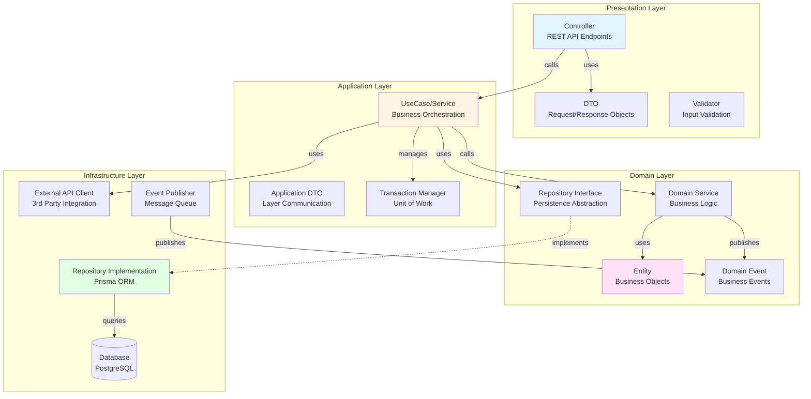
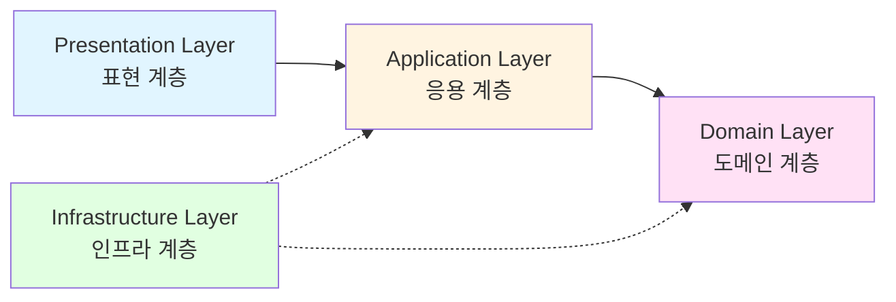
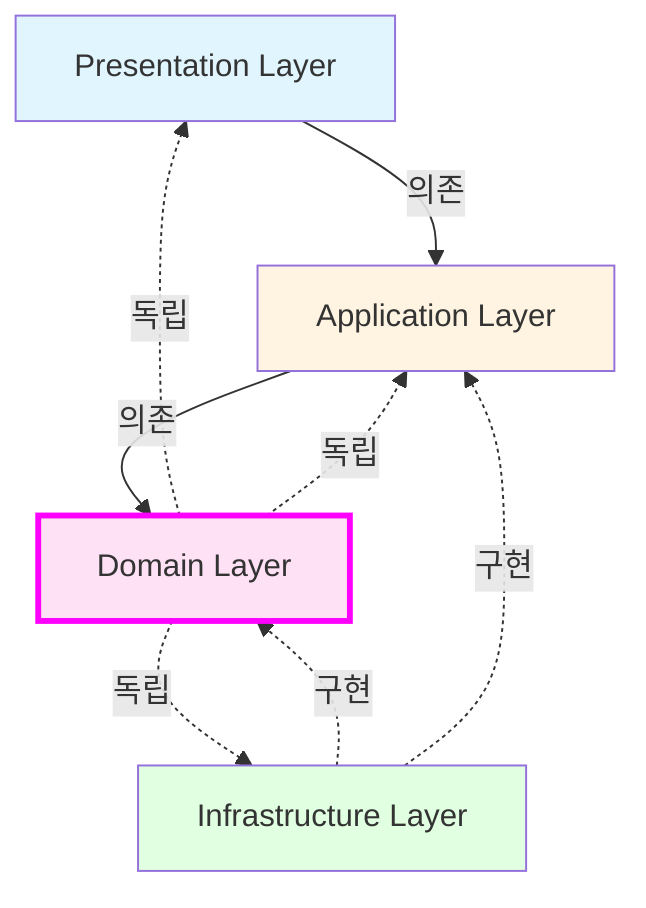
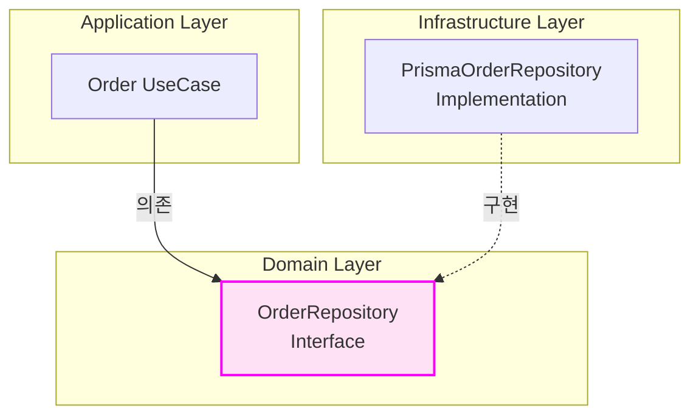
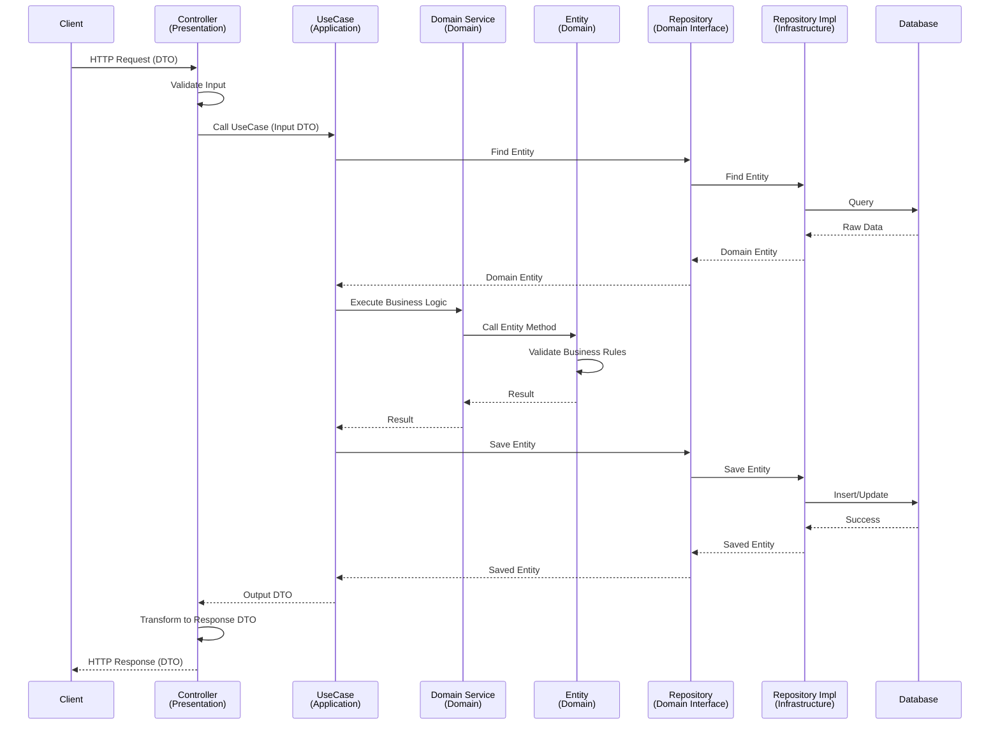
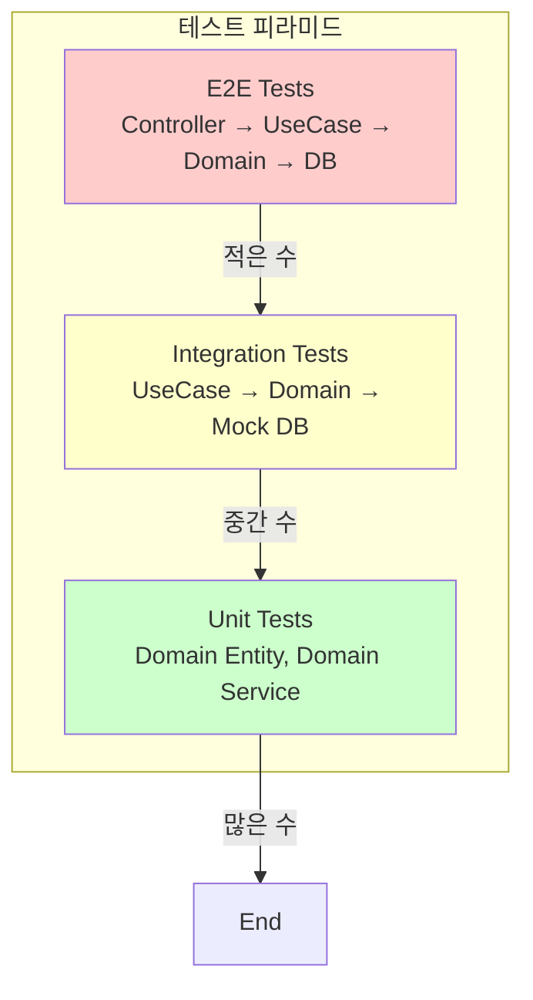

# 레이어드 아키텍처 (Layered Architecture)

**문서 정보**
- **버전**: 1.0.0
- **최종 수정일**: 2025-11-03
- **상태**: Active
- **작성자**: Development Team

---

**문서 네비게이션**
- ⬆️ 상위: [Dashboard 개요](./README.md)
- ⬅️ 이전: [데이터 모델](./data-model.md)
- ➡️ 다음: [Product 유스케이스](./product/use-cases.md)

---

## 목차
1. [개요](#1-개요)
2. [아키텍처 원칙](#2-아키텍처-원칙)
3. [계층 구조](#3-계층-구조)
4. [계층별 상세 설명](#4-계층별-상세-설명)
5. [의존성 규칙](#5-의존성-규칙)
6. [폴더 구조](#6-폴더-구조)
7. [계층 간 데이터 흐름](#7-계층-간-데이터-흐름)
8. [Best Practices](#8-best-practices)

---

## 1. 개요

### 1.1 목적
이 문서는 E-Commerce Backend Service의 레이어드 아키텍처 설계를 정의합니다. 레이어드 아키텍처를 통해 관심사의 분리(Separation of Concerns), 테스트 용이성, 유지보수성을 확보합니다.

### 1.2 아키텍처 선택 배경
- **명확한 책임 분리**: 각 계층이 특정 책임만 담당
- **테스트 용이성**: 계층별 독립적인 단위 테스트 가능
- **유지보수성**: 계층 간 느슨한 결합으로 변경 영향 최소화
- **확장성**: 비즈니스 로직과 기술 구현의 분리로 기술 스택 교체 용이
- **팀 협업**: 계층별로 작업 분담 가능

### 1.3 아키텍처 다이어그램



---

## 2. 아키텍처 원칙

### 2.1 핵심 원칙

#### Separation of Concerns (관심사의 분리)
각 계층은 명확히 정의된 단일 책임을 가집니다.

#### Dependency Rule (의존성 규칙)
의존성은 항상 외부에서 내부로 향합니다. 내부 계층은 외부 계층을 알지 못합니다.

```
Presentation → Application → Domain ← Infrastructure
```

#### Domain-Centric (도메인 중심)
비즈니스 로직은 Domain Layer에 집중되며, 다른 계층은 도메인을 지원합니다.

#### Technology Agnostic Domain (기술 독립적 도메인)
Domain Layer는 프레임워크나 라이브러리에 독립적입니다.

---

## 3. 계층 구조

### 3.1 계층 개요



| 계층 | 역할 | 주요 컴포넌트 |
|------|------|---------------|
| **Presentation** | 외부 인터페이스, 사용자 요청 처리 | Controller, DTO, Validator |
| **Application** | 유스케이스 구현, 비즈니스 플로우 조정 | UseCase/Service, Transaction Manager |
| **Domain** | 핵심 비즈니스 로직, 비즈니스 규칙 | Entity, Domain Service, Repository Interface |
| **Infrastructure** | 기술 구현, 외부 시스템 연동 | Repository Impl, Database, External API |

---

## 4. 계층별 상세 설명

### 4.1 Presentation Layer (표현 계층)

#### 책임
- HTTP 요청/응답 처리
- 입력 데이터 검증 (형식, 타입)
- 인증/인가 확인
- DTO 변환 (Request → Application DTO, Domain → Response)
- API 문서화

#### 주요 컴포넌트

**Controller**
```typescript
@Controller('products')
export class ProductController {
  constructor(private readonly productUseCase: ProductUseCase) {}

  @Get()
  async getProducts(@Query() query: GetProductsDto): Promise<ProductListResponseDto> {
    // 1. 입력 검증 (Pipe/Validator)
    // 2. UseCase 호출
    // 3. 응답 DTO 변환
  }
}
```

**DTO (Data Transfer Object)**
```typescript
export class GetProductsDto {
  @IsOptional()
  @IsInt()
  @Min(1)
  page?: number;

  @IsOptional()
  @IsInt()
  @Min(1)
  @Max(100)
  limit?: number;
}
```

#### 금지 사항
- ❌ 비즈니스 로직 포함
- ❌ 데이터베이스 직접 접근
- ❌ Domain Entity 직접 노출

---

### 4.2 Application Layer (응용 계층)

#### 책임
- 유스케이스 구현 (비즈니스 플로우 조정)
- 트랜잭션 관리
- Domain Service 및 Repository 조합
- 외부 시스템 연동 조정
- 이벤트 발행

#### 주요 컴포넌트

**UseCase/Service**
```typescript
@Injectable()
export class CreateOrderUseCase {
  constructor(
    private readonly orderRepository: OrderRepository,
    private readonly stockRepository: StockRepository,
    private readonly cartRepository: CartRepository,
    private readonly dataSource: DataSource,
  ) {}

  async execute(input: CreateOrderInput): Promise<CreateOrderOutput> {
    return this.dataSource.transaction(async (em) => {
      // 1. 장바구니 조회
      const cartItems = await this.cartRepository.findByUserId(input.userId, em);

      // 2. 재고 예약 (Domain Service 호출)
      await this.stockService.reserveStock(cartItems, em);

      // 3. 주문 생성 (Domain Entity 활용)
      const order = Order.create(input);
      await this.orderRepository.save(order, em);

      // 4. 장바구니 비우기
      await this.cartRepository.clearByUserId(input.userId, em);

      // 5. 도메인 이벤트 발행
      this.eventBus.publish(new OrderCreatedEvent(order));

      return CreateOrderOutput.from(order);
    });
  }
}
```

#### 특징
- **트랜잭션 경계**: Application Layer에서 트랜잭션 시작/종료
- **오케스트레이션**: 여러 Domain Service와 Repository를 조합
- **얇은 계층**: 비즈니스 로직은 Domain Layer에 위임

#### 금지 사항
- ❌ HTTP 요청/응답 직접 처리
- ❌ 복잡한 비즈니스 로직 (Domain Layer로 이동)
- ❌ Infrastructure 구현 직접 의존

---

### 4.3 Domain Layer (도메인 계층)

#### 책임
- 핵심 비즈니스 로직
- 비즈니스 규칙 검증
- 도메인 모델 정의
- 도메인 이벤트 정의
- 영속성 추상화 (Repository Interface)

#### 주요 컴포넌트

**Entity (Domain Model)**
```typescript
export class Order {
  private id: string;
  private userId: string;
  private items: OrderItem[];
  private status: OrderStatus;
  private totalAmount: number;
  private createdAt: Date;

  // 팩토리 메서드
  static create(input: CreateOrderInput): Order {
    const order = new Order();
    order.id = uuidv4();
    order.userId = input.userId;
    order.items = input.items.map(item => OrderItem.from(item));
    order.status = OrderStatus.PENDING;
    order.totalAmount = order.calculateTotalAmount();
    order.createdAt = new Date();

    // 비즈니스 규칙 검증
    order.validate();

    return order;
  }

  // 비즈니스 로직
  private calculateTotalAmount(): number {
    return this.items.reduce((sum, item) => sum + item.getSubtotal(), 0);
  }

  // 비즈니스 규칙 검증
  private validate(): void {
    if (this.items.length === 0) {
      throw new DomainException('주문 상품이 없습니다.');
    }
    if (this.totalAmount <= 0) {
      throw new DomainException('주문 금액이 0보다 커야 합니다.');
    }
  }

  // 상태 변경 메서드
  complete(): void {
    if (this.status !== OrderStatus.PENDING) {
      throw new DomainException('대기 상태인 주문만 완료할 수 있습니다.');
    }
    this.status = OrderStatus.COMPLETED;
  }
}
```

**Domain Service**
```typescript
export class StockService {
  constructor(private readonly stockRepository: StockRepository) {}

  // 복잡한 비즈니스 로직 (여러 Entity 협력)
  async reserveStock(
    items: { productId: string; quantity: number }[],
    em: EntityManager,
  ): Promise<void> {
    for (const item of items) {
      const stock = await this.stockRepository.findByProductIdForUpdate(
        item.productId,
        em,
      );

      if (!stock) {
        throw new DomainException(`재고를 찾을 수 없습니다: ${item.productId}`);
      }

      // Entity의 비즈니스 로직 호출
      stock.reserve(item.quantity);

      await this.stockRepository.save(stock, em);
    }
  }
}
```

**Repository Interface**
```typescript
export interface OrderRepository {
  findById(id: string, em?: EntityManager): Promise<Order | null>;
  findByUserId(userId: string, em?: EntityManager): Promise<Order[]>;
  save(order: Order, em?: EntityManager): Promise<Order>;
}
```

**Domain Event**
```typescript
export class OrderCreatedEvent {
  constructor(
    public readonly orderId: string,
    public readonly userId: string,
    public readonly totalAmount: number,
    public readonly createdAt: Date,
  ) {}
}
```

#### 특징
- **기술 독립적**: 프레임워크, 데이터베이스에 의존하지 않음
- **테스트 용이**: 순수 TypeScript로 테스트 가능
- **재사용 가능**: 다양한 Use Case에서 재사용

#### 금지 사항
- ❌ 프레임워크 의존성 (NestJS, Prisma 등)
- ❌ HTTP, Database 직접 접근
- ❌ Infrastructure Layer 의존

---

### 4.4 Infrastructure Layer (인프라 계층)

#### 책임
- Repository 구현 (ORM 사용)
- 데이터베이스 연동
- 외부 API 호출
- 메시지 큐 연동
- 파일 시스템 접근
- 캐시 관리

#### 주요 컴포넌트

**Repository Implementation**
```typescript
@Injectable()
export class PrismaOrderRepository implements OrderRepository {
  constructor(private readonly prisma: PrismaService) {}

  async findById(id: string, em?: EntityManager): Promise<Order | null> {
    const prismaClient = em ? em : this.prisma;

    const orderData = await prismaClient.order.findUnique({
      where: { id },
      include: { items: true },
    });

    if (!orderData) return null;

    // Prisma Model → Domain Entity 변환
    return this.toDomain(orderData);
  }

  async save(order: Order, em?: EntityManager): Promise<Order> {
    const prismaClient = em ? em : this.prisma;

    // Domain Entity → Prisma Model 변환
    const orderData = this.toPersistence(order);

    const saved = await prismaClient.order.create({
      data: orderData,
      include: { items: true },
    });

    return this.toDomain(saved);
  }

  // Domain Entity ↔ Prisma Model 변환
  private toDomain(data: PrismaOrder): Order {
    // 변환 로직
  }

  private toPersistence(order: Order): PrismaOrderCreateInput {
    // 변환 로직
  }
}
```

**External API Client**
```typescript
@Injectable()
export class ExternalPaymentClient {
  constructor(private readonly httpService: HttpService) {}

  async processPayment(request: PaymentRequest): Promise<PaymentResponse> {
    const response = await this.httpService
      .post('https://api.payment.com/v1/payments', request)
      .toPromise();

    return response.data;
  }
}
```

#### 특징
- **기술 구현**: 구체적인 기술 스택 사용
- **Domain 구현**: Domain Layer의 인터페이스 구현
- **변환 책임**: Domain Model ↔ Persistence Model 변환

#### 금지 사항
- ❌ 비즈니스 로직 포함
- ❌ Domain Entity 직접 수정

---

## 5. 의존성 규칙

### 5.1 의존성 방향



### 5.2 의존성 규칙 상세

| 계층 | 의존 가능 | 의존 불가 |
|------|-----------|-----------|
| **Presentation** | Application | Domain, Infrastructure |
| **Application** | Domain | Presentation, Infrastructure |
| **Domain** | 없음 (자기 자신만) | Presentation, Application, Infrastructure |
| **Infrastructure** | Domain, Application | Presentation |

### 5.3 Dependency Inversion Principle (DIP)

**문제**: Application Layer가 Infrastructure Layer에 직접 의존하면 테스트와 변경이 어려움

**해결**: Domain Layer에 인터페이스 정의, Infrastructure Layer에서 구현



**코드 예시**:
```typescript
// Domain Layer - 인터페이스 정의
export interface OrderRepository {
  findById(id: string): Promise<Order | null>;
  save(order: Order): Promise<Order>;
}

// Application Layer - 인터페이스 의존
export class CreateOrderUseCase {
  constructor(private readonly orderRepository: OrderRepository) {}
  // OrderRepository는 Domain Layer의 인터페이스
}

// Infrastructure Layer - 구현
export class PrismaOrderRepository implements OrderRepository {
  // 구현
}

// NestJS Module - DI 설정
@Module({
  providers: [
    {
      provide: 'OrderRepository',
      useClass: PrismaOrderRepository,
    },
    CreateOrderUseCase,
  ],
})
```

---

## 6. 폴더 구조

### 6.1 전체 폴더 구조

```
src/
├── presentation/              # Presentation Layer
│   ├── controllers/
│   │   ├── product.controller.ts
│   │   ├── cart.controller.ts
│   │   ├── order.controller.ts
│   │   ├── payment.controller.ts
│   │   └── coupon.controller.ts
│   ├── dtos/
│   │   ├── request/
│   │   │   ├── create-order.dto.ts
│   │   │   └── add-cart-item.dto.ts
│   │   └── response/
│   │       ├── order-response.dto.ts
│   │       └── product-response.dto.ts
│   └── validators/
│       └── custom-validators.ts
│
├── application/               # Application Layer
│   ├── use-cases/
│   │   ├── order/
│   │   │   ├── create-order.use-case.ts
│   │   │   ├── get-order.use-case.ts
│   │   │   └── list-orders.use-case.ts
│   │   ├── product/
│   │   │   ├── get-products.use-case.ts
│   │   │   └── get-product-detail.use-case.ts
│   │   └── cart/
│   │       ├── add-cart-item.use-case.ts
│   │       └── update-cart-item.use-case.ts
│   ├── dtos/
│   │   ├── create-order.input.ts
│   │   └── create-order.output.ts
│   └── services/
│       └── transaction.service.ts
│
├── domain/                    # Domain Layer
│   ├── entities/
│   │   ├── order/
│   │   │   ├── order.entity.ts
│   │   │   ├── order-item.entity.ts
│   │   │   └── order-status.enum.ts
│   │   ├── product/
│   │   │   ├── product.entity.ts
│   │   │   ├── stock.entity.ts
│   │   │   └── category.entity.ts
│   │   └── cart/
│   │       ├── cart.entity.ts
│   │       └── cart-item.entity.ts
│   ├── services/
│   │   ├── stock.service.ts
│   │   ├── coupon.service.ts
│   │   └── order.service.ts
│   ├── repositories/          # Repository Interfaces
│   │   ├── order.repository.ts
│   │   ├── product.repository.ts
│   │   ├── stock.repository.ts
│   │   └── cart.repository.ts
│   ├── events/
│   │   ├── order-created.event.ts
│   │   └── payment-completed.event.ts
│   └── exceptions/
│       ├── domain.exception.ts
│       ├── insufficient-stock.exception.ts
│       └── invalid-order.exception.ts
│
└── infrastructure/            # Infrastructure Layer
    ├── repositories/          # Repository Implementations
    │   ├── prisma-order.repository.ts
    │   ├── prisma-product.repository.ts
    │   ├── prisma-stock.repository.ts
    │   └── prisma-cart.repository.ts
    ├── prisma/
    │   ├── schema.prisma
    │   └── prisma.service.ts
    ├── external/
    │   └── payment-api.client.ts
    ├── events/
    │   └── event-publisher.service.ts
    └── config/
        └── database.config.ts
```

### 6.2 도메인별 폴더 구조 (선택적)

큰 프로젝트의 경우 도메인별로 수직 분할도 고려 가능:

```
src/
├── product/
│   ├── presentation/
│   ├── application/
│   ├── domain/
│   └── infrastructure/
├── order/
│   ├── presentation/
│   ├── application/
│   ├── domain/
│   └── infrastructure/
└── shared/
    ├── domain/
    └── infrastructure/
```

---

## 7. 계층 간 데이터 흐름

### 7.1 일반적인 요청 흐름



### 7.2 데이터 변환 지점

```mermaid
graph LR
    A[Client JSON] -->|Deserialize| B[Request DTO]
    B -->|Map| C[Input DTO]
    C -->|Use in| D[UseCase]
    D -->|Create/Update| E[Domain Entity]
    E -->|Persist| F[Persistence Model]
    F -->|Store| G[Database]

    G -->|Retrieve| F2[Persistence Model]
    F2 -->|Map| E2[Domain Entity]
    E2 -->|Transform| C2[Output DTO]
    C2 -->|Map| B2[Response DTO]
    B2 -->|Serialize| A2[Client JSON]

    style E fill:#ffe1f5
    style E2 fill:#ffe1f5
```



**변환 계층**:
1. **Presentation**: Client JSON ↔ Request/Response DTO
2. **Application**: Request DTO → Input DTO, Domain Entity → Output DTO → Response DTO
3. **Domain**: 비즈니스 로직 수행 (변환 없음)
4. **Infrastructure**: Domain Entity ↔ Persistence Model

---

## 8. Best Practices

### 8.1 Controller (Presentation)

✅ **DO**
```typescript
@Controller('orders')
export class OrderController {
  constructor(private readonly createOrderUseCase: CreateOrderUseCase) {}

  @Post()
  @HttpCode(201)
  async createOrder(
    @Body() dto: CreateOrderRequestDto,
    @CurrentUser() user: User,
  ): Promise<OrderResponseDto> {
    // 1. DTO 검증은 자동 (ValidationPipe)
    // 2. UseCase 호출
    const result = await this.createOrderUseCase.execute({
      userId: user.id,
      items: dto.items,
    });

    // 3. Response DTO 변환
    return OrderResponseDto.from(result);
  }
}
```

❌ **DON'T**
```typescript
// 비즈니스 로직을 Controller에 포함하지 않기
@Post()
async createOrder(@Body() dto: CreateOrderRequestDto) {
  // ❌ 비즈니스 로직
  const stock = await this.stockRepository.findByProductId(dto.productId);
  if (stock.availableQuantity < dto.quantity) {
    throw new BadRequestException('재고 부족');
  }

  // ❌ 직접 Repository 호출
  const order = await this.orderRepository.create({...});
}
```

### 8.2 UseCase (Application)

✅ **DO**
```typescript
@Injectable()
export class CreateOrderUseCase {
  constructor(
    private readonly orderRepository: OrderRepository,
    private readonly stockService: StockService,
    private readonly dataSource: DataSource,
  ) {}

  async execute(input: CreateOrderInput): Promise<CreateOrderOutput> {
    // 트랜잭션 시작
    return this.dataSource.transaction(async (em) => {
      // 1. 재고 예약 (Domain Service에 위임)
      await this.stockService.reserveStock(input.items, em);

      // 2. 주문 생성 (Entity 팩토리 메서드 사용)
      const order = Order.create(input);

      // 3. 주문 저장
      const savedOrder = await this.orderRepository.save(order, em);

      // 4. Output DTO 반환
      return CreateOrderOutput.from(savedOrder);
    });
  }
}
```

❌ **DON'T**
```typescript
// 복잡한 비즈니스 로직을 UseCase에 직접 작성하지 않기
async execute(input: CreateOrderInput): Promise<CreateOrderOutput> {
  // ❌ 복잡한 비즈니스 로직 (Domain Service로 이동해야 함)
  for (const item of input.items) {
    const stock = await this.stockRepository.findById(item.stockId);
    if (stock.availableQuantity < item.quantity) {
      throw new InsufficientStockException();
    }
    stock.availableQuantity -= item.quantity;
    stock.reservedQuantity += item.quantity;
    await this.stockRepository.save(stock);
  }

  // ❌ Entity 생성 로직 (Entity 팩토리 메서드로 이동해야 함)
  const order = new Order();
  order.id = uuidv4();
  order.userId = input.userId;
  order.items = input.items.map(item => ({...}));
  order.totalAmount = input.items.reduce((sum, item) => sum + item.price * item.quantity, 0);
}
```

### 8.3 Entity (Domain)

✅ **DO**
```typescript
export class Stock {
  private id: string;
  private productId: string;
  private availableQuantity: number;
  private reservedQuantity: number;
  private soldQuantity: number;

  // 비즈니스 로직을 Entity 메서드로
  reserve(quantity: number): void {
    // 비즈니스 규칙 검증
    if (quantity <= 0) {
      throw new DomainException('예약 수량은 0보다 커야 합니다.');
    }

    if (this.availableQuantity < quantity) {
      throw new InsufficientStockException(
        `재고 부족: 요청 ${quantity}, 재고 ${this.availableQuantity}`
      );
    }

    // 상태 변경
    this.availableQuantity -= quantity;
    this.reservedQuantity += quantity;
  }

  confirm(quantity: number): void {
    if (this.reservedQuantity < quantity) {
      throw new DomainException('예약된 재고가 부족합니다.');
    }

    this.reservedQuantity -= quantity;
    this.soldQuantity += quantity;
  }

  release(quantity: number): void {
    if (this.reservedQuantity < quantity) {
      throw new DomainException('예약된 재고가 부족합니다.');
    }

    this.reservedQuantity -= quantity;
    this.availableQuantity += quantity;
  }
}
```

❌ **DON'T**
```typescript
// Anemic Domain Model (빈약한 도메인 모델)
export class Stock {
  id: string;
  productId: string;
  availableQuantity: number;
  reservedQuantity: number;
  soldQuantity: number;

  // ❌ Getter/Setter만 있고 비즈니스 로직 없음
}

// ❌ 비즈니스 로직이 Service에 있음
export class StockService {
  reserve(stock: Stock, quantity: number): void {
    if (stock.availableQuantity < quantity) {
      throw new InsufficientStockException();
    }
    stock.availableQuantity -= quantity;
    stock.reservedQuantity += quantity;
  }
}
```

### 8.4 Repository (Domain → Infrastructure)

✅ **DO**
```typescript
// Domain Layer - Interface
export interface OrderRepository {
  findById(id: string, em?: EntityManager): Promise<Order | null>;
  findByUserId(userId: string, em?: EntityManager): Promise<Order[]>;
  save(order: Order, em?: EntityManager): Promise<Order>;
}

// Infrastructure Layer - Implementation
@Injectable()
export class PrismaOrderRepository implements OrderRepository {
  constructor(private readonly prisma: PrismaService) {}

  async findById(id: string, em?: EntityManager): Promise<Order | null> {
    const prismaClient = em ?? this.prisma;
    const data = await prismaClient.order.findUnique({
      where: { id },
      include: { items: true },
    });

    return data ? this.toDomain(data) : null;
  }

  // Mapper: Persistence Model → Domain Entity
  private toDomain(data: PrismaOrder & { items: PrismaOrderItem[] }): Order {
    return Order.reconstitute({
      id: data.id,
      userId: data.userId,
      items: data.items.map(item => OrderItem.reconstitute({...})),
      status: data.status as OrderStatus,
      totalAmount: data.totalAmount,
      createdAt: data.createdAt,
    });
  }

  // Mapper: Domain Entity → Persistence Model
  private toPersistence(order: Order): PrismaOrderCreateInput {
    return {
      id: order.getId(),
      userId: order.getUserId(),
      status: order.getStatus(),
      totalAmount: order.getTotalAmount(),
      items: {
        create: order.getItems().map(item => ({...})),
      },
    };
  }
}
```

### 8.5 트랜잭션 관리

✅ **DO**
```typescript
// Application Layer에서 트랜잭션 관리
@Injectable()
export class CreateOrderUseCase {
  constructor(private readonly dataSource: DataSource) {}

  async execute(input: CreateOrderInput): Promise<CreateOrderOutput> {
    return this.dataSource.transaction(async (em) => {
      // 모든 Repository 호출에 EntityManager 전달
      await this.stockRepository.reserve(input.items, em);
      const order = await this.orderRepository.save(orderEntity, em);
      await this.cartRepository.clear(input.userId, em);

      return CreateOrderOutput.from(order);
    });
  }
}
```

❌ **DON'T**
```typescript
// ❌ Domain Service에서 트랜잭션 관리하지 않기
export class OrderService {
  async createOrder(input: CreateOrderInput): Promise<Order> {
    // ❌ Domain Service가 트랜잭션을 관리하면 재사용성이 떨어짐
    return this.dataSource.transaction(async (em) => {
      // ...
    });
  }
}
```

### 8.6 예외 처리

✅ **DO**
```typescript
// Domain Layer - 도메인 예외 정의
export class DomainException extends Error {
  constructor(message: string) {
    super(message);
    this.name = 'DomainException';
  }
}

export class InsufficientStockException extends DomainException {
  constructor(message: string) {
    super(message);
    this.name = 'InsufficientStockException';
  }
}

// Presentation Layer - HTTP 예외로 변환
@Catch(DomainException)
export class DomainExceptionFilter implements ExceptionFilter {
  catch(exception: DomainException, host: ArgumentsHost) {
    const ctx = host.switchToHttp();
    const response = ctx.getResponse();

    let status = HttpStatus.BAD_REQUEST;

    if (exception instanceof InsufficientStockException) {
      status = HttpStatus.CONFLICT;
    }

    response.status(status).json({
      statusCode: status,
      message: exception.message,
      error: exception.name,
    });
  }
}
```

---

## 9. 테스트 전략

### 9.1 계층별 테스트



### 9.2 테스트 예시

**Unit Test (Domain Entity)**
```typescript
describe('Stock', () => {
  it('should reserve stock successfully', () => {
    // Given
    const stock = Stock.create({ availableQuantity: 10 });

    // When
    stock.reserve(5);

    // Then
    expect(stock.getAvailableQuantity()).toBe(5);
    expect(stock.getReservedQuantity()).toBe(5);
  });

  it('should throw exception when insufficient stock', () => {
    // Given
    const stock = Stock.create({ availableQuantity: 3 });

    // When & Then
    expect(() => stock.reserve(5)).toThrow(InsufficientStockException);
  });
});
```

**Integration Test (UseCase)**
```typescript
describe('CreateOrderUseCase', () => {
  let useCase: CreateOrderUseCase;
  let orderRepository: jest.Mocked<OrderRepository>;
  let stockRepository: jest.Mocked<StockRepository>;

  beforeEach(() => {
    orderRepository = createMock<OrderRepository>();
    stockRepository = createMock<StockRepository>();
    useCase = new CreateOrderUseCase(orderRepository, stockRepository);
  });

  it('should create order successfully', async () => {
    // Given
    const input = { userId: 'user1', items: [...] };
    stockRepository.findById.mockResolvedValue(Stock.create({...}));

    // When
    const result = await useCase.execute(input);

    // Then
    expect(result.orderId).toBeDefined();
    expect(orderRepository.save).toHaveBeenCalledTimes(1);
  });
});
```

**E2E Test (Controller)**
```typescript
describe('OrderController (E2E)', () => {
  let app: INestApplication;

  beforeAll(async () => {
    const moduleFixture = await Test.createTestingModule({
      imports: [AppModule],
    }).compile();

    app = moduleFixture.createNestApplication();
    await app.init();
  });

  it('POST /orders should create order', () => {
    return request(app.getHttpServer())
      .post('/orders')
      .send({ items: [...] })
      .expect(201)
      .expect(res => {
        expect(res.body.orderId).toBeDefined();
      });
  });
});
```

---

## 10. 관련 문서

### 10.1 도메인별 문서

#### 비즈니스 관점 (Use Cases)
- [Product 유스케이스](./product/use-cases.md)
- [Cart 유스케이스](./cart/use-cases.md)
- [Order 유스케이스](./order/use-cases.md)
- [Payment 유스케이스](./payment/use-cases.md)
- [Coupon 유스케이스](./coupon/use-cases.md)
- [Data 유스케이스](./data/use-cases.md)

#### 기술 관점 (Sequence Diagrams)
- [Product 시퀀스 다이어그램](./product/sequence-diagrams.md)
- [Cart 시퀀스 다이어그램](./cart/sequence-diagrams.md)
- [Order 시퀀스 다이어그램](./order/sequence-diagrams.md)
- [Payment 시퀀스 다이어그램](./payment/sequence-diagrams.md)
- [Coupon 시퀀스 다이어그램](./coupon/sequence-diagrams.md)
- [Data 시퀀스 다이어그램](./data/sequence-diagrams.md)

### 10.2 기타 문서
- [요구사항 분석](./requirements.md)
- [사용자 스토리](./user-stories.md)
- [API 명세서](./api-specification.md)
- [데이터 모델](./data-model.md)

---

## 11. 버전 히스토리

| 버전 | 날짜 | 작성자 | 변경 내역 |
|------|------|--------|-----------|
| 1.0.0 | 2025-11-03 | Development Team | 초기 문서 작성 |

---

**문서 끝**
