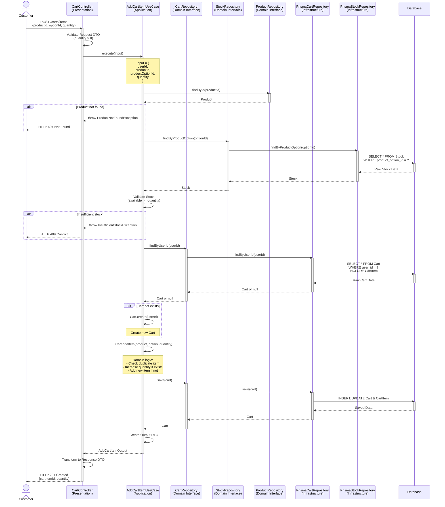
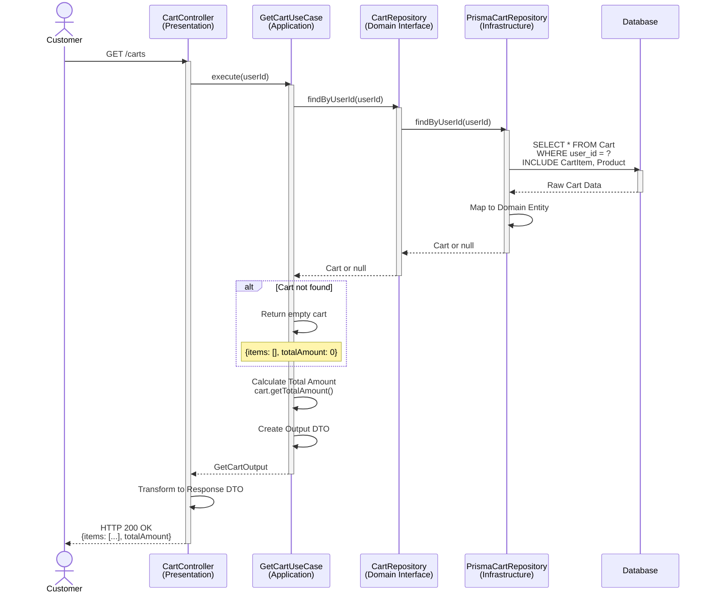
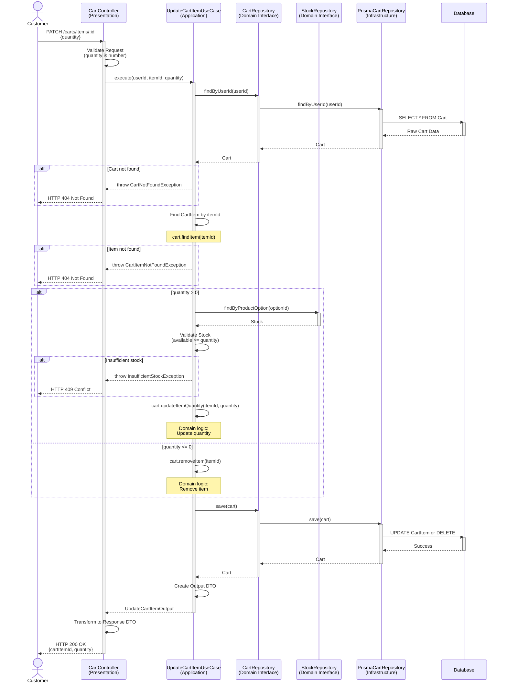
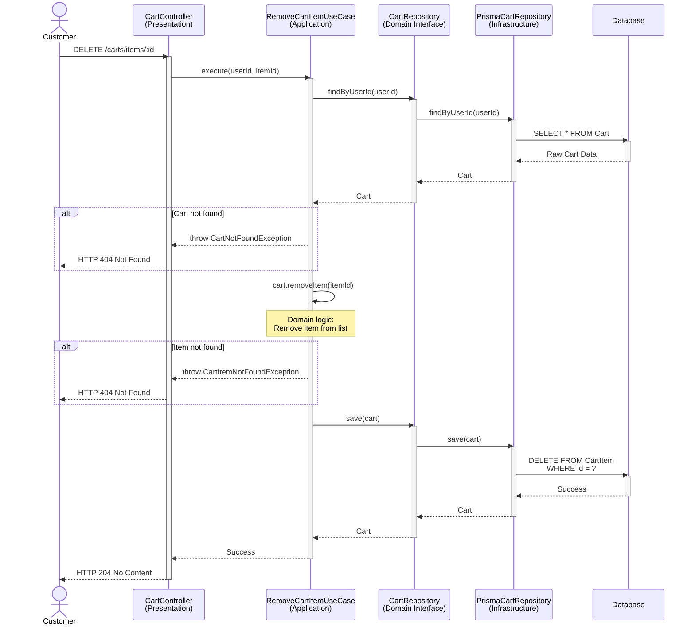
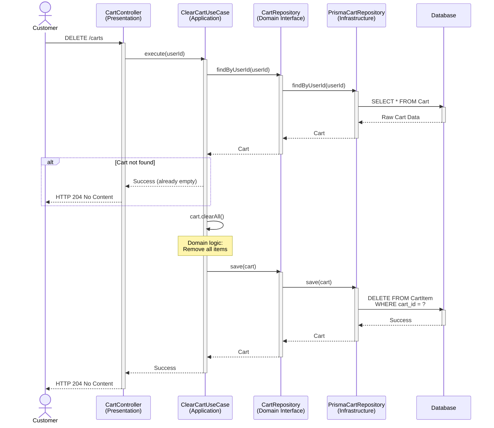
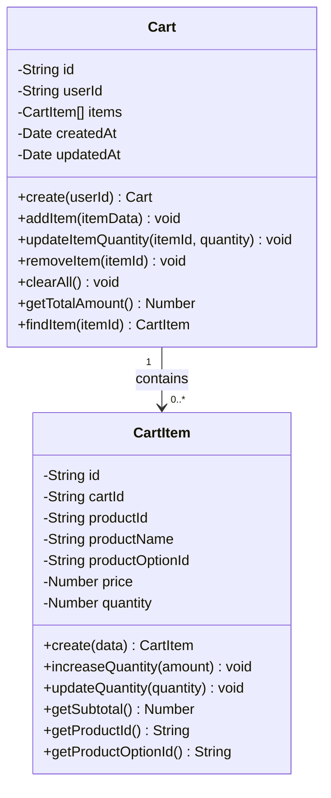

# Cart Domain - Sequence Diagrams

**문서 정보**
- **버전**: 2.0.0
- **최종 수정일**: 2025-11-03
- **상태**: Active
- **작성자**: Development Team
- **대상 독자**: Developers, Architects, DevOps

---

**문서 네비게이션**
- ⬆️ 상위: [아키텍처](../architecture.md)
- ⬅️ 이전: [Cart 유스케이스](./use-cases.md)
- ➡️ 다음: [Order 시퀀스 다이어그램](../order/sequence-diagrams.md)

---

## 목차
1. [개요](#1-개요)
2. [SD-CART-01: 장바구니 아이템 추가](#2-sd-cart-01-장바구니-아이템-추가)
3. [SD-CART-02: 장바구니 조회](#3-sd-cart-02-장바구니-조회)
4. [SD-CART-03: 장바구니 아이템 수량 변경](#4-sd-cart-03-장바구니-아이템-수량-변경)
5. [SD-CART-04: 장바구니 아이템 삭제](#5-sd-cart-04-장바구니-아이템-삭제)
6. [SD-CART-05: 장바구니 전체 삭제](#6-sd-cart-05-장바구니-전체-삭제)
7. [도메인 모델](#7-도메인-모델)
8. [동시성 제어](#8-동시성-제어)
9. [테스트 시나리오](#9-테스트-시나리오)

---

## 1. 개요

### 1.1 문서 목적
이 문서는 Cart 도메인의 **기술적 구현 세부사항**을 설명합니다. 4-Layer 아키텍처를 기반으로 각 유스케이스의 시퀀스 다이어그램, 레이어별 책임, 구현 예시를 제공합니다.

### 1.2 대상 독자
- **개발자**: 구현 시 참고할 상세 기술 명세
- **아키텍트**: 시스템 설계 및 레이어 간 상호작용 이해
- **DevOps**: 성능 최적화 및 인프라 설정

### 1.3 관련 문서
- [Cart 유스케이스](./use-cases.md) - 비즈니스 관점
- [아키텍처](../architecture.md) - 4-Layer 아키텍처 정의
- [API 명세](../api-specification.md) - REST API 계약
- [데이터 모델](../data-model.md) - 데이터베이스 스키마

---

## 2. SD-CART-01: 장바구니 아이템 추가

### 2.1 시퀀스 다이어그램



### 2.2 레이어별 책임

#### Presentation Layer
**컴포넌트**: `CartController`

**책임**:
- Request Body 검증 (productId, optionId, quantity)
- 인증된 사용자 확인 (JWT)
- UseCase 호출
- Response DTO 변환

**구현 예시**:
```typescript
@Controller('carts')
export class CartController {
  constructor(private readonly addCartItemUseCase: AddCartItemUseCase) {}

  @Post('items')
  @HttpCode(201)
  @UseGuards(JwtAuthGuard)
  async addItem(
    @Body() dto: AddCartItem,
    @CurrentUser() user: User,
  ): Promise<CartItemResponse> {
    const output = await this.addCartItemUseCase.execute({
      userId: user.id,
      productId: dto.productId,
      productOptionId: dto.productOptionId,
      quantity: dto.quantity,
    });

    return CartItemResponse.from(output);
  }
}
```

#### Application Layer
**컴포넌트**: `AddCartItemUseCase`

**책임**:
- 상품 존재 여부 확인
- 재고 검증
- 장바구니 조회 또는 생성
- 도메인 로직 호출 (Cart.addItem)
- 장바구니 저장
- Output DTO 생성

**구현 예시**:
```typescript
@Injectable()
export class AddCartItemUseCase {
  constructor(
    private readonly cartRepository: CartRepository,
    private readonly productRepository: ProductRepository,
    private readonly stockRepository: StockRepository,
  ) {}

  async execute(input: AddCartItemInput): Promise<AddCartItemOutput> {
    // 1. 상품 조회
    const product = await this.productRepository.findById(input.productId);
    if (!product) {
      throw new ProductNotFoundException('상품을 찾을 수 없습니다.');
    }

    // 2. 재고 검증
    const stock = await this.stockRepository.findByProductOption(
      input.productOptionId,
    );
    if (!stock || stock.getAvailableQuantity() < input.quantity) {
      throw new InsufficientStockException('재고가 부족합니다.');
    }

    // 3. 장바구니 조회 또는 생성
    let cart = await this.cartRepository.findByUserId(input.userId);
    if (!cart) {
      cart = Cart.create(input.userId);
    }

    // 4. 아이템 추가 (도메인 로직)
    cart.addItem({
      productId: input.productId,
      productName: product.getName(),
      productOptionId: input.productOptionId,
      price: product.getPrice(),
      quantity: input.quantity,
    });

    // 5. 장바구니 저장
    const savedCart = await this.cartRepository.save(cart);

    return AddCartItemOutput.from(savedCart);
  }
}
```

#### Domain Layer
**컴포넌트**: `Cart`, `CartItem`

**책임**:
- Cart Entity 정의
- 아이템 추가 비즈니스 로직
- 중복 아이템 처리 (수량 증가)
- 장바구니 제약 검증

**구현 예시**:
```typescript
export class Cart {
  private id: string;
  private userId: string;
  private items: CartItem[];
  private createdAt: Date;
  private updatedAt: Date;

  static create(userId: string): Cart {
    const cart = new Cart();
    cart.id = uuidv4();
    cart.userId = userId;
    cart.items = [];
    cart.createdAt = new Date();
    cart.updatedAt = new Date();
    return cart;
  }

  addItem(itemData: {
    productId: string;
    productName: string;
    productOptionId: string;
    price: number;
    quantity: number;
  }): void {
    // 비즈니스 규칙: 동일 상품+옵션이 있으면 수량 증가
    const existingItem = this.items.find(
      item =>
        item.getProductId() === itemData.productId &&
        item.getProductOptionId() === itemData.productOptionId,
    );

    if (existingItem) {
      existingItem.increaseQuantity(itemData.quantity);
    } else {
      const newItem = CartItem.create({
        cartId: this.id,
        ...itemData,
      });
      this.items.push(newItem);
    }

    this.updatedAt = new Date();
  }

  getTotalAmount(): number {
    return this.items.reduce((sum, item) => sum + item.getSubtotal(), 0);
  }
}

export class CartItem {
  private id: string;
  private cartId: string;
  private productId: string;
  private productName: string;
  private productOptionId: string;
  private price: number;
  private quantity: number;

  static create(data: CartItemCreateData): CartItem {
    const item = new CartItem();
    item.id = uuidv4();
    item.cartId = data.cartId;
    item.productId = data.productId;
    item.productName = data.productName;
    item.productOptionId = data.productOptionId;
    item.price = data.price;
    item.quantity = data.quantity;

    // 비즈니스 규칙 검증
    if (item.quantity <= 0) {
      throw new DomainException('수량은 1 이상이어야 합니다.');
    }

    return item;
  }

  increaseQuantity(amount: number): void {
    if (amount <= 0) {
      throw new DomainException('증가량은 1 이상이어야 합니다.');
    }
    this.quantity += amount;
  }

  getSubtotal(): number {
    return this.price * this.quantity;
  }
}
```

#### Infrastructure Layer
**컴포넌트**: `PrismaCartRepository`, `PrismaStockRepository`

**책임**:
- 장바구니 조회 (CartItem 포함)
- 장바구니 및 아이템 저장
- 재고 조회
- Domain Entity ↔ Persistence Model 변환

### 2.3 트랜잭션 전략
- **트랜잭션 필요**: 장바구니 생성/수정 작업
- **격리 수준**: READ COMMITTED (기본값)

### 2.4 동시성 제어
- **락 불필요**: 사용자별 독립적인 장바구니
- 동일 사용자가 동시에 같은 상품을 추가하는 경우도 문제없음 (수량만 증가)

### 2.5 에러 처리

| 에러 케이스 | HTTP 상태 | 에러 메시지 | 처리 레이어 |
|-------------|-----------|-------------|-------------|
| 존재하지 않는 상품 | 404 | "상품을 찾을 수 없습니다." | Application |
| 재고 부족 | 409 | "재고가 부족합니다." | Application |
| 잘못된 수량 (< 1) | 400 | "수량은 1 이상이어야 합니다." | Presentation/Domain |

---

## 3. SD-CART-02: 장바구니 조회

### 3.1 시퀀스 다이어그램



### 3.2 레이어별 책임

#### Presentation Layer
**책임**:
- 인증된 사용자 확인
- UseCase 호출
- Response DTO 변환

#### Application Layer
**책임**:
- 장바구니 조회
- 총 금액 계산
- 빈 장바구니 처리

#### Domain Layer
**책임**:
- Cart Entity의 getTotalAmount() 로직
- 각 CartItem의 getSubtotal() 계산

#### Infrastructure Layer
**책임**:
- 사용자 ID로 장바구니 조회
- CartItem, Product JOIN
- Domain Entity 변환

### 3.3 트랜잭션 전략
- **트랜잭션 불필요**: 읽기 전용 작업 (Read-Only)
- **격리 수준**: READ COMMITTED (기본값)

### 3.4 동시성 제어
- **락 불필요**: 조회만 수행하므로 동시성 이슈 없음

### 3.5 에러 처리

| 에러 케이스 | HTTP 상태 | 에러 메시지 | 처리 레이어 |
|-------------|-----------|-------------|-------------|
| 인증 실패 | 401 | "인증이 필요합니다." | Presentation |

---

## 4. SD-CART-03: 장바구니 아이템 수량 변경

### 4.1 시퀀스 다이어그램



### 4.2 레이어별 책임

#### Presentation Layer
**책임**:
- Path Parameter (itemId) 및 Request Body (quantity) 검증
- UseCase 호출
- Response DTO 변환

#### Application Layer
**책임**:
- 장바구니 조회
- 아이템 존재 여부 확인
- 재고 검증 (수량 증가 시)
- 도메인 로직 호출 (수정 또는 삭제)
- 장바구니 저장

#### Domain Layer
**컴포넌트**: `Cart`, `CartItem`

**책임**:
- 아이템 수량 변경 로직
- 아이템 삭제 로직

**구현 예시**:
```typescript
export class Cart {
  updateItemQuantity(itemId: string, quantity: number): void {
    const item = this.items.find(i => i.getId() === itemId);
    if (!item) {
      throw new DomainException('아이템을 찾을 수 없습니다.');
    }

    item.updateQuantity(quantity);
    this.updatedAt = new Date();
  }

  removeItem(itemId: string): void {
    const index = this.items.findIndex(i => i.getId() === itemId);
    if (index === -1) {
      throw new DomainException('아이템을 찾을 수 없습니다.');
    }

    this.items.splice(index, 1);
    this.updatedAt = new Date();
  }
}

export class CartItem {
  updateQuantity(quantity: number): void {
    if (quantity <= 0) {
      throw new DomainException('수량은 1 이상이어야 합니다.');
    }
    this.quantity = quantity;
  }
}
```

#### Infrastructure Layer
**책임**:
- 장바구니 업데이트
- 아이템 삭제 (quantity = 0인 경우)

### 4.3 트랜잭션 전략
- **트랜잭션 필요**: 장바구니 업데이트 작업
- **격리 수준**: READ COMMITTED (기본값)

### 4.4 동시성 제어
- **락 불필요**: 사용자별 독립적인 장바구니

### 4.5 에러 처리

| 에러 케이스 | HTTP 상태 | 에러 메시지 | 처리 레이어 |
|-------------|-----------|-------------|-------------|
| 장바구니를 찾을 수 없음 | 404 | "장바구니를 찾을 수 없습니다." | Application |
| 아이템을 찾을 수 없음 | 404 | "아이템을 찾을 수 없습니다." | Application |
| 재고 부족 | 409 | "재고가 부족합니다." | Application |
| 다른 사용자의 장바구니 | 403 | "권한이 없습니다." | Application |

---

## 5. SD-CART-04: 장바구니 아이템 삭제

### 5.1 시퀀스 다이어그램



### 5.2 레이어별 책임

#### Presentation Layer
**책임**:
- Path Parameter 검증
- UseCase 호출
- 204 No Content 응답

#### Application Layer
**책임**:
- 장바구니 조회
- 도메인 로직 호출 (삭제)
- 장바구니 저장

#### Domain Layer
**책임**:
- 아이템 삭제 로직 (Cart.removeItem)

#### Infrastructure Layer
**책임**:
- CartItem 데이터 삭제

### 5.3 트랜잭션 전략
- **트랜잭션 필요**: 아이템 삭제 작업
- **격리 수준**: READ COMMITTED (기본값)

### 5.4 동시성 제어
- **락 불필요**: 사용자별 독립적인 장바구니

### 5.5 에러 처리

| 에러 케이스 | HTTP 상태 | 에러 메시지 | 처리 레이어 |
|-------------|-----------|-------------|-------------|
| 장바구니를 찾을 수 없음 | 404 | "장바구니를 찾을 수 없습니다." | Application |
| 아이템을 찾을 수 없음 | 404 | "아이템을 찾을 수 없습니다." | Application |

---

## 6. SD-CART-05: 장바구니 전체 삭제

### 6.1 시퀀스 다이어그램



### 6.2 레이어별 책임

#### Presentation Layer
**책임**:
- 인증된 사용자 확인
- UseCase 호출
- 204 No Content 응답

#### Application Layer
**책임**:
- 장바구니 조회
- 도메인 로직 호출 (전체 삭제)
- 장바구니 저장

#### Domain Layer
**컴포넌트**: `Cart`

**책임**:
- 전체 아이템 삭제 로직

**구현 예시**:
```typescript
export class Cart {
  clearAll(): void {
    this.items = [];
    this.updatedAt = new Date();
  }
}
```

#### Infrastructure Layer
**책임**:
- 해당 장바구니의 모든 CartItem 삭제

### 6.3 트랜잭션 전략
- **트랜잭션 필요**: 모든 아이템 삭제 작업
- **격리 수준**: READ COMMITTED (기본값)

### 6.4 동시성 제어
- **락 불필요**: 사용자별 독립적인 장바구니

### 6.5 에러 처리

| 에러 케이스 | HTTP 상태 | 에러 메시지 | 처리 레이어 |
|-------------|-----------|-------------|-------------|
| 없음 (항상 성공) | 204 | - | - |

---

## 7. 도메인 모델

### 7.1 핵심 Entity



### 7.2 Repository Interface

```typescript
export interface CartRepository {
  findByUserId(userId: string, em?: EntityManager): Promise<Cart | null>;
  save(cart: Cart, em?: EntityManager): Promise<Cart>;
  clearByUserId(userId: string, em: EntityManager): Promise<void>;
}
```

---

## 8. 동시성 제어

### 8.1 동시성 이슈

장바구니는 동시성 이슈가 적은 도메인입니다:
- 사용자별로 독립적인 장바구니
- 다른 사용자 간 경합 없음

### 8.2 낙관적 락 (Optional)

버전 필드를 사용한 낙관적 락:
```typescript
export class Cart {
  private version: number; // 낙관적 락용

  // Prisma schema
  // version Int @default(0)
}
```

---

## 9. 테스트 시나리오

### 9.1 Unit Test: AddCartItemUseCase

```typescript
describe('AddCartItemUseCase', () => {
  let useCase: AddCartItemUseCase;
  let mockCartRepository: jest.Mocked<CartRepository>;
  let mockProductRepository: jest.Mocked<ProductRepository>;
  let mockStockRepository: jest.Mocked<StockRepository>;

  beforeEach(() => {
    mockCartRepository = {
      findByUserId: jest.fn(),
      save: jest.fn(),
    } as any;

    mockProductRepository = {
      findById: jest.fn(),
    } as any;

    mockStockRepository = {
      findByProductOption: jest.fn(),
    } as any;

    useCase = new AddCartItemUseCase(
      mockCartRepository,
      mockProductRepository,
      mockStockRepository,
    );
  });

  it('should add new item to cart', async () => {
    // Given
    const input = {
      userId: 'user1',
      productId: 'prod1',
      productOptionId: 'opt1',
      quantity: 2,
    };

    const product = Product.reconstitute({
      id: 'prod1',
      name: 'Test Product',
      price: 10000,
    });

    const stock = Stock.reconstitute({
      id: 'stock1',
      productOptionId: 'opt1',
      availableQuantity: 10,
    });

    mockProductRepository.findById.mockResolvedValue(product);
    mockStockRepository.findByProductOption.mockResolvedValue(stock);
    mockCartRepository.findByUserId.mockResolvedValue(null);
    mockCartRepository.save.mockImplementation(cart => Promise.resolve(cart));

    // When
    const output = await useCase.execute(input);

    // Then
    expect(output.cartItemId).toBeDefined();
    expect(output.quantity).toBe(2);
    expect(mockCartRepository.save).toHaveBeenCalled();
  });

  it('should increase quantity when item already exists', async () => {
    // Given
    const existingCart = Cart.create('user1');
    existingCart.addItem({
      productId: 'prod1',
      productName: 'Test Product',
      productOptionId: 'opt1',
      price: 10000,
      quantity: 2,
    });

    const product = Product.reconstitute({
      id: 'prod1',
      name: 'Test Product',
      price: 10000,
    });

    const stock = Stock.reconstitute({
      id: 'stock1',
      productOptionId: 'opt1',
      availableQuantity: 10,
    });

    mockProductRepository.findById.mockResolvedValue(product);
    mockStockRepository.findByProductOption.mockResolvedValue(stock);
    mockCartRepository.findByUserId.mockResolvedValue(existingCart);
    mockCartRepository.save.mockImplementation(cart => Promise.resolve(cart));

    const input = {
      userId: 'user1',
      productId: 'prod1',
      productOptionId: 'opt1',
      quantity: 3,
    };

    // When
    await useCase.execute(input);

    // Then
    const item = existingCart.findItem('prod1');
    expect(item.getQuantity()).toBe(5); // 2 + 3
  });

  it('should throw exception when insufficient stock', async () => {
    // Given
    const product = Product.reconstitute({
      id: 'prod1',
      name: 'Test Product',
      price: 10000,
    });

    const stock = Stock.reconstitute({
      id: 'stock1',
      productOptionId: 'opt1',
      availableQuantity: 1,
    });

    mockProductRepository.findById.mockResolvedValue(product);
    mockStockRepository.findByProductOption.mockResolvedValue(stock);

    const input = {
      userId: 'user1',
      productId: 'prod1',
      productOptionId: 'opt1',
      quantity: 5,
    };

    // When & Then
    await expect(useCase.execute(input)).rejects.toThrow(
      InsufficientStockException,
    );
  });
});
```

### 9.2 Integration Test: Cart Domain

```typescript
describe('Cart Domain (Integration)', () => {
  let app: INestApplication;
  let cartRepository: CartRepository;
  let prisma: PrismaService;

  beforeAll(async () => {
    const moduleRef = await Test.createTestingModule({
      imports: [AppModule],
    }).compile();

    app = moduleRef.createNestApplication();
    await app.init();

    cartRepository = app.get(CartRepository);
    prisma = app.get(PrismaService);
  });

  beforeEach(async () => {
    // 테스트 데이터 정리
    await prisma.cartItem.deleteMany();
    await prisma.cart.deleteMany();
  });

  afterAll(async () => {
    await app.close();
  });

  it('should save and retrieve cart', async () => {
    // Given
    const cart = Cart.create('user1');
    cart.addItem({
      productId: 'prod1',
      productName: 'Test Product',
      productOptionId: 'opt1',
      price: 10000,
      quantity: 2,
    });

    // When
    await cartRepository.save(cart);
    const retrieved = await cartRepository.findByUserId('user1');

    // Then
    expect(retrieved).toBeDefined();
    expect(retrieved.getUserId()).toBe('user1');
    expect(retrieved.getItems()).toHaveLength(1);
    expect(retrieved.getTotalAmount()).toBe(20000);
  });
});
```

### 9.3 E2E Test: Cart API

```typescript
describe('Cart API (E2E)', () => {
  let app: INestApplication;
  let authToken: string;

  beforeAll(async () => {
    const moduleRef = await Test.createTestingModule({
      imports: [AppModule],
    }).compile();

    app = moduleRef.createNestApplication();
    await app.init();

    // 인증 토큰 생성
    authToken = await getAuthToken(app);
  });

  afterAll(async () => {
    await app.close();
  });

  describe('POST /carts/items', () => {
    it('should add item to cart', async () => {
      // Given
      const product = await createTestProduct();

      // When & Then
      return request(app.getHttpServer())
        .post('/carts/items')
        .set('Authorization', `Bearer ${authToken}`)
        .send({
          productId: product.id,
          productOptionId: product.options[0].id,
          quantity: 2,
        })
        .expect(201)
        .expect((res) => {
          expect(res.body.cartItemId).toBeDefined();
          expect(res.body.quantity).toBe(2);
        });
    });

    it('should return 409 when insufficient stock', async () => {
      // Given
      const product = await createTestProductWithLowStock(1);

      // When & Then
      return request(app.getHttpServer())
        .post('/carts/items')
        .set('Authorization', `Bearer ${authToken}`)
        .send({
          productId: product.id,
          productOptionId: product.options[0].id,
          quantity: 5,
        })
        .expect(409);
    });
  });

  describe('GET /carts', () => {
    it('should return cart with items', async () => {
      // Given
      await addItemToCart(authToken, { quantity: 2 });

      // When & Then
      return request(app.getHttpServer())
        .get('/carts')
        .set('Authorization', `Bearer ${authToken}`)
        .expect(200)
        .expect((res) => {
          expect(res.body.items).toBeInstanceOf(Array);
          expect(res.body.totalAmount).toBeGreaterThan(0);
        });
    });
  });
});
```

---

## 10. 관련 문서

- [Cart 유스케이스](./use-cases.md) - 비즈니스 관점
- [아키텍처](../architecture.md) - 4-Layer 아키텍처
- [API 명세서](../api-specification.md) - REST API 계약
- [데이터 모델](../data-model.md) - 데이터베이스 스키마
- [Product 시퀀스 다이어그램](../product/sequence-diagrams.md) - 이전 도메인
- [Order 시퀀스 다이어그램](../order/sequence-diagrams.md) - 다음 도메인

---

## 11. 버전 히스토리

| 버전 | 날짜 | 작성자 | 변경 내역 |
|------|------|--------|-----------|
| 2.0.0 | 2025-11-03 | Development Team | 비즈니스 관점과 기술 관점 분리 (Issue #006) |

---

**문서 끝**
