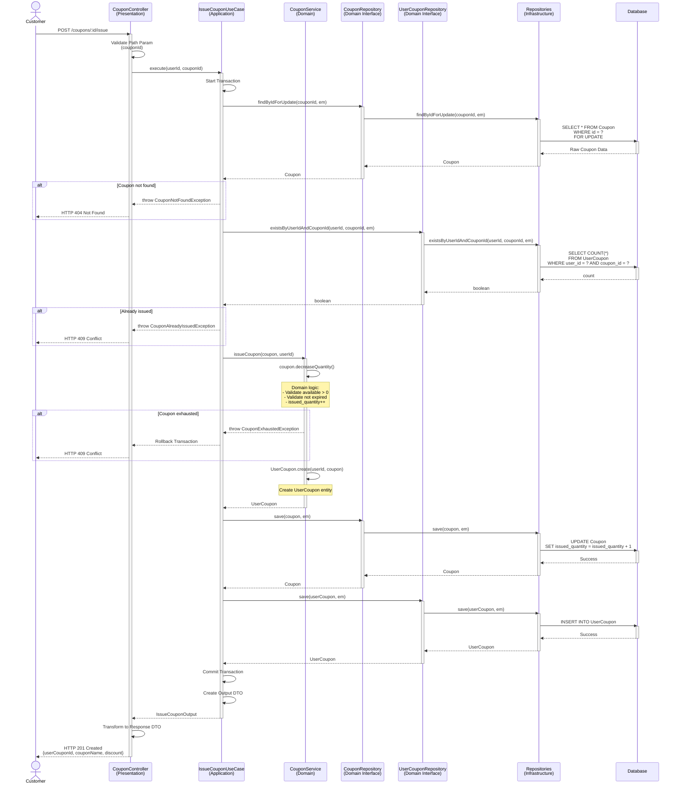
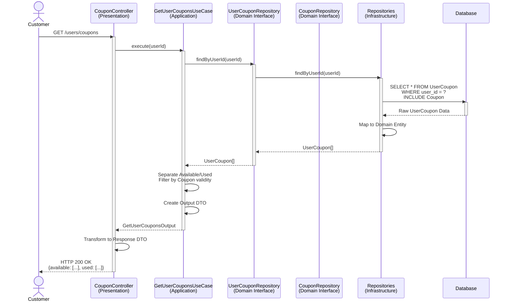
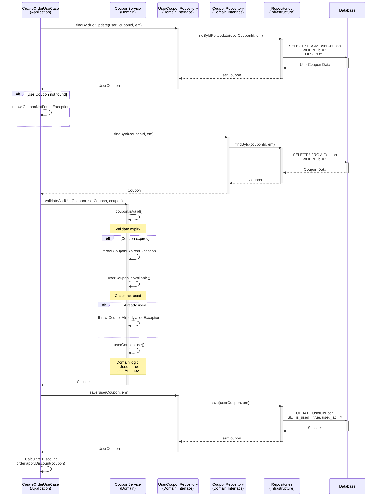
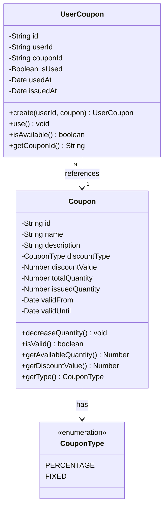

# Coupon Domain - Sequence Diagrams

**문서 정보**
- **버전**: 2.0.0
- **최종 수정일**: 2025-11-03
- **상태**: Active
- **작성자**: Development Team
- **대상 독자**: Developers, Architects, DevOps

---

**문서 네비게이션**
- ⬆️ 상위: [아키텍처](../architecture.md)
- ⬅️ 이전: [Coupon 유스케이스](./use-cases.md)
- ➡️ 다음: [Data 시퀀스 다이어그램](../data/sequence-diagrams.md)

---

## 목차
1. [개요](#1-개요)
2. [SD-COUPON-01: 쿠폰 발급](#2-sd-coupon-01-쿠폰-발급)
3. [SD-COUPON-02: 사용자 쿠폰 조회](#3-sd-coupon-02-사용자-쿠폰-조회)
4. [SD-COUPON-03: 쿠폰 사용](#4-sd-coupon-03-쿠폰-사용)
5. [도메인 모델](#5-도메인-모델)
6. [동시성 제어](#6-동시성-제어)
7. [성능 최적화](#7-성능-최적화)
8. [테스트 시나리오](#8-테스트-시나리오)

---

## 1. 개요

### 1.1 문서 목적
이 문서는 Coupon 도메인의 **기술적 구현 세부사항**을 설명합니다. 4-Layer 아키텍처를 기반으로 각 유스케이스의 시퀀스 다이어그램, 레이어별 책임, 구현 예시를 제공합니다.

### 1.2 대상 독자
- **개발자**: 구현 시 참고할 상세 기술 명세
- **아키텍트**: 시스템 설계 및 레이어 간 상호작용 이해
- **DevOps**: 성능 최적화 및 인프라 설정

### 1.3 관련 문서
- [Coupon 유스케이스](./use-cases.md) - 비즈니스 관점
- [아키텍처](../architecture.md) - 4-Layer 아키텍처 정의
- [API 명세](../api-specification.md) - REST API 계약
- [데이터 모델](../data-model.md) - 데이터베이스 스키마

---

## 2. SD-COUPON-01: 쿠폰 발급

### 2.1 시퀀스 다이어그램



### 2.2 레이어별 책임

#### Presentation Layer
**컴포넌트**: `CouponController`

**책임**:
- Path Parameter 검증 (couponId)
- 인증된 사용자 확인
- UseCase 호출
- Response DTO 변환

**구현 예시**:
```typescript
@Controller('coupons')
export class CouponController {
  constructor(private readonly issueCouponUseCase: IssueCouponUseCase) {}

  @Post(':id/issue')
  @HttpCode(201)
  @UseGuards(JwtAuthGuard)
  async issueCoupon(
    @Param('id') couponId: string,
    @CurrentUser() user: User,
  ): Promise<UserCouponResponse> {
    const output = await this.issueCouponUseCase.execute({
      userId: user.id,
      couponId,
    });

    return UserCouponResponse.from(output);
  }
}
```

#### Application Layer
**컴포넌트**: `IssueCouponUseCase`

**책임**:
- 트랜잭션 관리
- 쿠폰 조회 (FOR UPDATE)
- 중복 발급 확인
- 쿠폰 발급 (Domain Service 호출)
- UserCoupon 저장
- Output DTO 생성

**구현 예시**:
```typescript
@Injectable()
export class IssueCouponUseCase {
  constructor(
    private readonly couponRepository: CouponRepository,
    private readonly userCouponRepository: UserCouponRepository,
    private readonly couponService: CouponService,
    private readonly dataSource: DataSource,
  ) {}

  async execute(input: IssueCouponInput): Promise<IssueCouponOutput> {
    return this.dataSource.transaction(async (em) => {
      // 1. 쿠폰 조회 (FOR UPDATE - 동시성 제어)
      const coupon = await this.couponRepository.findByIdForUpdate(
        input.couponId,
        em,
      );

      if (!coupon) {
        throw new CouponNotFoundException('쿠폰을 찾을 수 없습니다.');
      }

      // 2. 중복 발급 확인
      const alreadyIssued = await this.userCouponRepository.existsByUserIdAndCouponId(
        input.userId,
        input.couponId,
        em,
      );

      if (alreadyIssued) {
        throw new CouponAlreadyIssuedException(
          '이미 발급받은 쿠폰입니다.',
        );
      }

      // 3. 쿠폰 발급 (Domain Service)
      const userCoupon = await this.couponService.issueCoupon(
        coupon,
        input.userId,
      );

      // 4. 쿠폰 저장 (발급 수량 증가)
      await this.couponRepository.save(coupon, em);

      // 5. UserCoupon 저장
      const savedUserCoupon = await this.userCouponRepository.save(
        userCoupon,
        em,
      );

      return IssueCouponOutput.from(savedUserCoupon, coupon);
    });
  }
}
```

#### Domain Layer
**컴포넌트**: `Coupon`, `UserCoupon`, `CouponService`

**책임**:
- Coupon Entity 정의
- UserCoupon Entity 정의
- 쿠폰 발급 비즈니스 로직
- 수량 검증
- 유효기간 검증

**구현 예시**:
```typescript
// Coupon Entity
export class Coupon {
  private id: string;
  private name: string;
  private description: string;
  private discountType: CouponType;
  private discountValue: number;
  private totalQuantity: number;
  private issuedQuantity: number;
  private validFrom: Date;
  private validUntil: Date;

  decreaseQuantity(): void {
    // 비즈니스 규칙 검증
    if (this.issuedQuantity >= this.totalQuantity) {
      throw new CouponExhaustedException('쿠폰이 모두 소진되었습니다.');
    }

    if (!this.isValid()) {
      throw new CouponExpiredException('쿠폰 발급 기간이 아닙니다.');
    }

    this.issuedQuantity++;
  }

  isValid(): boolean {
    const now = new Date();
    return now >= this.validFrom && now <= this.validUntil;
  }

  getAvailableQuantity(): number {
    return this.totalQuantity - this.issuedQuantity;
  }
}

export enum CouponType {
  PERCENTAGE = 'PERCENTAGE', // 정률 (%)
  FIXED = 'FIXED',           // 정액 (원)
}

// UserCoupon Entity
export class UserCoupon {
  private id: string;
  private userId: string;
  private couponId: string;
  private isUsed: boolean;
  private usedAt: Date | null;
  private issuedAt: Date;

  static create(userId: string, coupon: Coupon): UserCoupon {
    const userCoupon = new UserCoupon();
    userCoupon.id = uuidv4();
    userCoupon.userId = userId;
    userCoupon.couponId = coupon.getId();
    userCoupon.isUsed = false;
    userCoupon.usedAt = null;
    userCoupon.issuedAt = new Date();
    return userCoupon;
  }

  use(): void {
    if (this.isUsed) {
      throw new DomainException('이미 사용된 쿠폰입니다.');
    }
    this.isUsed = true;
    this.usedAt = new Date();
  }

  isAvailable(): boolean {
    return !this.isUsed;
  }
}

// Coupon Service
@Injectable()
export class CouponService {
  issueCoupon(coupon: Coupon, userId: string): UserCoupon {
    // 1. 쿠폰 수량 감소 (Domain Entity 메서드)
    coupon.decreaseQuantity();

    // 2. UserCoupon 생성
    const userCoupon = UserCoupon.create(userId, coupon);

    return userCoupon;
  }

  validateAndUseCoupon(
    userCoupon: UserCoupon,
    coupon: Coupon,
  ): void {
    // 쿠폰 유효성 검증
    if (!coupon.isValid()) {
      throw new CouponExpiredException('쿠폰이 만료되었습니다.');
    }

    if (!userCoupon.isAvailable()) {
      throw new CouponAlreadyUsedException('이미 사용된 쿠폰입니다.');
    }

    // 쿠폰 사용 처리
    userCoupon.use();
  }
}
```

#### Infrastructure Layer
**컴포넌트**: `PrismaCouponRepository`, `PrismaUserCouponRepository`

**책임**:
- Coupon 조회 (FOR UPDATE)
- 중복 발급 확인
- Coupon 및 UserCoupon 저장
- Domain Entity ↔ Persistence Model 변환

**구현 예시**:
```typescript
@Injectable()
export class PrismaCouponRepository implements CouponRepository {
  constructor(private readonly prisma: PrismaService) {}

  async findByIdForUpdate(
    id: string,
    em: EntityManager,
  ): Promise<Coupon | null> {
    // FOR UPDATE를 위한 Raw Query
    const coupon = await em.$queryRaw`
      SELECT * FROM Coupon
      WHERE id = ${id}
      FOR UPDATE
    `;

    if (!coupon || coupon.length === 0) return null;

    return this.toDomain(coupon[0]);
  }

  async save(coupon: Coupon, em: EntityManager): Promise<Coupon> {
    const data = this.toPersistence(coupon);

    const saved = await em.coupon.update({
      where: { id: coupon.getId() },
      data: { issuedQuantity: data.issuedQuantity },
    });

    return this.toDomain(saved);
  }
}

@Injectable()
export class PrismaUserCouponRepository implements UserCouponRepository {
  async existsByUserIdAndCouponId(
    userId: string,
    couponId: string,
    em: EntityManager,
  ): Promise<boolean> {
    const count = await em.userCoupon.count({
      where: {
        userId,
        couponId,
      },
    });

    return count > 0;
  }

  async save(userCoupon: UserCoupon, em: EntityManager): Promise<UserCoupon> {
    const data = this.toPersistence(userCoupon);

    const saved = await em.userCoupon.create({
      data,
    });

    return this.toDomain(saved);
  }
}
```

### 2.3 트랜잭션 전략
- **트랜잭션 필수**: 쿠폰 수량 차감 및 UserCoupon 생성이 원자적으로 처리되어야 함
- **격리 수준**: READ COMMITTED + Pessimistic Lock (FOR UPDATE)

### 2.4 동시성 제어

**전략**: Pessimistic Lock (SELECT FOR UPDATE)

```sql
BEGIN TRANSACTION

-- 1. Coupon 조회 (Pessimistic Lock)
SELECT * FROM Coupon WHERE id = ? FOR UPDATE;

-- 2. 수량 검증 (Application Layer)
IF issued_quantity >= total_quantity THEN
  ROLLBACK;
END IF;

-- 3. 중복 발급 확인
SELECT COUNT(*) FROM UserCoupon WHERE user_id = ? AND coupon_id = ?;

-- 4. Coupon 업데이트
UPDATE Coupon SET issued_quantity = issued_quantity + 1 WHERE id = ?;

-- 5. UserCoupon 생성
INSERT INTO UserCoupon (...);

COMMIT
```

### 2.5 에러 처리

| 에러 케이스 | HTTP 상태 | 에러 메시지 | 처리 레이어 |
|-------------|-----------|-------------|-------------|
| 존재하지 않는 쿠폰 | 404 | "쿠폰을 찾을 수 없습니다." | Application |
| 이미 발급받은 쿠폰 | 409 | "이미 발급받은 쿠폰입니다." | Application |
| 쿠폰 소진 | 409 | "쿠폰이 모두 소진되었습니다." | Domain |
| 쿠폰 기간 만료 | 400 | "쿠폰 발급 기간이 아닙니다." | Domain |

---

## 3. SD-COUPON-02: 사용자 쿠폰 조회

### 3.1 시퀀스 다이어그램



### 3.2 레이어별 책임

#### Presentation Layer
**책임**:
- 인증된 사용자 확인
- UseCase 호출
- Response DTO 변환

#### Application Layer
**컴포넌트**: `GetUserCouponsUseCase`

**책임**:
- UserCoupon 조회 (Coupon 정보 포함)
- 사용 가능/사용 완료 분류
- 만료된 쿠폰 필터링
- Output DTO 생성

**구현 예시**:
```typescript
@Injectable()
export class GetUserCouponsUseCase {
  constructor(
    private readonly userCouponRepository: UserCouponRepository,
  ) {}

  async execute(userId: string): Promise<GetUserCouponsOutput> {
    // 1. 사용자의 모든 쿠폰 조회
    const userCoupons = await this.userCouponRepository.findByUserId(userId);

    // 2. 사용 가능/사용 완료 분류
    const available = userCoupons.filter(uc =>
      uc.isAvailable() && uc.getCoupon().isValid()
    );

    const used = userCoupons.filter(uc => !uc.isAvailable());

    // 3. Output DTO 생성
    return GetUserCouponsOutput.from(available, used);
  }
}
```

#### Domain Layer
**책임**:
- UserCoupon Entity의 isAvailable() 로직
- Coupon Entity의 isValid() 로직

#### Infrastructure Layer
**책임**:
- 사용자 ID로 UserCoupon 조회
- Coupon JOIN
- Domain Entity 변환

### 3.3 트랜잭션 전략
- **트랜잭션 불필요**: 읽기 전용 작업 (Read-Only)
- **격리 수준**: READ COMMITTED (기본값)

### 3.4 동시성 제어
- **락 불필요**: 조회만 수행하므로 동시성 이슈 없음

---

## 4. SD-COUPON-03: 쿠폰 사용

### 4.1 시퀀스 다이어그램



### 4.2 레이어별 책임

#### Application Layer
**컴포넌트**: `CreateOrderUseCase` (Order 도메인)

**책임**:
- UserCoupon 조회 (FOR UPDATE)
- Coupon 조회
- 쿠폰 검증 및 사용 (Domain Service 호출)
- UserCoupon 저장
- 주문에 할인 적용

#### Domain Layer
**컴포넌트**: `CouponService`, `UserCoupon`, `Coupon`

**책임**:
- 쿠폰 유효성 검증
- 쿠폰 사용 처리
- 할인 금액 계산

**구현 예시**:
```typescript
// Order Domain에서 CouponService 호출
export class CreateOrderUseCase {
  async execute(input: CreateOrderInput): Promise<CreateOrderOutput> {
    return this.dataSource.transaction(async (em) => {
      // ... 장바구니 조회, 재고 예약 ...

      let coupon = null;
      if (input.userCouponId) {
        // 1. UserCoupon 조회 (FOR UPDATE)
        const userCoupon = await this.userCouponRepository.findByIdForUpdate(
          input.userCouponId,
          em,
        );

        if (!userCoupon) {
          throw new CouponNotFoundException('쿠폰을 찾을 수 없습니다.');
        }

        // 2. Coupon 조회
        coupon = await this.couponRepository.findById(
          userCoupon.getCouponId(),
          em,
        );

        // 3. 쿠폰 검증 및 사용 (Domain Service)
        this.couponService.validateAndUseCoupon(userCoupon, coupon);

        // 4. UserCoupon 저장 (사용 처리)
        await this.userCouponRepository.save(userCoupon, em);
      }

      // 5. 주문 생성 (쿠폰 포함)
      const order = Order.create({
        userId: input.userId,
        cartItems: cart.getItems(),
        coupon,
      });

      // ... 주문 저장 ...
    });
  }
}
```

#### Infrastructure Layer
**책임**:
- UserCoupon 조회 (FOR UPDATE)
- UserCoupon 업데이트 (사용 처리)

### 4.3 트랜잭션 전략
- **트랜잭션 필수**: 주문 생성 트랜잭션 내에서 쿠폰 사용 처리
- **격리 수준**: READ COMMITTED + Pessimistic Lock (FOR UPDATE)

### 4.4 동시성 제어

**전략**: Pessimistic Lock (SELECT FOR UPDATE)

```sql
BEGIN TRANSACTION

-- 1. UserCoupon 조회 (Pessimistic Lock)
SELECT * FROM UserCoupon WHERE id = ? FOR UPDATE;

-- 2. 사용 여부 검증 (Application Layer)
IF is_used = true THEN
  ROLLBACK;
END IF;

-- 3. UserCoupon 업데이트
UPDATE UserCoupon SET is_used = true, used_at = NOW() WHERE id = ?;

COMMIT
```

### 4.5 할인 계산 로직

- **정률(%)**: `totalAmount * (discountValue / 100)`
- **정액(원)**: `min(discountValue, totalAmount)`

---

## 5. 도메인 모델

### 5.1 핵심 Entity



### 5.2 Repository Interface

```typescript
export interface CouponRepository {
  findById(id: string, em?: EntityManager): Promise<Coupon | null>;
  findByIdForUpdate(id: string, em: EntityManager): Promise<Coupon | null>;
  findAll(): Promise<Coupon[]>;
  save(coupon: Coupon, em?: EntityManager): Promise<Coupon>;
}

export interface UserCouponRepository {
  findById(id: string, em?: EntityManager): Promise<UserCoupon | null>;
  findByIdForUpdate(id: string, em: EntityManager): Promise<UserCoupon | null>;
  findByUserId(userId: string, em?: EntityManager): Promise<UserCoupon[]>;
  existsByUserIdAndCouponId(
    userId: string,
    couponId: string,
    em: EntityManager,
  ): Promise<boolean>;
  save(userCoupon: UserCoupon, em?: EntityManager): Promise<UserCoupon>;
}
```

---

## 6. 동시성 제어

### 6.1 쿠폰 발급 시

```sql
BEGIN TRANSACTION

-- 1. Coupon 조회 (Pessimistic Lock)
SELECT * FROM Coupon WHERE id = ? FOR UPDATE;

-- 2. 수량 검증 (Application Layer)
IF issued_quantity >= total_quantity THEN
  ROLLBACK;
END IF;

-- 3. 중복 발급 확인
SELECT COUNT(*) FROM UserCoupon WHERE user_id = ? AND coupon_id = ?;

-- 4. Coupon 업데이트
UPDATE Coupon SET issued_quantity = issued_quantity + 1 WHERE id = ?;

-- 5. UserCoupon 생성
INSERT INTO UserCoupon (...);

COMMIT
```

### 6.2 쿠폰 사용 시

```sql
BEGIN TRANSACTION

-- 1. UserCoupon 조회 (Pessimistic Lock)
SELECT * FROM UserCoupon WHERE id = ? FOR UPDATE;

-- 2. 사용 여부 검증 (Application Layer)
IF is_used = true THEN
  ROLLBACK;
END IF;

-- 3. UserCoupon 업데이트
UPDATE UserCoupon SET is_used = true, used_at = NOW() WHERE id = ?;

COMMIT
```

---

## 7. 성능 최적화

### 7.1 인덱스 전략

```sql
-- Coupon 테이블
CREATE INDEX idx_coupon_valid_period ON Coupon(valid_from, valid_until);

-- UserCoupon 테이블
CREATE UNIQUE INDEX idx_user_coupon_unique ON UserCoupon(user_id, coupon_id);
CREATE INDEX idx_user_coupon_user ON UserCoupon(user_id, is_used);
```

### 7.2 캐싱 전략

| 데이터 | TTL | 캐시 키 |
|--------|-----|---------|
| 쿠폰 상세 | 1시간 | `coupon:{id}` |
| 사용자 쿠폰 목록 | 5분 | `user:{userId}:coupons` |

---

## 8. 테스트 시나리오

### 8.1 UC-COUPON-01 테스트

```typescript
describe('IssueCouponUseCase', () => {
  it('should issue coupon successfully', async () => {
    // Given
    const coupon = Coupon.create({
      totalQuantity: 100,
      issuedQuantity: 50,
    });
    couponRepository.findByIdForUpdate.mockResolvedValue(coupon);
    userCouponRepository.existsByUserIdAndCouponId.mockResolvedValue(false);

    // When
    const output = await useCase.execute({
      userId: 'user1',
      couponId: 'coupon1',
    });

    // Then
    expect(output.userCouponId).toBeDefined();
    expect(coupon.getIssuedQuantity()).toBe(51);
  });

  it('should throw exception when coupon exhausted', async () => {
    // Given
    const exhaustedCoupon = Coupon.create({
      totalQuantity: 100,
      issuedQuantity: 100,
    });
    couponRepository.findByIdForUpdate.mockResolvedValue(exhaustedCoupon);

    // When & Then
    await expect(useCase.execute({...})).rejects.toThrow(
      CouponExhaustedException,
    );
  });

  it('should throw exception when already issued', async () => {
    // Given
    userCouponRepository.existsByUserIdAndCouponId.mockResolvedValue(true);

    // When & Then
    await expect(useCase.execute({...})).rejects.toThrow(
      CouponAlreadyIssuedException,
    );
  });
});
```

### 8.2 동시성 테스트

```typescript
describe('IssueCouponUseCase Concurrency', () => {
  it('should handle concurrent requests correctly', async () => {
    // Given
    const coupon = Coupon.create({
      totalQuantity: 10,
      issuedQuantity: 0,
    });

    // When: 100명이 동시에 발급 요청
    const requests = Array.from({ length: 100 }, (_, i) =>
      useCase.execute({ userId: `user${i}`, couponId: 'coupon1' }),
    );

    const results = await Promise.allSettled(requests);

    // Then: 10명만 성공
    const succeeded = results.filter(r => r.status === 'fulfilled');
    const failed = results.filter(r => r.status === 'rejected');

    expect(succeeded.length).toBe(10);
    expect(failed.length).toBe(90);
  });
});
```

---

## 9. 관련 문서

- [Coupon 유스케이스](./use-cases.md) - 비즈니스 관점
- [아키텍처](../architecture.md) - 4-Layer 아키텍처
- [요구사항 분석](../requirements.md) - 비즈니스 요구사항
- [사용자 스토리](../user-stories.md) - 사용자 관점의 시나리오
- [API 명세서](../api-specification.md) - REST API 계약
- [데이터 모델](../data-model.md) - 데이터베이스 스키마
- [Order 유스케이스](../order/use-cases.md) - 쿠폰 사용 연관 도메인

---

## 10. 버전 히스토리

| 버전 | 날짜 | 작성자 | 변경 내역 |
|------|------|--------|-----------|
| 1.0.0 | 2025-11-03 | Development Team | 초기 문서 작성 |
| 2.0.0 | 2025-11-03 | Development Team | 비즈니스 관점과 기술 관점 분리 (Issue #006) |

---

**문서 끝**
