# 데이터 모델 (Data Model)

**버전**: 1.0.0
**최종 수정**: 2025-10-31
**상태**: Active

---

## 문서 네비게이션

**이전**: [← API 명세서](api-specification.md)
**다음**: [시퀀스 다이어그램 →](sequence-diagrams.md)

---

## 목차

1. [개요](#개요)
2. [엔티티 목록](#엔티티-목록)
3. [ERD 다이어그램](#erd-다이어그램)
4. [엔티티 상세 설명](#엔티티-상세-설명)
5. [관계 설명](#관계-설명)
6. [인덱스 전략](#인덱스-전략)
7. [동시성 제어 전략](#동시성-제어-전략)
8. [성능 최적화 전략](#성능-최적화-전략)

---

## 개요

본 문서는 E-Commerce Backend Service의 데이터베이스 스키마를 정의합니다. 모든 엔티티는 [요구사항 분석](requirements.md), [사용자 스토리](user-stories.md), [API 명세서](api-specification.md)를 기반으로 설계되었습니다.

### 설계 원칙

1. **정규화**: 제3정규형(3NF) 준수하여 데이터 중복 최소화
2. **성능 최적화**: 빈번한 쿼리를 위한 인덱스 설계
3. **동시성 제어**: 비관적 락을 통한 재고 및 쿠폰 수량 관리
4. **데이터 무결성**: 외래 키, NOT NULL, UNIQUE, CHECK 제약 조건
5. **확장성**: Prisma ORM과 호환되는 스키마 구조

### 데이터베이스

- **DBMS**: PostgreSQL (권장) 또는 MySQL
- **문자 인코딩**: UTF-8
- **Collation**: UTF-8 기본 정렬

---

## 엔티티 목록

### 1. 사용자 및 인증
| 엔티티 | 설명 | 관계 |
|--------|------|------|
| `User` | 사용자 정보 | Cart, Order, UserCoupon |

### 2. 상품 관리
| 엔티티 | 설명 | 관계 |
|--------|------|------|
| `Category` | 카테고리 (단일 계층) | Product |
| `Product` | 상품 정보 | Category, ProductOption, Stock |
| `ProductOption` | 개별 옵션 | Product, Stock |
| `Stock` | 재고 정보 (상품별/옵션별) | Product, ProductOption |

### 3. 장바구니
| 엔티티 | 설명 | 관계 |
|--------|------|------|
| `Cart` | 장바구니 | User, CartItem |
| `CartItem` | 장바구니 항목 | Cart, Product, ProductOption |

### 4. 주문 및 결제
| 엔티티 | 설명 | 관계 |
|--------|------|------|
| `Order` | 주문 정보 | User, OrderItem, Payment, UserCoupon |
| `OrderItem` | 주문 항목 (재고 예약 포함) | Order, Product, ProductOption, Stock |
| `Payment` | 결제 정보 | Order |

### 5. 쿠폰
| 엔티티 | 설명 | 관계 |
|--------|------|------|
| `Coupon` | 쿠폰 마스터 | UserCoupon |
| `UserCoupon` | 사용자별 쿠폰 | User, Coupon, Order |

### 6. 데이터 연동
| 엔티티 | 설명 | 관계 |
|--------|------|------|
| `DataTransmission` | Outbox 패턴 (외부 전송) | Order |

**총 엔티티 수**: 13개

---

## ERD 다이어그램

### Overview: 도메인 간 관계

전체 시스템의 도메인 구조와 주요 관계를 보여줍니다.

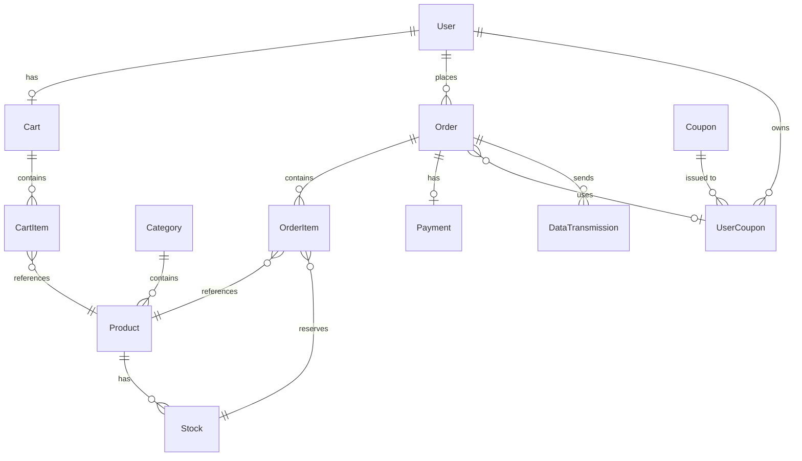

### 1. 사용자 도메인 (User Domain)

사용자 정보를 관리하는 엔티티입니다.

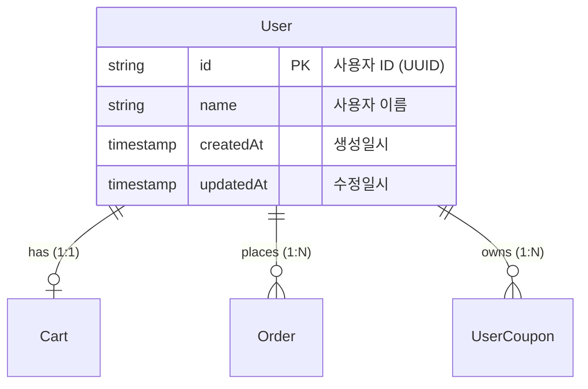

### 2. 상품 도메인 (Product Domain)

상품, 카테고리, 옵션, 재고를 관리하는 엔티티 그룹입니다.

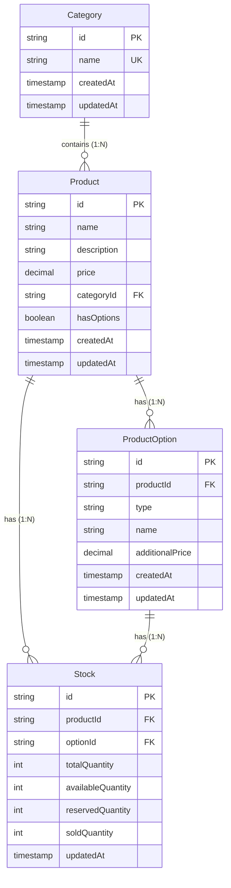

**주요 제약조건**:

- `Stock.totalQuantity = availableQuantity + reservedQuantity + soldQuantity` (CHECK)
- `Stock.availableQuantity >= 0, reservedQuantity >= 0, soldQuantity >= 0` (CHECK)
- `Stock (productId, optionId)` UNIQUE
- `Category.name` UNIQUE
- 동시성 제어: `SELECT FOR UPDATE` on Stock

### 3. 장바구니 도메인 (Cart Domain)

장바구니와 장바구니 항목을 관리하는 엔티티 그룹입니다.

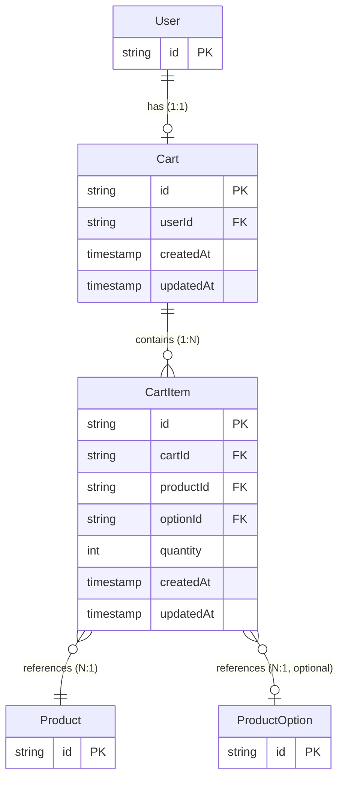

**주요 제약조건**:

- `Cart.userId` UNIQUE (사용자당 1개 장바구니)
- `CartItem (cartId, productId, optionId)` UNIQUE (중복 방지)
- `CartItem.quantity >= 1` (CHECK)

### 4. 주문 및 결제 도메인 (Order Domain)

주문, 결제, 재고 확보를 관리하는 엔티티 그룹입니다.

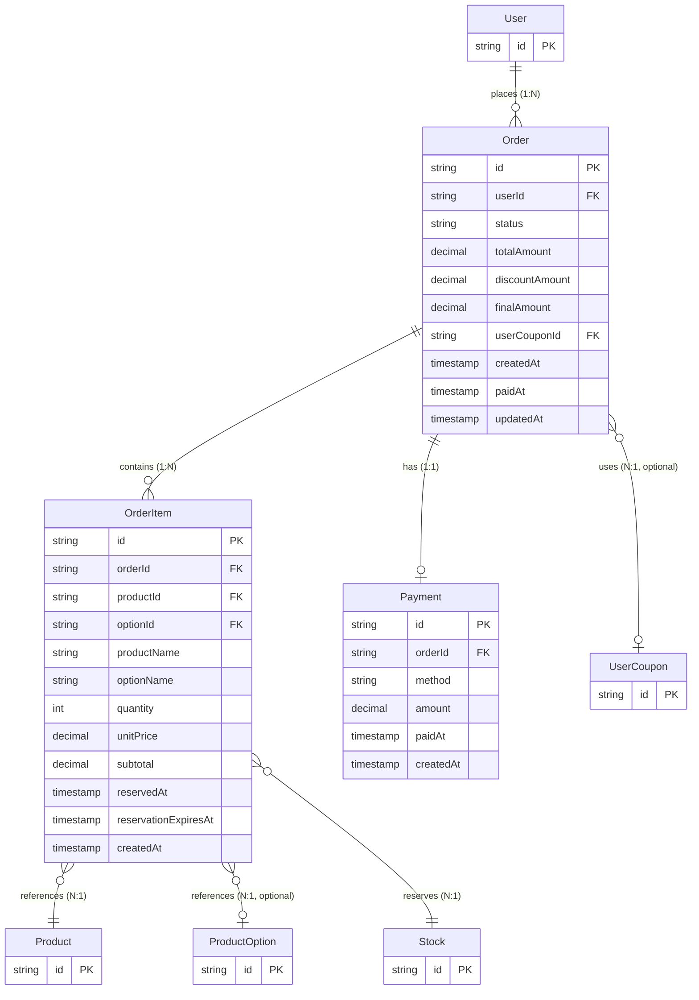

**주요 제약조건**:

- `Order.status` ENUM (PENDING, COMPLETED, FAILED, CANCELLED, EXPIRED)
- `Payment.orderId` UNIQUE (주문당 1개 결제)
- `OrderItem.reservationExpiresAt = reservedAt + 10분` (자동 만료)
- **스냅샷 패턴**: OrderItem에 상품 정보 저장
- **재고 예약**: OrderItem에 reservedAt, reservationExpiresAt 필드로 추적

### 5. 쿠폰 도메인 (Coupon Domain)

쿠폰 마스터와 사용자별 쿠폰을 관리하는 엔티티 그룹입니다.

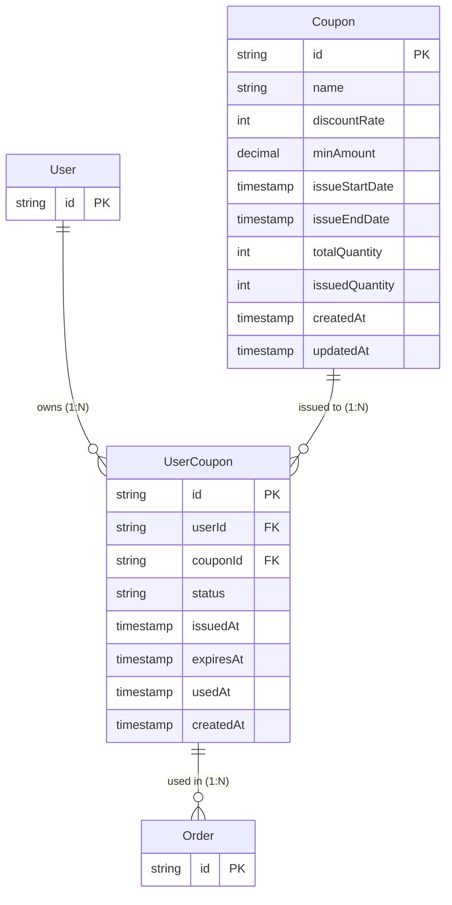

**주요 제약조건**:

- `Coupon.discountRate` 1-100 (CHECK)
- `Coupon.issuedQuantity <= totalQuantity` (애플리케이션 검증)
- `UserCoupon (userId, couponId)` UNIQUE (1인 1매)
- `UserCoupon.status` ENUM (AVAILABLE, USED, EXPIRED)
- 동시성 제어: `SELECT FOR UPDATE` on Coupon

### 6. 데이터 연동 도메인 (Data Transmission Domain)

외부 데이터 플랫폼 전송을 관리하는 엔티티입니다 (Outbox Pattern).

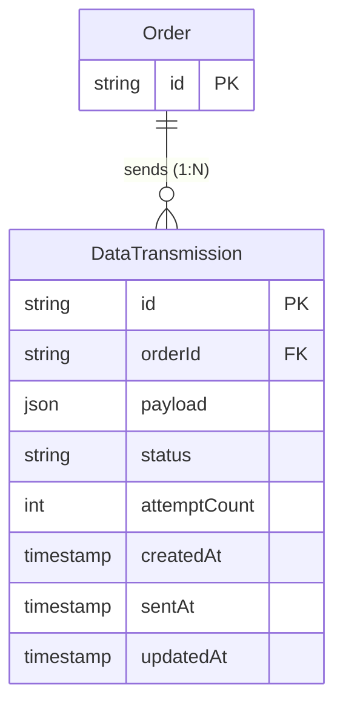

**주요 제약조건**:

- `DataTransmission.status` ENUM (PENDING, SUCCESS, FAILED, FAILED_PERMANENT)
- `DataTransmission.attemptCount >= 0` (CHECK)
- **재시도 전략**: Exponential Backoff (1분, 2분, 4분)
- **최대 재시도**: 3회

---

## 엔티티 상세 설명

### 1. User (사용자)

사용자 정보를 저장하는 엔티티입니다.

#### 컬럼

| 컬럼명 | 데이터 타입 | 제약조건 | 설명 |
|--------|------------|---------|------|
| `id` | VARCHAR(36) | PRIMARY KEY | 사용자 ID (UUID) |
| `name` | VARCHAR(100) | NOT NULL | 사용자 이름 |
| `createdAt` | TIMESTAMP | NOT NULL, DEFAULT NOW() | 생성일시 |
| `updatedAt` | TIMESTAMP | NOT NULL, DEFAULT NOW() | 수정일시 |

#### 인덱스

```sql
-- 기본 키 (자동 생성)
PRIMARY KEY (id)
```

#### 관계

- **1:1** → Cart (한 사용자는 하나의 장바구니를 가짐)
- **1:N** → Order (한 사용자는 여러 주문을 생성)
- **1:N** → UserCoupon (한 사용자는 여러 쿠폰을 보유)

---

### 2. Category (카테고리)

상품 카테고리 정보를 저장하는 엔티티입니다. **단일 계층 구조**로 설계됩니다.

#### 컬럼

| 컬럼명 | 데이터 타입 | 제약조건 | 설명 |
|--------|------------|---------|------|
| `id` | VARCHAR(36) | PRIMARY KEY | 카테고리 ID (UUID) |
| `name` | VARCHAR(50) | NOT NULL, UNIQUE | 카테고리명 |
| `createdAt` | TIMESTAMP | NOT NULL, DEFAULT NOW() | 생성일시 |
| `updatedAt` | TIMESTAMP | NOT NULL, DEFAULT NOW() | 수정일시 |

#### 인덱스

```sql
PRIMARY KEY (id)
-- UTF-8 대소문자 구분 없는 정렬 (PostgreSQL)
UNIQUE INDEX idx_category_name (name) WITH (COLLATE = "ucs_basic")
-- MySQL의 경우: UNIQUE INDEX idx_category_name (name) USING BTREE COLLATE utf8mb4_unicode_ci
```

#### 관계

- **1:N** → Product (한 카테고리는 여러 상품을 포함)

---

### 3. Product (상품)

상품 정보를 저장하는 엔티티입니다.

#### 컬럼

| 컬럼명 | 데이터 타입 | 제약조건 | 설명 |
|--------|------------|---------|------|
| `id` | VARCHAR(36) | PRIMARY KEY | 상품 ID (UUID) |
| `name` | VARCHAR(200) | NOT NULL | 상품명 |
| `description` | TEXT | NULL | 상품 설명 |
| `price` | DECIMAL(10, 2) | NOT NULL, CHECK (price >= 0) | 가격 (원 단위) |
| `categoryId` | VARCHAR(36) | NOT NULL, FOREIGN KEY | 카테고리 ID |
| `hasOptions` | BOOLEAN | NOT NULL, DEFAULT FALSE | 옵션 존재 여부 |
| `createdAt` | TIMESTAMP | NOT NULL, DEFAULT NOW() | 생성일시 |
| `updatedAt` | TIMESTAMP | NOT NULL, DEFAULT NOW() | 수정일시 |

#### 인덱스

```sql
PRIMARY KEY (id)
-- idx_product_category는 복합 인덱스로 커버되므로 제거
INDEX idx_product_created_at (createdAt DESC)     -- 최신순 정렬
INDEX idx_product_category_created (categoryId, createdAt DESC)  -- 카테고리별 조회 + 복합
```

#### 관계

- **N:1** → Category (여러 상품은 하나의 카테고리에 속함)
- **1:N** → ProductOption (한 상품은 여러 옵션을 가질 수 있음)
- **1:N** → Stock (한 상품은 여러 재고 항목을 가질 수 있음)

#### 비즈니스 로직

- `hasOptions = true`일 경우, 장바구니 추가 시 `optionId` 필수
- **재고 유무 계산** (`hasStock`):
  ```sql
  -- 옵션이 없는 상품 (hasOptions = false)
  SELECT EXISTS(
    SELECT 1 FROM Stock
    WHERE productId = :productId AND optionId IS NULL AND availableQuantity > 0
  ) AS hasStock;

  -- 옵션이 있는 상품 (hasOptions = true)
  SELECT EXISTS(
    SELECT 1 FROM Stock
    WHERE productId = :productId AND availableQuantity > 0
  ) AS hasStock;
  ```

---

### 4. ProductOption (상품 옵션)

개별 옵션 정보를 저장하는 엔티티입니다.

#### 컬럼

| 컬럼명 | 데이터 타입 | 제약조건 | 설명 |
|--------|------------|---------|------|
| `id` | VARCHAR(36) | PRIMARY KEY | 옵션 ID (UUID) |
| `productId` | VARCHAR(36) | NOT NULL, FOREIGN KEY | 상품 ID |
| `type` | VARCHAR(50) | NOT NULL | 옵션 타입 (예: "색상", "사이즈") |
| `name` | VARCHAR(50) | NOT NULL | 옵션명 (예: "빨강", "S") |
| `additionalPrice` | DECIMAL(10, 2) | NOT NULL, CHECK (additionalPrice >= 0) | 추가 가격 |
| `createdAt` | TIMESTAMP | NOT NULL, DEFAULT NOW() | 생성일시 |
| `updatedAt` | TIMESTAMP | NOT NULL, DEFAULT NOW() | 수정일시 |

#### 인덱스

```sql
PRIMARY KEY (id)
INDEX idx_option_product (productId)
INDEX idx_option_product_type (productId, type)  -- 타입별 옵션 조회 최적화
```

#### 관계

- **N:1** → Product (여러 옵션은 하나의 상품에 속함)
- **1:N** → Stock (한 옵션은 여러 재고 항목을 가질 수 있음)

#### 비즈니스 로직

- `type` 필드로 옵션 그룹을 구분 (예: "색상", "사이즈")
- 동일 상품의 옵션들은 `type` 필드로 그룹화하여 표시
- 옵션 조회 시 `type`별로 정렬하여 반환

---

### 5. Stock (재고)

상품 및 옵션별 재고 수량을 저장하는 엔티티입니다. 가용/예약/판매 재고를 분리하여 관리합니다.

#### 컬럼

| 컬럼명 | 데이터 타입 | 제약조건 | 설명 |
|--------|------------|---------|------|
| `id` | VARCHAR(36) | PRIMARY KEY | 재고 ID (UUID) |
| `productId` | VARCHAR(36) | NOT NULL, FOREIGN KEY | 상품 ID |
| `optionId` | VARCHAR(36) | NULL, FOREIGN KEY | 옵션 ID (NULL 가능) |
| `totalQuantity` | INT | NOT NULL, CHECK (totalQuantity >= 0) | 전체 재고 수량 |
| `availableQuantity` | INT | NOT NULL, CHECK (availableQuantity >= 0) | 가용 재고 (판매 가능) |
| `reservedQuantity` | INT | NOT NULL, DEFAULT 0, CHECK (reservedQuantity >= 0) | 예약된 재고 (주문 생성, 미결제) |
| `soldQuantity` | INT | NOT NULL, DEFAULT 0, CHECK (soldQuantity >= 0) | 판매된 재고 (결제 완료) |
| `updatedAt` | TIMESTAMP | NOT NULL, DEFAULT NOW() | 수정일시 |

#### 인덱스

```sql
PRIMARY KEY (id)
-- NULL 안전 UNIQUE 제약 (PostgreSQL)
UNIQUE INDEX idx_stock_product_option (productId, COALESCE(optionId, ''))
-- MySQL의 경우: UNIQUE INDEX idx_stock_product_option (productId, IFNULL(optionId, ''))
INDEX idx_stock_product (productId)
```

#### CHECK 제약조건

```sql
-- 수량 정합성 검증
ALTER TABLE Stock ADD CONSTRAINT chk_stock_quantities CHECK (
  totalQuantity = availableQuantity + reservedQuantity + soldQuantity
);

-- 개별 수량 음수 방지
ALTER TABLE Stock ADD CONSTRAINT chk_stock_non_negative CHECK (
  totalQuantity >= 0 AND
  availableQuantity >= 0 AND
  reservedQuantity >= 0 AND
  soldQuantity >= 0
);
```

#### NULL 처리

**중요**: `optionId`가 NULL일 수 있으므로, UNIQUE 제약에서 NULL을 빈 문자열로 변환하여 처리합니다.
- PostgreSQL: `COALESCE(optionId, '')`
- MySQL: `IFNULL(optionId, '')`

이를 통해 옵션이 없는 상품의 재고가 중복 생성되는 것을 방지합니다.

#### 관계

- **N:1** → Product (여러 재고 항목은 하나의 상품에 속함)
- **N:1** → ProductOption (여러 재고 항목은 하나의 옵션에 속함)

#### 동시성 제어

```sql
-- 재고 확보 시 비관적 락 사용 (주문 생성)
BEGIN;
SELECT * FROM Stock WHERE id = :stockId FOR UPDATE;

-- 가용 재고 확인 및 예약
UPDATE Stock
SET availableQuantity = availableQuantity - :quantity,
    reservedQuantity = reservedQuantity + :quantity
WHERE id = :stockId AND availableQuantity >= :quantity;

IF affected_rows = 0 THEN
  ROLLBACK;
  THROW 'OUT_OF_STOCK';
END IF;

COMMIT;
```

#### 비즈니스 로직

**재고 구분**:
- `totalQuantity`: 전체 재고 (입고 시 증가)
- `availableQuantity`: 판매 가능한 재고 (주문 시 감소, 취소/만료 시 증가)
- `reservedQuantity`: 주문 생성되었으나 미결제된 재고 (주문 시 증가, 결제/취소 시 감소)
- `soldQuantity`: 결제 완료된 재고 (결제 시 증가)

**재고 흐름**:
1. **주문 생성 시**:
   - `availableQuantity -= orderQuantity`
   - `reservedQuantity += orderQuantity`

2. **결제 완료 시**:
   - `reservedQuantity -= orderQuantity`
   - `soldQuantity += orderQuantity`

3. **결제 실패/취소 시**:
   - `reservedQuantity -= orderQuantity`
   - `availableQuantity += orderQuantity`

4. **재고 확보 만료 시 (10분 경과)**:
   - `reservedQuantity -= orderQuantity`
   - `availableQuantity += orderQuantity`

**UNIQUE 제약**: (productId, optionId) 조합은 유일해야 함

**옵션 처리**:
- `optionId = NULL`: 옵션이 없는 상품의 재고
- `optionId != NULL`: 특정 옵션의 재고

#### 애플리케이션 레벨 검증

재고 음수 방지 및 수량 정합성은 다음 방법으로 보장합니다:

1. **CHECK 제약조건**: DB 레벨에서 음수 및 정합성 검증
2. **애플리케이션 유효성 검증**: 비즈니스 로직에서 재고 변경 전 검증
3. **비관적 락**: SELECT FOR UPDATE로 동시성 제어
4. **트랜잭션**: ACID 속성으로 데이터 일관성 보장

**상태 전이는 애플리케이션에서 FSM 패턴 등을 활용하여 관리합니다.**

---

### 6. Cart (장바구니)

사용자별 장바구니를 저장하는 엔티티입니다.

#### 컬럼

| 컬럼명 | 데이터 타입 | 제약조건 | 설명 |
|--------|------------|---------|------|
| `id` | VARCHAR(36) | PRIMARY KEY | 장바구니 ID (UUID) |
| `userId` | VARCHAR(36) | NOT NULL, UNIQUE, FOREIGN KEY | 사용자 ID |
| `createdAt` | TIMESTAMP | NOT NULL, DEFAULT NOW() | 생성일시 |
| `updatedAt` | TIMESTAMP | NOT NULL, DEFAULT NOW() | 수정일시 |

#### 인덱스

```sql
PRIMARY KEY (id)
UNIQUE INDEX idx_cart_user (userId)  -- 사용자당 1개 장바구니
```

#### 관계

- **1:1** → User (한 사용자는 하나의 장바구니를 가짐)
- **1:N** → CartItem (한 장바구니는 여러 항목을 포함)

---

### 7. CartItem (장바구니 항목)

장바구니에 담긴 상품 항목을 저장하는 엔티티입니다.

#### 컬럼

| 컬럼명 | 데이터 타입 | 제약조건 | 설명 |
|--------|------------|---------|------|
| `id` | VARCHAR(36) | PRIMARY KEY | 장바구니 항목 ID (UUID) |
| `cartId` | VARCHAR(36) | NOT NULL, FOREIGN KEY | 장바구니 ID |
| `productId` | VARCHAR(36) | NOT NULL, FOREIGN KEY | 상품 ID |
| `optionId` | VARCHAR(36) | NULL, FOREIGN KEY | 옵션 ID (NULL 가능) |
| `quantity` | INT | NOT NULL, CHECK (quantity >= 1) | 수량 |
| `createdAt` | TIMESTAMP | NOT NULL, DEFAULT NOW() | 생성일시 |
| `updatedAt` | TIMESTAMP | NOT NULL, DEFAULT NOW() | 수정일시 |

#### 인덱스

```sql
PRIMARY KEY (id)
INDEX idx_cart_item_cart (cartId)
-- NULL 안전 UNIQUE 제약 (PostgreSQL)
UNIQUE INDEX idx_cart_item_product_option (cartId, productId, COALESCE(optionId, ''))
-- MySQL의 경우: UNIQUE INDEX idx_cart_item_product_option (cartId, productId, IFNULL(optionId, ''))
```

#### NULL 처리

**중요**: `optionId`가 NULL일 수 있으므로, UNIQUE 제약에서 NULL을 빈 문자열로 변환하여 처리합니다.
이를 통해 옵션이 없는 동일 상품이 장바구니에 중복 추가되는 것을 방지합니다.

#### 관계

- **N:1** → Cart (여러 항목은 하나의 장바구니에 속함)
- **N:1** → Product (여러 항목은 하나의 상품을 참조)
- **N:1** → ProductOption (여러 항목은 하나의 옵션을 참조)

#### 비즈니스 로직

- 동일한 (cartId, productId, optionId) 조합은 수량만 증가
- `optionId = NULL`: 옵션이 없는 상품

---

### 8. Order (주문)

주문 정보를 저장하는 엔티티입니다.

> **재고 예약 관리**: 재고 예약은 Order 레벨에서 관리됩니다. 주문 생성 시 `reservationExpiresAt` (생성 시간 + 10분)이 설정되며, 모든 OrderItem이 동일한 예약 만료 시간을 공유합니다.

#### 컬럼

| 컬럼명 | 데이터 타입 | 제약조건 | 설명 |
|--------|------------|---------|------|
| `id` | VARCHAR(36) | PRIMARY KEY | 주문 ID (UUID) |
| `userId` | VARCHAR(36) | NOT NULL, FOREIGN KEY | 사용자 ID |
| `status` | ENUM | NOT NULL | 주문 상태 (PENDING, COMPLETED, FAILED, CANCELLED, EXPIRED) |
| `totalAmount` | DECIMAL(10, 2) | NOT NULL, CHECK (totalAmount >= 0) | 총 상품 금액 |
| `discountAmount` | DECIMAL(10, 2) | NOT NULL, DEFAULT 0, CHECK (discountAmount >= 0) | 할인 금액 |
| `finalAmount` | DECIMAL(10, 2) | NOT NULL, CHECK (finalAmount >= 0) | 최종 결제 금액 |
| `userCouponId` | VARCHAR(36) | NULL, FOREIGN KEY | 사용자 쿠폰 ID |
| `reservationExpiresAt` | TIMESTAMP | NOT NULL | 재고 예약 만료 시간 (생성 시간 + 10분) |
| `createdAt` | TIMESTAMP | NOT NULL, DEFAULT NOW() | 생성일시 |
| `paidAt` | TIMESTAMP | NULL | 결제일시 |
| `updatedAt` | TIMESTAMP | NOT NULL, DEFAULT NOW() | 수정일시 |

#### ENUM 정의

```sql
-- PostgreSQL
CREATE TYPE order_status AS ENUM ('PENDING', 'COMPLETED', 'FAILED', 'CANCELLED', 'EXPIRED');

-- MySQL
-- ENUM('PENDING', 'COMPLETED', 'FAILED', 'CANCELLED', 'EXPIRED')
```

#### CHECK 제약

```sql
-- 금액 계산 정확성 보장
ALTER TABLE "Order" ADD CONSTRAINT chk_final_amount
CHECK (finalAmount = totalAmount - discountAmount);

-- 또는 Generated Column (PostgreSQL 12+)
-- finalAmount DECIMAL(10, 2) GENERATED ALWAYS AS (totalAmount - discountAmount) STORED
```

#### 인덱스

```sql
PRIMARY KEY (id)
INDEX idx_order_user_status (userId, status)                -- 사용자별 주문 조회
INDEX idx_order_created_at (createdAt DESC)                 -- 최신순 정렬
INDEX idx_order_status_paid_at (status, paidAt)             -- 인기 상품 통계
INDEX idx_order_reservation_expires (status, reservationExpiresAt)  -- 재고 예약 만료 배치 작업
```

#### 관계

- **N:1** → User (여러 주문은 하나의 사용자에 속함)
- **1:N** → OrderItem (한 주문은 여러 항목을 포함)
- **1:1** → Payment (한 주문은 하나의 결제 정보를 가짐)
- **N:1** → UserCoupon (여러 주문은 하나의 쿠폰을 사용할 수 있음)

#### 상태 전이

```
PENDING → COMPLETED  (결제 성공)
PENDING → FAILED     (결제 실패)
PENDING → EXPIRED    (10분 타임아웃)
PENDING → CANCELLED  (사용자 취소)
COMPLETED → CANCELLED (주문 취소)
```

#### 상태 전이 검증

잘못된 상태 전이(예: `COMPLETED → PENDING`)는 **애플리케이션 레벨에서 FSM(Finite State Machine) 패턴**을 사용하여 방지합니다.

**구현 예시**:
```typescript
// 허용되는 상태 전이 정의
const ALLOWED_TRANSITIONS = {
  PENDING: ['COMPLETED', 'FAILED', 'EXPIRED', 'CANCELLED'],
  FAILED: [],  // 재결제는 PENDING 유지
  COMPLETED: ['CANCELLED'],
  CANCELLED: [],
  EXPIRED: []
};

function validateStatusTransition(currentStatus, newStatus) {
  const allowed = ALLOWED_TRANSITIONS[currentStatus] || [];
  if (!allowed.includes(newStatus)) {
    throw new Error(`Invalid status transition: ${currentStatus} -> ${newStatus}`);
  }
}
```

이를 통해 비즈니스 로직을 애플리케이션에서 관리하고, 디버깅과 유지보수가 용이합니다.

---

### 9. OrderItem (주문 항목)

주문에 포함된 상품 항목을 저장하는 엔티티입니다. **스냅샷 패턴**을 사용하여 주문 시점의 상품 정보를 저장합니다.

> **재고 예약 관리**: 재고 예약은 Order 엔티티 레벨에서 관리됩니다 (Order.reservationExpiresAt). OrderItem은 주문 시점의 상품 정보 스냅샷만 저장합니다.

#### 컬럼

| 컬럼명 | 데이터 타입 | 제약조건 | 설명 |
|--------|------------|---------|------|
| `id` | VARCHAR(36) | PRIMARY KEY | 주문 항목 ID (UUID) |
| `orderId` | VARCHAR(36) | NOT NULL, FOREIGN KEY | 주문 ID |
| `productId` | VARCHAR(36) | NOT NULL, FOREIGN KEY | 상품 ID (참조용) |
| `optionId` | VARCHAR(36) | NULL, FOREIGN KEY | 옵션 ID (참조용) |
| `productName` | VARCHAR(200) | NOT NULL | 상품명 (스냅샷) |
| `optionName` | VARCHAR(50) | NULL | 옵션명 (스냅샷) |
| `quantity` | INT | NOT NULL, CHECK (quantity >= 1) | 수량 |
| `price` | DECIMAL(10, 2) | NOT NULL, CHECK (price >= 0) | 단가 (상품 가격 + 옵션 추가 가격) |
| `subtotal` | DECIMAL(10, 2) | NOT NULL, CHECK (subtotal >= 0) | 소계 (price × quantity) |
| `createdAt` | TIMESTAMP | NOT NULL, DEFAULT NOW() | 생성일시 |

#### 인덱스

```sql
PRIMARY KEY (id)
INDEX idx_order_item_order (orderId)
INDEX idx_order_item_product (productId)  -- 인기 상품 통계
```

#### 관계

- **N:1** → Order (여러 항목은 하나의 주문에 속함)
- **N:1** → Product (여러 항목은 하나의 상품을 참조)
- **N:1** → ProductOption (여러 항목은 하나의 옵션을 참조)

#### 비즈니스 로직

**스냅샷 패턴**:
- `productName`, `optionName`, `price` 필드는 주문 시점의 값을 저장
- `price`는 상품 가격 + 옵션 추가 가격의 합계
- 상품 정보가 변경되어도 주문 내역은 영향받지 않음
- 주문 완료 후 가격 변경이나 상품 삭제에도 주문 이력은 유지됨

**재고 예약 관리**:
- 재고 예약은 Order 엔티티에서 관리됨 (`Order.reservationExpiresAt`)
- 한 주문의 모든 OrderItem은 동일한 예약 만료 시간을 공유
- 배치 작업은 Order 단위로 만료를 확인하고 재고를 복원함

**재고 예약 만료 처리**:
```sql
-- 만료된 주문 조회 (배치 작업)
SELECT o.*, oi.*
FROM "Order" o
JOIN OrderItem oi ON o.id = oi.orderId
WHERE o.status = 'PENDING'
  AND o.reservationExpiresAt < NOW();
```

---

### 10. Payment (결제)

결제 정보를 저장하는 엔티티입니다.

#### 컬럼

| 컬럼명 | 데이터 타입 | 제약조건 | 설명 |
|--------|------------|---------|------|
| `id` | VARCHAR(36) | PRIMARY KEY | 결제 ID (UUID) |
| `orderId` | VARCHAR(36) | NOT NULL, UNIQUE, FOREIGN KEY | 주문 ID |
| `method` | ENUM | NOT NULL | 결제 수단 (CARD, BANK_TRANSFER) |
| `amount` | DECIMAL(10, 2) | NOT NULL, CHECK (amount >= 0) | 결제 금액 |
| `paidAt` | TIMESTAMP | NOT NULL | 결제일시 |
| `createdAt` | TIMESTAMP | NOT NULL, DEFAULT NOW() | 생성일시 |

#### ENUM 정의

```sql
-- PostgreSQL
CREATE TYPE payment_method AS ENUM ('CARD', 'BANK_TRANSFER');

-- MySQL
-- ENUM('CARD', 'BANK_TRANSFER')
```

#### 인덱스

```sql
PRIMARY KEY (id)
UNIQUE INDEX idx_payment_order (orderId)  -- 주문당 1개 결제
```

#### 관계

- **1:1** → Order (한 결제는 하나의 주문에 대응)

---

### 11. Coupon (쿠폰 마스터)

쿠폰 마스터 정보를 저장하는 엔티티입니다.

#### 컬럼

| 컬럼명 | 데이터 타입 | 제약조건 | 설명 |
|--------|------------|---------|------|
| `id` | VARCHAR(36) | PRIMARY KEY | 쿠폰 ID (UUID) |
| `name` | VARCHAR(100) | NOT NULL | 쿠폰명 |
| `discountRate` | INT | NOT NULL, CHECK (discountRate BETWEEN 1 AND 100) | 할인율 (%) |
| `minAmount` | DECIMAL(10, 2) | NULL, CHECK (minAmount >= 0) | 최소 주문 금액 |
| `issueStartDate` | TIMESTAMP | NOT NULL | 발급 시작일 |
| `issueEndDate` | TIMESTAMP | NOT NULL | 발급 종료일 |
| `totalQuantity` | INT | NOT NULL, CHECK (totalQuantity >= 1) | 총 발급 가능 수량 |
| `issuedQuantity` | INT | NOT NULL, DEFAULT 0, CHECK (issuedQuantity >= 0) | 현재 발급된 수량 |
| `createdAt` | TIMESTAMP | NOT NULL, DEFAULT NOW() | 생성일시 |
| `updatedAt` | TIMESTAMP | NOT NULL, DEFAULT NOW() | 수정일시 |

#### 인덱스

```sql
PRIMARY KEY (id)
INDEX idx_coupon_issue_date (issueStartDate, issueEndDate)
```

#### CHECK 제약

```sql
-- 발급 수량 정합성 보장
ALTER TABLE Coupon ADD CONSTRAINT chk_issued_quantity
CHECK (issuedQuantity <= totalQuantity);
```

이 제약을 통해 애플리케이션 버그가 발생해도 `issuedQuantity > totalQuantity`가 되는 것을 DB 레벨에서 방지합니다.

#### 관계

- **1:N** → UserCoupon (한 쿠폰은 여러 사용자에게 발급)

#### 동시성 제어

```sql
-- 쿠폰 발급 시 비관적 락 사용
BEGIN;
SELECT * FROM Coupon WHERE id = :couponId FOR UPDATE;
UPDATE Coupon SET issuedQuantity = issuedQuantity + 1
WHERE id = :couponId AND issuedQuantity < totalQuantity;
COMMIT;
```

#### 비즈니스 로직

- `issuedQuantity <= totalQuantity` 제약 (애플리케이션 레벨)
- 1인 1매 제한은 `UserCoupon` 테이블에서 검증

---

### 12. UserCoupon (사용자 쿠폰)

사용자별로 발급된 쿠폰을 저장하는 엔티티입니다.

#### 컬럼

| 컬럼명 | 데이터 타입 | 제약조건 | 설명 |
|--------|------------|---------|------|
| `id` | VARCHAR(36) | PRIMARY KEY | 사용자 쿠폰 ID (UUID) |
| `userId` | VARCHAR(36) | NOT NULL, FOREIGN KEY | 사용자 ID |
| `couponId` | VARCHAR(36) | NOT NULL, FOREIGN KEY | 쿠폰 ID |
| `status` | ENUM | NOT NULL | 쿠폰 상태 (AVAILABLE, USED, EXPIRED) |
| `issuedAt` | TIMESTAMP | NOT NULL, DEFAULT NOW() | 발급일시 |
| `expiresAt` | TIMESTAMP | NOT NULL | 만료일시 |
| `usedAt` | TIMESTAMP | NULL | 사용일시 |
| `createdAt` | TIMESTAMP | NOT NULL, DEFAULT NOW() | 생성일시 |

#### ENUM 정의

```sql
-- PostgreSQL
CREATE TYPE coupon_status AS ENUM ('AVAILABLE', 'USED', 'EXPIRED');

-- MySQL
-- ENUM('AVAILABLE', 'USED', 'EXPIRED')
```

#### 인덱스

```sql
PRIMARY KEY (id)
INDEX idx_user_coupon_user_status (userId, status)    -- 사용자별 쿠폰 조회
INDEX idx_user_coupon_expires_at (expiresAt)          -- 만료 배치 작업
UNIQUE INDEX idx_user_coupon_user_coupon (userId, couponId)  -- 1인 1매 제한
```

#### 관계

- **N:1** → User (여러 쿠폰은 하나의 사용자에게 발급)
- **N:1** → Coupon (여러 사용자 쿠폰은 하나의 쿠폰 마스터를 참조)
- **1:N** → Order (한 쿠폰은 여러 주문에서 사용될 수 없음 - 1회용)

#### 상태 전이

```
AVAILABLE → USED    (주문 생성 시)
AVAILABLE → EXPIRED (만료일 경과)
```

#### 비즈니스 로직

- **1인 1매**: (userId, couponId) UNIQUE 제약
- 배치 작업(1일 1회): `status = 'AVAILABLE' AND expiresAt < NOW()` → `status = 'EXPIRED'`

---

### 13. DataTransmission (데이터 전송 - Outbox)

외부 데이터 플랫폼으로 전송할 주문 데이터를 저장하는 엔티티입니다. **Outbox Pattern**을 사용합니다.

#### 컬럼

| 컬럼명 | 데이터 타입 | 제약조건 | 설명 |
|--------|------------|---------|------|
| `id` | VARCHAR(36) | PRIMARY KEY | 전송 ID (UUID) |
| `orderId` | VARCHAR(36) | NOT NULL, FOREIGN KEY | 주문 ID |
| `payload` | JSON | NOT NULL | 전송 데이터 (JSON 형식) |
| `status` | ENUM | NOT NULL | 전송 상태 (PENDING, SUCCESS, FAILED, FAILED_PERMANENT) |
| `attemptCount` | INT | NOT NULL, DEFAULT 0, CHECK (attemptCount >= 0) | 시도 횟수 |
| `createdAt` | TIMESTAMP | NOT NULL, DEFAULT NOW() | 생성일시 |
| `sentAt` | TIMESTAMP | NULL | 전송일시 |
| `updatedAt` | TIMESTAMP | NOT NULL, DEFAULT NOW() | 수정일시 |

#### ENUM 정의

```sql
-- PostgreSQL
CREATE TYPE transmission_status AS ENUM ('PENDING', 'SUCCESS', 'FAILED', 'FAILED_PERMANENT');

-- MySQL
-- ENUM('PENDING', 'SUCCESS', 'FAILED', 'FAILED_PERMANENT')
```

#### 인덱스

```sql
PRIMARY KEY (id)
INDEX idx_transmission_status_created (status, createdAt)  -- 재시도 배치 작업
INDEX idx_transmission_order (orderId)
```

#### 관계

- **N:1** → Order (여러 전송은 하나의 주문을 참조)

#### 상태 전이

```
PENDING → SUCCESS           (전송 성공)
PENDING → FAILED            (전송 실패, attemptCount < 3)
FAILED → SUCCESS            (재시도 성공)
FAILED → FAILED_PERMANENT   (attemptCount >= 3)
```

#### 비즈니스 로직

- **Outbox Pattern**: 주문 트랜잭션 내에서 PENDING 상태로 삽입
- 배치 워커가 주기적으로 PENDING/FAILED 상태 데이터를 외부 전송
- **재시도 전략**: Exponential Backoff (1분, 2분, 4분)
- `attemptCount >= 3` 시 `FAILED_PERMANENT`로 변경 및 알림

---

## 관계 설명

### 1. User 관련 관계

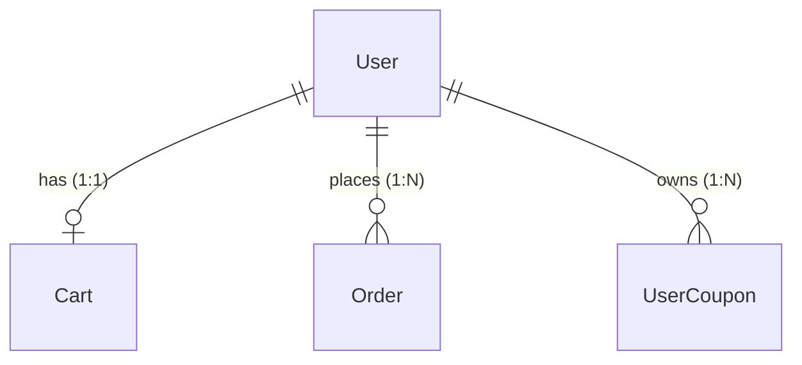

- **User → Cart (1:1)**: 사용자당 하나의 장바구니
- **User → Order (1:N)**: 사용자는 여러 주문 생성 가능
- **User → UserCoupon (1:N)**: 사용자는 여러 쿠폰 보유 가능

### 2. Product 관련 관계

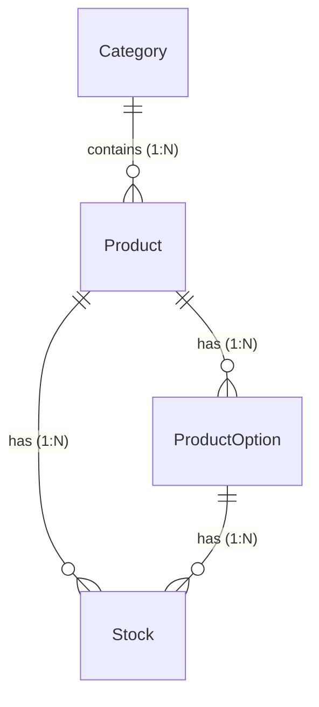

- **Category → Product (1:N)**: 카테고리는 여러 상품 포함
- **Product → ProductOption (1:N)**: 상품은 여러 옵션 보유
- **Product → Stock (1:N)**: 상품은 여러 재고 항목 보유 (옵션별)
- **ProductOption → Stock (1:N)**: 옵션별 재고 관리

### 3. Cart 관련 관계

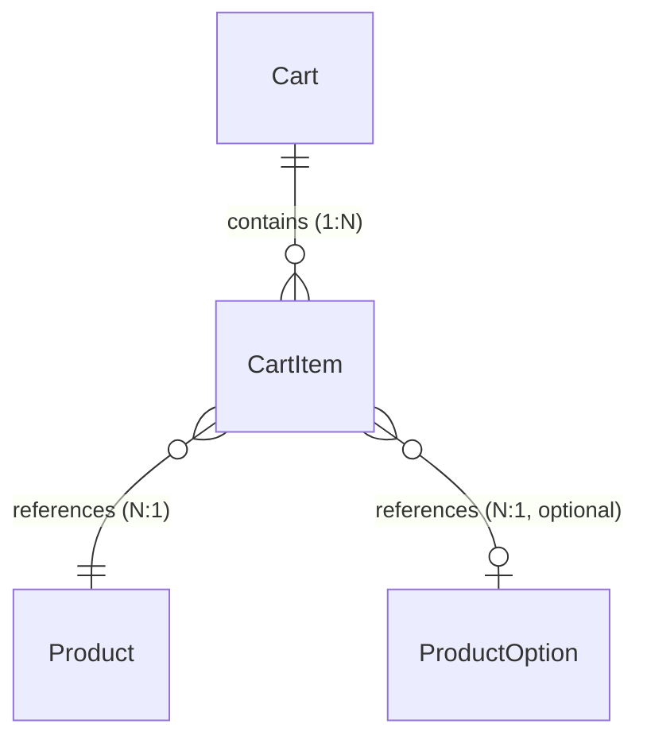

- **Cart → CartItem (1:N)**: 장바구니는 여러 항목 포함
- **CartItem → Product (N:1)**: 장바구니 항목은 하나의 상품 참조
- **CartItem → ProductOption (N:1, optional)**: 장바구니 항목은 옵션 참조 (선택)

### 4. Order 관련 관계

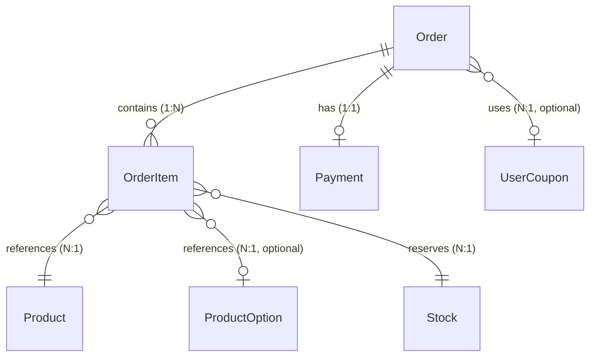

- **Order → OrderItem (1:N)**: 주문은 여러 항목 포함
- **Order → Payment (1:1)**: 주문당 하나의 결제
- **Order → UserCoupon (N:1, optional)**: 주문은 쿠폰 사용 가능
- **OrderItem → Product (N:1)**: 주문 항목은 하나의 상품 참조
- **OrderItem → ProductOption (N:1, optional)**: 주문 항목은 옵션 참조 (선택)
- **OrderItem → Stock (N:1)**: 주문 항목은 하나의 재고를 예약

### 5. Coupon 관련 관계

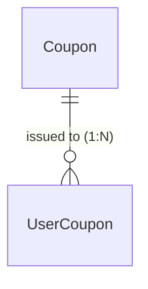

- **Coupon → UserCoupon (1:N)**: 쿠폰은 여러 사용자에게 발급

### 6. DataTransmission 관련 관계

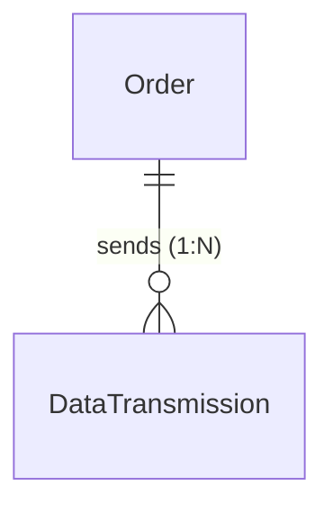

- **Order → DataTransmission (1:N)**: 주문은 여러 전송 시도 가능

---

## 인덱스 전략

### 1. 조회 성능 최적화

#### 상품 조회
```sql
-- 최신순 정렬 (단독 쿼리용)
INDEX idx_product_created_at (createdAt DESC)

-- 카테고리별 + 최신순 (복합 인덱스)
-- 주의: 이 인덱스가 있으면 idx_product_category는 불필요
INDEX idx_product_category_created (categoryId, createdAt DESC)
```

**최적화 노트**: `idx_product_category_created`는 첫 번째 컬럼이 `categoryId`이므로, 카테고리별 조회 쿼리에도 사용됩니다. 따라서 별도의 `idx_product_category` 인덱스는 중복입니다.

#### 장바구니 조회
```sql
-- 사용자별 장바구니 조회
UNIQUE INDEX idx_cart_user (userId)
INDEX idx_cart_item_cart (cartId)
```

#### 주문 조회
```sql
-- 사용자별 주문 조회
INDEX idx_order_user_status (userId, status)

-- 최신순 정렬
INDEX idx_order_created_at (createdAt DESC)
```

### 2. 통계 쿼리 최적화

#### 인기 상품 통계 (최근 3일)
```sql
-- Order 테이블
INDEX idx_order_status_paid_at (status, paidAt)

-- OrderItem 테이블
INDEX idx_order_item_product (productId)

-- 쿼리 예시
SELECT
  p.id,
  p.name,
  SUM(oi.quantity) AS sales_count,
  SUM(oi.subtotal) AS sales_amount
FROM Product p
JOIN OrderItem oi ON p.id = oi.productId
JOIN Order o ON oi.orderId = o.id
WHERE o.status = 'COMPLETED'
  AND o.paidAt >= NOW() - INTERVAL '3 days'
GROUP BY p.id, p.name
ORDER BY sales_count DESC
LIMIT 5;
```

### 3. 동시성 제어 인덱스

#### 재고 관리
```sql
-- 상품+옵션 조합 UNIQUE
UNIQUE INDEX idx_stock_product_option (productId, optionId)
```

#### 쿠폰 발급
```sql
-- 1인 1매 제한
UNIQUE INDEX idx_user_coupon_user_coupon (userId, couponId)
```

### 4. 배치 작업 인덱스

#### 재고 예약 만료
```sql
INDEX idx_order_reservation_expires (status, reservationExpiresAt)

-- 배치 쿼리: 만료된 주문 조회
SELECT o.*, oi.*
FROM "Order" o
JOIN OrderItem oi ON o.id = oi.orderId
WHERE o.status = 'PENDING' AND o.reservationExpiresAt < NOW();
```

#### 쿠폰 만료
```sql
INDEX idx_user_coupon_expires_at (expiresAt)

-- 배치 쿼리
UPDATE UserCoupon
SET status = 'EXPIRED'
WHERE status = 'AVAILABLE' AND expiresAt < NOW();
```

#### 외부 전송 재시도
```sql
INDEX idx_transmission_status_created (status, createdAt)

-- 배치 쿼리
SELECT * FROM DataTransmission
WHERE status IN ('PENDING', 'FAILED')
ORDER BY createdAt ASC;
```

---

## 동시성 제어 전략

### 1. 비관적 락 (Pessimistic Lock)

#### 재고 예약 (주문 생성)

```sql
-- 트랜잭션 시작
BEGIN;

-- 재고 행에 배타적 락 획득
SELECT * FROM Stock
WHERE id = :stockId
FOR UPDATE;

-- 가용 재고 확인 및 예약
UPDATE Stock
SET availableQuantity = availableQuantity - :quantity,
    reservedQuantity = reservedQuantity + :quantity
WHERE id = :stockId AND availableQuantity >= :quantity;

-- 결과 확인: affected rows = 0 → 가용 재고 부족
IF affected_rows = 0 THEN
  ROLLBACK;
  THROW 'OUT_OF_STOCK';
END IF;

-- 주문 생성 (재고 예약 만료 시간 설정)
INSERT INTO "Order" (
  id, userId, status, totalAmount, discountAmount, finalAmount,
  userCouponId, reservationExpiresAt, createdAt, updatedAt
)
VALUES (
  :orderId, :userId, 'PENDING', :totalAmount, :discountAmount, :finalAmount,
  :userCouponId, NOW() + INTERVAL '10 minutes', NOW(), NOW()
);

-- 주문 항목 생성 (스냅샷 정보만 저장)
INSERT INTO OrderItem (
  orderId, productId, optionId,
  productName, optionName, quantity, price, subtotal
)
VALUES (
  :orderId, :productId, :optionId,
  :productName, :optionName, :quantity, :price, :subtotal
);

-- 트랜잭션 커밋
COMMIT;
```

**효과**:
- 다른 트랜잭션은 `SELECT FOR UPDATE`가 완료될 때까지 대기
- 100명이 동시 요청 시 순차적으로 처리되어 정확한 가용 재고 수량 보장
- 재고 예약 만료는 Order 레벨에서 관리하여 구조 간소화

#### 쿠폰 발급

```sql
-- 트랜잭션 시작
BEGIN;

-- 쿠폰 행에 배타적 락 획득
SELECT * FROM Coupon
WHERE id = :couponId
FOR UPDATE;

-- 중복 발급 확인 (1인 1매)
SELECT COUNT(*) FROM UserCoupon
WHERE userId = :userId AND couponId = :couponId;

IF count > 0 THEN
  ROLLBACK;
  THROW 'ALREADY_ISSUED';
END IF;

-- 쿠폰 발급 가능 여부 확인 및 수량 증가
UPDATE Coupon
SET issuedQuantity = issuedQuantity + 1
WHERE id = :couponId AND issuedQuantity < totalQuantity;

IF affected_rows = 0 THEN
  ROLLBACK;
  THROW 'COUPON_SOLD_OUT';
END IF;

-- 사용자 쿠폰 발급
INSERT INTO UserCoupon (userId, couponId, status, issuedAt, expiresAt)
VALUES (:userId, :couponId, 'AVAILABLE', NOW(), :expiresAt);

-- 트랜잭션 커밋
COMMIT;
```

**효과**:
- 100명이 100개 쿠폰을 동시 요청 시 정확히 100명만 발급 성공
- 1인 1매 제한 보장

### 2. 트랜잭션 격리 수준

#### PostgreSQL 기본 설정

```sql
-- 기본 격리 수준: READ COMMITTED
SHOW TRANSACTION ISOLATION LEVEL;
```

**READ COMMITTED의 장점**:
- Dirty Read 방지
- 적절한 동시성 보장
- 대부분의 동시성 문제 해결

#### 특수한 경우: SERIALIZABLE

```sql
-- 높은 정합성이 필요한 경우 (예: 금융 거래)
BEGIN TRANSACTION ISOLATION LEVEL SERIALIZABLE;
-- 트랜잭션 로직
COMMIT;
```

### 3. 낙관적 락 (Optimistic Lock) - 선택적 사용

#### 버전 컬럼 추가 (선택)

```sql
-- Stock 테이블에 version 컬럼 추가 (선택적)
ALTER TABLE Stock ADD COLUMN version INT NOT NULL DEFAULT 1;

-- 재고 예약 시 버전 확인
UPDATE Stock
SET availableQuantity = availableQuantity - :quantity,
    reservedQuantity = reservedQuantity + :quantity,
    version = version + 1
WHERE id = :stockId
  AND version = :expectedVersion
  AND availableQuantity >= :quantity;

IF affected_rows = 0 THEN
  THROW 'CONFLICT or OUT_OF_STOCK';
END IF;
```

**사용 시나리오**:
- 동시성이 낮고 충돌이 드문 경우
- 읽기가 많고 쓰기가 적은 경우

**본 프로젝트에서는 비관적 락 권장**:
- 재고 및 쿠폰은 동시성이 높은 리소스
- 정확한 수량 제어가 필수

### 4. 데드락 방지

#### 락 획득 순서 일관성

```sql
-- 나쁜 예: 순서가 다른 락 획득
-- Transaction A
SELECT * FROM Stock WHERE id = 'stock-001' FOR UPDATE;
SELECT * FROM Coupon WHERE id = 'coupon-001' FOR UPDATE;

-- Transaction B
SELECT * FROM Coupon WHERE id = 'coupon-001' FOR UPDATE;  -- Deadlock!
SELECT * FROM Stock WHERE id = 'stock-001' FOR UPDATE;

-- 좋은 예: 항상 동일한 순서로 락 획득
-- 모든 트랜잭션은 Stock → Coupon 순서로 락 획득
```

#### 타임아웃 설정

```sql
-- PostgreSQL
SET lock_timeout = '5s';

-- MySQL
SET innodb_lock_wait_timeout = 5;
```

---

## 성능 최적화 전략

### 1. 캐싱 전략

#### 인기 상품 통계 캐싱

```typescript
// Redis 캐시 사용 예시
const POPULAR_PRODUCTS_KEY = 'popular_products:3days';
const CACHE_TTL = 15 * 60; // 15분

async function getPopularProducts() {
  // 캐시 조회
  const cached = await redis.get(POPULAR_PRODUCTS_KEY);
  if (cached) {
    return JSON.parse(cached);
  }

  // DB 조회
  const products = await db.query(`
    SELECT ... FROM Product ... (인기 상품 쿼리)
  `);

  // 캐시 저장
  await redis.setex(POPULAR_PRODUCTS_KEY, CACHE_TTL, JSON.stringify(products));

  return products;
}
```

**갱신 전략**:
- TTL: 15분
- 배치 작업: 10분마다 백그라운드 갱신
- API 응답: 캐시 우선, 만료 시 DB 조회

#### 상품 정보 캐싱

```typescript
// 상품 상세 정보 캐싱
const PRODUCT_KEY = (id: string) => `product:${id}`;
const PRODUCT_TTL = 60 * 60; // 1시간

async function getProductById(id: string) {
  const cached = await redis.get(PRODUCT_KEY(id));
  if (cached) {
    return JSON.parse(cached);
  }

  const product = await db.product.findUnique({ where: { id } });
  await redis.setex(PRODUCT_KEY(id), PRODUCT_TTL, JSON.stringify(product));

  return product;
}
```

### 2. 쿼리 최적화

#### N+1 문제 해결

```typescript
// 나쁜 예: N+1 쿼리
const orders = await db.order.findMany();
for (const order of orders) {
  const items = await db.orderItem.findMany({ where: { orderId: order.id } });
  // ...
}

// 좋은 예: JOIN 사용
const orders = await db.order.findMany({
  include: {
    items: true,
    payment: true,
    userCoupon: {
      include: { coupon: true }
    }
  }
});
```

#### 인덱스 힌트 사용

```sql
-- PostgreSQL
SELECT * FROM Product
WHERE categoryId = :categoryId
ORDER BY createdAt DESC
-- 인덱스 힌트 (필요 시)
;

-- MySQL
SELECT * FROM Product USE INDEX (idx_product_category_created)
WHERE categoryId = :categoryId
ORDER BY createdAt DESC;
```

### 3. 배치 처리 최적화

#### 벌크 연산

```sql
-- 나쁜 예: 개별 INSERT
INSERT INTO OrderItem (...) VALUES (...);  -- N번 실행

-- 좋은 예: 벌크 INSERT
INSERT INTO OrderItem (orderId, productId, quantity, ...)
VALUES
  (:orderId, :productId1, :quantity1, ...),
  (:orderId, :productId2, :quantity2, ...),
  (...);
```

#### 배치 작업 최적화

```typescript
// 재고 예약 만료 배치 (1분마다)
async function expireStockReservations() {
  // 만료된 주문 조회 (Order 레벨)
  const expiredOrders = await db.order.findMany({
    where: {
      status: 'PENDING',
      reservationExpiresAt: { lt: new Date() }
    },
    include: {
      items: {
        include: {
          product: {
            include: { stock: true }
          }
        }
      }
    }
  });

  if (expiredOrders.length === 0) return;

  // 각 주문별로 재고 복원 수량 계산
  const stockUpdates = new Map<string, number>();

  for (const order of expiredOrders) {
    for (const item of order.items) {
      const stockId = item.product.stock.id;
      const currentQty = stockUpdates.get(stockId) || 0;
      stockUpdates.set(stockId, currentQty + item.quantity);
    }
  }

  // 벌크 업데이트
  await db.$transaction([
    // 재고 복원 (각 Stock별로)
    ...Array.from(stockUpdates.entries()).map(([stockId, quantity]) =>
      db.stock.update({
        where: { id: stockId },
        data: {
          availableQuantity: { increment: quantity },
          reservedQuantity: { decrement: quantity }
        }
      })
    ),
    // 주문 상태 변경
    db.order.updateMany({
      where: {
        id: { in: expiredOrders.map(o => o.id) }
      },
      data: { status: 'EXPIRED' }
    })
  ]);
}
```

### 4. 커넥션 풀 최적화

```typescript
// Prisma 커넥션 풀 설정
const prisma = new PrismaClient({
  datasources: {
    db: {
      url: process.env.DATABASE_URL,
    }
  },
  // 커넥션 풀 설정
  // connection_limit=10
});
```

**권장 설정** (PostgreSQL):
- **최소 커넥션**: 5
- **최대 커넥션**: 20
- **타임아웃**: 30초

---

## 관련 문서

- **이전**: [← API 명세서](api-specification.md)
- **다음**: [시퀀스 다이어그램 →](sequence-diagrams.md)
- **요구사항**: [요구사항 분석](requirements.md)
- **사용자 스토리**: [사용자 스토리](user-stories.md)
- **Issue**: [Issue #003](../../issue/issue003.md)

---

**버전 이력**:
- 1.1.0 (2025-11-02): 피드백 반영 - 데이터 모델 간소화
  - ProductOptionGroup 제거 → ProductOption에 `type` 필드 추가
  - StockReservation 제거 → OrderItem에서 예약 관리
  - Stock 재고 분리 (available/reserved/sold)
  - DB 트리거 제거 → FSM 패턴 적용
  - 엔티티 수: 15개 → 13개
- 1.0.0 (2025-10-31): 초기 데이터 모델 문서 작성
  - 15개 엔티티 정의
  - Mermaid ERD 다이어그램 작성
  - 인덱스 전략 수립
  - 동시성 제어 전략 문서화
  - 성능 최적화 가이드 작성
