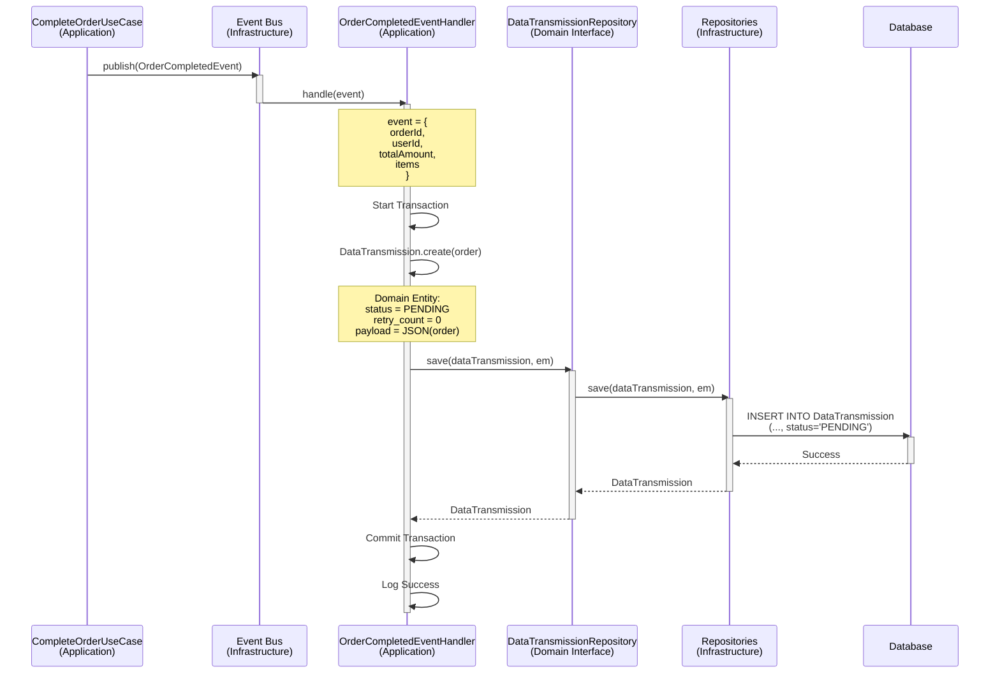
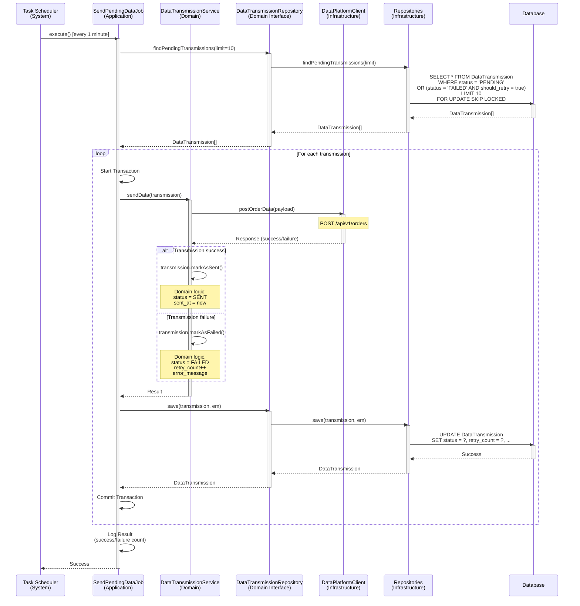
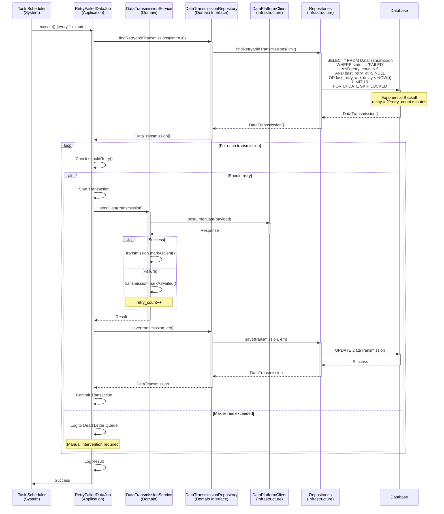
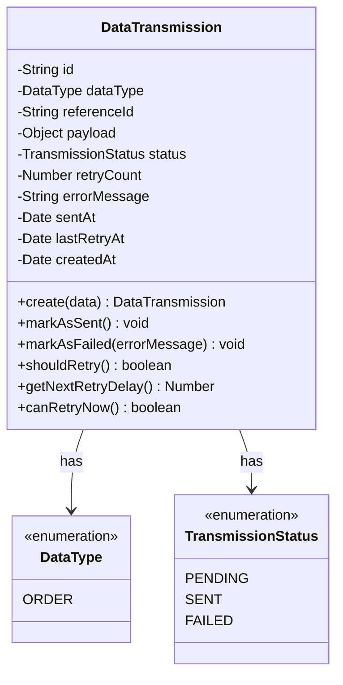

# Data Integration Domain - Sequence Diagrams

**문서 정보**
- **버전**: 2.0.0
- **최종 수정일**: 2025-11-03
- **상태**: Active
- **작성자**: Development Team
- **대상 독자**: Developers, Architects, DevOps

---

**문서 네비게이션**
- ⬆️ 상위: [아키텍처](../architecture.md)
- ⬅️ 이전: [Data 유스케이스](./use-cases.md)
- ➡️ 다음: [아키텍처](../architecture.md)

---

## 목차
1. [개요](#1-개요)
2. [SD-DATA-01: 주문 데이터 전송 (Phase 1: Outbox 생성)](#2-sd-data-01-주문-데이터-전송-phase-1-outbox-생성)
3. [SD-DATA-01: 주문 데이터 전송 (Phase 2: 실제 전송)](#3-sd-data-01-주문-데이터-전송-phase-2-실제-전송)
4. [SD-DATA-02: 전송 실패 재시도](#4-sd-data-02-전송-실패-재시도)
5. [도메인 모델](#5-도메인-모델)
6. [성능 최적화](#6-성능-최적화)
7. [테스트 시나리오](#7-테스트-시나리오)

---

## 1. 개요

### 1.1 문서 목적
이 문서는 Data Integration 도메인의 **기술적 구현 세부사항**을 설명합니다. Outbox Pattern을 기반으로 각 유스케이스의 시퀀스 다이어그램, 레이어별 책임, 구현 예시를 제공합니다.

### 1.2 대상 독자
- **개발자**: 구현 시 참고할 상세 기술 명세
- **아키텍트**: 시스템 설계 및 레이어 간 상호작용 이해
- **DevOps**: 성능 최적화 및 인프라 설정

### 1.3 Outbox Pattern 아키텍처
```
1. 주문 완료 이벤트 발생
2. DataTransmission 레코드 생성 (status: PENDING)
3. 트랜잭션 커밋
4. 백그라운드 작업이 PENDING 레코드 조회
5. 외부 API 호출
6. 성공 시: status = SENT
7. 실패 시: status = FAILED, retry_count++
```

### 1.4 재시도 전략
- **재시도 간격**: Exponential Backoff (1분, 2분, 4분, 8분, 16분)
- **최대 재시도**: 5회
- **실패 후 처리**: Dead Letter Queue 또는 수동 처리

### 1.5 관련 문서
- [Data 유스케이스](./use-cases.md) - 비즈니스 관점
- [아키텍처](../architecture.md) - 시스템 아키텍처
- [데이터 모델](../data-model.md) - 데이터베이스 스키마

---

## 2. SD-DATA-01: 주문 데이터 전송 (Phase 1: Outbox 생성)

### 2.1 시퀀스 다이어그램



### 2.2 레이어별 책임

#### Application Layer
**컴포넌트**: `OrderCompletedEventHandler`

**책임**:
- 주문 완료 이벤트 수신
- DataTransmission 생성
- Outbox 레코드 저장

**구현 예시**:
```typescript
// Event Handler - Outbox 생성
@Injectable()
export class OrderCompletedEventHandler {
  private readonly logger = new Logger(OrderCompletedEventHandler.name);

  constructor(
    private readonly dataTransmissionRepository: DataTransmissionRepository,
    private readonly dataSource: DataSource,
  ) {}

  @OnEvent('order.completed')
  async handle(event: OrderCompletedEvent): Promise<void> {
    this.logger.log(`주문 완료 이벤트 수신: orderId=${event.orderId}`);

    try {
      await this.dataSource.transaction(async (em) => {
        // DataTransmission 생성 (Outbox)
        const dataTransmission = DataTransmission.create({
          dataType: DataType.ORDER,
          referenceId: event.orderId,
          payload: {
            orderId: event.orderId,
            userId: event.userId,
            totalAmount: event.totalAmount,
            items: event.items,
            completedAt: event.completedAt,
          },
        });

        // Outbox 레코드 저장
        await this.dataTransmissionRepository.save(dataTransmission, em);

        this.logger.log(`데이터 전송 대기열 추가: orderId=${event.orderId}`);
      });
    } catch (error) {
      this.logger.error(`Outbox 생성 실패: orderId=${event.orderId}`, error);
      throw error;
    }
  }
}
```

#### Domain Layer
**컴포넌트**: `DataTransmission`

**책임**:
- DataTransmission Entity 정의
- 전송 상태 관리 비즈니스 로직
- 재시도 정책 판단

**구현 예시**:
```typescript
// DataTransmission Entity
export class DataTransmission {
  private id: string;
  private dataType: DataType;
  private referenceId: string;
  private payload: any;
  private status: TransmissionStatus;
  private retryCount: number;
  private errorMessage: string | null;
  private sentAt: Date | null;
  private createdAt: Date;

  static create(data: {
    dataType: DataType;
    referenceId: string;
    payload: any;
  }): DataTransmission {
    const transmission = new DataTransmission();
    transmission.id = uuidv4();
    transmission.dataType = data.dataType;
    transmission.referenceId = data.referenceId;
    transmission.payload = data.payload;
    transmission.status = TransmissionStatus.PENDING;
    transmission.retryCount = 0;
    transmission.errorMessage = null;
    transmission.sentAt = null;
    transmission.createdAt = new Date();
    return transmission;
  }

  markAsSent(): void {
    this.status = TransmissionStatus.SENT;
    this.sentAt = new Date();
    this.errorMessage = null;
  }

  markAsFailed(errorMessage: string): void {
    this.status = TransmissionStatus.FAILED;
    this.retryCount++;
    this.errorMessage = errorMessage;
  }

  shouldRetry(): boolean {
    const MAX_RETRIES = 5;
    return this.retryCount < MAX_RETRIES;
  }

  getNextRetryDelay(): number {
    // Exponential Backoff: 1분, 2분, 4분, 8분, 16분
    return Math.pow(2, this.retryCount) * 60 * 1000;
  }
}

export enum DataType {
  ORDER = 'ORDER',
}

export enum TransmissionStatus {
  PENDING = 'PENDING',
  SENT = 'SENT',
  FAILED = 'FAILED',
}
```

#### Infrastructure Layer
**컴포넌트**: `PrismaDataTransmissionRepository`

**책임**:
- DataTransmission 저장 및 업데이트
- Domain Entity ↔ Persistence Model 변환

### 2.3 트랜잭션 전략
- **트랜잭션 필수**: 주문 완료와 동일 트랜잭션에서 Outbox 레코드 생성
- **격리 수준**: READ COMMITTED (기본값)
- **일관성 보장**: 주문 완료 시 반드시 DataTransmission 레코드 생성

---

## 3. SD-DATA-01: 주문 데이터 전송 (Phase 2: 실제 전송)

### 3.1 시퀀스 다이어그램



### 3.2 레이어별 책임

#### Application Layer
**컴포넌트**: `SendPendingDataJob`

**책임**:
- PENDING/FAILED 레코드 조회
- 전송 오케스트레이션
- 결과 저장
- 로깅

**구현 예시**:
```typescript
// Batch Job - 실제 전송
@Injectable()
export class SendPendingDataJob {
  private readonly logger = new Logger(SendPendingDataJob.name);

  constructor(
    private readonly dataTransmissionRepository: DataTransmissionRepository,
    private readonly dataTransmissionService: DataTransmissionService,
    private readonly dataSource: DataSource,
  ) {}

  @Cron('0 * * * * *') // 매분 실행
  async execute(): Promise<void> {
    this.logger.log('데이터 전송 작업 시작');

    try {
      // PENDING/FAILED 레코드 조회 (최대 10건)
      const pendingTransmissions =
        await this.dataTransmissionRepository.findPendingTransmissions(10);

      if (pendingTransmissions.length === 0) {
        return;
      }

      this.logger.log(`전송 대상 ${pendingTransmissions.length}건 발견`);

      let successCount = 0;
      let failureCount = 0;

      // 각 레코드별로 전송 시도
      for (const transmission of pendingTransmissions) {
        try {
          await this.dataSource.transaction(async (em) => {
            // 전송 시도
            const success = await this.dataTransmissionService.sendData(
              transmission,
            );

            if (success) {
              successCount++;
            } else {
              failureCount++;
            }

            // 결과 저장
            await this.dataTransmissionRepository.save(transmission, em);
          });
        } catch (error) {
          this.logger.error(
            `전송 실패: id=${transmission.getId()}`,
            error,
          );
          failureCount++;
        }
      }

      this.logger.log(
        `데이터 전송 완료: 성공 ${successCount}건, 실패 ${failureCount}건`,
      );
    } catch (error) {
      this.logger.error('데이터 전송 작업 실패', error);
    }
  }
}
```

#### Domain Layer
**컴포넌트**: `DataTransmissionService`

**책임**:
- 외부 API 호출 (Infrastructure 위임)
- 전송 결과에 따른 상태 변경

**구현 예시**:
```typescript
// DataTransmissionService
@Injectable()
export class DataTransmissionService {
  private readonly logger = new Logger(DataTransmissionService.name);

  constructor(
    private readonly dataPlatformClient: DataPlatformClient,
  ) {}

  async sendData(transmission: DataTransmission): Promise<boolean> {
    try {
      // 외부 API 호출 (Infrastructure)
      const response = await this.dataPlatformClient.postOrderData({
        type: transmission.getDataType(),
        referenceId: transmission.getReferenceId(),
        data: transmission.getPayload(),
      });

      if (response.success) {
        // 전송 성공
        transmission.markAsSent();
        this.logger.log(
          `데이터 전송 성공: id=${transmission.getId()}`,
        );
        return true;
      } else {
        // 외부 API가 실패 응답
        transmission.markAsFailed(response.message || '전송 실패');
        this.logger.warn(
          `데이터 전송 실패: id=${transmission.getId()}, message=${response.message}`,
        );
        return false;
      }
    } catch (error) {
      // 네트워크 오류 등
      transmission.markAsFailed(error.message);
      this.logger.error(
        `데이터 전송 오류: id=${transmission.getId()}`,
        error,
      );
      return false;
    }
  }
}
```

#### Infrastructure Layer
**컴포넌트**: `DataPlatformClient`, `PrismaDataTransmissionRepository`

**책임**:
- 외부 API 호출 (HTTP 통신)
- PENDING/FAILED 레코드 조회 (FOR UPDATE SKIP LOCKED)
- DataTransmission 저장 및 업데이트
- Domain Entity ↔ Persistence Model 변환

**구현 예시**:
```typescript
// External API Client
@Injectable()
export class DataPlatformClient {
  constructor(
    private readonly httpService: HttpService,
    private readonly configService: ConfigService,
  ) {}

  async postOrderData(request: DataPlatformRequest): Promise<DataPlatformResponse> {
    const apiUrl = this.configService.get('DATA_PLATFORM_URL');
    const apiKey = this.configService.get('DATA_PLATFORM_API_KEY');

    try {
      const response = await this.httpService
        .post(`${apiUrl}/api/v1/orders`, request, {
          headers: {
            'Authorization': `Bearer ${apiKey}`,
            'Content-Type': 'application/json',
          },
          timeout: 10000, // 10초 타임아웃
        })
        .toPromise();

      return {
        success: true,
        message: 'Success',
      };
    } catch (error) {
      return {
        success: false,
        message: error.message || 'API 호출 실패',
      };
    }
  }
}

export interface DataPlatformRequest {
  type: string;
  referenceId: string;
  data: any;
}

export interface DataPlatformResponse {
  success: boolean;
  message?: string;
}

// Repository
@Injectable()
export class PrismaDataTransmissionRepository implements DataTransmissionRepository {
  async findPendingTransmissions(limit: number): Promise<DataTransmission[]> {
    // FOR UPDATE SKIP LOCKED: 동시 처리 방지
    const transmissions = await this.prisma.$queryRaw`
      SELECT * FROM DataTransmission
      WHERE status = 'PENDING'
         OR (status = 'FAILED' AND retry_count < 5)
      ORDER BY created_at ASC
      LIMIT ${limit}
      FOR UPDATE SKIP LOCKED
    `;

    return transmissions.map(t => this.toDomain(t));
  }
}
```

### 3.3 트랜잭션 전략
- **트랜잭션 필수**: 전송 시도와 결과 저장을 동일 트랜잭션에서 처리
- **격리 수준**: READ COMMITTED
- **멱등성**: 외부 API가 중복 요청을 처리할 수 있어야 함

### 3.4 동시성 제어
- `FOR UPDATE SKIP LOCKED`: 동일 레코드를 여러 워커가 동시 처리하지 않도록 방지
- 락을 획득하지 못한 레코드는 건너뛰고 다음 레코드 처리

### 3.5 에러 처리

| 에러 케이스 | 처리 방법 |
|-------------|-----------|
| 외부 API 타임아웃 | status = FAILED, 재시도 대상 |
| 외부 API 4xx 에러 | status = FAILED, 재시도 (정책에 따라) |
| 외부 API 5xx 에러 | status = FAILED, 재시도 |
| 네트워크 오류 | status = FAILED, 재시도 |

---

## 4. SD-DATA-02: 전송 실패 재시도

### 4.1 시퀀스 다이어그램



### 4.2 레이어별 책임

#### Application Layer
**컴포넌트**: `RetryFailedDataJob`

**책임**:
- 재시도 가능한 레코드 조회
- Exponential Backoff 시간 계산
- 재시도 오케스트레이션
- 최대 재시도 초과 시 Dead Letter Queue 처리
- 로깅

**구현 예시**:
```typescript
@Injectable()
export class RetryFailedDataJob {
  private readonly logger = new Logger(RetryFailedDataJob.name);

  constructor(
    private readonly dataTransmissionRepository: DataTransmissionRepository,
    private readonly dataTransmissionService: DataTransmissionService,
    private readonly dataSource: DataSource,
  ) {}

  @Cron('0 * * * * *') // 매분 실행
  async execute(): Promise<void> {
    this.logger.log('실패 데이터 재시도 작업 시작');

    try {
      // 재시도 가능한 레코드 조회
      const retryableTransmissions =
        await this.dataTransmissionRepository.findRetryableTransmissions(10);

      if (retryableTransmissions.length === 0) {
        return;
      }

      this.logger.log(`재시도 대상 ${retryableTransmissions.length}건 발견`);

      let successCount = 0;
      let failureCount = 0;
      let maxRetriesCount = 0;

      for (const transmission of retryableTransmissions) {
        // 최대 재시도 횟수 확인
        if (!transmission.shouldRetry()) {
          this.logger.warn(
            `최대 재시도 횟수 초과: id=${transmission.getId()}`,
          );
          maxRetriesCount++;
          // Dead Letter Queue 또는 알림 처리
          continue;
        }

        try {
          await this.dataSource.transaction(async (em) => {
            // 재시도
            const success = await this.dataTransmissionService.sendData(
              transmission,
            );

            if (success) {
              successCount++;
            } else {
              failureCount++;
            }

            // 결과 저장
            await this.dataTransmissionRepository.save(transmission, em);
          });
        } catch (error) {
          this.logger.error(
            `재시도 실패: id=${transmission.getId()}`,
            error,
          );
          failureCount++;
        }
      }

      this.logger.log(
        `재시도 완료: 성공 ${successCount}건, 실패 ${failureCount}건, 최대재시도초과 ${maxRetriesCount}건`,
      );
    } catch (error) {
      this.logger.error('재시도 작업 실패', error);
    }
  }
}
```

#### Domain Layer
**컴포넌트**: `DataTransmission`

**책임**:
- 재시도 가능 여부 판단
- Exponential Backoff 지연 시간 계산

**구현 예시**:
```typescript
export class DataTransmission {
  shouldRetry(): boolean {
    const MAX_RETRIES = 5;
    return this.retryCount < MAX_RETRIES;
  }

  getNextRetryDelay(): number {
    // Exponential Backoff: 1분, 2분, 4분, 8분, 16분
    // 2^0 = 1, 2^1 = 2, 2^2 = 4, 2^3 = 8, 2^4 = 16
    const delayMinutes = Math.pow(2, this.retryCount);
    return delayMinutes * 60 * 1000; // milliseconds
  }

  canRetryNow(): boolean {
    if (!this.lastRetryAt) return true;

    const nextRetryTime = new Date(
      this.lastRetryAt.getTime() + this.getNextRetryDelay(),
    );

    return new Date() >= nextRetryTime;
  }
}
```

#### Infrastructure Layer
**컴포넌트**: `PrismaDataTransmissionRepository`

**책임**:
- 재시도 가능한 레코드 조회 (Exponential Backoff 고려)
- FOR UPDATE SKIP LOCKED

**구현 예시**:
```typescript
@Injectable()
export class PrismaDataTransmissionRepository {
  async findRetryableTransmissions(limit: number): Promise<DataTransmission[]> {
    // Exponential Backoff를 고려한 쿼리
    const transmissions = await this.prisma.$queryRaw`
      SELECT * FROM DataTransmission
      WHERE status = 'FAILED'
        AND retry_count < 5
        AND (
          last_retry_at IS NULL
          OR last_retry_at + INTERVAL (POW(2, retry_count) || ' minutes') < NOW()
        )
      ORDER BY created_at ASC
      LIMIT ${limit}
      FOR UPDATE SKIP LOCKED
    `;

    return transmissions.map(t => this.toDomain(t));
  }
}
```

### 4.3 트랜잭션 전략
- **트랜잭션 필수**: 재시도와 결과 저장을 동일 트랜잭션에서 처리
- **격리 수준**: READ COMMITTED

### 4.4 동시성 제어
- `FOR UPDATE SKIP LOCKED`: 동일 레코드를 여러 워커가 동시 처리하지 않도록 방지

### 4.5 Exponential Backoff

| 재시도 횟수 | 지연 시간 | 누적 시간 |
|-------------|-----------|-----------|
| 1회 | 1분 | 1분 |
| 2회 | 2분 | 3분 |
| 3회 | 4분 | 7분 |
| 4회 | 8분 | 15분 |
| 5회 | 16분 | 31분 |

### 4.6 최대 재시도 초과
- 5회 재시도 후에도 실패하면 수동 처리 필요
- Dead Letter Queue 또는 알림 발송

### 4.7 모니터링

| 메트릭 | 설명 |
|--------|------|
| Pending Count | 전송 대기 중인 레코드 수 |
| Failed Count | 실패한 레코드 수 (재시도 대상) |
| Max Retries Exceeded | 최대 재시도 초과 레코드 수 |
| Average Retry Count | 평균 재시도 횟수 |
| Success Rate | 전송 성공률 |

---

## 5. 도메인 모델

### 5.1 핵심 Entity



### 5.2 Repository Interface

```typescript
export interface DataTransmissionRepository {
  findById(id: string, em?: EntityManager): Promise<DataTransmission | null>;
  findPendingTransmissions(
    limit: number,
    em?: EntityManager,
  ): Promise<DataTransmission[]>;
  findRetryableTransmissions(
    limit: number,
    em?: EntityManager,
  ): Promise<DataTransmission[]>;
  save(
    dataTransmission: DataTransmission,
    em?: EntityManager,
  ): Promise<DataTransmission>;
}
```

---

## 6. 성능 최적화

### 6.1 인덱스 전략

```sql
-- 전송 대기/실패 조회용
CREATE INDEX idx_data_transmission_status
ON DataTransmission(status, created_at)
WHERE status IN ('PENDING', 'FAILED');

-- 재시도 시간 계산용
CREATE INDEX idx_data_transmission_retry
ON DataTransmission(status, retry_count, last_retry_at)
WHERE status = 'FAILED';

-- 참조 ID 조회용
CREATE INDEX idx_data_transmission_reference
ON DataTransmission(data_type, reference_id);
```

### 6.2 배치 크기 조정
- 한 번에 처리할 레코드 수: 10건 (조정 가능)
- 처리 시간이 길면 워커 수 증가 고려

### 6.3 성능 고려사항

| 항목 | 설정 | 설명 |
|------|------|------|
| 배치 크기 | 10건 | 한 번에 처리할 최대 레코드 수 |
| 실행 주기 | 1분 | Cron Job 실행 간격 |
| 외부 API 타임아웃 | 10초 | HTTP 요청 타임아웃 |
| 락 타임아웃 | 5초 | FOR UPDATE 락 대기 시간 |

---

## 7. 테스트 시나리오

### 7.1 UC-DATA-01 테스트

```typescript
describe('OrderCompletedEventHandler', () => {
  it('should create DataTransmission outbox record', async () => {
    // Given
    const event = new OrderCompletedEvent('order1', 'user1', 10000);

    // When
    await handler.handle(event);

    // Then
    expect(dataTransmissionRepository.save).toHaveBeenCalled();
    const transmission = dataTransmissionRepository.save.mock.calls[0][0];
    expect(transmission.getStatus()).toBe(TransmissionStatus.PENDING);
  });
});

describe('SendPendingDataJob', () => {
  it('should send pending transmissions successfully', async () => {
    // Given
    const transmission = DataTransmission.create({...});
    dataTransmissionRepository.findPendingTransmissions.mockResolvedValue([
      transmission,
    ]);
    dataPlatformClient.postOrderData.mockResolvedValue({ success: true });

    // When
    await job.execute();

    // Then
    expect(transmission.getStatus()).toBe(TransmissionStatus.SENT);
  });
});
```

### 7.2 UC-DATA-02 테스트

```typescript
describe('RetryFailedDataJob', () => {
  it('should retry failed transmissions with exponential backoff', async () => {
    // Given
    const failedTransmission = DataTransmission.create({...});
    failedTransmission.markAsFailed('네트워크 오류');
    dataTransmissionRepository.findRetryableTransmissions.mockResolvedValue([
      failedTransmission,
    ]);

    // When
    await job.execute();

    // Then
    expect(failedTransmission.getRetryCount()).toBe(1);
    expect(dataPlatformClient.postOrderData).toHaveBeenCalled();
  });

  it('should skip transmissions exceeding max retries', async () => {
    // Given
    const maxRetriedTransmission = DataTransmission.create({...});
    maxRetriedTransmission.retryCount = 5;

    // When
    const shouldRetry = maxRetriedTransmission.shouldRetry();

    // Then
    expect(shouldRetry).toBe(false);
  });
});
```

### 7.3 Exponential Backoff 테스트

```typescript
describe('DataTransmission Exponential Backoff', () => {
  it('should calculate correct retry delay', () => {
    const transmission = DataTransmission.create({...});

    // 1회: 1분 (60,000ms)
    expect(transmission.getNextRetryDelay()).toBe(60000);

    // 2회: 2분 (120,000ms)
    transmission.markAsFailed('error');
    expect(transmission.getNextRetryDelay()).toBe(120000);

    // 3회: 4분 (240,000ms)
    transmission.markAsFailed('error');
    expect(transmission.getNextRetryDelay()).toBe(240000);

    // 4회: 8분 (480,000ms)
    transmission.markAsFailed('error');
    expect(transmission.getNextRetryDelay()).toBe(480000);

    // 5회: 16분 (960,000ms)
    transmission.markAsFailed('error');
    expect(transmission.getNextRetryDelay()).toBe(960000);
  });
});
```

### 7.4 동시성 제어 테스트

```typescript
describe('Concurrent Processing', () => {
  it('should prevent duplicate processing with FOR UPDATE SKIP LOCKED', async () => {
    // Given
    const transmission = DataTransmission.create({...});
    await dataTransmissionRepository.save(transmission);

    // When: 두 워커가 동시에 처리 시도
    const worker1 = job.execute();
    const worker2 = job.execute();
    await Promise.all([worker1, worker2]);

    // Then: 한 번만 처리되어야 함
    expect(dataPlatformClient.postOrderData).toHaveBeenCalledTimes(1);
  });
});
```

---

## 8. 관련 문서

- [Data 유스케이스](./use-cases.md) - 비즈니스 관점
- [아키텍처](../architecture.md) - 시스템 아키텍처
- [요구사항 분석](../requirements.md) - 비즈니스 요구사항
- [사용자 스토리](../user-stories.md) - 사용자 관점의 시나리오
- [데이터 모델](../data-model.md) - 데이터베이스 스키마
- [Order 유스케이스](../order/use-cases.md) - 선행 도메인

---

## 9. 버전 히스토리

| 버전 | 날짜 | 작성자 | 변경 내역 |
|------|------|--------|-----------|
| 2.0.0 | 2025-11-03 | Development Team | 비즈니스 관점과 기술 관점 분리 (Issue #006) |

---

**문서 끝**
