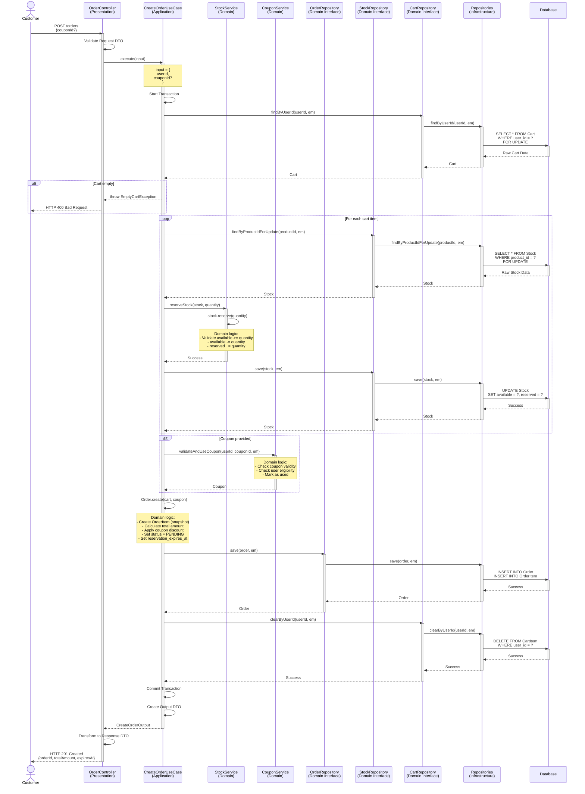
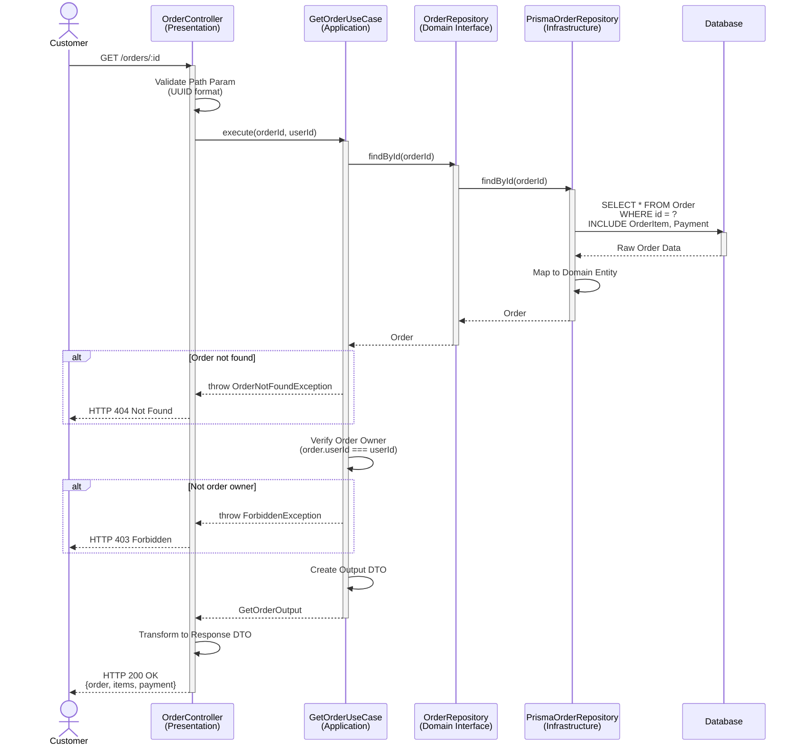
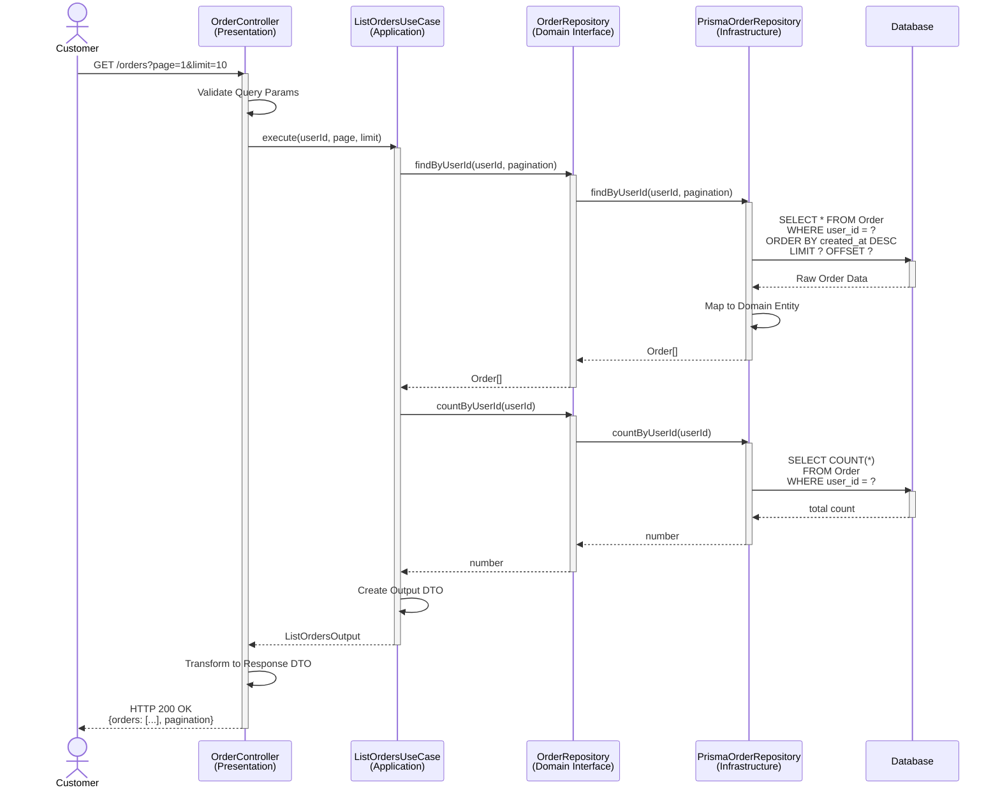
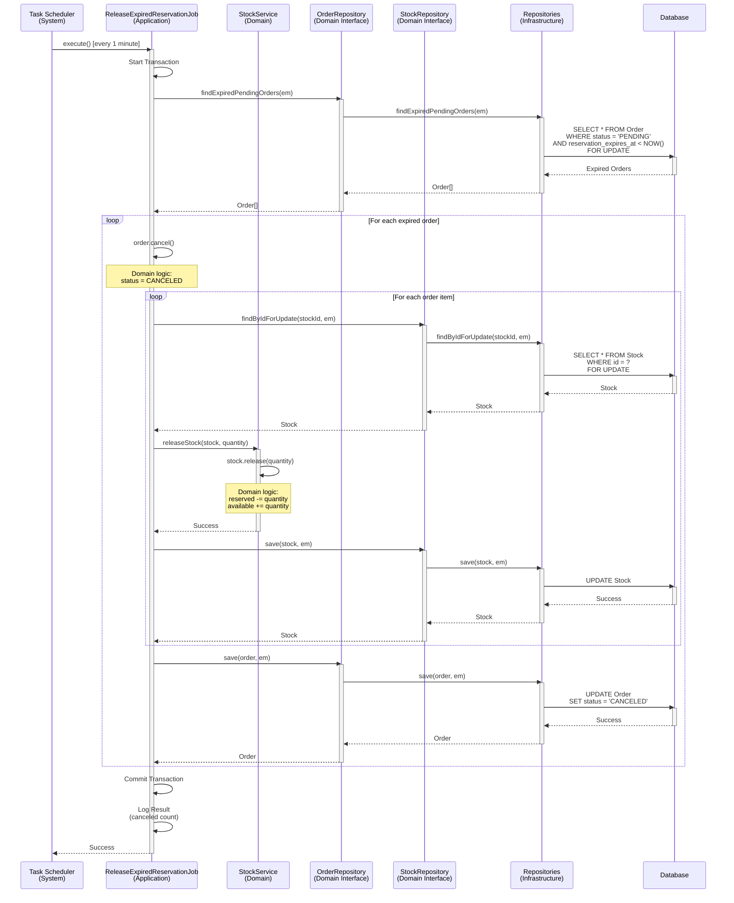
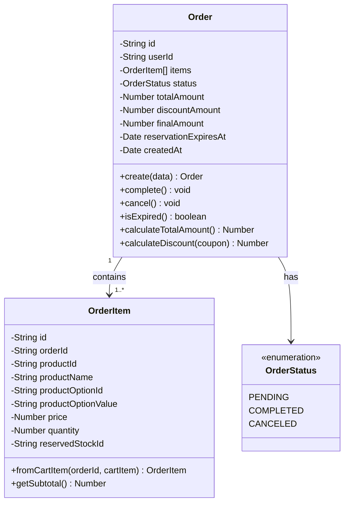

# Order Domain - Sequence Diagrams

**문서 정보**
- **버전**: 2.0.0
- **최종 수정일**: 2025-11-03
- **상태**: Active
- **작성자**: Development Team
- **대상 독자**: Developers, Architects, DevOps

---

**문서 네비게이션**
- ⬆️ 상위: [아키텍처](../architecture.md)
- ⬅️ 이전: [Order 유스케이스](./use-cases.md)
- ➡️ 다음: [Payment 시퀀스 다이어그램](../payment/sequence-diagrams.md)

---

## 목차
1. [개요](#1-개요)
2. [SD-ORDER-01: 주문 생성](#2-sd-order-01-주문-생성)
3. [SD-ORDER-02: 주문 조회](#3-sd-order-02-주문-조회)
4. [SD-ORDER-03: 주문 목록 조회](#4-sd-order-03-주문-목록-조회)
5. [SD-ORDER-04: 재고 예약 타임아웃 처리](#5-sd-order-04-재고-예약-타임아웃-처리)
6. [도메인 모델](#6-도메인-모델)
7. [트랜잭션 전략](#7-트랜잭션-전략)
8. [테스트 시나리오](#8-테스트-시나리오)

---

## 1. 개요

### 1.1 문서 목적
이 문서는 Order 도메인의 **기술적 구현 세부사항**을 설명합니다. 4-Layer 아키텍처를 기반으로 각 유스케이스의 시퀀스 다이어그램, 레이어별 책임, 구현 예시를 제공합니다.

### 1.2 대상 독자
- **개발자**: 구현 시 참고할 상세 기술 명세
- **아키텍트**: 시스템 설계 및 레이어 간 상호작용 이해
- **DevOps**: 성능 최적화 및 인프라 설정

### 1.3 관련 문서
- [Order 유스케이스](./use-cases.md) - 비즈니스 관점
- [아키텍처](../architecture.md) - 4-Layer 아키텍처 정의
- [API 명세](../api-specification.md) - REST API 계약
- [데이터 모델](../data-model.md) - 데이터베이스 스키마

---

## 2. SD-ORDER-01: 주문 생성

### 2.1 시퀀스 다이어그램



### 2.2 레이어별 책임

#### Presentation Layer
**컴포넌트**: `OrderController`

**책임**:
- Request Body 검증 (couponId는 optional)
- 인증된 사용자 확인
- UseCase 호출
- Response DTO 변환

**구현 예시**:
```typescript
@Controller('orders')
export class OrderController {
  constructor(private readonly createOrderUseCase: CreateOrderUseCase) {}

  @Post()
  @HttpCode(201)
  @UseGuards(JwtAuthGuard)
  async createOrder(
    @Body() dto: CreateOrderDto,
    @CurrentUser() user: User,
  ): Promise<OrderResponseDto> {
    const output = await this.createOrderUseCase.execute({
      userId: user.id,
      couponId: dto.couponId,
    });

    return OrderResponseDto.from(output);
  }
}
```

#### Application Layer
**컴포넌트**: `CreateOrderUseCase`

**책임**:
- **트랜잭션 관리** (핵심!)
- 장바구니 조회 및 검증
- 재고 예약 오케스트레이션
- 쿠폰 검증 및 사용
- 주문 생성
- 장바구니 비우기
- Output DTO 생성

**구현 예시**:
```typescript
@Injectable()
export class CreateOrderUseCase {
  constructor(
    private readonly orderRepository: OrderRepository,
    private readonly cartRepository: CartRepository,
    private readonly stockService: StockService,
    private readonly couponService: CouponService,
    private readonly dataSource: DataSource,
  ) {}

  async execute(input: CreateOrderInput): Promise<CreateOrderOutput> {
    // 트랜잭션 시작
    return this.dataSource.transaction(async (em) => {
      // 1. 장바구니 조회 (FOR UPDATE)
      const cart = await this.cartRepository.findByUserId(input.userId, em);
      if (!cart || cart.getItems().length === 0) {
        throw new EmptyCartException('장바구니가 비어 있습니다.');
      }

      // 2. 재고 예약 (Domain Service)
      await this.stockService.reserveStockForCart(cart.getItems(), em);

      // 3. 쿠폰 검증 및 사용 (Optional)
      let coupon = null;
      if (input.couponId) {
        coupon = await this.couponService.validateAndUseCoupon(
          input.userId,
          input.couponId,
          em,
        );
      }

      // 4. 주문 생성 (Domain Entity)
      const order = Order.create({
        userId: input.userId,
        cartItems: cart.getItems(),
        coupon,
      });

      // 5. 주문 저장
      const savedOrder = await this.orderRepository.save(order, em);

      // 6. 장바구니 비우기
      await this.cartRepository.clearByUserId(input.userId, em);

      // 7. Output DTO 반환
      return CreateOrderOutput.from(savedOrder);
    });
  }
}
```

#### Domain Layer
**컴포넌트**: `Order`, `OrderItem`, `StockService`

**책임**:
- 주문 생성 비즈니스 로직
- OrderItem 스냅샷 생성
- 총액 계산 및 쿠폰 할인
- 재고 예약 비즈니스 로직
- 재고 검증

**구현 예시**:
```typescript
// Order Entity
export class Order {
  private id: string;
  private userId: string;
  private items: OrderItem[];
  private status: OrderStatus;
  private totalAmount: number;
  private discountAmount: number;
  private finalAmount: number;
  private reservationExpiresAt: Date;
  private createdAt: Date;

  static create(data: {
    userId: string;
    cartItems: CartItem[];
    coupon?: Coupon;
  }): Order {
    const order = new Order();
    order.id = uuidv4();
    order.userId = data.userId;
    order.status = OrderStatus.PENDING;
    order.createdAt = new Date();

    // OrderItem 생성 (Snapshot Pattern)
    order.items = data.cartItems.map(cartItem =>
      OrderItem.fromCartItem(order.id, cartItem),
    );

    // 총액 계산
    order.totalAmount = order.calculateTotalAmount();

    // 쿠폰 할인 적용
    order.discountAmount = data.coupon
      ? order.calculateDiscount(data.coupon)
      : 0;
    order.finalAmount = order.totalAmount - order.discountAmount;

    // 예약 만료 시간 (10분)
    order.reservationExpiresAt = new Date(Date.now() + 10 * 60 * 1000);

    // 비즈니스 규칙 검증
    order.validate();

    return order;
  }

  private calculateTotalAmount(): number {
    return this.items.reduce((sum, item) => sum + item.getSubtotal(), 0);
  }

  private calculateDiscount(coupon: Coupon): number {
    if (coupon.getType() === CouponType.PERCENTAGE) {
      return Math.floor(
        this.totalAmount * (coupon.getDiscountValue() / 100),
      );
    } else {
      return Math.min(coupon.getDiscountValue(), this.totalAmount);
    }
  }

  private validate(): void {
    if (this.items.length === 0) {
      throw new DomainException('주문 상품이 없습니다.');
    }
    if (this.finalAmount < 0) {
      throw new DomainException('최종 금액이 0보다 작을 수 없습니다.');
    }
  }

  // 결제 완료 처리
  complete(): void {
    if (this.status !== OrderStatus.PENDING) {
      throw new DomainException('대기 중인 주문만 완료할 수 있습니다.');
    }
    if (new Date() > this.reservationExpiresAt) {
      throw new DomainException('주문 예약 시간이 만료되었습니다.');
    }
    this.status = OrderStatus.COMPLETED;
  }
}

// OrderItem Entity (Snapshot)
export class OrderItem {
  private id: string;
  private orderId: string;
  private productId: string;
  private productName: string;        // Snapshot
  private productOptionId: string;
  private productOptionValue: string; // Snapshot
  private price: number;              // Snapshot
  private quantity: number;
  private reservedStockId: string;    // 예약된 재고 추적

  static fromCartItem(orderId: string, cartItem: CartItem): OrderItem {
    const item = new OrderItem();
    item.id = uuidv4();
    item.orderId = orderId;
    item.productId = cartItem.getProductId();
    item.productName = cartItem.getProductName();
    item.productOptionId = cartItem.getProductOptionId();
    item.price = cartItem.getPrice();
    item.quantity = cartItem.getQuantity();
    return item;
  }

  getSubtotal(): number {
    return this.price * this.quantity;
  }
}

// Stock Service
@Injectable()
export class StockService {
  constructor(private readonly stockRepository: StockRepository) {}

  async reserveStockForCart(
    cartItems: CartItem[],
    em: EntityManager,
  ): Promise<void> {
    for (const item of cartItems) {
      // Pessimistic Lock으로 재고 조회
      const stock = await this.stockRepository.findByProductIdForUpdate(
        item.getProductId(),
        em,
      );

      if (!stock) {
        throw new StockNotFoundException(
          `재고를 찾을 수 없습니다: ${item.getProductId()}`,
        );
      }

      // 재고 예약 (Domain Entity 메서드)
      stock.reserve(item.getQuantity());

      // 저장
      await this.stockRepository.save(stock, em);
    }
  }
}
```

#### Infrastructure Layer
**컴포넌트**: `PrismaOrderRepository`, `PrismaStockRepository`, `PrismaCartRepository`

**책임**:
- 트랜잭션 EntityManager 사용
- FOR UPDATE 쿼리 실행
- Domain Entity ↔ Persistence Model 변환
- 주문 및 OrderItem 저장

### 2.3 트랜잭션 전략

```
BEGIN TRANSACTION

1. SELECT * FROM Cart WHERE user_id = ? FOR UPDATE
2. SELECT * FROM Stock WHERE product_id = ? FOR UPDATE (각 상품마다)
3. UPDATE Stock SET available = available - ?, reserved = reserved + ?
4. SELECT * FROM UserCoupon WHERE ... FOR UPDATE (쿠폰 있으면)
5. UPDATE UserCoupon SET is_used = true
6. INSERT INTO Order
7. INSERT INTO OrderItem (각 아이템마다)
8. DELETE FROM CartItem WHERE cart_id = ?

COMMIT
```

### 2.4 동시성 제어

#### Pessimistic Lock 전략
- **재고 조회**: `SELECT FOR UPDATE`로 재고 레코드 락 획득
- **장바구니 조회**: `SELECT FOR UPDATE`로 동시 주문 방지
- **쿠폰 사용**: `SELECT FOR UPDATE`로 중복 사용 방지

#### 데드락 방지
- 모든 리소스를 동일한 순서로 락 획득 (상품 ID 오름차순)
- 트랜잭션 시간 최소화
- 타임아웃 설정 (5초)

### 2.5 에러 처리

| 에러 케이스 | HTTP 상태 | 에러 메시지 | 처리 레이어 |
|-------------|-----------|-------------|-------------|
| 빈 장바구니 | 400 | "장바구니가 비어 있습니다." | Application |
| 재고 부족 | 409 | "재고가 부족합니다." | Domain |
| 유효하지 않은 쿠폰 | 400 | "유효하지 않은 쿠폰입니다." | Domain |
| 이미 사용한 쿠폰 | 409 | "이미 사용한 쿠폰입니다." | Domain |
| 쿠폰 사용 불가 사용자 | 403 | "쿠폰을 사용할 수 없습니다." | Domain |

---

## 3. SD-ORDER-02: 주문 조회

### 3.1 시퀀스 다이어그램



### 3.2 레이어별 책임

#### Presentation Layer
**책임**:
- Path Parameter 검증
- UseCase 호출
- Response DTO 변환

#### Application Layer
**책임**:
- 주문 조회
- 소유권 검증 (본인 주문인지 확인)
- Output DTO 생성

#### Domain Layer
**책임**:
- Order Entity 정의
- Repository Interface 정의

#### Infrastructure Layer
**책임**:
- 주문 조회 (OrderItem, Payment JOIN)
- Domain Entity 변환

### 3.3 트랜잭션 전략
- **트랜잭션 불필요**: 읽기 전용 작업 (Read-Only)
- **격리 수준**: READ COMMITTED (기본값)

### 3.4 동시성 제어
- **락 불필요**: 조회만 수행하므로 동시성 이슈 없음

### 3.5 에러 처리

| 에러 케이스 | HTTP 상태 | 에러 메시지 | 처리 레이어 |
|-------------|-----------|-------------|-------------|
| 존재하지 않는 주문 | 404 | "주문을 찾을 수 없습니다." | Application |
| 다른 사용자의 주문 | 403 | "권한이 없습니다." | Application |
| 잘못된 UUID 형식 | 400 | "잘못된 주문 ID 형식입니다." | Presentation |

---

## 4. SD-ORDER-03: 주문 목록 조회

### 4.1 시퀀스 다이어그램



### 4.2 레이어별 책임

#### Presentation Layer
**책임**:
- Query Parameter 검증 (page, limit)
- UseCase 호출
- Response DTO 변환

#### Application Layer
**책임**:
- 사용자별 주문 목록 조회
- 총 주문 수 조회
- Pagination 처리
- Output DTO 생성

#### Domain Layer
**책임**:
- Repository Interface 정의

#### Infrastructure Layer
**책임**:
- 사용자 ID로 주문 조회
- 최신 순 정렬 (created_at DESC)
- Pagination 적용

### 4.3 트랜잭션 전략
- **트랜잭션 불필요**: 읽기 전용 작업 (Read-Only)
- **격리 수준**: READ COMMITTED (기본값)

### 4.4 동시성 제어
- **락 불필요**: 조회만 수행하므로 동시성 이슈 없음

### 4.5 에러 처리

| 에러 케이스 | HTTP 상태 | 에러 메시지 | 처리 레이어 |
|-------------|-----------|-------------|-------------|
| 잘못된 page 값 | 400 | "페이지는 1 이상이어야 합니다." | Presentation |
| 잘못된 limit 값 | 400 | "페이지 크기는 1-100 사이여야 합니다." | Presentation |

---

## 5. SD-ORDER-04: 재고 예약 타임아웃 처리

### 5.1 시퀀스 다이어그램



### 5.2 레이어별 책임

#### Application Layer
**컴포넌트**: `ReleaseExpiredReservationJob`

**책임**:
- 배치 작업 실행 (1분마다)
- 만료된 주문 조회
- 트랜잭션 관리
- 재고 해제 오케스트레이션
- 주문 취소 처리
- 로깅

**구현 예시**:
```typescript
@Injectable()
export class ReleaseExpiredReservationJob {
  private readonly logger = new Logger(ReleaseExpiredReservationJob.name);

  constructor(
    private readonly orderRepository: OrderRepository,
    private readonly stockService: StockService,
    private readonly dataSource: DataSource,
  ) {}

  @Cron('0 * * * * *') // 매분 실행
  async execute(): Promise<void> {
    this.logger.log('재고 예약 타임아웃 처리 시작');

    try {
      const canceledCount = await this.dataSource.transaction(async (em) => {
        // 1. 만료된 주문 조회 (FOR UPDATE)
        const expiredOrders = await this.orderRepository.findExpiredPendingOrders(
          em,
        );

        if (expiredOrders.length === 0) {
          return 0;
        }

        this.logger.log(`만료된 주문 ${expiredOrders.length}건 발견`);

        // 2. 각 주문별 재고 해제 및 취소
        for (const order of expiredOrders) {
          // 재고 해제
          await this.stockService.releaseReservedStock(
            order.getItems(),
            em,
          );

          // 주문 취소
          order.cancel();
          await this.orderRepository.save(order, em);
        }

        return expiredOrders.length;
      });

      this.logger.log(`재고 예약 타임아웃 처리 완료: ${canceledCount}건`);
    } catch (error) {
      this.logger.error('재고 예약 타임아웃 처리 실패', error);
      // 실패해도 다음 실행 시도
    }
  }
}
```

#### Domain Layer
**컴포넌트**: `Order`, `Stock`, `StockService`

**책임**:
- 주문 취소 로직
- 재고 해제 로직

**구현 예시**:
```typescript
// Order Entity
export class Order {
  cancel(): void {
    if (this.status !== OrderStatus.PENDING) {
      throw new DomainException('대기 중인 주문만 취소할 수 있습니다.');
    }
    this.status = OrderStatus.CANCELED;
  }

  isExpired(): boolean {
    return new Date() > this.reservationExpiresAt;
  }
}

// Stock Entity
export class Stock {
  release(quantity: number): void {
    if (this.reservedQuantity < quantity) {
      throw new DomainException('예약된 재고가 부족합니다.');
    }

    this.reservedQuantity -= quantity;
    this.availableQuantity += quantity;
  }
}

// Stock Service
export class StockService {
  async releaseReservedStock(
    orderItems: OrderItem[],
    em: EntityManager,
  ): Promise<void> {
    for (const item of orderItems) {
      const stock = await this.stockRepository.findByIdForUpdate(
        item.getReservedStockId(),
        em,
      );

      if (!stock) {
        this.logger.warn(`재고를 찾을 수 없음: ${item.getReservedStockId()}`);
        continue;
      }

      stock.release(item.getQuantity());
      await this.stockRepository.save(stock, em);
    }
  }
}
```

#### Infrastructure Layer
**컴포넌트**: `PrismaOrderRepository`, `PrismaStockRepository`

**책임**:
- 만료된 주문 조회 (FOR UPDATE)
- 재고 업데이트
- 주문 상태 업데이트

**구현 예시**:
```typescript
@Injectable()
export class PrismaOrderRepository implements OrderRepository {
  async findExpiredPendingOrders(em: EntityManager): Promise<Order[]> {
    const orders = await em.order.findMany({
      where: {
        status: OrderStatus.PENDING,
        reservationExpiresAt: {
          lt: new Date(),
        },
      },
      include: {
        items: true,
      },
    });

    // FOR UPDATE는 Prisma의 제약으로 별도 raw query 필요
    // await em.$executeRaw`SELECT * FROM Order ... FOR UPDATE`;

    return orders.map(o => this.toDomain(o));
  }
}
```

### 5.3 트랜잭션 전략

```
BEGIN TRANSACTION

1. SELECT * FROM Order WHERE status = 'PENDING' AND expires_at < NOW() FOR UPDATE
2. SELECT * FROM Stock WHERE id = ? FOR UPDATE (각 재고마다)
3. UPDATE Stock SET reserved = reserved - ?, available = available + ?
4. UPDATE Order SET status = 'CANCELED'

COMMIT
```

### 5.4 동시성 제어

#### Pessimistic Lock 전략
- FOR UPDATE로 락 획득
- 트랜잭션 내 모든 작업 수행

### 5.5 성능 고려사항

#### 인덱스
```sql
CREATE INDEX idx_order_reservation_expires
ON Order(status, reservation_expires_at)
WHERE status = 'PENDING';
```

#### 배치 크기
- 한 번에 최대 100건 처리
- 처리량이 많으면 주기 조정 (30초마다)

---

## 6. 도메인 모델

### 6.1 핵심 Entity



### 6.2 Repository Interface

```typescript
export interface OrderRepository {
  findById(id: string, em?: EntityManager): Promise<Order | null>;
  findByUserId(
    userId: string,
    pagination: Pagination,
    em?: EntityManager,
  ): Promise<Order[]>;
  countByUserId(userId: string, em?: EntityManager): Promise<number>;
  findExpiredPendingOrders(em: EntityManager): Promise<Order[]>;
  save(order: Order, em?: EntityManager): Promise<Order>;
}
```

---

## 7. 트랜잭션 전략

### 7.1 주문 생성 트랜잭션

```
BEGIN TRANSACTION

1. SELECT * FROM Cart WHERE user_id = ? FOR UPDATE
2. SELECT * FROM Stock WHERE product_id = ? FOR UPDATE (각 상품마다)
3. UPDATE Stock SET available = available - ?, reserved = reserved + ?
4. SELECT * FROM UserCoupon WHERE ... FOR UPDATE (쿠폰 있으면)
5. UPDATE UserCoupon SET is_used = true
6. INSERT INTO Order
7. INSERT INTO OrderItem (각 아이템마다)
8. DELETE FROM CartItem WHERE cart_id = ?

COMMIT
```

### 7.2 타임아웃 처리 트랜잭션

```
BEGIN TRANSACTION

1. SELECT * FROM Order WHERE status = 'PENDING' AND expires_at < NOW() FOR UPDATE
2. SELECT * FROM Stock WHERE id = ? FOR UPDATE (각 재고마다)
3. UPDATE Stock SET reserved = reserved - ?, available = available + ?
4. UPDATE Order SET status = 'CANCELED'

COMMIT
```

---

## 8. 테스트 시나리오

### 8.1 UC-ORDER-01 테스트

```typescript
describe('CreateOrderUseCase', () => {
  it('should create order and reserve stock', async () => {
    // Given
    const cart = Cart.create('user1');
    cart.addItem({ productId: 'prod1', quantity: 2 });
    cartRepository.findByUserId.mockResolvedValue(cart);

    const stock = Stock.create({ availableQuantity: 10 });
    stockRepository.findByProductIdForUpdate.mockResolvedValue(stock);

    // When
    const output = await useCase.execute({ userId: 'user1' });

    // Then
    expect(output.orderId).toBeDefined();
    expect(output.status).toBe(OrderStatus.PENDING);
    expect(stock.getReservedQuantity()).toBe(2);
  });

  it('should throw exception when cart is empty', async () => {
    // Given
    cartRepository.findByUserId.mockResolvedValue(null);

    // When & Then
    await expect(useCase.execute({ userId: 'user1' })).rejects.toThrow(
      EmptyCartException,
    );
  });
});
```

### 8.2 UC-ORDER-04 테스트

```typescript
describe('ReleaseExpiredReservationJob', () => {
  it('should release stock for expired orders', async () => {
    // Given
    const expiredOrder = Order.create({...});
    expiredOrder.reservationExpiresAt = new Date(Date.now() - 1000);
    orderRepository.findExpiredPendingOrders.mockResolvedValue([expiredOrder]);

    // When
    await job.execute();

    // Then
    expect(expiredOrder.getStatus()).toBe(OrderStatus.CANCELED);
    expect(stockRepository.save).toHaveBeenCalled();
  });
});
```

---

## 9. 관련 문서

- [Order 유스케이스](./use-cases.md) - 비즈니스 관점
- [아키텍처](../architecture.md) - 4-Layer 아키텍처
- [API 명세서](../api-specification.md) - REST API 계약
- [데이터 모델](../data-model.md) - 데이터베이스 스키마
- [Payment 시퀀스 다이어그램](../payment/sequence-diagrams.md) - 다음 도메인

---

## 10. 버전 히스토리

| 버전 | 날짜 | 작성자 | 변경 내역 |
|------|------|--------|-----------|
| 2.0.0 | 2025-11-03 | Development Team | 비즈니스 관점과 기술 관점 분리 (Issue #006) |

---

**문서 끝**
