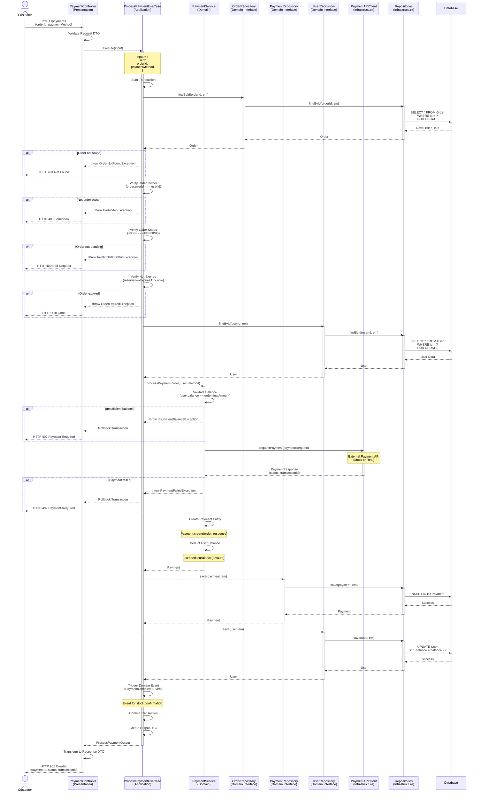
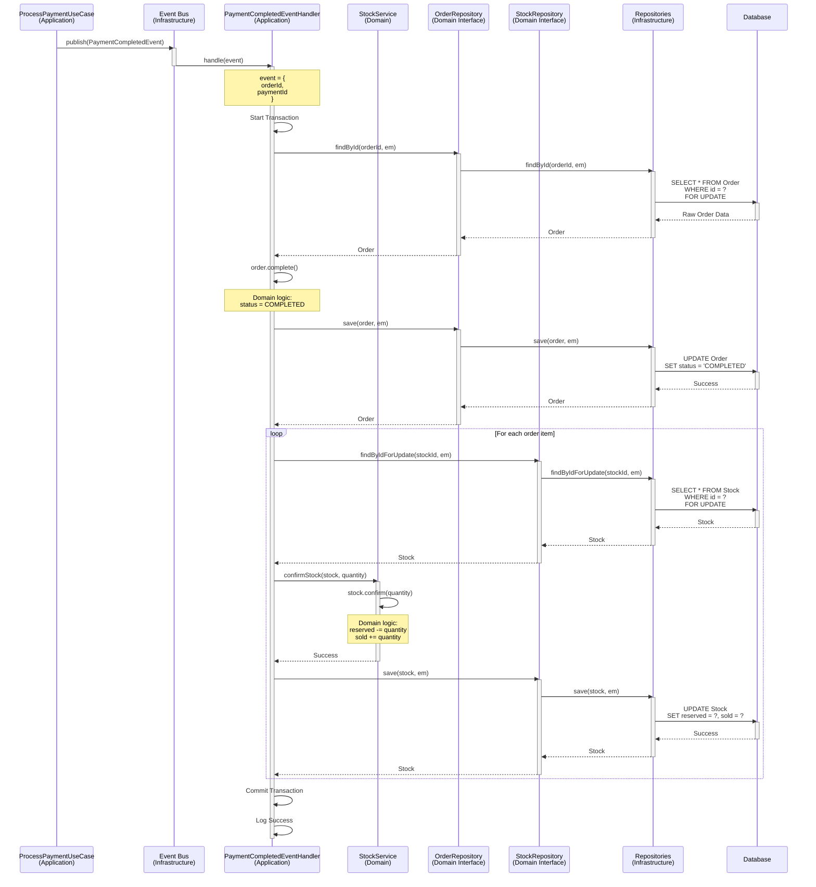
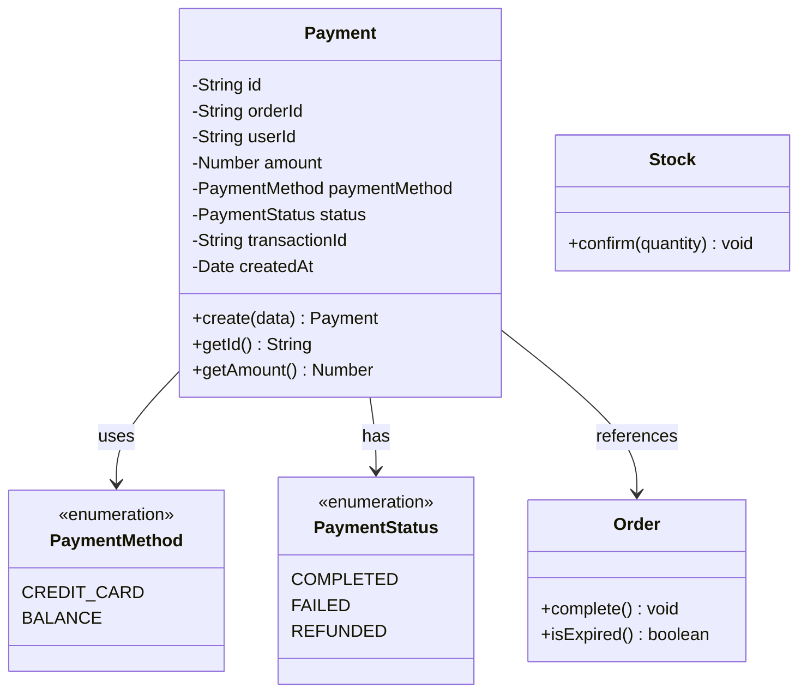

# Payment Domain - Sequence Diagrams

**문서 정보**
- **버전**: 2.0.0
- **최종 수정일**: 2025-11-03
- **상태**: Active
- **작성자**: Development Team
- **대상 독자**: Developers, Architects, DevOps

---

**문서 네비게이션**
- ⬆️ 상위: [아키텍처](../architecture.md)
- ⬅️ 이전: [Payment 유스케이스](./use-cases.md)
- ➡️ 다음: [Coupon 유스케이스](../coupon/use-cases.md)

---

## 목차
1. [개요](#1-개요)
2. [SD-PAYMENT-01: 결제 처리](#2-sd-payment-01-결제-처리)
3. [SD-PAYMENT-02: 결제 완료 후 재고 확정](#3-sd-payment-02-결제-완료-후-재고-확정)
4. [도메인 모델](#4-도메인-모델)
5. [외부 API 연동](#5-외부-api-연동)
6. [트랜잭션 전략](#6-트랜잭션-전략)
7. [성능 최적화](#7-성능-최적화)
8. [테스트 시나리오](#8-테스트-시나리오)

---

## 1. 개요

### 1.1 문서 목적
이 문서는 Payment 도메인의 **기술적 구현 세부사항**을 설명합니다. 4-Layer 아키텍처를 기반으로 각 유스케이스의 시퀀스 다이어그램, 레이어별 책임, 구현 예시를 제공합니다.

### 1.2 대상 독자
- **개발자**: 구현 시 참고할 상세 기술 명세
- **아키텍트**: 시스템 설계 및 레이어 간 상호작용 이해
- **DevOps**: 성능 최적화 및 인프라 설정

### 1.3 관련 문서
- [Payment 유스케이스](./use-cases.md) - 비즈니스 관점
- [아키텍처](../architecture.md) - 4-Layer 아키텍처 정의
- [API 명세](../api-specification.md) - REST API 계약
- [데이터 모델](../data-model.md) - 데이터베이스 스키마

---

## 2. SD-PAYMENT-01: 결제 처리

### 2.1 시퀀스 다이어그램



### 2.2 레이어별 책임

#### Presentation Layer
**컴포넌트**: `PaymentController`

**책임**:
- Request Body 검증 (orderId, paymentMethod)
- 인증된 사용자 확인
- UseCase 호출
- Response DTO 변환

**구현 예시**:
```typescript
@Controller('payments')
export class PaymentController {
  constructor(private readonly processPaymentUseCase: ProcessPaymentUseCase) {}

  @Post()
  @HttpCode(201)
  @UseGuards(JwtAuthGuard)
  async processPayment(
    @Body() dto: ProcessPayment,
    @CurrentUser() user: User,
  ): Promise<PaymentResponse> {
    const output = await this.processPaymentUseCase.execute({
      userId: user.id,
      orderId: dto.orderId,
      paymentMethod: dto.paymentMethod,
    });

    return PaymentResponse.from(output);
  }
}
```

#### Application Layer
**컴포넌트**: `ProcessPaymentUseCase`

**책임**:
- 트랜잭션 관리
- 주문 조회 및 검증 (소유권, 상태, 만료)
- 사용자 조회
- 결제 처리 (Domain Service 호출)
- Payment 저장
- 사용자 잔액 업데이트
- 도메인 이벤트 발행 (PaymentCompletedEvent)
- Output DTO 생성

**구현 예시**:
```typescript
@Injectable()
export class ProcessPaymentUseCase {
  constructor(
    private readonly orderRepository: OrderRepository,
    private readonly paymentRepository: PaymentRepository,
    private readonly userRepository: UserRepository,
    private readonly paymentService: PaymentService,
    private readonly eventBus: EventBus,
    private readonly dataSource: DataSource,
  ) {}

  async execute(input: ProcessPaymentInput): Promise<ProcessPaymentOutput> {
    return this.dataSource.transaction(async (em) => {
      // 1. 주문 조회 (FOR UPDATE)
      const order = await this.orderRepository.findById(input.orderId, em);
      if (!order) {
        throw new OrderNotFoundException('주문을 찾을 수 없습니다.');
      }

      // 2. 소유권 검증
      if (order.getUserId() !== input.userId) {
        throw new ForbiddenException('권한이 없습니다.');
      }

      // 3. 주문 상태 검증
      if (order.getStatus() !== OrderStatus.PENDING) {
        throw new InvalidOrderStatusException(
          '대기 중인 주문만 결제할 수 있습니다.',
        );
      }

      // 4. 만료 검증
      if (order.isExpired()) {
        throw new OrderExpiredException('주문 예약 시간이 만료되었습니다.');
      }

      // 5. 사용자 조회 (FOR UPDATE - 잔액 차감)
      const user = await this.userRepository.findById(input.userId, em);

      // 6. 결제 처리 (Domain Service)
      const payment = await this.paymentService.processPayment(
        order,
        user,
        input.paymentMethod,
        em,
      );

      // 7. Payment 저장
      const savedPayment = await this.paymentRepository.save(payment, em);

      // 8. 사용자 저장 (잔액 차감 반영)
      await this.userRepository.save(user, em);

      // 9. 도메인 이벤트 발행 (재고 확정용)
      this.eventBus.publish(
        new PaymentCompletedEvent(order.getId(), savedPayment.getId()),
      );

      return ProcessPaymentOutput.from(savedPayment);
    });
  }
}
```

#### Domain Layer
**컴포넌트**: `Payment`, `PaymentService`

**책임**:
- Payment Entity 정의
- 결제 처리 비즈니스 로직
- 잔액 검증
- 외부 API 호출 (Infrastructure 위임)
- Payment 생성

**구현 예시**:
```typescript
// Payment Entity
export class Payment {
  private id: string;
  private orderId: string;
  private userId: string;
  private amount: number;
  private paymentMethod: PaymentMethod;
  private status: PaymentStatus;
  private transactionId: string;
  private createdAt: Date;

  static create(data: {
    orderId: string;
    userId: string;
    amount: number;
    paymentMethod: PaymentMethod;
    transactionId: string;
  }): Payment {
    const payment = new Payment();
    payment.id = uuidv4();
    payment.orderId = data.orderId;
    payment.userId = data.userId;
    payment.amount = data.amount;
    payment.paymentMethod = data.paymentMethod;
    payment.status = PaymentStatus.COMPLETED;
    payment.transactionId = data.transactionId;
    payment.createdAt = new Date();

    payment.validate();

    return payment;
  }

  private validate(): void {
    if (this.amount <= 0) {
      throw new DomainException('결제 금액은 0보다 커야 합니다.');
    }
  }
}

export enum PaymentMethod {
  CREDIT_CARD = 'CREDIT_CARD',
  BALANCE = 'BALANCE',
}

export enum PaymentStatus {
  COMPLETED = 'COMPLETED',
  FAILED = 'FAILED',
  REFUNDED = 'REFUNDED',
}

// Payment Service
@Injectable()
export class PaymentService {
  constructor(
    private readonly paymentAPIClient: PaymentAPIClient,
  ) {}

  async processPayment(
    order: Order,
    user: User,
    paymentMethod: PaymentMethod,
    em: EntityManager,
  ): Promise<Payment> {
    const amount = order.getFinalAmount();

    // 1. 잔액 검증 (BALANCE 결제 방식)
    if (paymentMethod === PaymentMethod.BALANCE) {
      if (user.getBalance() < amount) {
        throw new InsufficientBalanceException('잔액이 부족합니다.');
      }
    }

    // 2. 외부 결제 API 호출 (Infrastructure)
    const response = await this.paymentAPIClient.requestPayment({
      orderId: order.getId(),
      userId: user.getId(),
      amount,
      paymentMethod,
    });

    if (!response.success) {
      throw new PaymentFailedException(
        response.message || '결제에 실패했습니다.',
      );
    }

    // 3. Payment 생성
    const payment = Payment.create({
      orderId: order.getId(),
      userId: user.getId(),
      amount,
      paymentMethod,
      transactionId: response.transactionId,
    });

    // 4. 사용자 잔액 차감 (BALANCE 결제 방식)
    if (paymentMethod === PaymentMethod.BALANCE) {
      user.deductBalance(amount);
    }

    return payment;
  }
}

// User Entity (간략)
export class User {
  private balance: number;

  deductBalance(amount: number): void {
    if (this.balance < amount) {
      throw new DomainException('잔액이 부족합니다.');
    }
    this.balance -= amount;
  }

  getBalance(): number {
    return this.balance;
  }
}
```

#### Infrastructure Layer
**컴포넌트**: `PaymentAPIClient`, `PrismaPaymentRepository`

**책임**:
- 외부 결제 API 호출 (HTTP 통신)
- Payment 저장
- Domain Entity ↔ Persistence Model 변환

**구현 예시**:
```typescript
// External Payment API Client
@Injectable()
export class PaymentAPIClient {
  constructor(private readonly httpService: HttpService) {}

  async requestPayment(request: PaymentRequest): Promise<PaymentResponse> {
    try {
      // 실제 환경에서는 외부 API 호출
      // const response = await this.httpService.post('https://payment-api.com/v1/payments', request).toPromise();

      // Mock 구현 (개발용)
      const response = {
        success: true,
        transactionId: `TXN-${Date.now()}`,
        message: '결제 성공',
      };

      return response;
    } catch (error) {
      throw new PaymentAPIException('결제 API 호출 실패', error);
    }
  }
}

export interface PaymentRequest {
  orderId: string;
  userId: string;
  amount: number;
  paymentMethod: PaymentMethod;
}

export interface PaymentResponse {
  success: boolean;
  transactionId?: string;
  message?: string;
}
```

### 2.3 트랜잭션 전략

```
BEGIN TRANSACTION

1. SELECT * FROM Order WHERE id = ? FOR UPDATE
2. SELECT * FROM User WHERE id = ? FOR UPDATE
3. [외부 API 호출] POST https://payment-api.com/v1/payments
4. INSERT INTO Payment
5. UPDATE User SET balance = balance - ?
6. [이벤트 발행] PaymentCompletedEvent

COMMIT
```

### 2.4 동시성 제어

#### 비관적 락 (Pessimistic Lock)
- **Order**: FOR UPDATE 락 적용 (결제 처리 중 중복 방지)
- **User**: FOR UPDATE 락 적용 (잔액 차감 동시성 제어)

#### 락 순서
1. Order 락 획득
2. User 락 획득
→ 데드락 방지를 위해 항상 동일한 순서로 락 획득

### 2.5 에러 처리

| 에러 케이스 | HTTP 상태 | 에러 메시지 | 처리 레이어 |
|-------------|-----------|-------------|-------------|
| 존재하지 않는 주문 | 404 | "주문을 찾을 수 없습니다." | Application |
| 다른 사용자의 주문 | 403 | "권한이 없습니다." | Application |
| 주문 상태가 PENDING 아님 | 400 | "대기 중인 주문만 결제할 수 있습니다." | Application |
| 주문 예약 만료 | 410 | "주문 예약 시간이 만료되었습니다." | Application |
| 잔액 부족 | 402 | "잔액이 부족합니다." | Domain |
| 외부 API 결제 실패 | 402 | "결제에 실패했습니다." | Domain |
| 외부 API 호출 실패 | 500 | "결제 API 호출 실패" | Infrastructure |

---

## 3. SD-PAYMENT-02: 결제 완료 후 재고 확정

### 3.1 시퀀스 다이어그램



### 3.2 레이어별 책임

#### Application Layer
**컴포넌트**: `PaymentCompletedEventHandler`

**책임**:
- 도메인 이벤트 수신
- 트랜잭션 관리
- 주문 조회 및 완료 처리
- 재고 확정 오케스트레이션
- 에러 처리 및 로깅

**구현 예시**:
```typescript
@Injectable()
export class PaymentCompletedEventHandler {
  private readonly logger = new Logger(PaymentCompletedEventHandler.name);

  constructor(
    private readonly orderRepository: OrderRepository,
    private readonly stockService: StockService,
    private readonly dataSource: DataSource,
  ) {}

  @OnEvent('payment.completed')
  async handle(event: PaymentCompletedEvent): Promise<void> {
    this.logger.log(`결제 완료 이벤트 처리: orderId=${event.orderId}`);

    try {
      await this.dataSource.transaction(async (em) => {
        // 1. 주문 조회 (FOR UPDATE)
        const order = await this.orderRepository.findById(event.orderId, em);
        if (!order) {
          throw new OrderNotFoundException(
            `주문을 찾을 수 없습니다: ${event.orderId}`,
          );
        }

        // 2. 주문 완료 처리 (Domain Entity 메서드)
        order.complete();
        await this.orderRepository.save(order, em);

        // 3. 재고 확정 (Domain Service)
        await this.stockService.confirmReservedStock(order.getItems(), em);

        this.logger.log(`주문 완료 처리 성공: orderId=${event.orderId}`);
      });
    } catch (error) {
      this.logger.error(
        `주문 완료 처리 실패: orderId=${event.orderId}`,
        error,
      );
      // 에러 발생 시 재시도 또는 Dead Letter Queue로 이동
      throw error;
    }
  }
}
```

#### Domain Layer
**컴포넌트**: `Order`, `Stock`, `StockService`

**책임**:
- 주문 완료 비즈니스 로직
- 재고 확정 비즈니스 로직

**구현 예시**:
```typescript
// Order Entity
export class Order {
  complete(): void {
    if (this.status !== OrderStatus.PENDING) {
      throw new DomainException('대기 중인 주문만 완료할 수 있습니다.');
    }

    if (this.isExpired()) {
      throw new DomainException('주문 예약 시간이 만료되었습니다.');
    }

    this.status = OrderStatus.COMPLETED;
  }
}

// Stock Entity
export class Stock {
  confirm(quantity: number): void {
    if (this.reservedQuantity < quantity) {
      throw new DomainException(
        `예약된 재고가 부족합니다: 요청 ${quantity}, 예약 ${this.reservedQuantity}`,
      );
    }

    this.reservedQuantity -= quantity;
    this.soldQuantity += quantity;
  }
}

// Stock Service
@Injectable()
export class StockService {
  constructor(private readonly stockRepository: StockRepository) {}

  async confirmReservedStock(
    orderItems: OrderItem[],
    em: EntityManager,
  ): Promise<void> {
    for (const item of orderItems) {
      const stock = await this.stockRepository.findByIdForUpdate(
        item.getReservedStockId(),
        em,
      );

      if (!stock) {
        throw new StockNotFoundException(
          `재고를 찾을 수 없습니다: ${item.getReservedStockId()}`,
        );
      }

      // 재고 확정 (Domain Entity 메서드)
      stock.confirm(item.getQuantity());

      await this.stockRepository.save(stock, em);
    }
  }
}
```

#### Infrastructure Layer
**컴포넌트**: `EventBus` (NestJS EventEmitter or Message Queue)

**책임**:
- 이벤트 발행
- 이벤트 전달
- 비동기 처리 (Optional)

**구현 예시**:
```typescript
// Event Definition
export class PaymentCompletedEvent {
  constructor(
    public readonly orderId: string,
    public readonly paymentId: string,
  ) {}
}

// Event Publisher (Application Layer)
this.eventBus.publish(new PaymentCompletedEvent(orderId, paymentId));

// Event Subscriber (Application Layer)
@OnEvent('payment.completed')
async handle(event: PaymentCompletedEvent) {
  // 처리
}
```

### 3.3 트랜잭션 전략

```
BEGIN TRANSACTION

1. SELECT * FROM Order WHERE id = ? FOR UPDATE
2. UPDATE Order SET status = 'COMPLETED'
3. SELECT * FROM Stock WHERE id = ? FOR UPDATE (각 재고마다)
4. UPDATE Stock SET reserved = reserved - ?, sold = sold + ?

COMMIT
```

### 3.4 동시성 제어

#### 비관적 락 (Pessimistic Lock)
- **Order**: FOR UPDATE 락 적용
- **Stock**: FOR UPDATE 락 적용 (각 재고마다)

### 3.5 에러 처리

| 에러 케이스 | 처리 방법 |
|-------------|-----------|
| 주문을 찾을 수 없음 | 로그 기록, Dead Letter Queue |
| 주문 상태가 PENDING 아님 | 로그 기록, 무시 (멱등성) |
| 재고 확정 실패 | 트랜잭션 롤백, 재시도 |

---

## 4. 도메인 모델

### 4.1 핵심 Entity



### 4.2 Domain Event

```typescript
export class PaymentCompletedEvent {
  constructor(
    public readonly orderId: string,
    public readonly paymentId: string,
    public readonly occurredAt: Date = new Date(),
  ) {}
}
```

### 4.3 Repository Interface

```typescript
export interface PaymentRepository {
  findById(id: string, em?: EntityManager): Promise<Payment | null>;
  findByOrderId(orderId: string, em?: EntityManager): Promise<Payment | null>;
  save(payment: Payment, em?: EntityManager): Promise<Payment>;
}

export interface UserRepository {
  findById(id: string, em?: EntityManager): Promise<User | null>;
  save(user: User, em?: EntityManager): Promise<User>;
}
```

---

## 5. 외부 API 연동

### 5.1 Payment API 인터페이스

```typescript
export interface IPaymentAPIClient {
  requestPayment(request: PaymentRequest): Promise<PaymentResponse>;
  refundPayment(transactionId: string, amount: number): Promise<RefundResponse>;
}
```

### 5.2 Mock 구현 (개발/테스트용)

```typescript
@Injectable()
export class MockPaymentAPIClient implements IPaymentAPIClient {
  async requestPayment(request: PaymentRequest): Promise<PaymentResponse> {
    // 항상 성공 응답 (개발용)
    return {
      success: true,
      transactionId: `MOCK-TXN-${Date.now()}`,
      message: '결제 성공 (Mock)',
    };
  }

  async refundPayment(transactionId: string, amount: number): Promise<RefundResponse> {
    return {
      success: true,
      refundId: `REFUND-${Date.now()}`,
      message: '환불 성공 (Mock)',
    };
  }
}
```

### 5.3 실제 구현 (프로덕션용)

```typescript
@Injectable()
export class RealPaymentAPIClient implements IPaymentAPIClient {
  constructor(
    private readonly httpService: HttpService,
    private readonly configService: ConfigService,
  ) {}

  async requestPayment(request: PaymentRequest): Promise<PaymentResponse> {
    const apiUrl = this.configService.get('PAYMENT_API_URL');
    const apiKey = this.configService.get('PAYMENT_API_KEY');

    try {
      const response = await this.httpService
        .post(`${apiUrl}/v1/payments`, request, {
          headers: {
            'Authorization': `Bearer ${apiKey}`,
            'Content-Type': 'application/json',
          },
        })
        .toPromise();

      return response.data;
    } catch (error) {
      throw new PaymentAPIException('결제 API 호출 실패', error);
    }
  }
}
```

---

## 6. 트랜잭션 전략

### 6.1 결제 처리 트랜잭션

**격리 수준**: READ COMMITTED

**락 전략**: Pessimistic Lock (FOR UPDATE)

**트랜잭션 범위**:
- 주문 조회 ~ 결제 완료 ~ 사용자 잔액 업데이트

**롤백 조건**:
- 주문 검증 실패
- 잔액 부족
- 외부 API 결제 실패

### 6.2 재고 확정 트랜잭션

**격리 수준**: READ COMMITTED

**락 전략**: Pessimistic Lock (FOR UPDATE)

**트랜잭션 범위**:
- 주문 완료 처리 ~ 재고 확정

**롤백 조건**:
- 주문 상태 검증 실패
- 재고 확정 실패

---

## 7. 성능 최적화

### 7.1 인덱스 전략

| 테이블 | 인덱스 | 용도 | 예상 개선 |
|--------|--------|------|-----------|
| Payment | (order_id) | 주문별 결제 조회 | 90% 성능 향상 |
| Payment | (user_id, created_at) | 사용자별 결제 내역 조회 | 70% 성능 향상 |
| Order | (status, reservation_expires_at) | 만료 주문 처리 | 80% 성능 향상 |

### 7.2 외부 API 타임아웃 설정

```typescript
@Injectable()
export class PaymentAPIClient {
  private readonly TIMEOUT = 10000; // 10초

  async requestPayment(request: PaymentRequest): Promise<PaymentResponse> {
    const controller = new AbortController();
    const timeout = setTimeout(() => controller.abort(), this.TIMEOUT);

    try {
      const response = await fetch('https://payment-api.com/v1/payments', {
        signal: controller.signal,
        // ... other options
      });

      clearTimeout(timeout);
      return response.json();
    } catch (error) {
      if (error.name === 'AbortError') {
        throw new PaymentTimeoutException('결제 API 타임아웃');
      }
      throw error;
    }
  }
}
```

### 7.3 이벤트 처리 최적화

#### 비동기 이벤트 처리
```typescript
// Option 1: NestJS EventEmitter (In-Process)
@OnEvent('payment.completed', { async: true })
async handle(event: PaymentCompletedEvent): Promise<void> {
  // 비동기 처리
}

// Option 2: Message Queue (Bull, RabbitMQ)
@Processor('payment-events')
export class PaymentEventProcessor {
  @Process('payment.completed')
  async handlePaymentCompleted(job: Job<PaymentCompletedEvent>) {
    const event = job.data;
    // 처리
  }
}
```

---

## 8. 테스트 시나리오

### 8.1 UC-PAYMENT-01 테스트

```typescript
describe('ProcessPaymentUseCase', () => {
  it('should process payment successfully', async () => {
    // Given
    const order = Order.create({...});
    order.status = OrderStatus.PENDING;
    orderRepository.findById.mockResolvedValue(order);

    const user = User.create({ balance: 10000 });
    userRepository.findById.mockResolvedValue(user);

    paymentAPIClient.requestPayment.mockResolvedValue({
      success: true,
      transactionId: 'TXN-123',
    });

    // When
    const output = await useCase.execute({
      userId: 'user1',
      orderId: 'order1',
      paymentMethod: PaymentMethod.BALANCE,
    });

    // Then
    expect(output.paymentId).toBeDefined();
    expect(user.getBalance()).toBe(10000 - order.getFinalAmount());
  });

  it('should throw exception when order expired', async () => {
    // Given
    const expiredOrder = Order.create({...});
    expiredOrder.reservationExpiresAt = new Date(Date.now() - 1000);
    orderRepository.findById.mockResolvedValue(expiredOrder);

    // When & Then
    await expect(useCase.execute({...})).rejects.toThrow(OrderExpiredException);
  });

  it('should throw exception when insufficient balance', async () => {
    // Given
    const order = Order.create({ finalAmount: 10000 });
    const user = User.create({ balance: 5000 });
    orderRepository.findById.mockResolvedValue(order);
    userRepository.findById.mockResolvedValue(user);

    // When & Then
    await expect(useCase.execute({
      userId: 'user1',
      orderId: 'order1',
      paymentMethod: PaymentMethod.BALANCE,
    })).rejects.toThrow(InsufficientBalanceException);
  });

  it('should rollback transaction when payment API fails', async () => {
    // Given
    const order = Order.create({...});
    const user = User.create({ balance: 10000 });
    orderRepository.findById.mockResolvedValue(order);
    userRepository.findById.mockResolvedValue(user);

    paymentAPIClient.requestPayment.mockResolvedValue({
      success: false,
      message: '결제 거부',
    });

    // When & Then
    await expect(useCase.execute({...})).rejects.toThrow(PaymentFailedException);
    expect(user.getBalance()).toBe(10000); // 잔액 유지
  });
});
```

### 8.2 UC-PAYMENT-02 테스트

```typescript
describe('PaymentCompletedEventHandler', () => {
  it('should complete order and confirm stock', async () => {
    // Given
    const order = Order.create({...});
    order.status = OrderStatus.PENDING;
    orderRepository.findById.mockResolvedValue(order);

    const stock = Stock.create({ reservedQuantity: 5 });
    stockRepository.findByIdForUpdate.mockResolvedValue(stock);

    const event = new PaymentCompletedEvent('order1', 'payment1');

    // When
    await handler.handle(event);

    // Then
    expect(order.getStatus()).toBe(OrderStatus.COMPLETED);
    expect(stock.getSoldQuantity()).toBe(5);
    expect(stock.getReservedQuantity()).toBe(0);
  });

  it('should handle idempotency for duplicate events', async () => {
    // Given
    const order = Order.create({...});
    order.status = OrderStatus.COMPLETED; // 이미 완료된 주문
    orderRepository.findById.mockResolvedValue(order);

    const event = new PaymentCompletedEvent('order1', 'payment1');

    // When & Then
    await expect(handler.handle(event)).rejects.toThrow(DomainException);
    // 또는 멱등성 처리로 무시
  });

  it('should rollback when stock confirmation fails', async () => {
    // Given
    const order = Order.create({...});
    orderRepository.findById.mockResolvedValue(order);

    stockRepository.findByIdForUpdate.mockResolvedValue(null); // 재고 없음

    const event = new PaymentCompletedEvent('order1', 'payment1');

    // When & Then
    await expect(handler.handle(event)).rejects.toThrow(StockNotFoundException);
    expect(order.getStatus()).toBe(OrderStatus.PENDING); // 롤백됨
  });
});
```

### 8.3 Integration Test: 결제 → 재고 확정

```typescript
describe('Payment Flow (Integration)', () => {
  it('should complete full payment flow with stock confirmation', async () => {
    // Given
    const product = await createTestProduct();
    const stock = await createTestStock(product.id, { availableQuantity: 10 });
    const user = await createTestUser({ balance: 100000 });
    const order = await createTestOrder(user.id, product.id, { quantity: 2 });

    // When: 결제 처리
    const paymentOutput = await processPaymentUseCase.execute({
      userId: user.id,
      orderId: order.id,
      paymentMethod: PaymentMethod.BALANCE,
    });

    // 이벤트 처리 대기
    await waitForEventProcessing();

    // Then: 결제 완료 확인
    expect(paymentOutput.status).toBe(PaymentStatus.COMPLETED);

    // Then: 주문 상태 확인
    const updatedOrder = await orderRepository.findById(order.id);
    expect(updatedOrder.getStatus()).toBe(OrderStatus.COMPLETED);

    // Then: 재고 확정 확인
    const updatedStock = await stockRepository.findById(stock.id);
    expect(updatedStock.getSoldQuantity()).toBe(2);
    expect(updatedStock.getReservedQuantity()).toBe(0);

    // Then: 잔액 차감 확인
    const updatedUser = await userRepository.findById(user.id);
    expect(updatedUser.getBalance()).toBe(100000 - order.getFinalAmount());
  });
});
```

---

## 9. 관련 문서

- [Payment 유스케이스](./use-cases.md) - 비즈니스 관점
- [아키텍처](../architecture.md) - 4-Layer 아키텍처
- [API 명세서](../api-specification.md) - REST API 계약
- [데이터 모델](../data-model.md) - 데이터베이스 스키마
- [Order 시퀀스 다이어그램](../order/sequence-diagrams.md) - 이전 도메인
- [Coupon 유스케이스](../coupon/use-cases.md) - 다음 도메인

---

## 10. 버전 히스토리

| 버전 | 날짜 | 작성자 | 변경 내역 |
|------|------|--------|-----------|
| 1.0.0 | 2025-11-03 | Development Team | 초기 문서 작성 |
| 2.0.0 | 2025-11-03 | Development Team | 비즈니스 관점과 기술 관점 분리 (Issue #006) |

---

**문서 끝**
