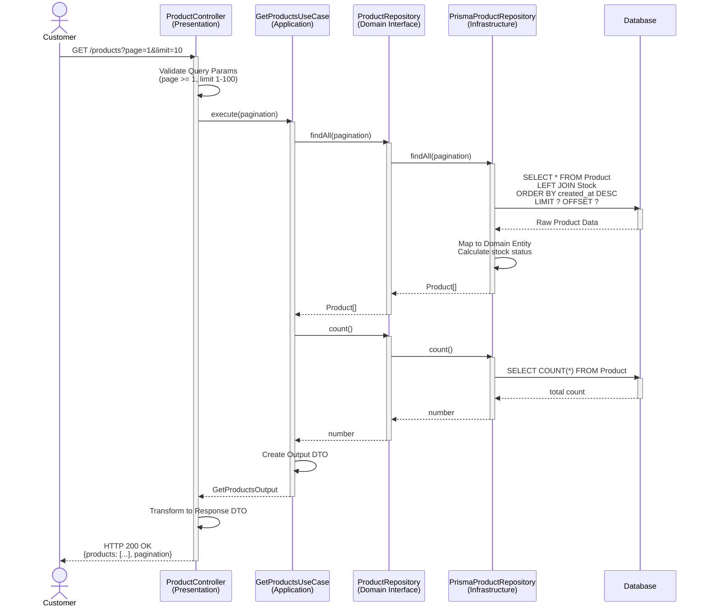
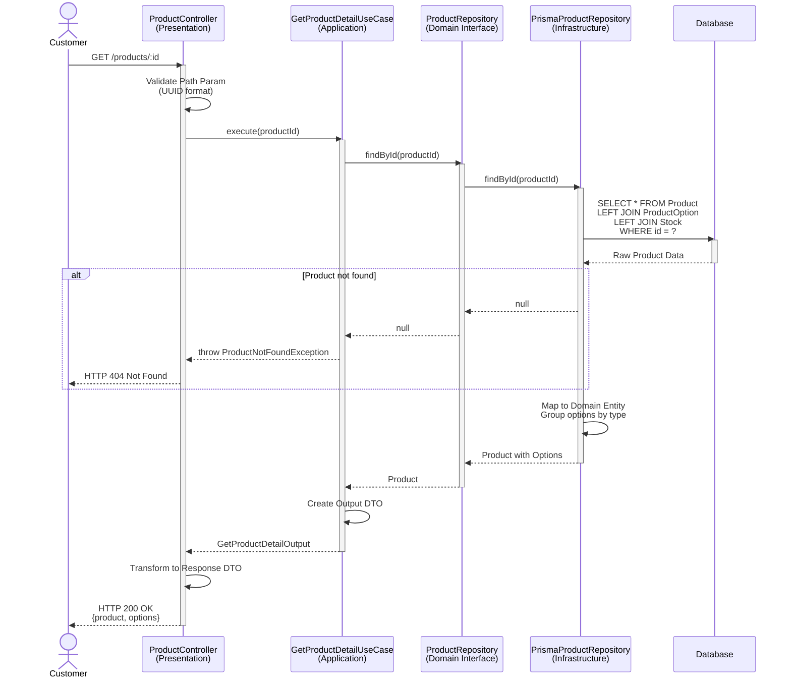
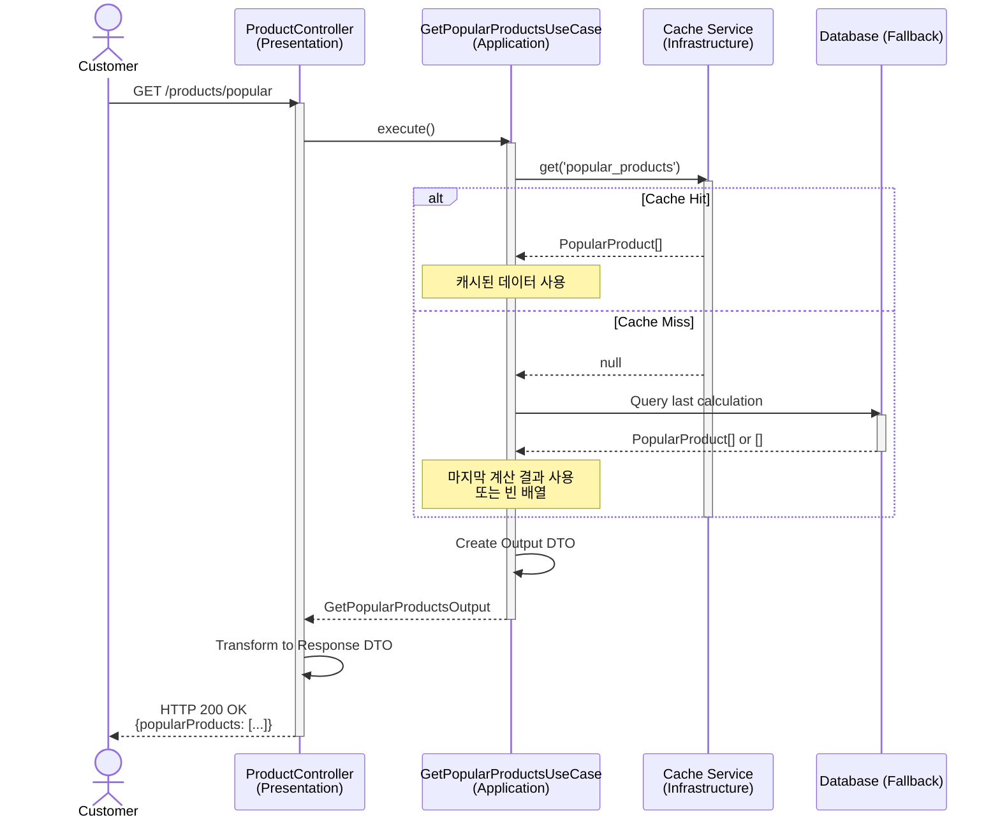
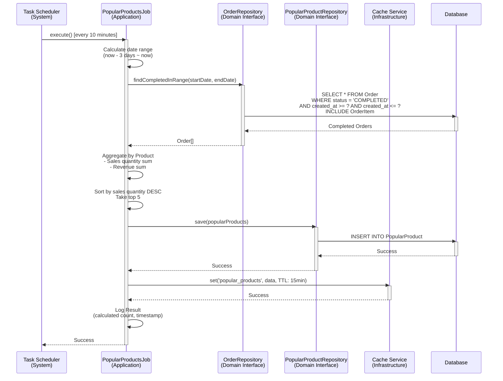
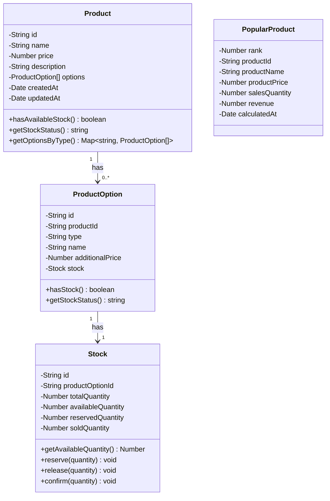

# Product Domain - Sequence Diagrams

**문서 정보**
- **버전**: 1.0.0
- **최종 수정일**: 2025-11-05
- **상태**: Active
- **작성자**: Development Team
- **대상 독자**: Developers, Architects, DevOps

---

**문서 네비게이션**
- ⬆️ 상위: [아키텍처](../architecture.md)
- ⬅️ 이전: [Product 유스케이스](./use-cases.md)
- ➡️ 다음: [Cart 유스케이스](../cart/use-cases.md)

---

## 목차
1. [개요](#1-개요)
2. [SD-PROD-01: 상품 목록 조회](#2-sd-prod-01-상품-목록-조회)
3. [SD-PROD-02: 상품 상세 조회](#3-sd-prod-02-상품-상세-조회)
4. [SD-PROD-03: 인기 상품 조회](#4-sd-prod-03-인기-상품-조회)
5. [SD-PROD-04: 인기 상품 통계 배치](#5-sd-prod-04-인기-상품-통계-배치)
6. [도메인 모델](#6-도메인-모델)
7. [캐싱 전략](#7-캐싱-전략)
8. [테스트 시나리오](#8-테스트-시나리오)

---

## 1. 개요

### 1.1 문서 목적
이 문서는 Product 도메인의 **기술적 구현 세부사항**을 설명합니다. 4-Layer 아키텍처를 기반으로 각 유스케이스의 시퀀스 다이어그램, 레이어별 책임, 구현 예시를 제공합니다.

### 1.2 대상 독자
- **개발자**: 구현 시 참고할 상세 기술 명세
- **아키텍트**: 시스템 설계 및 레이어 간 상호작용 이해
- **DevOps**: 성능 최적화 및 인프라 설정

### 1.3 관련 문서
- [Product 유스케이스](./use-cases.md) - 비즈니스 관점
- [아키텍처](../architecture.md) - 4-Layer 아키텍처 정의
- [API 명세](../api-specification.md) - REST API 계약
- [데이터 모델](../data-model.md) - 데이터베이스 스키마

---

## 2. SD-PROD-01: 상품 목록 조회

### 2.1 시퀀스 다이어그램



### 2.2 레이어별 책임

#### Presentation Layer
**컴포넌트**: `ProductController`

**책임**:
- Query Parameter 검증 (page, limit)
- UseCase 호출
- Response DTO 변환

**구현 예시**:
```typescript
@Controller('products')
export class ProductController {
  constructor(private readonly getProductsUseCase: GetProductsUseCase) {}

  @Get()
  async getProducts(
    @Query() query: GetProductsDto,
  ): Promise<ProductListResponseDto> {
    const output = await this.getProductsUseCase.execute({
      page: query.page || 1,
      limit: query.limit || 10,
    });

    return ProductListResponseDto.from(output);
  }
}

export class GetProductsDto {
  @IsOptional()
  @IsInt()
  @Min(1)
  page?: number;

  @IsOptional()
  @IsInt()
  @Min(1)
  @Max(100)
  limit?: number;
}
```

#### Application Layer
**컴포넌트**: `GetProductsUseCase`

**책임**:
- 상품 목록 조회
- 총 상품 수 조회
- Pagination 처리
- Output DTO 생성

**구현 예시**:
```typescript
@Injectable()
export class GetProductsUseCase {
  constructor(private readonly productRepository: ProductRepository) {}

  async execute(input: GetProductsInput): Promise<GetProductsOutput> {
    const pagination = {
      page: input.page,
      limit: input.limit,
      offset: (input.page - 1) * input.limit,
    };

    // 1. 상품 목록 조회
    const products = await this.productRepository.findAll(pagination);

    // 2. 총 상품 수 조회
    const total = await this.productRepository.count();

    // 3. Output DTO 생성
    return GetProductsOutput.from({
      products,
      pagination: {
        currentPage: input.page,
        pageSize: input.limit,
        totalItems: total,
        totalPages: Math.ceil(total / input.limit),
      },
    });
  }
}
```

#### Domain Layer
**컴포넌트**: `Product`, `ProductRepository`

**책임**:
- Product Entity 정의
- Repository Interface 정의
- 재고 상태 로직

**구현 예시**:
```typescript
export class Product {
  private id: string;
  private name: string;
  private price: number;
  private description: string;
  private createdAt: Date;
  private updatedAt: Date;

  // Stock은 별도 Aggregate
  private hasStock: boolean; // 조회 시 계산됨

  hasAvailableStock(): boolean {
    return this.hasStock;
  }

  getStockStatus(): string {
    return this.hasStock ? '재고 있음' : '품절';
  }

  // Getters
  getId(): string { return this.id; }
  getName(): string { return this.name; }
  getPrice(): number { return this.price; }
  getDescription(): string { return this.description; }
}

export interface ProductRepository {
  findAll(pagination: Pagination): Promise<Product[]>;
  findById(id: string): Promise<Product | null>;
  count(): Promise<number>;
}
```

#### Infrastructure Layer
**컴포넌트**: `PrismaProductRepository`

**책임**:
- 상품 조회 (Stock JOIN)
- Pagination 적용
- 최신 순 정렬
- Domain Entity 변환

**구현 예시**:
```typescript
@Injectable()
export class PrismaProductRepository implements ProductRepository {
  constructor(private readonly prisma: PrismaService) {}

  async findAll(pagination: Pagination): Promise<Product[]> {
    const products = await this.prisma.product.findMany({
      take: pagination.limit,
      skip: pagination.offset,
      orderBy: { createdAt: 'desc' },
      include: {
        options: {
          include: {
            stock: true,
          },
        },
      },
    });

    return products.map(p => this.toDomain(p));
  }

  async count(): Promise<number> {
    return this.prisma.product.count();
  }

  private toDomain(data: PrismaProduct & { options: PrismaOption[] }): Product {
    // 재고 상태 계산: 하나라도 재고가 있으면 true
    const hasStock = data.options.some(
      opt => opt.stock && opt.stock.availableQuantity > 0,
    );

    return Product.reconstitute({
      id: data.id,
      name: data.name,
      price: data.price,
      description: data.description,
      hasStock,
      createdAt: data.createdAt,
      updatedAt: data.updatedAt,
    });
  }
}
```

### 2.3 트랜잭션 전략
- **트랜잭션 불필요**: 읽기 전용 작업 (Read-Only)
- **격리 수준**: READ COMMITTED (기본값)

### 2.4 동시성 제어
- **락 불필요**: 조회만 수행하므로 동시성 이슈 없음

### 2.5 에러 처리

| 에러 케이스 | HTTP 상태 | 에러 메시지 | 처리 레이어 |
|-------------|-----------|-------------|-------------|
| 잘못된 page 값 | 400 | "페이지는 1 이상이어야 합니다." | Presentation |
| 잘못된 limit 값 | 400 | "페이지 크기는 1-100 사이여야 합니다." | Presentation |

---

## 3. SD-PROD-02: 상품 상세 조회

### 3.1 시퀀스 다이어그램



### 3.2 레이어별 책임

#### Presentation Layer
**책임**:
- Path Parameter 검증 (UUID 형식)
- UseCase 호출
- Response DTO 변환

#### Application Layer
**컴포넌트**: `GetProductDetailUseCase`

**책임**:
- 상품 조회
- 존재 여부 확인
- Output DTO 생성

**구현 예시**:
```typescript
@Injectable()
export class GetProductDetailUseCase {
  constructor(private readonly productRepository: ProductRepository) {}

  async execute(input: GetProductDetailInput): Promise<GetProductDetailOutput> {
    // 1. 상품 조회 (옵션 포함)
    const product = await this.productRepository.findById(input.productId);

    if (!product) {
      throw new ProductNotFoundException('상품을 찾을 수 없습니다.');
    }

    // 2. Output DTO 생성
    return GetProductDetailOutput.from(product);
  }
}
```

#### Domain Layer
**컴포넌트**: `Product`, `ProductOption`, `Stock`

**책임**:
- Product Entity 정의
- ProductOption Entity 정의
- 옵션 그룹화 로직
- 재고 상태 계산

**구현 예시**:
```typescript
export class Product {
  private id: string;
  private name: string;
  private price: number;
  private description: string;
  private options: ProductOption[];

  getOptions(): ProductOption[] {
    return [...this.options];
  }

  getOptionsByType(): Map<string, ProductOption[]> {
    const grouped = new Map<string, ProductOption[]>();

    for (const option of this.options) {
      const type = option.getType();
      if (!grouped.has(type)) {
        grouped.set(type, []);
      }
      grouped.get(type).push(option);
    }

    return grouped;
  }

  hasAvailableStock(): boolean {
    return this.options.some(opt => opt.hasStock());
  }
}

export class ProductOption {
  private id: string;
  private productId: string;
  private type: string; // 예: "색상", "사이즈"
  private name: string; // 예: "빨강", "M"
  private additionalPrice: number;
  private stock: Stock;

  hasStock(): boolean {
    return this.stock && this.stock.getAvailableQuantity() > 0;
  }

  getStockStatus(): string {
    return this.hasStock() ? '재고 있음' : '품절';
  }

  // Getters
  getType(): string { return this.type; }
  getName(): string { return this.name; }
  getAdditionalPrice(): number { return this.additionalPrice; }
}

export class Stock {
  private id: string;
  private productOptionId: string;
  private totalQuantity: number;
  private availableQuantity: number;
  private reservedQuantity: number;
  private soldQuantity: number;

  getAvailableQuantity(): number {
    return this.availableQuantity;
  }
}
```

#### Infrastructure Layer
**책임**:
- Product, ProductOption, Stock JOIN 조회
- Domain Entity 변환
- 옵션 type별 그룹화 지원

### 3.3 트랜잭션 전략
- **트랜잭션 불필요**: 읽기 전용 작업 (Read-Only)
- **격리 수준**: READ COMMITTED (기본값)

### 3.4 동시성 제어
- **락 불필요**: 조회만 수행하므로 동시성 이슈 없음

### 3.5 에러 처리

| 에러 케이스 | HTTP 상태 | 에러 메시지 | 처리 레이어 |
|-------------|-----------|-------------|-------------|
| 존재하지 않는 상품 | 404 | "상품을 찾을 수 없습니다." | Application |
| 잘못된 UUID 형식 | 400 | "잘못된 상품 ID 형식입니다." | Presentation |

---

## 4. SD-PROD-03: 인기 상품 조회

### 4.1 시퀀스 다이어그램



### 4.2 레이어별 책임

#### Presentation Layer
**책임**:
- UseCase 호출
- Response DTO 변환

#### Application Layer
**컴포넌트**: `GetPopularProductsUseCase`

**책임**:
- 캐시 조회
- Fallback 처리
- Output DTO 생성

**구현 예시**:
```typescript
@Injectable()
export class GetPopularProductsUseCase {
  constructor(
    private readonly cacheService: CacheService,
    private readonly popularProductRepository: PopularProductRepository,
  ) {}

  async execute(): Promise<GetPopularProductsOutput> {
    // 1. 캐시 조회
    const cached = await this.cacheService.get<PopularProduct[]>(
      'popular_products',
    );

    if (cached) {
      return GetPopularProductsOutput.from(cached);
    }

    // 2. 캐시 미스: 마지막 계산 결과 조회
    const products = await this.popularProductRepository.findLatest();

    return GetPopularProductsOutput.from(products);
  }
}
```

#### Domain Layer
**컴포넌트**: `PopularProduct`

**책임**:
- PopularProduct Value Object 정의

**구현 예시**:
```typescript
export class PopularProduct {
  private rank: number;
  private productId: string;
  private productName: string;
  private productPrice: number;
  private salesQuantity: number;
  private revenue: number;
  private calculatedAt: Date;

  // Getters
  getRank(): number { return this.rank; }
  getProductId(): string { return this.productId; }
  getProductName(): string { return this.productName; }
  getProductPrice(): number { return this.productPrice; }
  getSalesQuantity(): number { return this.salesQuantity; }
  getRevenue(): number { return this.revenue; }
  getCalculatedAt(): Date { return this.calculatedAt; }
}
```

#### Infrastructure Layer
**컴포넌트**: `CacheService`, `PopularProductRepository`

**책임**:
- 캐시 조회/저장
- 마지막 계산 결과 조회

### 4.3 캐싱 전략
- **캐시 키**: `popular_products`
- **TTL**: 15분
- **저장 시점**: 배치 작업 완료 시
- **캐시 미스**: 마지막 계산 결과 반환 또는 빈 배열

### 4.4 에러 처리

| 에러 케이스 | HTTP 상태 | 에러 메시지 | 처리 레이어 |
|-------------|-----------|-------------|-------------|
| 캐시 데이터 없음 | 200 | 빈 배열 반환 | Application |

---

## 5. SD-PROD-04: 인기 상품 통계 배치

### 5.1 시퀀스 다이어그램



### 5.2 레이어별 책임

#### Application Layer
**컴포넌트**: `PopularProductsJob`

**책임**:
- 배치 작업 실행 (10분마다)
- 최근 3일간 완료된 주문 조회
- 상품별 판매 수량 및 매출액 집계
- 상위 5개 추출
- 결과 저장 및 캐시
- 로깅

**구현 예시**:
```typescript
@Injectable()
export class PopularProductsJob {
  private readonly logger = new Logger(PopularProductsJob.name);

  constructor(
    private readonly orderRepository: OrderRepository,
    private readonly popularProductRepository: PopularProductRepository,
    private readonly cacheService: CacheService,
  ) {}

  @Cron('0 */10 * * * *') // 10분마다 실행
  async execute(): Promise<void> {
    this.logger.log('인기 상품 통계 계산 시작');

    try {
      // 1. 날짜 범위 계산 (최근 3일)
      const endDate = new Date();
      const startDate = new Date();
      startDate.setDate(startDate.getDate() - 3);

      // 2. 완료된 주문 조회
      const orders = await this.orderRepository.findCompletedInRange(
        startDate,
        endDate,
      );

      // 3. 상품별 판매 통계 집계
      const productStats = this.aggregateByProduct(orders);

      // 4. 판매 수량 기준 내림차순 정렬 후 상위 5개
      const topProducts = productStats
        .sort((a, b) => b.salesQuantity - a.salesQuantity)
        .slice(0, 5)
        .map((stat, index) => ({
          rank: index + 1,
          ...stat,
          calculatedAt: new Date(),
        }));

      // 5. 데이터베이스에 저장
      await this.popularProductRepository.save(topProducts);

      // 6. 캐시에 저장 (TTL: 15분)
      await this.cacheService.set(
        'popular_products',
        topProducts,
        15 * 60, // 15분
      );

      this.logger.log(
        `인기 상품 통계 계산 완료: ${topProducts.length}개 상품`,
      );
    } catch (error) {
      this.logger.error('인기 상품 통계 계산 실패', error);
      // 실패해도 다음 실행 시도
    }
  }

  private aggregateByProduct(orders: Order[]): ProductStat[] {
    const statsMap = new Map<string, ProductStat>();

    for (const order of orders) {
      for (const item of order.getItems()) {
        const productId = item.getProductId();

        if (!statsMap.has(productId)) {
          statsMap.set(productId, {
            productId,
            productName: item.getProductName(),
            productPrice: item.getPrice(),
            salesQuantity: 0,
            revenue: 0,
          });
        }

        const stat = statsMap.get(productId);
        stat.salesQuantity += item.getQuantity();
        stat.revenue += item.getSubtotal();
      }
    }

    return Array.from(statsMap.values());
  }
}

interface ProductStat {
  productId: string;
  productName: string;
  productPrice: number;
  salesQuantity: number;
  revenue: number;
}
```

#### Infrastructure Layer
**책임**:
- 완료된 주문 조회
- 통계 데이터 저장
- 캐시 저장

### 5.3 배치 성능 고려사항

#### 인덱스
```sql
CREATE INDEX idx_order_status_created_at
ON "Order"(status, created_at)
WHERE status = 'COMPLETED';

CREATE INDEX idx_order_item_product_id
ON "OrderItem"(product_id);
```

#### 배치 최적화
- 완료된 주문만 조회 (status 필터)
- 날짜 범위 제한 (최근 3일)
- 집계 로직은 애플리케이션에서 수행
- 캐시 활용으로 API 응답 속도 향상

---

## 6. 도메인 모델

### 6.1 핵심 Entity



### 6.2 Repository Interface

```typescript
export interface ProductRepository {
  findAll(pagination: Pagination): Promise<Product[]>;
  findById(id: string): Promise<Product | null>;
  count(): Promise<number>;
}

export interface PopularProductRepository {
  save(products: PopularProduct[]): Promise<void>;
  findLatest(): Promise<PopularProduct[]>;
}

export interface OrderRepository {
  findCompletedInRange(startDate: Date, endDate: Date): Promise<Order[]>;
}
```

---

## 7. 캐싱 전략

### 7.1 인기 상품 캐싱

**캐시 키**: `popular_products`

**TTL**: 15분

**갱신 전략**:
- 배치 작업이 10분마다 실행
- 배치 완료 시 캐시 갱신
- TTL이 15분이므로 배치 실패 시에도 5분간 기존 캐시 유지

**데이터 구조**:
```typescript
interface CachedPopularProduct {
  rank: number;
  productId: string;
  productName: string;
  productPrice: number;
  salesQuantity: number;
  revenue: number;
  calculatedAt: string; // ISO 8601
}
```

### 7.2 Fallback 전략

```
1. 캐시 조회
   ↓ (Hit)
2. 캐시 데이터 반환
   ↓ (Miss)
3. 데이터베이스에서 마지막 계산 결과 조회
   ↓ (있음)
4. 마지막 계산 결과 반환
   ↓ (없음)
5. 빈 배열 반환
```

---

## 8. 테스트 시나리오

### 8.1 Unit Test: GetProductsUseCase

```typescript
describe('GetProductsUseCase', () => {
  let useCase: GetProductsUseCase;
  let mockProductRepository: jest.Mocked<ProductRepository>;

  beforeEach(() => {
    mockProductRepository = {
      findAll: jest.fn(),
      count: jest.fn(),
    } as any;

    useCase = new GetProductsUseCase(mockProductRepository);
  });

  it('should return paginated products', async () => {
    // Given
    const input = { page: 1, limit: 10 };
    const products = [
      Product.reconstitute({ id: '1', name: 'Product 1', price: 10000 }),
      Product.reconstitute({ id: '2', name: 'Product 2', price: 20000 }),
    ];

    mockProductRepository.findAll.mockResolvedValue(products);
    mockProductRepository.count.mockResolvedValue(2);

    // When
    const output = await useCase.execute(input);

    // Then
    expect(output.products).toHaveLength(2);
    expect(output.pagination.currentPage).toBe(1);
    expect(output.pagination.totalItems).toBe(2);
  });

  it('should return empty list when no products', async () => {
    // Given
    mockProductRepository.findAll.mockResolvedValue([]);
    mockProductRepository.count.mockResolvedValue(0);

    // When
    const output = await useCase.execute({ page: 1, limit: 10 });

    // Then
    expect(output.products).toHaveLength(0);
    expect(output.pagination.totalItems).toBe(0);
  });
});
```

### 8.2 Integration Test: PopularProductsJob

```typescript
describe('PopularProductsJob (Integration)', () => {
  let job: PopularProductsJob;
  let orderRepository: OrderRepository;
  let popularProductRepository: PopularProductRepository;
  let cacheService: CacheService;

  beforeEach(async () => {
    // Setup test module
  });

  it('should calculate and cache popular products', async () => {
    // Given
    const orders = createTestOrdersWithProducts();
    jest.spyOn(orderRepository, 'findCompletedInRange').mockResolvedValue(orders);

    // When
    await job.execute();

    // Then
    expect(popularProductRepository.save).toHaveBeenCalledWith(
      expect.arrayContaining([
        expect.objectContaining({
          rank: 1,
          salesQuantity: expect.any(Number),
        }),
      ]),
    );

    expect(cacheService.set).toHaveBeenCalledWith(
      'popular_products',
      expect.any(Array),
      15 * 60,
    );
  });
});
```

### 8.3 E2E Test: Product API

```typescript
describe('Product API (E2E)', () => {
  let app: INestApplication;

  beforeAll(async () => {
    const moduleRef = await Test.createTestingModule({
      imports: [AppModule],
    }).compile();

    app = moduleRef.createNestApplication();
    await app.init();
  });

  afterAll(async () => {
    await app.close();
  });

  describe('GET /products', () => {
    it('should return product list', async () => {
      return request(app.getHttpServer())
        .get('/products?page=1&limit=10')
        .expect(200)
        .expect((res) => {
          expect(res.body.products).toBeInstanceOf(Array);
          expect(res.body.pagination).toBeDefined();
        });
    });
  });

  describe('GET /products/:id', () => {
    it('should return product detail', async () => {
      // Given
      const product = await createTestProduct();

      // When & Then
      return request(app.getHttpServer())
        .get(`/products/${product.id}`)
        .expect(200)
        .expect((res) => {
          expect(res.body.id).toBe(product.id);
          expect(res.body.options).toBeInstanceOf(Array);
        });
    });

    it('should return 404 when product not found', async () => {
      return request(app.getHttpServer())
        .get('/products/non-existent-id')
        .expect(404);
    });
  });

  describe('GET /products/popular', () => {
    it('should return popular products', async () => {
      return request(app.getHttpServer())
        .get('/products/popular')
        .expect(200)
        .expect((res) => {
          expect(res.body.popularProducts).toBeInstanceOf(Array);
          expect(res.body.popularProducts.length).toBeLessThanOrEqual(5);
        });
    });
  });
});
```

---

## 9. 관련 문서

- [Product 유스케이스](./use-cases.md) - 비즈니스 관점
- [아키텍처](../architecture.md) - 4-Layer 아키텍처
- [API 명세서](../api-specification.md) - REST API 계약
- [데이터 모델](../data-model.md) - 데이터베이스 스키마
- [Cart 시퀀스 다이어그램](../cart/sequence-diagrams.md) - 다음 도메인

---

## 10. 버전 히스토리

| 버전 | 날짜 | 작성자 | 변경 내역 |
|------|------|--------|-----------|
| 1.0.0 | 2025-11-05 | Development Team | 초기 문서 작성 |

---

**문서 끝**
