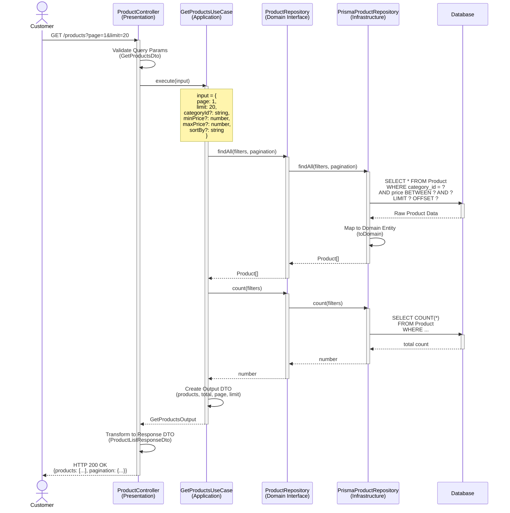
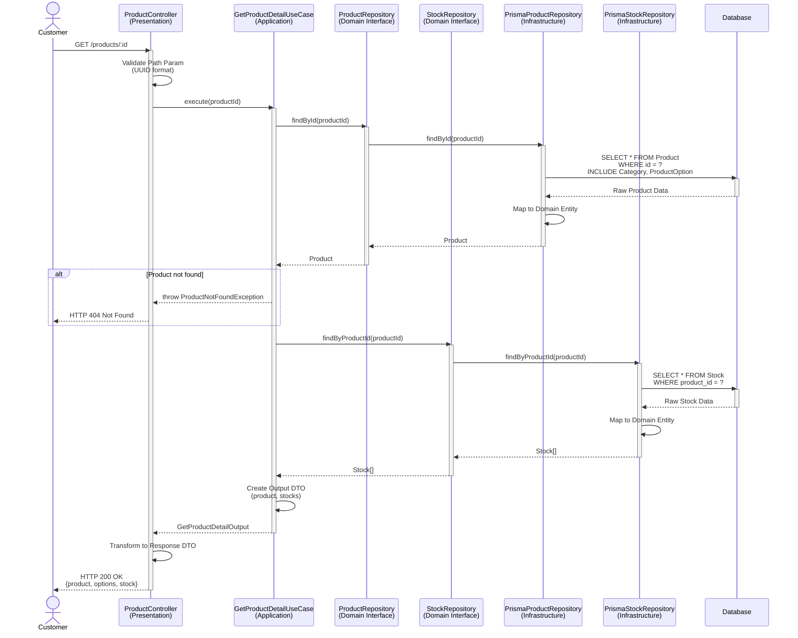
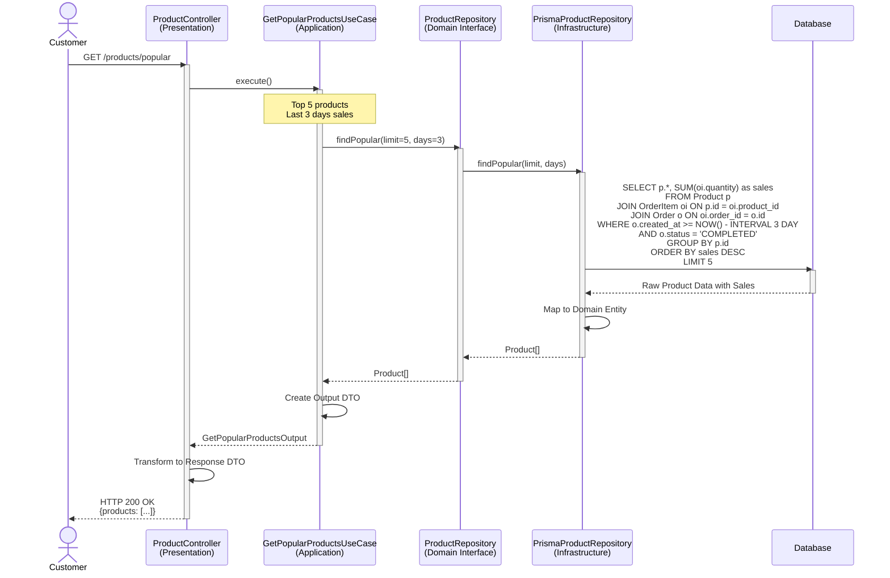
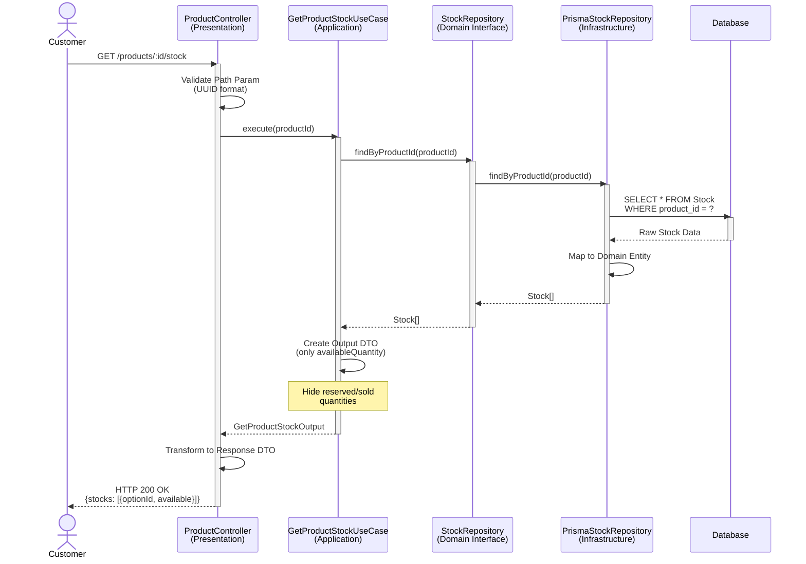
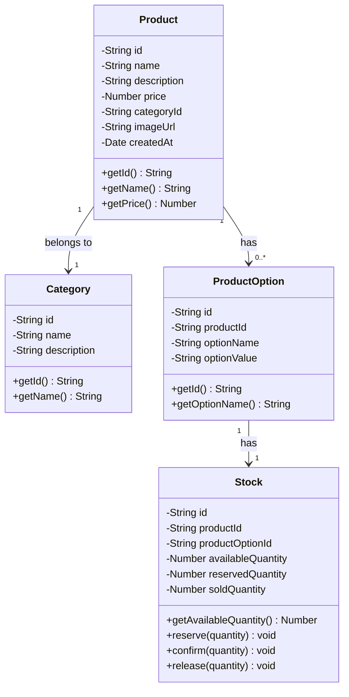

# Product Domain - Sequence Diagrams

**문서 정보**
- **버전**: 1.0.0
- **최종 수정일**: 2025-11-03
- **상태**: Active
- **작성자**: Development Team
- **대상 독자**: Developers, Architects, DevOps

---

**문서 네비게이션**
- ⬆️ 상위: [아키텍처](../architecture.md)
- ⬅️ 이전: [Product 유스케이스](./use-cases.md)
- ➡️ 다음: [Cart 시퀀스 다이어그램](../cart/sequence-diagrams.md)

---

## 목차
1. [개요](#1-개요)
2. [SD-PROD-01: 상품 목록 조회](#2-sd-prod-01-상품-목록-조회)
3. [SD-PROD-02: 상품 상세 조회](#3-sd-prod-02-상품-상세-조회)
4. [SD-PROD-03: 인기 상품 조회](#4-sd-prod-03-인기-상품-조회)
5. [SD-PROD-04: 재고 조회](#5-sd-prod-04-재고-조회)
6. [도메인 모델](#6-도메인-모델)
7. [성능 고려사항](#7-성능-고려사항)
8. [테스트 시나리오](#8-테스트-시나리오)

---

## 1. 개요

### 1.1 문서 목적
이 문서는 Product 도메인의 **기술적 구현 세부사항**을 설명합니다. 4-Layer 아키텍처를 기반으로 각 유스케이스의 시퀀스 다이어그램, 레이어별 책임, 구현 예시를 제공합니다.

### 1.2 대상 독자
- **개발자**: 구현 시 참고할 상세 기술 명세
- **아키텍트**: 시스템 설계 및 레이어 간 상호작용 이해
- **DevOps**: 성능 최적화 및 인프라 설정

### 1.3 관련 문서
- [Product 유스케이스](./use-cases.md) - 비즈니스 관점
- [아키텍처](../architecture.md) - 4-Layer 아키텍처 정의
- [API 명세](../api-specification.md) - REST API 계약
- [데이터 모델](../data-model.md) - 데이터베이스 스키마

---

## 2. SD-PROD-01: 상품 목록 조회

### 2.1 시퀀스 다이어그램



### 2.2 레이어별 책임

#### Presentation Layer
**컴포넌트**: `ProductController`

**책임**:
- Query Parameter 검증 (page, limit, categoryId, minPrice, maxPrice, sortBy)
- Pagination 범위 검증 (limit: 1-100)
- UseCase 호출
- Response DTO 변환

**구현 예시**:
```typescript
@Controller('products')
export class ProductController {
  constructor(private readonly getProductsUseCase: GetProductsUseCase) {}

  @Get()
  async getProducts(
    @Query() query: GetProductsDto,
  ): Promise<ProductListResponseDto> {
    const output = await this.getProductsUseCase.execute({
      page: query.page ?? 1,
      limit: query.limit ?? 20,
      categoryId: query.categoryId,
      minPrice: query.minPrice,
      maxPrice: query.maxPrice,
      sortBy: query.sortBy ?? 'createdAt',
    });

    return ProductListResponseDto.from(output);
  }
}
```

#### Application Layer
**컴포넌트**: `GetProductsUseCase`

**책임**:
- Repository를 통한 상품 목록 조회
- 총 상품 수 조회 (페이지네이션용)
- Output DTO 생성

**구현 예시**:
```typescript
@Injectable()
export class GetProductsUseCase {
  constructor(private readonly productRepository: ProductRepository) {}

  async execute(input: GetProductsInput): Promise<GetProductsOutput> {
    // 필터 및 페이지네이션 설정
    const filters = {
      categoryId: input.categoryId,
      minPrice: input.minPrice,
      maxPrice: input.maxPrice,
    };

    const pagination = {
      page: input.page,
      limit: input.limit,
      sortBy: input.sortBy,
    };

    // Repository 호출
    const products = await this.productRepository.findAll(filters, pagination);
    const total = await this.productRepository.count(filters);

    // Output DTO 생성
    return GetProductsOutput.from({
      products,
      total,
      page: input.page,
      limit: input.limit,
    });
  }
}
```

#### Domain Layer
**컴포넌트**: `Product` (Entity), `ProductRepository` (Interface)

**책임**:
- Product Entity 정의
- Repository Interface 정의 (findAll, count)
- 비즈니스 로직: 없음 (단순 조회)

**구현 예시**:
```typescript
// Product Entity
export class Product {
  private id: string;
  private name: string;
  private description: string;
  private price: number;
  private categoryId: string;
  private imageUrl: string;
  private createdAt: Date;

  // Getter methods
  getId(): string { return this.id; }
  getName(): string { return this.name; }
  getPrice(): number { return this.price; }
  // ...
}

// Repository Interface
export interface ProductRepository {
  findAll(
    filters: ProductFilters,
    pagination: Pagination,
  ): Promise<Product[]>;

  count(filters: ProductFilters): Promise<number>;
}

export interface ProductFilters {
  categoryId?: string;
  minPrice?: number;
  maxPrice?: number;
}

export interface Pagination {
  page: number;
  limit: number;
  sortBy: string;
}
```

#### Infrastructure Layer
**컴포넌트**: `PrismaProductRepository`

**책임**:
- Prisma를 사용한 데이터베이스 쿼리
- Persistence Model → Domain Entity 변환
- 필터 및 정렬 조건 적용

**구현 예시**:
```typescript
@Injectable()
export class PrismaProductRepository implements ProductRepository {
  constructor(private readonly prisma: PrismaService) {}

  async findAll(
    filters: ProductFilters,
    pagination: Pagination,
  ): Promise<Product[]> {
    const where = {
      ...(filters.categoryId && { categoryId: filters.categoryId }),
      ...(filters.minPrice && { price: { gte: filters.minPrice } }),
      ...(filters.maxPrice && { price: { lte: filters.maxPrice } }),
    };

    const orderBy = {
      [pagination.sortBy]: 'desc',
    };

    const products = await this.prisma.product.findMany({
      where,
      orderBy,
      skip: (pagination.page - 1) * pagination.limit,
      take: pagination.limit,
      include: {
        category: true,
      },
    });

    return products.map(p => this.toDomain(p));
  }

  async count(filters: ProductFilters): Promise<number> {
    const where = {
      ...(filters.categoryId && { categoryId: filters.categoryId }),
      ...(filters.minPrice && { price: { gte: filters.minPrice } }),
      ...(filters.maxPrice && { price: { lte: filters.maxPrice } }),
    };

    return this.prisma.product.count({ where });
  }

  private toDomain(data: PrismaProduct): Product {
    return Product.reconstitute({
      id: data.id,
      name: data.name,
      description: data.description,
      price: data.price,
      categoryId: data.categoryId,
      imageUrl: data.imageUrl,
      createdAt: data.createdAt,
    });
  }
}
```

### 2.3 트랜잭션 전략
- **트랜잭션 불필요**: 읽기 전용 작업 (Read-Only)
- **격리 수준**: READ COMMITTED (기본값)

### 2.4 동시성 제어
- **락 불필요**: 조회만 수행하므로 동시성 이슈 없음

### 2.5 에러 처리

| 에러 케이스 | HTTP 상태 | 에러 메시지 | 처리 레이어 |
|-------------|-----------|-------------|-------------|
| 잘못된 page 값 (< 1) | 400 | "페이지는 1 이상이어야 합니다." | Presentation |
| 잘못된 limit 값 (< 1 or > 100) | 400 | "페이지 크기는 1-100 사이여야 합니다." | Presentation |
| 존재하지 않는 카테고리 | 400 | "존재하지 않는 카테고리입니다." | Application |
| 데이터베이스 연결 실패 | 500 | "서버 오류가 발생했습니다." | Infrastructure |

### 2.6 성능 최적화

#### 인덱스 전략
```sql
-- 카테고리 + 가격 필터링 최적화
CREATE INDEX idx_product_category_price ON Product(category_id, price);

-- 최신 상품 정렬 최적화
CREATE INDEX idx_product_created_at ON Product(created_at DESC);
```

#### 쿼리 최적화
- **Pagination 최적화**: OFFSET 대신 Cursor-based pagination 고려 (대용량 데이터)
- **JOIN 최적화**: Category 정보는 별도 API로 분리 고려

---

## 3. SD-PROD-02: 상품 상세 조회

### 3.1 시퀀스 다이어그램



### 3.2 레이어별 책임

#### Presentation Layer
**컴포넌트**: `ProductController`

**책임**:
- Path Parameter 검증 (UUID 형식)
- UseCase 호출
- Response DTO 변환
- 404 에러 처리

**구현 예시**:
```typescript
@Controller('products')
export class ProductController {
  constructor(
    private readonly getProductDetailUseCase: GetProductDetailUseCase,
  ) {}

  @Get(':id')
  async getProductDetail(
    @Param('id', ParseUUIDPipe) id: string,
  ): Promise<ProductDetailResponseDto> {
    try {
      const output = await this.getProductDetailUseCase.execute(id);
      return ProductDetailResponseDto.from(output);
    } catch (error) {
      if (error instanceof ProductNotFoundException) {
        throw new NotFoundException(error.message);
      }
      throw error;
    }
  }
}
```

#### Application Layer
**컴포넌트**: `GetProductDetailUseCase`

**책임**:
- Product Repository를 통한 상품 조회
- Stock Repository를 통한 재고 조회
- Product 존재 여부 확인
- Output DTO 생성

**구현 예시**:
```typescript
@Injectable()
export class GetProductDetailUseCase {
  constructor(
    private readonly productRepository: ProductRepository,
    private readonly stockRepository: StockRepository,
  ) {}

  async execute(productId: string): Promise<GetProductDetailOutput> {
    // 상품 조회
    const product = await this.productRepository.findById(productId);

    if (!product) {
      throw new ProductNotFoundException(`상품을 찾을 수 없습니다: ${productId}`);
    }

    // 재고 조회
    const stocks = await this.stockRepository.findByProductId(productId);

    // Output DTO 생성
    return GetProductDetailOutput.from({
      product,
      stocks,
    });
  }
}
```

#### Domain Layer
**컴포넌트**: `Product`, `Stock`, `ProductOption`

**책임**:
- Entity 정의
- Repository Interface 정의
- 비즈니스 로직: 없음 (단순 조회)

**구현 예시**:
```typescript
// Product Entity
export class Product {
  private id: string;
  private name: string;
  private description: string;
  private price: number;
  private categoryId: string;
  private imageUrl: string;
  private options: ProductOption[];
  private createdAt: Date;

  static reconstitute(data: ProductData): Product {
    const product = new Product();
    Object.assign(product, data);
    return product;
  }

  // Getters
  getId(): string { return this.id; }
  getName(): string { return this.name; }
  getPrice(): number { return this.price; }
  getOptions(): ProductOption[] { return this.options; }
}

// Stock Entity
export class Stock {
  private id: string;
  private productId: string;
  private productOptionId: string;
  private availableQuantity: number;
  private reservedQuantity: number;
  private soldQuantity: number;

  getAvailableQuantity(): number {
    return this.availableQuantity;
  }
}

// Repository Interfaces
export interface ProductRepository {
  findById(id: string): Promise<Product | null>;
}

export interface StockRepository {
  findByProductId(productId: string): Promise<Stock[]>;
}
```

#### Infrastructure Layer
**컴포넌트**: `PrismaProductRepository`, `PrismaStockRepository`

**책임**:
- 상품 상세 조회 (Category, ProductOption JOIN)
- 재고 조회
- Persistence Model → Domain Entity 변환

**구현 예시**:
```typescript
@Injectable()
export class PrismaProductRepository implements ProductRepository {
  constructor(private readonly prisma: PrismaService) {}

  async findById(id: string): Promise<Product | null> {
    const product = await this.prisma.product.findUnique({
      where: { id },
      include: {
        category: true,
        options: true,
      },
    });

    return product ? this.toDomain(product) : null;
  }

  private toDomain(data: PrismaProductWithRelations): Product {
    return Product.reconstitute({
      id: data.id,
      name: data.name,
      description: data.description,
      price: data.price,
      categoryId: data.categoryId,
      imageUrl: data.imageUrl,
      options: data.options.map(opt => ProductOption.reconstitute(opt)),
      createdAt: data.createdAt,
    });
  }
}

@Injectable()
export class PrismaStockRepository implements StockRepository {
  constructor(private readonly prisma: PrismaService) {}

  async findByProductId(productId: string): Promise<Stock[]> {
    const stocks = await this.prisma.stock.findMany({
      where: { productId },
      include: {
        productOption: true,
      },
    });

    return stocks.map(s => this.toDomain(s));
  }

  private toDomain(data: PrismaStock): Stock {
    return Stock.reconstitute({
      id: data.id,
      productId: data.productId,
      productOptionId: data.productOptionId,
      availableQuantity: data.availableQuantity,
      reservedQuantity: data.reservedQuantity,
      soldQuantity: data.soldQuantity,
    });
  }
}
```

### 3.3 트랜잭션 전략
- **트랜잭션 불필요**: 읽기 전용 작업 (Read-Only)
- **격리 수준**: READ COMMITTED (기본값)

### 3.4 동시성 제어
- **락 불필요**: 조회만 수행하므로 동시성 이슈 없음

### 3.5 에러 처리

| 에러 케이스 | HTTP 상태 | 에러 메시지 | 처리 레이어 |
|-------------|-----------|-------------|-------------|
| 존재하지 않는 상품 ID | 404 | "상품을 찾을 수 없습니다." | Application |
| 잘못된 UUID 형식 | 400 | "잘못된 상품 ID 형식입니다." | Presentation |
| 데이터베이스 연결 실패 | 500 | "서버 오류가 발생했습니다." | Infrastructure |

### 3.6 성능 최적화

#### 캐싱 전략
```typescript
// Redis 캐싱 적용
@Injectable()
export class CachedProductRepository implements ProductRepository {
  constructor(
    private readonly prismaRepo: PrismaProductRepository,
    private readonly cacheManager: Cache,
  ) {}

  async findById(id: string): Promise<Product | null> {
    const cacheKey = `product:${id}`;

    // 캐시 조회
    const cached = await this.cacheManager.get<Product>(cacheKey);
    if (cached) return cached;

    // DB 조회
    const product = await this.prismaRepo.findById(id);

    // 캐시 저장 (TTL: 1시간)
    if (product) {
      await this.cacheManager.set(cacheKey, product, { ttl: 3600 });
    }

    return product;
  }
}
```

---

## 4. SD-PROD-03: 인기 상품 조회

### 4.1 시퀀스 다이어그램



### 4.2 레이어별 책임

#### Presentation Layer
**컴포넌트**: `ProductController`

**책임**:
- UseCase 호출 (파라미터 없음)
- Response DTO 변환

**구현 예시**:
```typescript
@Controller('products')
export class ProductController {
  constructor(
    private readonly getPopularProductsUseCase: GetPopularProductsUseCase,
  ) {}

  @Get('popular')
  async getPopularProducts(): Promise<ProductListResponseDto> {
    const output = await this.getPopularProductsUseCase.execute();
    return ProductListResponseDto.from(output);
  }
}
```

#### Application Layer
**컴포넌트**: `GetPopularProductsUseCase`

**책임**:
- Repository를 통한 인기 상품 조회
- 조회 조건 설정 (limit=5, days=3)
- Output DTO 생성

**구현 예시**:
```typescript
@Injectable()
export class GetPopularProductsUseCase {
  constructor(private readonly productRepository: ProductRepository) {}

  async execute(): Promise<GetPopularProductsOutput> {
    const products = await this.productRepository.findPopular(5, 3);

    return GetPopularProductsOutput.from({
      products,
    });
  }
}
```

#### Domain Layer
**컴포넌트**: `Product`, `ProductRepository`

**책임**:
- Entity 정의
- Repository Interface에 findPopular 메서드 정의

**구현 예시**:
```typescript
export interface ProductRepository {
  findPopular(limit: number, days: number): Promise<Product[]>;
}
```

#### Infrastructure Layer
**컴포넌트**: `PrismaProductRepository`

**책임**:
- OrderItem과 Order JOIN하여 판매량 집계
- 최근 3일 필터 적용
- 완료된 주문만 집계 (status = 'COMPLETED')
- 상위 5개 정렬

**구현 예시**:
```typescript
@Injectable()
export class PrismaProductRepository implements ProductRepository {
  constructor(private readonly prisma: PrismaService) {}

  async findPopular(limit: number, days: number): Promise<Product[]> {
    const cutoffDate = new Date();
    cutoffDate.setDate(cutoffDate.getDate() - days);

    const products = await this.prisma.$queryRaw<any[]>`
      SELECT
        p.*,
        SUM(oi.quantity) as sales
      FROM Product p
      INNER JOIN OrderItem oi ON p.id = oi.product_id
      INNER JOIN \`Order\` o ON oi.order_id = o.id
      WHERE o.created_at >= ${cutoffDate}
        AND o.status = 'COMPLETED'
      GROUP BY p.id
      ORDER BY sales DESC
      LIMIT ${limit}
    `;

    return products.map(p => this.toDomain(p));
  }
}
```

### 4.3 트랜잭션 전략
- **트랜잭션 불필요**: 읽기 전용 작업 (Read-Only)
- **격리 수준**: READ COMMITTED (기본값)

### 4.4 동시성 제어
- **락 불필요**: 조회만 수행하므로 동시성 이슈 없음

### 4.5 에러 처리

| 에러 케이스 | HTTP 상태 | 에러 메시지 | 처리 레이어 |
|-------------|-----------|-------------|-------------|
| 집계 데이터 없음 | 200 | [] (빈 배열 반환) | Application |
| 데이터베이스 연결 실패 | 500 | "서버 오류가 발생했습니다." | Infrastructure |

### 4.6 성능 최적화

#### 인덱스 전략
```sql
-- 주문 날짜 및 상태 필터링 최적화
CREATE INDEX idx_order_created_status ON `Order`(created_at, status);

-- OrderItem 조인 최적화
CREATE INDEX idx_orderitem_product ON OrderItem(product_id, order_id);
```

#### 캐싱 전략
```typescript
@Injectable()
export class CachedProductRepository implements ProductRepository {
  constructor(
    private readonly prismaRepo: PrismaProductRepository,
    private readonly cacheManager: Cache,
  ) {}

  async findPopular(limit: number, days: number): Promise<Product[]> {
    const cacheKey = `products:popular:${limit}:${days}`;

    // 캐시 조회
    const cached = await this.cacheManager.get<Product[]>(cacheKey);
    if (cached) return cached;

    // DB 조회
    const products = await this.prismaRepo.findPopular(limit, days);

    // 캐시 저장 (TTL: 1시간)
    await this.cacheManager.set(cacheKey, products, { ttl: 3600 });

    return products;
  }
}
```

---

## 5. SD-PROD-04: 재고 조회

### 5.1 시퀀스 다이어그램



### 5.2 레이어별 책임

#### Presentation Layer
**컴포넌트**: `ProductController`

**책임**:
- Path Parameter 검증 (UUID 형식)
- UseCase 호출
- Response DTO 변환

**구현 예시**:
```typescript
@Controller('products')
export class ProductController {
  constructor(
    private readonly getProductStockUseCase: GetProductStockUseCase,
  ) {}

  @Get(':id/stock')
  async getProductStock(
    @Param('id', ParseUUIDPipe) id: string,
  ): Promise<ProductStockResponseDto> {
    const output = await this.getProductStockUseCase.execute(id);
    return ProductStockResponseDto.from(output);
  }
}
```

#### Application Layer
**컴포넌트**: `GetProductStockUseCase`

**책임**:
- Stock Repository를 통한 재고 조회
- availableQuantity만 포함하여 Output DTO 생성 (보안)

**구현 예시**:
```typescript
@Injectable()
export class GetProductStockUseCase {
  constructor(private readonly stockRepository: StockRepository) {}

  async execute(productId: string): Promise<GetProductStockOutput> {
    const stocks = await this.stockRepository.findByProductId(productId);

    // availableQuantity만 노출
    return GetProductStockOutput.from({
      stocks: stocks.map(stock => ({
        optionId: stock.getProductOptionId(),
        availableQuantity: stock.getAvailableQuantity(),
      })),
    });
  }
}
```

#### Domain Layer
**컴포넌트**: `Stock`

**책임**:
- Stock Entity 정의 (availableQuantity, reservedQuantity, soldQuantity)
- Repository Interface 정의
- 재고 예약 비즈니스 로직

**구현 예시**:
```typescript
export class Stock {
  private id: string;
  private productId: string;
  private productOptionId: string;
  private availableQuantity: number;
  private reservedQuantity: number;  // 고객에게 노출 안 함
  private soldQuantity: number;      // 고객에게 노출 안 함

  getAvailableQuantity(): number {
    return this.availableQuantity;
  }

  getProductOptionId(): string {
    return this.productOptionId;
  }

  // Business logic for reservation
  reserve(quantity: number): void {
    if (this.availableQuantity < quantity) {
      throw new InsufficientStockException(
        `재고 부족: 요청 ${quantity}, 재고 ${this.availableQuantity}`
      );
    }
    this.availableQuantity -= quantity;
    this.reservedQuantity += quantity;
  }

  // Business logic for confirmation
  confirm(quantity: number): void {
    if (this.reservedQuantity < quantity) {
      throw new InvalidStockOperationException(
        `예약된 재고 부족: 요청 ${quantity}, 예약 ${this.reservedQuantity}`
      );
    }
    this.reservedQuantity -= quantity;
    this.soldQuantity += quantity;
  }

  // Business logic for release
  release(quantity: number): void {
    if (this.reservedQuantity < quantity) {
      throw new InvalidStockOperationException(
        `예약된 재고 부족: 요청 ${quantity}, 예약 ${this.reservedQuantity}`
      );
    }
    this.reservedQuantity -= quantity;
    this.availableQuantity += quantity;
  }
}

export interface StockRepository {
  findByProductId(productId: string, em?: EntityManager): Promise<Stock[]>;
  findByProductIdForUpdate(productId: string, em: EntityManager): Promise<Stock | null>;
  save(stock: Stock, em?: EntityManager): Promise<Stock>;
}
```

#### Infrastructure Layer
**컴포넌트**: `PrismaStockRepository`

**책임**:
- 상품 ID로 재고 조회
- ProductOption JOIN하여 옵션 정보 포함
- Persistence Model → Domain Entity 변환

**구현 예시**:
```typescript
@Injectable()
export class PrismaStockRepository implements StockRepository {
  constructor(private readonly prisma: PrismaService) {}

  async findByProductId(
    productId: string,
    em?: EntityManager,
  ): Promise<Stock[]> {
    const prismaClient = em ?? this.prisma;

    const stocks = await prismaClient.stock.findMany({
      where: { productId },
      include: {
        productOption: true,
      },
    });

    return stocks.map(s => this.toDomain(s));
  }

  async findByProductIdForUpdate(
    productId: string,
    em: EntityManager,
  ): Promise<Stock | null> {
    // FOR UPDATE 락 적용 (재고 차감 시 사용)
    const stock = await em.$queryRaw<any>`
      SELECT * FROM Stock
      WHERE product_id = ${productId}
      FOR UPDATE
    `;

    return stock ? this.toDomain(stock[0]) : null;
  }

  async save(stock: Stock, em?: EntityManager): Promise<Stock> {
    const prismaClient = em ?? this.prisma;

    const saved = await prismaClient.stock.update({
      where: { id: stock.getId() },
      data: {
        availableQuantity: stock.getAvailableQuantity(),
        reservedQuantity: stock.getReservedQuantity(),
        soldQuantity: stock.getSoldQuantity(),
      },
    });

    return this.toDomain(saved);
  }

  private toDomain(data: PrismaStock): Stock {
    return Stock.reconstitute({
      id: data.id,
      productId: data.productId,
      productOptionId: data.productOptionId,
      availableQuantity: data.availableQuantity,
      reservedQuantity: data.reservedQuantity,
      soldQuantity: data.soldQuantity,
    });
  }
}
```

### 5.3 트랜잭션 전략
- **트랜잭션 불필요**: 읽기 전용 작업 (Read-Only)
- **격리 수준**: READ COMMITTED (기본값)

### 5.4 동시성 제어
- **락 불필요**: 조회만 수행하므로 동시성 이슈 없음
- **주의**: 재고 차감 시에는 `findByProductIdForUpdate` 사용 필요

### 5.5 에러 처리

| 에러 케이스 | HTTP 상태 | 에러 메시지 | 처리 레이어 |
|-------------|-----------|-------------|-------------|
| 존재하지 않는 상품 ID | 200 | [] (빈 배열 반환) | Application |
| 잘못된 UUID 형식 | 400 | "잘못된 상품 ID 형식입니다." | Presentation |
| 데이터베이스 연결 실패 | 500 | "서버 오류가 발생했습니다." | Infrastructure |

### 5.6 보안 고려사항

#### 재고 정보 노출 정책
- **노출**: `availableQuantity` (구매 가능 수량)
- **비노출**: `reservedQuantity`, `soldQuantity` (내부 관리용)

**이유**:
- 예약 및 판매 수량은 비즈니스 민감 정보
- 경쟁사에 판매량 정보 노출 방지
- 재고 조작 공격 방지

---

## 6. 도메인 모델

### 6.1 핵심 Entity



### 6.2 Repository Interface

```typescript
export interface ProductRepository {
  findAll(filters: ProductFilters, pagination: Pagination): Promise<Product[]>;
  findById(id: string): Promise<Product | null>;
  findPopular(limit: number, days: number): Promise<Product[]>;
  count(filters: ProductFilters): Promise<number>;
}

export interface StockRepository {
  findByProductId(productId: string, em?: EntityManager): Promise<Stock[]>;
  findByProductIdForUpdate(productId: string, em: EntityManager): Promise<Stock | null>;
  save(stock: Stock, em?: EntityManager): Promise<Stock>;
}
```

---

## 7. 성능 고려사항

### 7.1 인덱스 전략

| 테이블 | 인덱스 | 용도 | 예상 개선 |
|--------|--------|------|-----------|
| Product | (category_id, price) | 카테고리 + 가격 필터링 | 80% 성능 향상 |
| Product | (created_at DESC) | 최신 상품 정렬 | 60% 성능 향상 |
| Stock | (product_id) | 상품별 재고 조회 | 90% 성능 향상 |
| OrderItem | (product_id, order_id) | 인기 상품 집계 | 70% 성능 향상 |
| Order | (created_at, status) | 최근 주문 필터링 | 75% 성능 향상 |

### 7.2 캐싱 전략

| 데이터 | TTL | 캐시 키 | 무효화 시점 |
|--------|-----|---------|-------------|
| 상품 상세 | 1시간 | `product:{id}` | 상품 정보 수정 시 |
| 인기 상품 | 1시간 | `products:popular` | 매시간 자동 갱신 |
| 카테고리별 상품 수 | 10분 | `products:count:{categoryId}` | 상품 추가/삭제 시 |
| 재고 정보 | 캐싱 안 함 | - | 실시간 정확성 필요 |

### 7.3 쿼리 최적화

#### N+1 문제 해결
```typescript
// ❌ Bad: N+1 문제 발생
const products = await productRepo.findAll();
for (const product of products) {
  product.category = await categoryRepo.findById(product.categoryId);
}

// ✅ Good: JOIN으로 한 번에 조회
const products = await prisma.product.findMany({
  include: {
    category: true,  // JOIN으로 한 번에 조회
  },
});
```

#### Pagination 최적화
```typescript
// ❌ Bad: OFFSET 사용 (대용량 데이터에서 느림)
const products = await prisma.product.findMany({
  skip: (page - 1) * limit,  // OFFSET
  take: limit,
});

// ✅ Good: Cursor-based pagination (대용량 데이터에 적합)
const products = await prisma.product.findMany({
  take: limit,
  cursor: lastProductId ? { id: lastProductId } : undefined,
  orderBy: { createdAt: 'desc' },
});
```

---

## 8. 테스트 시나리오

### 8.1 Unit Test: GetProductsUseCase

```typescript
describe('GetProductsUseCase', () => {
  let useCase: GetProductsUseCase;
  let mockProductRepository: jest.Mocked<ProductRepository>;

  beforeEach(() => {
    mockProductRepository = {
      findAll: jest.fn(),
      count: jest.fn(),
    } as any;

    useCase = new GetProductsUseCase(mockProductRepository);
  });

  it('should return paginated products', async () => {
    // Given
    const input = { page: 1, limit: 20 };
    const mockProducts = [
      Product.reconstitute({ id: '1', name: 'Product 1', price: 1000 }),
      Product.reconstitute({ id: '2', name: 'Product 2', price: 2000 }),
    ];
    mockProductRepository.findAll.mockResolvedValue(mockProducts);
    mockProductRepository.count.mockResolvedValue(100);

    // When
    const output = await useCase.execute(input);

    // Then
    expect(output.products).toHaveLength(2);
    expect(output.pagination.total).toBe(100);
    expect(mockProductRepository.findAll).toHaveBeenCalledWith(
      expect.any(Object),
      expect.objectContaining({ page: 1, limit: 20 }),
    );
  });

  it('should filter by category', async () => {
    // Given
    const input = { page: 1, limit: 20, categoryId: 'category-1' };
    mockProductRepository.findAll.mockResolvedValue([]);
    mockProductRepository.count.mockResolvedValue(0);

    // When
    await useCase.execute(input);

    // Then
    expect(mockProductRepository.findAll).toHaveBeenCalledWith(
      expect.objectContaining({ categoryId: 'category-1' }),
      expect.any(Object),
    );
  });
});
```

### 8.2 Integration Test: GetProductDetailUseCase

```typescript
describe('GetProductDetailUseCase (Integration)', () => {
  let app: INestApplication;
  let useCase: GetProductDetailUseCase;
  let prisma: PrismaService;

  beforeAll(async () => {
    const moduleRef = await Test.createTestingModule({
      imports: [AppModule],
    }).compile();

    app = moduleRef.createNestApplication();
    await app.init();

    useCase = app.get(GetProductDetailUseCase);
    prisma = app.get(PrismaService);
  });

  beforeEach(async () => {
    // 테스트 데이터 준비
    await prisma.product.create({
      data: {
        id: 'test-product-1',
        name: 'Test Product',
        price: 10000,
        categoryId: 'test-category',
      },
    });
  });

  afterEach(async () => {
    // 테스트 데이터 정리
    await prisma.product.deleteMany();
  });

  afterAll(async () => {
    await app.close();
  });

  it('should return product detail with stock', async () => {
    // When
    const output = await useCase.execute('test-product-1');

    // Then
    expect(output.product.id).toBe('test-product-1');
    expect(output.product.name).toBe('Test Product');
    expect(output.stocks).toBeDefined();
  });

  it('should throw exception when product not found', async () => {
    // When & Then
    await expect(
      useCase.execute('non-existent-id')
    ).rejects.toThrow(ProductNotFoundException);
  });
});
```

### 8.3 E2E Test: Product API

```typescript
describe('Product API (E2E)', () => {
  let app: INestApplication;

  beforeAll(async () => {
    const moduleRef = await Test.createTestingModule({
      imports: [AppModule],
    }).compile();

    app = moduleRef.createNestApplication();
    await app.init();
  });

  afterAll(async () => {
    await app.close();
  });

  describe('GET /products', () => {
    it('should return paginated products', async () => {
      return request(app.getHttpServer())
        .get('/products?page=1&limit=20')
        .expect(200)
        .expect((res) => {
          expect(res.body.products).toBeInstanceOf(Array);
          expect(res.body.pagination).toBeDefined();
          expect(res.body.pagination.total).toBeGreaterThanOrEqual(0);
        });
    });

    it('should return 400 for invalid page', async () => {
      return request(app.getHttpServer())
        .get('/products?page=0&limit=20')
        .expect(400)
        .expect((res) => {
          expect(res.body.message).toContain('페이지는 1 이상이어야 합니다');
        });
    });
  });

  describe('GET /products/:id', () => {
    it('should return product detail', async () => {
      // Given: 테스트 상품 생성
      const product = await createTestProduct();

      // When & Then
      return request(app.getHttpServer())
        .get(`/products/${product.id}`)
        .expect(200)
        .expect((res) => {
          expect(res.body.id).toBe(product.id);
          expect(res.body.stocks).toBeDefined();
        });
    });

    it('should return 404 for non-existent product', async () => {
      return request(app.getHttpServer())
        .get('/products/00000000-0000-0000-0000-000000000000')
        .expect(404);
    });
  });
});
```

---

## 9. 관련 문서

- [Product 유스케이스](./use-cases.md) - 비즈니스 관점
- [아키텍처](../architecture.md) - 4-Layer 아키텍처
- [API 명세서](../api-specification.md) - REST API 계약
- [데이터 모델](../data-model.md) - 데이터베이스 스키마
- [Cart 시퀀스 다이어그램](../cart/sequence-diagrams.md) - 다음 도메인

---

## 10. 버전 히스토리

| 버전 | 날짜 | 작성자 | 변경 내역 |
|------|------|--------|-----------|
| 1.0.0 | 2025-11-03 | Development Team | 초기 문서 작성 (Issue #006) |

---

**문서 끝**
