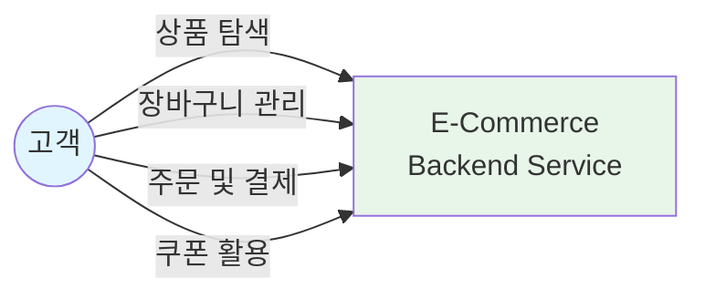
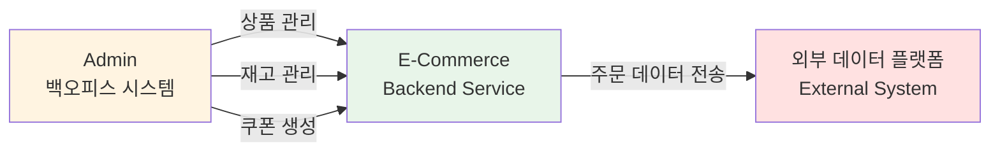
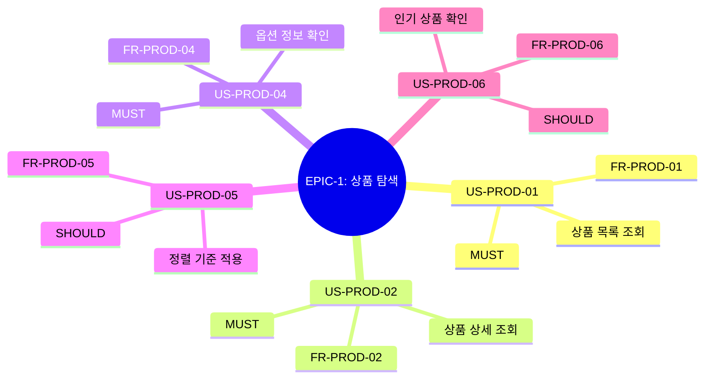
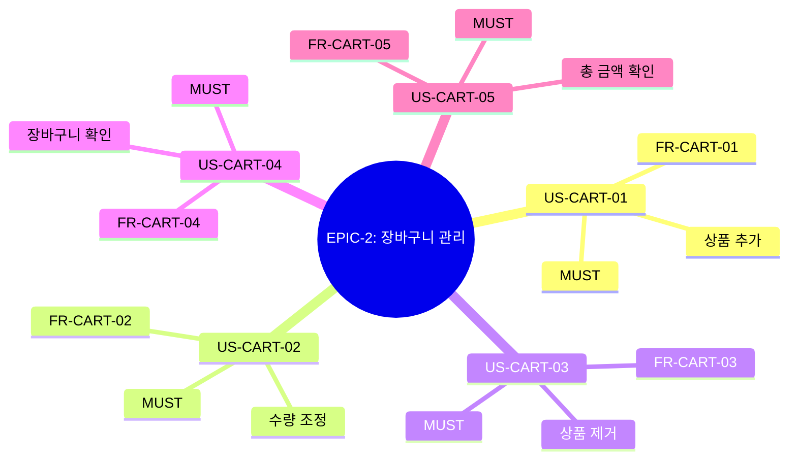
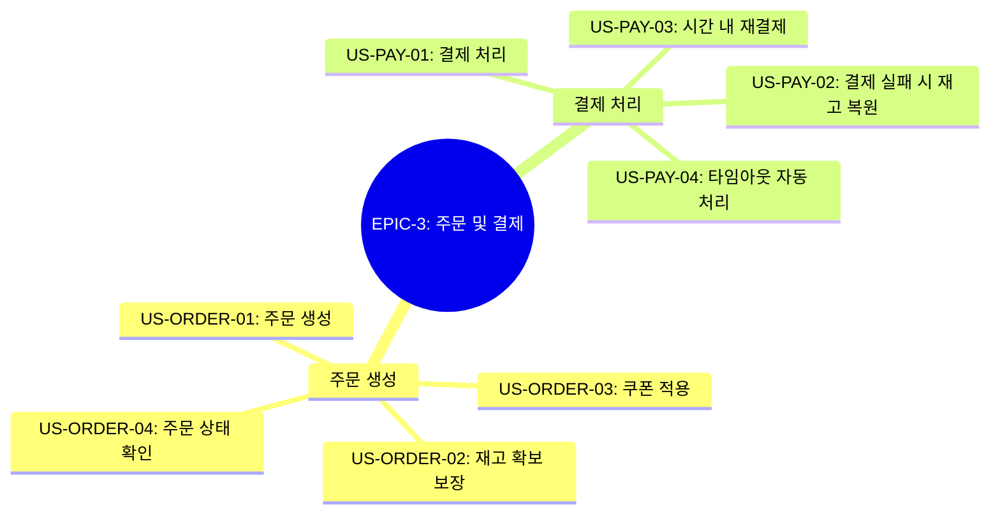
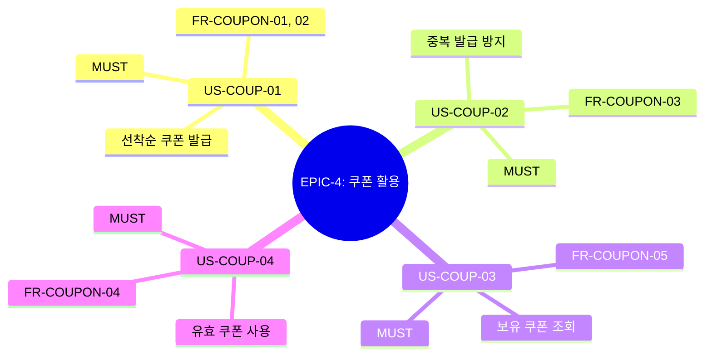
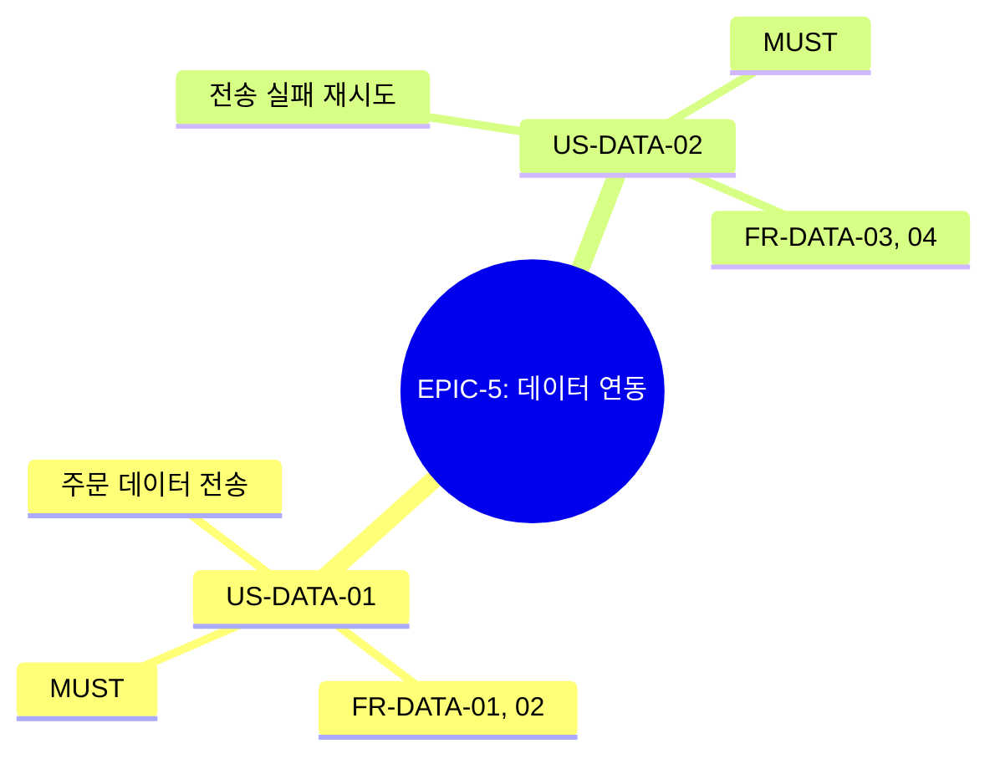
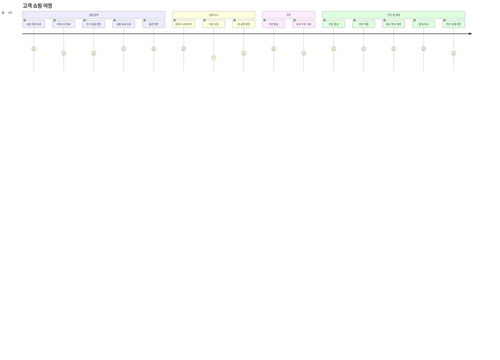

# 사용자 스토리

**버전**: 1.0.0
**최종 수정**: 2025-10-30
**상태**: Active

---

## 문서 네비게이션

**이전**: [← 요구사항 분석](../requirements.md)
**다음**: [API 명세서 →](api-specifications.md)

---

## 목차

1. [개요](#개요)
2. [액터](#액터)
3. [사용자 스토리 맵](#사용자-스토리-맵)
4. [EPIC-1: 상품 탐색](#epic-1-상품-탐색)
5. [EPIC-2: 장바구니 관리](#epic-2-장바구니-관리)
6. [EPIC-3: 주문 및 결제](#epic-3-주문-및-결제)
7. [EPIC-4: 쿠폰 활용](#epic-4-쿠폰-활용)
8. [EPIC-5: 데이터 연동](#epic-5-데이터-연동)
9. [사용자 여정](#사용자-여정)
10. [사용자 스토리 추적 매트릭스](#사용자-스토리-추적-매트릭스)

---

## 개요

### 사용자 스토리란?

사용자 스토리(User Story)는 소프트웨어 기능을 사용자 관점에서 간결하게 기술한 것입니다. "누가(Who), 무엇을(What), 왜(Why)" 하고 싶은지를 명확히 표현하여 개발팀이 비즈니스 가치를 이해하고 구현할 수 있도록 돕습니다.

**기본 형식**:
```
As a [Actor]
I want to [Action]
So that [Benefit]
```

### Epic 구조

본 문서는 5개의 Epic으로 구성됩니다:

| Epic | 설명 | 우선순위 |
|------|------|---------|
| **EPIC-1: 상품 탐색** | 고객이 상품을 검색하고 정보를 확인하는 기능 | MUST |
| **EPIC-2: 장바구니 관리** | 구매 전 상품을 장바구니에 담고 관리하는 기능 | MUST |
| **EPIC-3: 주문 및 결제** | 주문 생성, 결제 처리, 재고 관리 기능 | MUST |
| **EPIC-4: 쿠폰 활용** | 쿠폰 발급 및 사용 기능 | MUST |
| **EPIC-5: 데이터 연동** | 외부 시스템과 주문 데이터 연동 및 재시도 관리 | MUST |

---

## 액터

시스템과 상호작용하는 액터들을 정의합니다.

### 주요 액터 (Primary Actors)



#### 1. 고객 (Customer)

**설명**: E-Commerce 플랫폼을 이용하여 상품을 탐색하고 구매하는 최종 사용자

**목표**:
- 다양한 상품 탐색 및 검색
- 장바구니에 상품 추가 및 관리
- 주문 생성 및 결제 완료
- 쿠폰 발급 및 사용
- 주문 내역 조회

**특성**:
- 인증된 사용자 (로그인 필요)
- 개인별 장바구니 및 주문 이력 보유
- 쿠폰 발급 및 사용 가능

**관련 Epic**:
- EPIC-1: 상품 탐색
- EPIC-2: 장바구니 관리
- EPIC-3: 주문 및 결제
- EPIC-4: 쿠폰 활용

---

### 보조 액터 (Secondary Actors)



#### 2. Admin 백오피스 시스템 (외부 시스템)

**설명**: 상품, 재고, 쿠폰 등을 관리하는 관리자용 백오피스 시스템 (향후 별도 서비스로 분리 예정)

**역할**:
- 상품 등록/수정/삭제
- 재고 관리 (입고/출고)
- 쿠폰 생성 및 발급 설정
- 주문 관리 및 모니터링

**통신**:
- 내부 API 호출 (현재는 동일 서비스 내 구현)
- 향후 마이크로서비스로 분리 시 REST API 또는 gRPC

**관련 기능**:
- 상품 데이터 제공 (EPIC-1)
- 재고 데이터 제공 (EPIC-2, EPIC-3)
- 쿠폰 마스터 데이터 제공 (EPIC-4)

> **참고**: Admin 기능의 상세 요구사항은 [requirements_admin.md](requirements_admin.md)를 참조하세요.

---

#### 3. 외부 데이터 플랫폼 (External System)

**설명**: 주문 완료 후 데이터를 수신하는 외부 데이터 분석/마케팅 플랫폼

**역할**:
- 주문 데이터 수신
- 고객 행동 분석
- 마케팅 자동화

**통신**:
- Outbox Pattern을 통한 비동기 전송
- HTTP/REST API

**관련 요구사항**:
- [FR-DATA-01](requirements.md#fr-data-01-주문-데이터-전송)
- [FR-DATA-02](requirements.md#fr-data-02-전송-실패-격리)

---

## 사용자 스토리 맵

### 전체 Epic 구조

```mermaid
graph TB
    Customer([고객])

    Customer --> EPIC1[EPIC-1: 상품 탐색]
    Customer --> EPIC2[EPIC-2: 장바구니 관리]
    Customer --> EPIC3[EPIC-3: 주문 및 결제]
    Customer --> EPIC4[EPIC-4: 쿠폰 활용]
    Customer --> EPIC5[EPIC-5: 데이터 연동]

    EPIC1 --> US01[US-PROD-01<br/>상품 목록 조회]
    EPIC1 --> US02[US-PROD-02<br/>상품 상세 조회]
    EPIC1 --> US04[US-PROD-04<br/>옵션 정보 확인]
    EPIC1 --> US05[US-PROD-05<br/>정렬 기준 적용]
    EPIC1 --> US06[US-PROD-06<br/>인기 상품 확인]

    EPIC2 --> US11[US-CART-01<br/>상품 추가]
    EPIC2 --> US12[US-CART-02<br/>수량 조정]
    EPIC2 --> US13[US-CART-03<br/>상품 제거]
    EPIC2 --> US14[US-CART-04<br/>장바구니 확인]
    EPIC2 --> US15[US-CART-05<br/>총 금액 확인]

    EPIC3 --> US21[US-ORDER-01<br/>주문 생성]
    EPIC3 --> US22[US-ORDER-02<br/>재고 확보 보장]
    EPIC3 --> US23[US-ORDER-03<br/>쿠폰 적용]
    EPIC3 --> US24[US-ORDER-04<br/>주문 상태 확인]
    EPIC3 --> US25[US-PAY-01<br/>결제 처리]
    EPIC3 --> US26[US-PAY-02<br/>결제 실패 시 재고 복원]
    EPIC3 --> US27[US-PAY-03<br/>시간 내 재결제]
    EPIC3 --> US28[US-PAY-04<br/>타임아웃 자동 처리]

    EPIC4 --> US31[US-COUP-01<br/>선착순 쿠폰 발급]
    EPIC4 --> US32[US-COUP-02<br/>중복 발급 방지]
    EPIC4 --> US33[US-COUP-03<br/>보유 쿠폰 조회]
    EPIC4 --> US34[US-COUP-04<br/>유효 쿠폰 사용]

    EPIC5 --> US41[US-DATA-01<br/>주문 데이터 전송]
    EPIC5 --> US42[US-DATA-02<br/>전송 실패 재시도]

    style Customer fill:#e1f5ff
    style EPIC1 fill:#fff4e6
    style EPIC2 fill:#e8f5e9
    style EPIC3 fill:#f3e5f5
    style EPIC4 fill:#fce4ec
    style EPIC5 fill:#e3f2fd
```



---

## EPIC-1: 상품 탐색

고객이 다양한 상품을 탐색하고 원하는 상품을 찾을 수 있도록 지원하는 기능군입니다.



---

### US-PROD-01: 상품 목록 조회

| 항목 | 내용 |
|------|------|
| **스토리 ID** | US-PROD-01 |
| **스토리 명** | 상품 목록 조회 |
| **액터** | 고객 (Primary) |
| **Epic** | EPIC-1: 상품 탐색 |
| **관련 요구사항** | [FR-PROD-01](requirements.md#fr-prod-01-상품-목록-조회) |
| **우선순위** | MUST |

#### 스토리

**As a** 고객
**I want to** 모든 상품 목록을 한눈에 보고 싶다
**So that** 내가 원하는 상품을 빠르게 찾을 수 있다

#### 인수 조건 (Acceptance Criteria)

**정상 케이스:**
- [ ] **Given** 상품이 등록되어 있을 때, **When** 상품 목록 조회 요청 시, **Then** 페이지네이션된 상품 목록을 받는다
- [ ] **Given** 상품 목록이 50개일 때, **When** 페이지 크기 20으로 조회 시, **Then** 3페이지로 나누어 반환된다
- [ ] **Given** 각 상품 정보에는, **Then** 상품 ID, 이름, 가격, 카테고리, 재고 유무가 포함된다
- [ ] **Given** 조회 응답 시간은, **Then** 평균 200ms 이내여야 한다

**에러 케이스:**
- [ ] **Given** 잘못된 페이지 번호(음수 또는 0)일 때, **When** 조회 시, **Then** "유효하지 않은 페이지 번호입니다" (400 Bad Request)
- [ ] **Given** 잘못된 페이지 크기(0 이하 또는 100 초과)일 때, **When** 조회 시, **Then** "페이지 크기는 1-100 사이여야 합니다" (400 Bad Request)
- [ ] **Given** 잘못된 정렬 파라미터일 때, **When** 조회 시, **Then** "지원하지 않는 정렬 기준입니다" (400 Bad Request)

#### 비기능 요구사항

| 항목 | 요구사항 | 목표 |
|------|---------|------|
| **성능** | 평균 응답 시간 | < 200ms |
| **확장성** | 페이지네이션 지원 | 대용량 데이터 처리 |

---

### US-PROD-02: 상품 상세 조회

| 항목 | 내용 |
|------|------|
| **스토리 ID** | US-PROD-02 |
| **스토리 명** | 상품 상세 조회 |
| **액터** | 고객 (Primary) |
| **Epic** | EPIC-1: 상품 탐색 |
| **관련 요구사항** | [FR-PROD-02](requirements.md#fr-prod-02-상품-상세-조회) |
| **우선순위** | MUST |

#### 스토리

**As a** 고객
**I want to** 특정 상품의 상세 정보를 확인하고 싶다
**So that** 구매 결정에 필요한 모든 정보를 얻을 수 있다

#### 인수 조건 (Acceptance Criteria)

- [ ] **Given** 상품 ID를 입력할 때, **When** 상세 조회 요청 시, **Then** 상품 상세 정보를 받는다
- [ ] **Given** 상세 정보에는, **Then** 이름, 가격, 설명, 옵션 목록, 재고 상태가 포함된다
- [ ] **Given** 존재하지 않는 상품 ID일 때, **When** 조회 시, **Then** 404 에러를 반환한다
- [ ] **Given** 조회 응답 시간은, **Then** 평균 200ms 이내여야 한다

#### 비기능 요구사항

| 항목 | 요구사항 | 목표 |
|------|---------|------|
| **성능** | 평균 응답 시간 | < 200ms |
| **에러 처리** | 존재하지 않는 상품 | 404 NOT FOUND |

---

### US-PROD-04: 옵션 정보 확인

| 항목 | 내용 |
|------|------|
| **스토리 ID** | US-PROD-04 |
| **스토리 명** | 옵션 정보 확인 |
| **액터** | 고객 (Primary) |
| **Epic** | EPIC-1: 상품 탐색 |
| **관련 요구사항** | [FR-PROD-04](requirements.md#fr-prod-04-상품-옵션-조회) |
| **우선순위** | MUST |

#### 스토리

**As a** 고객
**I want to** 상품의 다양한 옵션(색상, 사이즈 등)을 확인하고 싶다
**So that** 내가 원하는 옵션이 재고가 있는지 알 수 있다

#### 인수 조건 (Acceptance Criteria)

**정상 케이스:**
- [ ] **Given** 상품 ID를 입력할 때, **When** 옵션 조회 시, **Then** 옵션 그룹별 옵션 목록을 받는다
- [ ] **Given** 각 옵션 정보에는, **Then** 옵션명, 옵션값, 추가 가격, 재고 상태가 포함된다
- [ ] **Given** 옵션 예시로, **Then** "색상: 빨강(+0원, 재고있음), 파랑(+0원, 재고있음)" 형식으로 표시된다
- [ ] **Given** 옵션이 품절일 때, **Then** 재고 상태가 "품절"로 표시된다

**에러 케이스:**
- [ ] **Given** 존재하지 않는 상품 ID일 때, **When** 옵션 조회 시, **Then** "상품을 찾을 수 없습니다" (404 Not Found)
- [ ] **Given** 옵션이 없는 상품일 때, **When** 옵션 조회 시, **Then** 빈 옵션 목록을 반환한다 (200 OK)

---

### US-PROD-05: 정렬 기준 적용

| 항목 | 내용 |
|------|------|
| **스토리 ID** | US-PROD-05 |
| **스토리 명** | 정렬 기준 적용 |
| **액터** | 고객 (Primary) |
| **Epic** | EPIC-1: 상품 탐색 |
| **관련 요구사항** | [FR-PROD-05](requirements.md#fr-prod-05-상품-정렬) |
| **우선순위** | SHOULD |

#### 스토리

**As a** 고객
**I want to** 상품 목록을 다양한 기준(가격, 인기, 최신)으로 정렬하고 싶다
**So that** 내 우선순위에 맞는 순서로 상품을 탐색할 수 있다

#### 인수 조건 (Acceptance Criteria)

**정상 케이스:**
- [ ] **Given** 정렬 기준을 "가격순"으로 선택할 때, **When** 조회 시, **Then** 가격 오름차순 또는 내림차순으로 정렬된다
- [ ] **Given** 정렬 기준을 "인기순"으로 선택할 때, **When** 조회 시, **Then** 판매량 기준 내림차순으로 정렬된다
- [ ] **Given** 정렬 기준을 "최신순"으로 선택할 때, **When** 조회 시, **Then** 등록일 기준 내림차순으로 정렬된다
- [ ] **Given** 정렬 기준을 지정하지 않을 때, **When** 조회 시, **Then** 기본값인 최신순으로 정렬된다

**에러 케이스:**
- [ ] **Given** 지원하지 않는 정렬 기준(예: "평점순")일 때, **When** 조회 시, **Then** "지원하지 않는 정렬 기준입니다" (400 Bad Request)
- [ ] **Given** 잘못된 정렬 방향(asc/desc 외)일 때, **When** 조회 시, **Then** "유효하지 않은 정렬 방향입니다" (400 Bad Request)

---

### US-PROD-06: 인기 상품 확인

| 항목 | 내용 |
|------|------|
| **스토리 ID** | US-PROD-06 |
| **스토리 명** | 인기 상품 확인 |
| **액터** | 고객 (Primary) |
| **Epic** | EPIC-1: 상품 탐색 |
| **관련 요구사항** | [FR-PROD-06](requirements.md#fr-prod-06-인기-상품-통계) |
| **우선순위** | SHOULD |

#### 스토리

**As a** 고객
**I want to** 최근 인기 있는 상품 Top 5를 확인하고 싶다
**So that** 트렌디한 상품을 빠르게 찾을 수 있다

#### 인수 조건 (Acceptance Criteria)

**정상 케이스:**
- [ ] **Given** 최근 3일간 주문 데이터가 있을 때, **When** 인기 상품 조회 시, **Then** 판매량 기준 Top 5를 받는다
- [ ] **Given** 인기 상품 정보에는, **Then** 순위, 상품 정보, 판매 수량, 매출액이 포함된다
- [ ] **Given** 캐시된 데이터를 사용할 때, **Then** 응답 시간은 100ms 이내여야 한다
- [ ] **Given** 캐시 갱신은, **Then** 백그라운드 배치 작업으로 10분마다 자동 수행된다 (배치 스케줄러)
- [ ] **Given** 캐시 TTL은, **Then** 15분으로 설정된다

**에러 케이스:**
- [ ] **Given** 캐시가 만료되고 백그라운드 갱신이 지연될 때, **When** 조회 시, **Then** DB에서 직접 조회하여 응답한다
- [ ] **Given** 최근 3일간 주문 데이터가 없을 때, **When** 인기 상품 조회 시, **Then** 빈 목록을 반환한다 (200 OK)

#### 비기능 요구사항

| 항목 | 요구사항 | 목표 |
|------|---------|------|
| **성능** | 캐시 응답 시간 | < 100ms |
| **배치 주기** | 통계 갱신 주기 | 10분마다 (시스템 자동 실행) |
| **캐시 TTL** | 캐시 만료 시간 | 15분 |

---

## EPIC-2: 장바구니 관리

고객이 구매 전 선택한 상품을 장바구니에 담고 관리할 수 있도록 지원하는 기능군입니다.



---

### US-CART-01: 장바구니에 상품 추가

| 항목 | 내용 |
|------|------|
| **스토리 ID** | US-CART-01 |
| **스토리 명** | 장바구니에 상품 추가 |
| **액터** | 고객 (Primary) |
| **Epic** | EPIC-2: 장바구니 관리 |
| **관련 요구사항** | [FR-CART-01](requirements.md#fr-cart-01-장바구니-상품-추가) |
| **우선순위** | MUST |

#### 스토리

**As a** 고객
**I want to** 마음에 드는 상품을 장바구니에 추가하고 싶다
**So that** 나중에 한꺼번에 주문할 수 있다

#### 인수 조건 (Acceptance Criteria)

**정상 케이스:**
- [ ] **Given** 상품 ID, 옵션 ID, 수량을 입력할 때, **When** 장바구니 추가 요청 시, **Then** 장바구니에 항목이 추가된다
- [ ] **Given** 재고가 충분할 때, **When** 추가 요청 시, **Then** 성공적으로 추가된다
- [ ] **Given** 동일 상품/옵션이 이미 장바구니에 있을 때, **When** 추가 요청 시, **Then** 기존 수량에 더해진다
- [ ] **Given** 장바구니 항목은, **Then** 세션 만료 후에도 영구 저장된다

**에러 케이스:**
- [ ] **Given** 존재하지 않는 상품 ID일 때, **When** 추가 요청 시, **Then** "상품을 찾을 수 없습니다" (404 Not Found)
- [ ] **Given** 존재하지 않는 옵션 ID일 때, **When** 추가 요청 시, **Then** "옵션을 찾을 수 없습니다" (404 Not Found)
- [ ] **Given** 수량이 0 이하일 때, **When** 추가 요청 시, **Then** "수량은 1 이상이어야 합니다" (400 Bad Request)
- [ ] **Given** 옵션이 필수인 상품에 옵션 없이 추가할 때, **When** 추가 요청 시, **Then** "옵션을 선택해주세요" (400 Bad Request)
- [ ] **Given** 재고가 부족할 때, **When** 추가 요청 시, **Then** "상품명 - 옵션명이 품절입니다" (409 Conflict)

#### 비기능 요구사항

| 항목 | 요구사항 | 목표 |
|------|---------|------|
| **성능** | 평균 응답 시간 | < 300ms |
| **데이터 지속성** | 영구 저장 | 세션 독립적 |

---

### US-CART-02: 수량 조정

| 항목 | 내용 |
|------|------|
| **스토리 ID** | US-CART-02 |
| **스토리 명** | 수량 조정 |
| **액터** | 고객 (Primary) |
| **Epic** | EPIC-2: 장바구니 관리 |
| **관련 요구사항** | [FR-CART-02](requirements.md#fr-cart-02-수량-변경) |
| **우선순위** | MUST |

#### 스토리

**As a** 고객
**I want to** 장바구니에 담긴 상품의 수량을 변경하고 싶다
**So that** 구매 수량을 유연하게 조절할 수 있다

#### 인수 조건 (Acceptance Criteria)

**정상 케이스:**
- [ ] **Given** 장바구니 항목 ID와 변경할 수량을 입력할 때, **When** 수량 변경 요청 시, **Then** 수량이 업데이트된다
- [ ] **Given** 재고가 충분할 때, **When** 수량 증가 시, **Then** 성공적으로 변경된다
- [ ] **Given** 응답 시간은, **Then** 평균 300ms 이내여야 한다

**에러 케이스:**
- [ ] **Given** 다른 사용자의 장바구니 항목일 때, **When** 수량 변경 요청 시, **Then** "권한이 없습니다" (403 Forbidden)
- [ ] **Given** 수량이 0 이하일 때, **When** 수량 변경 요청 시, **Then** "수량은 1 이상이어야 합니다" (400 Bad Request)
- [ ] **Given** 수량이 음수일 때, **When** 수량 변경 요청 시, **Then** "유효하지 않은 수량입니다" (400 Bad Request)
- [ ] **Given** 존재하지 않는 장바구니 항목 ID일 때, **When** 수량 변경 요청 시, **Then** "장바구니 항목을 찾을 수 없습니다" (404 Not Found)
- [ ] **Given** 재고가 부족할 때, **When** 수량 증가 시, **Then** "상품명 - 옵션명이 품절입니다" (409 Conflict)

---

### US-CART-03: 상품 제거

| 항목 | 내용 |
|------|------|
| **스토리 ID** | US-CART-03 |
| **스토리 명** | 상품 제거 |
| **액터** | 고객 (Primary) |
| **Epic** | EPIC-2: 장바구니 관리 |
| **관련 요구사항** | [FR-CART-03](requirements.md#fr-cart-03-상품-제거) |
| **우선순위** | MUST |

#### 스토리

**As a** 고객
**I want to** 장바구니에서 원하지 않는 상품을 제거하고 싶다
**So that** 구매하지 않을 상품을 정리할 수 있다

#### 인수 조건 (Acceptance Criteria)

**정상 케이스:**
- [ ] **Given** 장바구니 항목 ID를 입력할 때, **When** 제거 요청 시, **Then** 해당 항목이 삭제된다
- [ ] **Given** 제거 후, **When** 장바구니 조회 시, **Then** 삭제된 항목은 표시되지 않는다

**에러 케이스:**
- [ ] **Given** 다른 사용자의 장바구니 항목일 때, **When** 제거 요청 시, **Then** "권한이 없습니다" (403 Forbidden)
- [ ] **Given** 존재하지 않는 항목 ID일 때, **When** 제거 요청 시, **Then** "장바구니 항목을 찾을 수 없습니다" (404 Not Found)

---

### US-CART-04: 장바구니 확인

| 항목 | 내용 |
|------|------|
| **스토리 ID** | US-CART-04 |
| **스토리 명** | 장바구니 확인 |
| **액터** | 고객 (Primary) |
| **Epic** | EPIC-2: 장바구니 관리 |
| **관련 요구사항** | [FR-CART-04](requirements.md#fr-cart-04-장바구니-조회) |
| **우선순위** | MUST |

#### 스토리

**As a** 고객
**I want to** 내 장바구니에 담긴 모든 상품을 확인하고 싶다
**So that** 주문 전 구매 목록을 점검할 수 있다

#### 인수 조건 (Acceptance Criteria)

**정상 케이스:**
- [ ] **Given** 사용자가 로그인했을 때, **When** 장바구니 조회 시, **Then** 내 장바구니 항목 목록을 받는다
- [ ] **Given** 각 항목 정보에는, **Then** 상품 정보, 옵션, 수량, 단가, 소계, 재고 상태가 포함된다
- [ ] **Given** 조회 시, **Then** 최신 상품 정보와 재고 상태가 반영된다
- [ ] **Given** 응답 시간은, **Then** 평균 200ms 이내여야 한다

**에러 케이스:**
- [ ] **Given** 인증되지 않은 사용자일 때, **When** 장바구니 조회 시, **Then** "인증이 필요합니다" (401 Unauthorized)
- [ ] **Given** 장바구니에 담긴 상품이 삭제되었을 때, **When** 조회 시, **Then** 해당 항목은 "품절" 상태로 표시되거나 자동 제거된다

---

### US-CART-05: 총 금액 확인

| 항목 | 내용 |
|------|------|
| **스토리 ID** | US-CART-05 |
| **스토리 명** | 총 금액 확인 |
| **액터** | 고객 (Primary) |
| **Epic** | EPIC-2: 장바구니 관리 |
| **관련 요구사항** | [FR-CART-05](requirements.md#fr-cart-05-총-금액-계산) |
| **우선순위** | MUST |

#### 스토리

**As a** 고객
**I want to** 장바구니 총 금액을 확인하고 싶다
**So that** 예상 결제 금액을 미리 알 수 있다

#### 인수 조건 (Acceptance Criteria)

- [ ] **Given** 장바구니에 상품이 있을 때, **When** 조회 시, **Then** 총 금액이 계산되어 표시된다
- [ ] **Given** 총 금액 계산은, **Then** "(상품 가격 + 옵션 추가 가격) × 수량"의 합계로 계산된다
- [ ] **Given** 가격 계산은, **Then** 소수점 오차 없이 정확해야 한다
- [ ] **Given** 장바구니가 비어있을 때, **When** 조회 시, **Then** 총 금액은 0원이다

---

### US-CART-06: 장바구니 전체 비우기

| 항목 | 내용 |
|------|------|
| **스토리 ID** | US-CART-06 |
| **스토리 명** | 장바구니 전체 비우기 |
| **액터** | 고객 (Primary) |
| **Epic** | EPIC-2: 장바구니 관리 |
| **관련 요구사항** | [FR-CART-06](requirements.md#fr-cart-06-장바구니-전체-비우기) |
| **우선순위** | SHOULD |

#### 스토리

**As a** 고객
**I want to** 장바구니의 모든 상품을 한 번에 비우고 싶다
**So that** 개별적으로 삭제하지 않고 빠르게 장바구니를 정리할 수 있다

#### 인수 조건 (Acceptance Criteria)

**정상 케이스:**
- [ ] **Given** 장바구니에 여러 상품이 담겨 있을 때, **When** 전체 비우기 요청 시, **Then** 모든 항목이 삭제된다
- [ ] **Given** 전체 비우기 후, **When** 장바구니 조회 시, **Then** 빈 장바구니가 반환된다 (items: [], totalAmount: 0)
- [ ] **Given** 빈 장바구니일 때, **When** 전체 비우기 요청 시, **Then** 에러 없이 성공 응답을 반환한다
- [ ] **Given** 다른 사용자의 장바구니는, **Then** 영향을 받지 않는다

**에러 케이스:**
- [ ] **Given** 인증되지 않은 사용자일 때, **When** 전체 비우기 요청 시, **Then** "인증이 필요합니다" (401 Unauthorized)

#### 비기능 요구사항

| 항목 | 요구사항 | 목표 |
|------|---------|------|
| **성능** | 평균 응답 시간 | < 300ms |
| **격리성** | 사용자별 독립적 처리 | 다른 사용자에게 영향 없음 |

---

## EPIC-3: 주문 및 결제

고객이 장바구니 상품을 주문하고 결제할 수 있도록 지원하는 기능군입니다.



---

### US-ORDER-01: 주문 생성

| 항목 | 내용 |
|------|------|
| **스토리 ID** | US-ORDER-01 |
| **스토리 명** | 주문 생성 |
| **액터** | 고객 (Primary) |
| **Epic** | EPIC-3: 주문 및 결제 |
| **관련 요구사항** | [FR-ORDER-01](requirements.md#fr-order-01-주문-생성) |
| **우선순위** | MUST |

#### 스토리

**As a** 고객
**I want to** 장바구니의 모든 상품으로 주문을 생성하고 싶다
**So that** 결제를 진행할 수 있다

#### 인수 조건 (Acceptance Criteria)

**정상 케이스:**
- [ ] **Given** 장바구니에 상품이 담겨 있을 때, **When** 주문 생성 요청 시, **Then** 장바구니 전체 항목으로 주문이 생성되고 주문 ID를 받는다
- [ ] **Given** 주문 생성 시, **Then** 재고가 확인되고 확보된다 (US-ORDER-02 참조)
- [ ] **Given** 주문 생성 시, **Then** 주문 상태는 PENDING으로 설정된다
- [ ] **Given** 주문 생성 후, **Then** 장바구니는 유지된다 (결제 완료 시 비워짐)
- [ ] **Given** 응답 시간은, **Then** 평균 500ms 이내여야 한다

**에러 케이스:**
- [ ] **Given** 장바구니가 비어있을 때, **When** 주문 생성 요청 시, **Then** "주문할 상품을 선택해주세요" (400 Bad Request)

---

### US-ORDER-02: 재고 확보 보장

| 항목 | 내용 |
|------|------|
| **스토리 ID** | US-ORDER-02 |
| **스토리 명** | 재고 확보 보장 |
| **액터** | 고객 (Primary) |
| **Epic** | EPIC-3: 주문 및 결제 |
| **관련 요구사항** | [FR-ORDER-02](requirements.md#fr-order-02-재고-확인-및-확보) |
| **우선순위** | MUST |

#### 스토리

**As a** 고객
**I want to** 주문 생성 시 내 주문 수량만큼 재고가 확보되기를 원한다
**So that** 결제 전까지 다른 사람이 구매하지 못하도록 보장받을 수 있다

#### 인수 조건 (Acceptance Criteria)

- [ ] **Given** 주문 생성 시, **When** 재고 확인 시, **Then** 비관적 락(SELECT FOR UPDATE)으로 동시성을 제어한다
- [ ] **Given** 재고가 충분할 때, **When** 확보 요청 시, **Then** 재고가 확보 상태로 표시되고 10분 타이머가 시작된다
- [ ] **Given** 재고가 부족할 때, **When** 확보 요청 시, **Then** "상품명 - 옵션명이 품절입니다" 에러를 반환한다
- [ ] **Given** 재고가 확보되면, **Then** 다른 사용자에게는 해당 재고가 품절로 표시된다
- [ ] **Given** 재고 확보 후 10분이 경과하면, **Then** 시스템이 자동으로 재고를 복원한다 (1분마다 만료 확인)

---

### US-ORDER-03: 쿠폰 적용

| 항목 | 내용 |
|------|------|
| **스토리 ID** | US-ORDER-03 |
| **스토리 명** | 쿠폰 적용 |
| **액터** | 고객 (Primary) |
| **Epic** | EPIC-3: 주문 및 결제 |
| **관련 요구사항** | [FR-ORDER-03](requirements.md#fr-order-03-주문-금액-계산) |
| **우선순위** | MUST |

#### 스토리

**As a** 고객
**I want to** 주문 생성 시 보유한 쿠폰을 적용하고 싶다
**So that** 할인된 가격으로 결제할 수 있다

#### 인수 조건 (Acceptance Criteria)

**정상 케이스:**
- [ ] **Given** 쿠폰 ID를 입력할 때, **When** 주문 생성 시, **Then** 쿠폰 유효성이 검증된다
- [ ] **Given** 유효한 쿠폰일 때, **When** 주문 금액 계산 시, **Then** 할인이 적용된다
- [ ] **Given** 할인 계산은, **Then** "총 상품 금액 × (할인율 / 100)"로 계산된다
- [ ] **Given** 최종 결제 금액은, **Then** "총 상품 금액 - 할인 금액"으로 계산된다
- [ ] **Given** 금액 계산은, **Then** 소수점 오차 없이 정확해야 한다

**에러 케이스:**
- [ ] **Given** 존재하지 않는 쿠폰 ID일 때, **When** 주문 생성 시, **Then** "쿠폰을 찾을 수 없습니다" (404 Not Found)
- [ ] **Given** 다른 사용자의 쿠폰일 때, **When** 주문 생성 시, **Then** "권한이 없습니다" (403 Forbidden)
- [ ] **Given** 이미 사용한 쿠폰일 때, **When** 주문 생성 시, **Then** "이미 사용한 쿠폰입니다" (400 Bad Request)
- [ ] **Given** 만료된 쿠폰일 때, **When** 주문 생성 시, **Then** "쿠폰이 만료되었습니다" (400 Bad Request)
- [ ] **Given** 주문 금액이 쿠폰 최소 금액 미달일 때, **When** 주문 생성 시, **Then** "쿠폰 사용 최소 금액을 충족하지 못했습니다" (400 Bad Request)

---

### US-ORDER-04: 주문 상태 확인

| 항목 | 내용 |
|------|------|
| **스토리 ID** | US-ORDER-04 |
| **스토리 명** | 주문 상태 확인 |
| **액터** | 고객 (Primary) |
| **Epic** | EPIC-3: 주문 및 결제 |
| **관련 요구사항** | [FR-ORDER-04](requirements.md#fr-order-04-주문-상태-관리), [FR-ORDER-05](requirements.md#fr-order-05-주문-내역-조회) |
| **우선순위** | MUST |

#### 스토리

**As a** 고객
**I want to** 내 주문의 현재 상태를 확인하고 싶다
**So that** 주문 진행 상황을 알 수 있다

#### 인수 조건 (Acceptance Criteria)

**정상 케이스:**
- [ ] **Given** 주문 ID를 입력할 때, **When** 주문 조회 시, **Then** 주문 상태와 상세 정보를 받는다
- [ ] **Given** 주문 상태는, **Then** PENDING(결제 대기), COMPLETED(결제 완료), FAILED(결제 실패), CANCELLED(주문 취소), EXPIRED(재고 확보 만료) 중 하나다
- [ ] **Given** 주문 상세 정보에는, **Then** 주문 상품 목록, 결제 정보, 쿠폰 사용 정보가 포함된다
- [ ] **Given** 날짜 범위를 지정할 때, **When** 주문 목록 조회 시, **Then** 해당 기간의 주문 목록을 받는다
- [ ] **Given** 응답 시간은, **Then** 평균 200ms 이내여야 한다

**에러 케이스:**
- [ ] **Given** 다른 사용자의 주문 ID일 때, **When** 주문 조회 시, **Then** "권한이 없습니다" (403 Forbidden)
- [ ] **Given** 존재하지 않는 주문 ID일 때, **When** 주문 조회 시, **Then** "주문을 찾을 수 없습니다" (404 Not Found)
- [ ] **Given** 잘못된 날짜 범위(시작일 > 종료일)일 때, **When** 주문 목록 조회 시, **Then** "유효하지 않은 날짜 범위입니다" (400 Bad Request)

---

### US-PAY-01: 결제 처리

| 항목 | 내용 |
|------|------|
| **스토리 ID** | US-PAY-01 |
| **스토리 명** | 결제 처리 |
| **액터** | 고객 (Primary), 외부 데이터 플랫폼 (Secondary) |
| **Epic** | EPIC-3: 주문 및 결제 |
| **관련 요구사항** | [FR-PAYMENT-01](requirements.md#fr-payment-01-결제-처리), [FR-PAYMENT-02](requirements.md#fr-payment-02-재고-차감) |
| **우선순위** | MUST |

#### 스토리

**As a** 고객
**I want to** 생성한 주문에 대해 결제를 완료하고 싶다
**So that** 상품을 구매할 수 있다

#### 인수 조건 (Acceptance Criteria)

**정상 케이스:**
- [ ] **Given** 주문 ID를 입력할 때, **When** 결제 요청 시, **Then** 결제가 처리되고 결제 완료 상태를 받는다
- [ ] **Given** 주문 상태가 PENDING일 때, **When** 결제 요청 시, **Then** 결제가 진행된다
- [ ] **Given** 재고 확보 후 10분 이내일 때, **When** 결제 요청 시, **Then** 결제가 허용된다
- [ ] **Given** 결제 성공 시, **Then** 확보된 재고가 실제 차감되고 주문 상태가 COMPLETED로 변경된다
- [ ] **Given** 결제 완료 시, **Then** 사용자의 장바구니가 자동으로 비워진다
- [ ] **Given** 결제 완료 시, **Then** 주문 데이터가 외부 데이터 플랫폼으로 비동기 전송된다 (Outbox Pattern)
- [ ] **Given** 결제 실패 시, **Then** 확보된 재고가 복원되고 주문 상태가 FAILED로 변경된다
- [ ] **Given** 결제 실패 시, **Then** 장바구니는 유지된다 (재주문 가능)
- [ ] **Given** 응답 시간은, **Then** 평균 1초 이내여야 한다

**에러 케이스:**
- [ ] **Given** 주문 상태가 이미 COMPLETED일 때, **When** 결제 요청 시, **Then** "이미 결제 완료된 주문입니다" (400 Bad Request)
- [ ] **Given** 주문 상태가 CANCELLED일 때, **When** 결제 요청 시, **Then** "취소된 주문은 결제할 수 없습니다" (400 Bad Request)
- [ ] **Given** 주문 상태가 EXPIRED일 때, **When** 결제 요청 시, **Then** "주문이 만료되었습니다" (400 Bad Request)
- [ ] **Given** 재고 확보가 만료되었을 때, **When** 결제 요청 시, **Then** "재고 확보가 만료되었습니다" (400 Bad Request)
- [ ] **Given** 다른 사용자의 주문일 때, **When** 결제 요청 시, **Then** "권한이 없습니다" (403 Forbidden)

#### 시스템 액터 참여

- **외부 데이터 플랫폼**: 결제 완료 후 주문 데이터를 수신 (비동기, 전송 실패가 주문을 차단하지 않음)

---

### US-PAY-02: 결제 실패 시 재고 복원

| 항목 | 내용 |
|------|------|
| **스토리 ID** | US-PAY-02 |
| **스토리 명** | 결제 실패 시 재고 복원 |
| **액터** | 고객 (Primary) |
| **Epic** | EPIC-3: 주문 및 결제 |
| **관련 요구사항** | [FR-PAYMENT-03](requirements.md#fr-payment-03-재고-복원) |
| **우선순위** | MUST |

#### 스토리

**As a** 고객
**I want to** 결제에 실패하거나 취소했을 때 확보된 재고가 자동으로 복원되기를 원한다
**So that** 다른 고객이 해당 상품을 구매할 수 있다

#### 인수 조건 (Acceptance Criteria)

- [ ] **Given** 결제 실패 시, **When** 프로세스 완료 후, **Then** 확보된 재고가 즉시 복원된다
- [ ] **Given** 사용자가 결제를 취소할 때, **When** 취소 요청 시, **Then** 확보된 재고가 복원되고 주문 상태가 CANCELLED로 변경된다
- [ ] **Given** 재고 복원 후, **Then** 다른 사용자가 해당 재고를 구매할 수 있다
- [ ] **Given** 재고 복원 응답 시간은, **Then** 평균 100ms 이내여야 한다

---

### US-PAY-03: 시간 내 재결제

| 항목 | 내용 |
|------|------|
| **스토리 ID** | US-PAY-03 |
| **스토리 명** | 시간 내 재결제 |
| **액터** | 고객 (Primary) |
| **Epic** | EPIC-3: 주문 및 결제 |
| **관련 요구사항** | [FR-PAYMENT-04](requirements.md#fr-payment-04-결제-재시도) |
| **우선순위** | MUST |

#### 스토리

**As a** 고객
**I want to** 결제 실패 후 10분 이내에 재결제를 시도하고 싶다
**So that** 재고를 다시 확보하지 않고 바로 결제할 수 있다

#### 인수 조건 (Acceptance Criteria)

**정상 케이스:**
- [ ] **Given** 주문 상태가 FAILED일 때, **When** 재고 확보 후 10분 이내에 재결제 요청 시, **Then** 재결제가 허용된다
- [ ] **Given** 주문 상태가 PENDING일 때, **When** 재고 확보 후 10분 이내에 재결제 요청 시, **Then** 재결제가 허용된다

**에러 케이스:**
- [ ] **Given** 주문 상태가 이미 COMPLETED일 때, **When** 재결제 요청 시, **Then** "이미 결제 완료된 주문입니다" (400 Bad Request)
- [ ] **Given** 재고 확보 후 10분이 경과했을 때, **When** 재결제 요청 시, **Then** "재고 확보가 만료되었습니다. 새로 주문을 생성해주세요" (400 Bad Request)

---

### US-PAY-04: 타임아웃 자동 처리

| 항목 | 내용 |
|------|------|
| **스토리 ID** | US-PAY-04 |
| **스토리 명** | 타임아웃 자동 처리 |
| **액터** | 시스템 (자동 처리) |
| **Epic** | EPIC-3: 주문 및 결제 |
| **관련 요구사항** | [FR-PAYMENT-03](requirements.md#fr-payment-03-재고-복원) |
| **우선순위** | MUST |

#### 스토리

**As a** 시스템
**I want to** 재고 확보 후 10분이 지난 주문을 자동으로 만료시키고 싶다
**So that** 재고가 무한정 점유되지 않고 다른 고객에게 기회가 돌아간다

#### 인수 조건 (Acceptance Criteria)

- [ ] **Given** 재고 확보 후 10분이 경과하면, **When** 배치 작업 실행 시, **Then** 주문 상태가 EXPIRED로 변경된다
- [ ] **Given** 주문이 만료되면, **Then** 확보된 재고가 자동으로 복원된다
- [ ] **Given** 배치 작업은, **Then** 1분마다 실행되어 만료된 주문을 확인한다
- [ ] **Given** 만료 기준은, **Then** 재고 확보 시간으로부터 10분(600초) 경과 여부다

#### 비기능 요구사항

| 항목 | 요구사항 | 목표 |
|------|---------|------|
| **배치 주기** | 만료 확인 주기 | 1분마다 (시스템 자동 실행) |
| **만료 기준** | 재고 확보 유지 시간 | 10분 (600초) |

---

## EPIC-4: 쿠폰 활용

고객이 쿠폰을 발급받고 사용하여 할인 혜택을 받을 수 있도록 지원하는 기능군입니다.



---

### US-COUP-01: 선착순 쿠폰 발급

| 항목 | 내용 |
|------|------|
| **스토리 ID** | US-COUP-01 |
| **스토리 명** | 선착순 쿠폰 발급 |
| **액터** | 고객 (Primary), Admin 백오피스 (Secondary) |
| **Epic** | EPIC-4: 쿠폰 활용 |
| **관련 요구사항** | [FR-COUPON-01](requirements.md#fr-coupon-01-선착순-쿠폰-발급-받기), [FR-COUPON-02](requirements.md#fr-coupon-02-발급-수량-제한) |
| **우선순위** | MUST |

#### 스토리

**As a** 고객
**I want to** 한정 수량 쿠폰을 선착순으로 발급받고 싶다
**So that** 할인 혜택을 받을 수 있다

#### 인수 조건 (Acceptance Criteria)

**정상 케이스:**
- [ ] **Given** 쿠폰 ID를 입력할 때, **When** 쿠폰 발급 요청 시, **Then** 쿠폰이 발급되고 쿠폰 정보를 받는다
- [ ] **Given** 쿠폰 발급 가능 수량이 남아있을 때, **When** 발급 요청 시, **Then** 성공적으로 발급된다
- [ ] **Given** 100명이 100개 한정 쿠폰을 동시 요청할 때, **When** 비관적 락으로 동시성 제어 시, **Then** 정확히 100명만 성공한다
- [ ] **Given** 응답 시간은, **Then** 평균 300ms 이내여야 한다 (동시성 제어 포함)

**에러 케이스:**
- [ ] **Given** 존재하지 않는 쿠폰 ID일 때, **When** 발급 요청 시, **Then** "쿠폰을 찾을 수 없습니다" (404 Not Found)
- [ ] **Given** 쿠폰 발급 기간이 아닐 때(시작 전/종료 후), **When** 발급 요청 시, **Then** "쿠폰 발급 기간이 아닙니다" (400 Bad Request)
- [ ] **Given** 쿠폰 발급 수량이 소진되었을 때, **When** 발급 요청 시, **Then** "쿠폰이 모두 소진되었습니다" (409 Conflict)

#### 비기능 요구사항

| 항목 | 요구사항 | 목표 |
|------|---------|------|
| **성능** | 평균 응답 시간 (동시성 제어 포함) | < 300ms |
| **동시성** | 수량 정합성 보장 | 비관적 락 (SELECT FOR UPDATE) |
| **정확성** | 발급 수량 제한 | 정확히 제한 수량만 발급 |

#### 시스템 액터 참여

- **Admin 백오피스**: 쿠폰 마스터 데이터 생성 및 발급 설정 제공

---

### US-COUP-02: 중복 발급 방지

| 항목 | 내용 |
|------|------|
| **스토리 ID** | US-COUP-02 |
| **스토리 명** | 중복 발급 방지 |
| **액터** | 고객 (Primary) |
| **Epic** | EPIC-4: 쿠폰 활용 |
| **관련 요구사항** | [FR-COUPON-03](requirements.md#fr-coupon-03-1인-1매-제한) |
| **우선순위** | MUST |

#### 스토리

**As a** 고객
**I want to** 동일한 쿠폰을 1인 1매만 발급받을 수 있기를 원한다
**So that** 공정한 쿠폰 분배가 보장된다

#### 인수 조건 (Acceptance Criteria)

- [ ] **Given** 동일한 쿠폰을 이미 발급받았을 때, **When** 재발급 요청 시, **Then** "이미 발급받은 쿠폰입니다" 에러를 반환한다
- [ ] **Given** 발급 전, **Then** 사용자별 쿠폰 발급 이력이 조회된다
- [ ] **Given** 중복 발급 확인은, **Then** 쿠폰 ID와 사용자 ID 조합으로 검증된다

---

### US-COUP-03: 보유 쿠폰 조회

| 항목 | 내용 |
|------|------|
| **스토리 ID** | US-COUP-03 |
| **스토리 명** | 보유 쿠폰 조회 |
| **액터** | 고객 (Primary) |
| **Epic** | EPIC-4: 쿠폰 활용 |
| **관련 요구사항** | [FR-COUPON-05](requirements.md#fr-coupon-05-보유-쿠폰-조회) |
| **우선순위** | MUST |

#### 스토리

**As a** 고객
**I want to** 내가 보유한 쿠폰 목록을 확인하고 싶다
**So that** 사용 가능한 쿠폰을 알 수 있다

#### 인수 조건 (Acceptance Criteria)

**정상 케이스:**
- [ ] **Given** 사용자가 로그인했을 때, **When** 보유 쿠폰 조회 시, **Then** 내 쿠폰 목록을 받는다
- [ ] **Given** 각 쿠폰 정보에는, **Then** 쿠폰명, 할인율, 상태, 만료일이 포함된다
- [ ] **Given** 쿠폰 목록은, **Then** 사용 가능/사용 완료/만료 상태로 필터링할 수 있다
- [ ] **Given** 조회 결과에는, **Then** 사용 가능한 쿠폰 수가 포함된다
- [ ] **Given** 응답 시간은, **Then** 평균 100ms 이내여야 한다

**에러 케이스:**
- [ ] **Given** 인증되지 않은 사용자일 때, **When** 쿠폰 조회 시, **Then** "인증이 필요합니다" (401 Unauthorized)

---

### US-COUP-04: 유효한 쿠폰만 사용

| 항목 | 내용 |
|------|------|
| **스토리 ID** | US-COUP-04 |
| **스토리 명** | 유효한 쿠폰만 사용 |
| **액터** | 고객 (Primary) |
| **Epic** | EPIC-4: 쿠폰 활용 |
| **관련 요구사항** | [FR-COUPON-04](requirements.md#fr-coupon-04-쿠폰-유효성-검증) |
| **우선순위** | MUST |

#### 스토리

**As a** 고객
**I want to** 주문 시 유효한 쿠폰만 사용할 수 있기를 원한다
**So that** 만료되거나 이미 사용한 쿠폰으로 혼란이 생기지 않는다

#### 인수 조건 (Acceptance Criteria)

- [ ] **Given** 주문 생성 시, **When** 쿠폰 ID를 입력할 때, **Then** 쿠폰 유효성이 검증된다
- [ ] **Given** 쿠폰 유효성 검증 항목은, **Then** 쿠폰 존재 여부, 사용자 보유 여부, 유효 기간, 사용 여부(AVAILABLE 상태)다
- [ ] **Given** 유효 기간 검증은, **Then** "시작일 ≤ 현재 ≤ 만료일"로 확인된다
- [ ] **Given** 유효하지 않은 쿠폰일 때, **When** 사용 요청 시, **Then** 적절한 에러 메시지를 반환한다
- [ ] **Given** 쿠폰 사용 후, **Then** 쿠폰 상태가 USED로 변경되어 재사용이 불가능하다

---

## EPIC-5: 데이터 연동

시스템이 외부 데이터 플랫폼과 주문 데이터를 연동하고, 전송 실패 시 재시도하는 기능군입니다.



---

### US-DATA-01: 주문 데이터 전송

| 항목 | 내용 |
|------|------|
| **스토리 ID** | US-DATA-01 |
| **스토리 명** | 주문 데이터 전송 |
| **액터** | 시스템 (Primary), 외부 데이터 플랫폼 (Secondary) |
| **Epic** | EPIC-5: 데이터 연동 |
| **관련 요구사항** | [FR-DATA-01](../requirements.md#fr-data-01-주문-데이터-전송), [FR-DATA-02](../requirements.md#fr-data-02-전송-실패-격리) |
| **우선순위** | MUST |

#### 스토리

**As a** 시스템
**I want to** 결제 완료된 주문 데이터를 외부 데이터 플랫폼으로 전송하고 싶다
**So that** 외부 시스템에서 주문 데이터를 분석하고 활용할 수 있다

#### 인수 조건 (Acceptance Criteria)

**정상 케이스:**
- [ ] **Given** 주문 상태가 COMPLETED로 변경되면, **When** 트랜잭션 커밋 시, **Then** Outbox 테이블에 전송 데이터가 저장된다
- [ ] **Given** Outbox 테이블에 PENDING 상태 데이터가 있을 때, **When** 배치 워커 실행 시, **Then** 외부 데이터 플랫폼으로 전송한다
- [ ] **Given** 전송 데이터에는, **Then** 주문 ID, 주문 상품 목록, 결제 금액, 주문 일시가 포함된다
- [ ] **Given** 전송이 성공하면, **Then** Outbox 상태를 SUCCESS로 변경하고 전송 일시를 기록한다
- [ ] **Given** 외부 전송 실패 시, **Then** 주문 프로세스는 정상적으로 완료되어야 한다 (격리)

**에러 케이스:**
- [ ] **Given** Outbox 데이터 저장이 실패할 때, **When** 트랜잭션 커밋 시, **Then** 전체 트랜잭션이 롤백되고 주문도 실패 처리된다
- [ ] **Given** 외부 API 호출이 타임아웃될 때, **When** 전송 시, **Then** Outbox 상태를 FAILED로 변경하고 재시도 대기 상태로 전환한다
- [ ] **Given** 외부 API가 에러 응답(4xx, 5xx)을 반환할 때, **When** 전송 시, **Then** Outbox 상태를 FAILED로 변경하고 에러 메시지를 기록한다
- [ ] **Given** 전송이 실패하면, **Then** Outbox 상태를 FAILED로 변경하고 시도 횟수를 증가시킨다

#### 비기능 요구사항

| 항목 | 요구사항 | 목표 |
|------|---------|------|
| **격리성** | 전송 실패가 주문 차단하지 않음 | Outbox Pattern |
| **신뢰성** | 최소 1회 전송 보장 | 재시도 메커니즘 |
| **추적성** | 전송 이력 기록 | 모든 시도 로그 |

> **참고**: 시스템은 Outbox 테이블을 폴링하여 PENDING 데이터를 외부 데이터 플랫폼으로 자동 전송합니다.

---

### US-DATA-02: 전송 실패 재시도

| 항목 | 내용 |
|------|------|
| **스토리 ID** | US-DATA-02 |
| **스토리 명** | 전송 실패 재시도 |
| **액터** | 시스템 (자동 처리) |
| **Epic** | EPIC-5: 데이터 연동 |
| **관련 요구사항** | [FR-DATA-03](../requirements.md#fr-data-03-전송-재시도), [FR-DATA-04](../requirements.md#fr-data-04-전송-이력-관리) |
| **우선순위** | MUST |

#### 스토리

**As a** 시스템
**I want to** 전송 실패한 주문 데이터를 자동으로 재시도하고 싶다
**So that** 일시적인 네트워크 오류로 인한 데이터 누락을 방지할 수 있다

#### 인수 조건 (Acceptance Criteria)

- [ ] **Given** Outbox 상태가 FAILED인 데이터가 있을 때, **When** 시스템 재시도 작업 실행 시, **Then** 재전송을 시도한다
- [ ] **Given** 재시도 전략은, **Then** Exponential Backoff 방식을 사용한다 (1분, 2분, 4분 간격)
- [ ] **Given** 최대 재시도 횟수는, **Then** 3회로 제한된다
- [ ] **Given** 3회 재시도 후에도 실패하면, **Then** 상태를 FAILED_PERMANENT로 변경하고 알림을 발송한다
- [ ] **Given** 재시도가 성공하면, **Then** 상태를 SUCCESS로 변경하고 전송 일시를 기록한다
- [ ] **Given** 모든 전송 시도는, **Then** 이력 테이블에 기록된다 (시도 시간, 결과, 에러 메시지)

#### 비기능 요구사항

| 항목 | 요구사항 | 목표 |
|------|---------|------|
| **배치 주기** | 재시도 확인 주기 | 1분마다 (시스템 자동 실행) |
| **재시도 전략** | Exponential Backoff | 1분 → 2분 → 4분 |
| **최대 재시도** | 재시도 횟수 제한 | 3회 |
| **알림** | 최종 실패 시 알림 | 모니터링 시스템 연동 |

---

## 사용자 여정

고객의 전형적인 쇼핑 여정을 시각화합니다.



---

## 사용자 스토리 추적 매트릭스

| 스토리 ID | 스토리 제목 | Epic | 액터 | 요구사항 ID | 우선순위 | 상태 |
|----------|-----------|------|------|-----------|---------|------|
| **US-PROD-01** | 상품 목록 조회 | EPIC-1 | 고객 | FR-PROD-01 | MUST | ⏳ 대기 |
| **US-PROD-02** | 상품 상세 조회 | EPIC-1 | 고객 | FR-PROD-02 | MUST | ⏳ 대기 |
| **US-PROD-04** | 옵션 정보 확인 | EPIC-1 | 고객 | FR-PROD-04 | MUST | ⏳ 대기 |
| **US-PROD-05** | 정렬 기준 적용 | EPIC-1 | 고객 | FR-PROD-05 | SHOULD | ⏳ 대기 |
| **US-PROD-06** | 인기 상품 확인 | EPIC-1 | 고객 | FR-PROD-06 | SHOULD | ⏳ 대기 |
| **US-CART-01** | 장바구니에 상품 추가 | EPIC-2 | 고객 | FR-CART-01 | MUST | ⏳ 대기 |
| **US-CART-02** | 수량 조정 | EPIC-2 | 고객 | FR-CART-02 | MUST | ⏳ 대기 |
| **US-CART-03** | 상품 제거 | EPIC-2 | 고객 | FR-CART-03 | MUST | ⏳ 대기 |
| **US-CART-04** | 장바구니 확인 | EPIC-2 | 고객 | FR-CART-04 | MUST | ⏳ 대기 |
| **US-CART-05** | 총 금액 확인 | EPIC-2 | 고객 | FR-CART-05 | MUST | ⏳ 대기 |
| **US-ORDER-01** | 주문 생성 | EPIC-3 | 고객 | FR-ORDER-01 | MUST | ⏳ 대기 |
| **US-ORDER-02** | 재고 확보 보장 | EPIC-3 | 고객 | FR-ORDER-02 | MUST | ⏳ 대기 |
| **US-ORDER-03** | 쿠폰 적용 | EPIC-3 | 고객 | FR-ORDER-03 | MUST | ⏳ 대기 |
| **US-ORDER-04** | 주문 상태 확인 | EPIC-3 | 고객 | FR-ORDER-04, 05 | MUST | ⏳ 대기 |
| **US-PAY-01** | 결제 처리 | EPIC-3 | 고객, 외부 플랫폼 | FR-PAYMENT-01, 02 | MUST | ⏳ 대기 |
| **US-PAY-02** | 결제 실패 시 재고 복원 | EPIC-3 | 고객 | FR-PAYMENT-03 | MUST | ⏳ 대기 |
| **US-PAY-03** | 시간 내 재결제 | EPIC-3 | 고객 | FR-PAYMENT-04 | MUST | ⏳ 대기 |
| **US-PAY-04** | 타임아웃 자동 처리 | EPIC-3 | 시스템 | FR-PAYMENT-03 | MUST | ⏳ 대기 |
| **US-COUP-01** | 선착순 쿠폰 발급 | EPIC-4 | 고객, Admin | FR-COUPON-01, 02 | MUST | ⏳ 대기 |
| **US-COUP-02** | 중복 발급 방지 | EPIC-4 | 고객 | FR-COUPON-03 | MUST | ⏳ 대기 |
| **US-COUP-03** | 보유 쿠폰 조회 | EPIC-4 | 고객 | FR-COUPON-05 | MUST | ⏳ 대기 |
| **US-COUP-04** | 유효 쿠폰 사용 | EPIC-4 | 고객 | FR-COUPON-04 | MUST | ⏳ 대기 |
| **US-DATA-01** | 주문 데이터 전송 | EPIC-5 | 시스템, 외부 플랫폼 | FR-DATA-01, 02 | MUST | ⏳ 대기 |
| **US-DATA-02** | 전송 실패 재시도 | EPIC-5 | 시스템 | FR-DATA-03, 04 | MUST | ⏳ 대기 |

**총 스토리 수**: 24개

**범례**:
- ⏳ 대기
- 🚧 진행 중
- ✅ 완료

---

## 관련 문서

- **이전**: [← 요구사항 분석](../requirements.md)
- **다음**: [API 명세서 →](api-specifications.md)
- **Admin 요구사항**: [Admin 요구사항 분석 (별도 서비스)](../requirements_admin.md)
- **구현 흐름**: [시퀀스 다이어그램](sequence-diagrams.md)

---

**버전 이력**:
- 1.0.0 (2025-10-30): 초기 사용자 스토리 문서 작성
