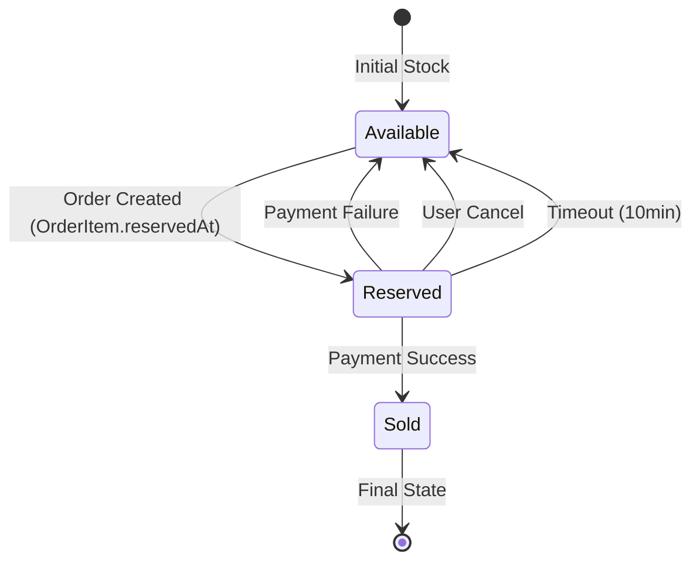

# Issue #004: Data Model Simplification Based on Feedback

## Issue Information

- **Issue Number**: #004
- **Type**: Refactoring / Documentation
- **Status**: Completed
- **Created**: 2025-11-02
- **Completed**: 2025-11-02
- **Related Issue**: #003

---

## Problem Statement

Following the initial data model design in Issue #003, feedback was received regarding the complexity of certain entities and the use of database triggers. The current design has 15 entities including `ProductOptionGroup` and `StockReservation`, and relies on database triggers for business logic enforcement.

**Key Feedback Points**:
1. **Remove Database Triggers**: Move business logic (stock validation, order status transitions) to application layer using FSM patterns and framework validation
2. **Simplify Option Structure**: Remove `ProductOptionGroup` entity and use a simpler 2-tier structure (Product → ProductOption) with a `type` field for grouping
3. **Redesign Stock Management**: Separate available/reserved/sold quantities and move reservation logic to application layer (remove `StockReservation` table)

---

## Objectives

1. Eliminate database triggers and replace with application-level patterns
2. Remove `ProductOptionGroup` entity and simplify option model
3. Remove `StockReservation` entity and track reservations in `OrderItem`
4. Redesign `Stock` entity to separate quantity types (available/reserved/sold)
5. Update all four dashboard specification documents consistently
6. Maintain data integrity using CHECK constraints instead of triggers
7. Update terminology from "재고 확보" (stock securing) to "재고 예약" (stock reservation)

---

## Work Completed

### 1. Data Model Refactoring

**File**: `/docs/dev/dashboard/data-model.md`

**Changes**:

#### Entity Count Reduction
- **Before**: 15 entities
- **After**: 13 entities
- **Removed**: `ProductOptionGroup`, `StockReservation`

#### ProductOption Simplification
**Before**:
```
Product (1) → (N) ProductOptionGroup (1) → (N) ProductOption
```

**After**:
```
Product (1) → (N) ProductOption
```

- Added `type` field to `ProductOption` (e.g., "색상", "사이즈")
- Removed `groupId`, added `productId` directly
- UI groups options by `type` field

#### Stock Entity Redesign
**Before**:
- Single `quantity` field
- Separate `StockReservation` table for tracking reservations
- Database triggers for validation

**After**:
```typescript
Stock {
  totalQuantity: int       // Total inventory (immutable)
  availableQuantity: int   // Available for sale
  reservedQuantity: int    // Reserved (order created, not paid)
  soldQuantity: int        // Sold (payment completed)
}
// Constraint: totalQuantity = available + reserved + sold
```

#### OrderItem Enhancement
Added reservation tracking fields:
- `stockId`: References Stock for reservation
- `reservedAt`: Timestamp when stock was reserved
- `reservationExpiresAt`: Expiration time (reservedAt + 10 minutes)

#### Trigger Removal Strategy
**Order Status Transitions**:
```typescript
// Before: Database trigger
// After: FSM Pattern in application

const ALLOWED_TRANSITIONS = {
  PENDING: ['COMPLETED', 'FAILED', 'EXPIRED', 'CANCELLED'],
  FAILED: [],
  COMPLETED: ['CANCELLED'],
  CANCELLED: [],
  EXPIRED: []
};

function validateStatusTransition(current, next) {
  if (!ALLOWED_TRANSITIONS[current]?.includes(next)) {
    throw new Error(`Invalid transition: ${current} -> ${next}`);
  }
}
```

**Stock Quantity Validation**:
```sql
-- Before: Trigger for negative check
-- After: CHECK constraint + application validation

ALTER TABLE Stock ADD CONSTRAINT chk_stock_quantities CHECK (
  totalQuantity = availableQuantity + reservedQuantity + soldQuantity
  AND availableQuantity >= 0
  AND reservedQuantity >= 0
  AND soldQuantity >= 0
);
```

#### Batch Job Updates
**Before**: Query `StockReservation` table
```sql
SELECT * FROM StockReservation WHERE expiresAt < NOW();
```

**After**: Query `OrderItem` with `Order` status
```sql
SELECT oi.*, o.id as orderId
FROM OrderItem oi
JOIN Order o ON oi.orderId = o.id
WHERE o.status = 'PENDING'
  AND oi.reservationExpiresAt < NOW();
```

#### ERD Updates
- Updated all Mermaid diagrams to reflect 13-entity model
- Removed `ProductOptionGroup` and `StockReservation` nodes
- Updated relationship cardinalities
- Added new fields to affected entities

**Statistics**:
- Lines modified: 492 changes
- Sections updated: Entity definitions, ERD diagrams, concurrency control, batch jobs
- Version: 1.0.0 → 1.1.0

---

### 2. Requirements Document Updates

**File**: `/docs/dev/dashboard/requirements.md`

**Changes**:

#### Terminology Updates
- Changed all occurrences: "재고 확보" → "재고 예약"
- Updated error messages and status descriptions

#### FR-PROD-03: Product Option Retrieval
**Before**: Query option groups with nested options
**After**: Query flat option list, group by `type` in application/UI

```markdown
- 처리 과정:
  1. 상품에 연결된 옵션 조회 (type 필드로 그룹화)
  2. 각 옵션의 재고 상태 조회 (availableQuantity 기준)
  3. 옵션별 추가 가격 조회
```

#### FR-ORDER-02: Stock Reservation
**Before**:
- Check quantity, create StockReservation record
- Use database trigger for validation

**After**:
```markdown
- 처리 과정:
  1. 각 상품/옵션에 대해 비관적 락 획득 (SELECT FOR UPDATE)
  2. 재고 충분 여부 확인 (availableQuantity >= 요청 수량)
  3. 재고 부족 시 에러 반환
  4. Stock 업데이트: availableQuantity 감소, reservedQuantity 증가
  5. OrderItem에 예약 시간 기록 (reservedAt, reservationExpiresAt)
```

#### FR-PAYMENT-02: Stock Deduction
**Before**: Delete StockReservation, decrement Stock.quantity
**After**:
```markdown
- 처리 과정:
  1. Stock 업데이트: reservedQuantity 감소, soldQuantity 증가
  2. 주문 상태 변경 (COMPLETED)
  3. 사용자의 장바구니 전체 비우기
```

#### FR-PAYMENT-03: Stock Restoration
**Before**: Delete StockReservation, increment Stock.quantity
**After**:
```markdown
- 처리 과정:
  1. OrderItem에서 예약된 재고 정보 조회
  2. Stock 업데이트: reservedQuantity 감소, availableQuantity 증가
  3. 주문 상태 변경 (FAILED/CANCELLED/EXPIRED)

- 자동 복원 배치 작업:
  - 배치 주기: 1분마다 실행
  - 만료 기준: OrderItem.reservationExpiresAt < NOW()
  - 처리 대상: Order.status = 'PENDING' AND 예약 만료된 항목
```

#### Stock Policy Section
Added new comprehensive policy:
```markdown
**재고 분리 정책**:

- **totalQuantity**: 전체 재고 (불변)
- **availableQuantity**: 판매 가능 재고 (조회/예약 기준)
- **reservedQuantity**: 예약된 재고 (주문 생성, 미결제)
- **soldQuantity**: 판매 완료 재고 (결제 완료)
- **관계식**: totalQuantity = availableQuantity + reservedQuantity + soldQuantity
```

**Statistics**:
- Lines modified: 106 changes
- Functional requirements updated: FR-PROD-03, FR-ORDER-02, FR-PAYMENT-02/03/04
- Version: 1.0.0 → 1.1.0

---

### 3. User Stories Updates

**File**: `/docs/dev/dashboard/user-stories.md`

**Changes**:

#### US-PROD-03: Option Information Display
**Updated Acceptance Criteria**:
```markdown
- Given: 상품 ID를 입력할 때
- When: 옵션 조회 시
- Then: type별로 그룹화된 옵션 목록을 받는다

- Given: 각 옵션 정보에는
- Then: type(옵션 타입), name(옵션명), 추가 가격, 재고 상태가 포함된다

- Given: 옵션이 품절일 때
- Then: 재고 상태가 "품절"로 표시된다 (availableQuantity = 0)
```

#### US-ORDER-02: Stock Reservation Guarantee
**Title Changed**: "재고 확보 보장" → "재고 예약 보장"

**Updated Story**:
```markdown
As a: 고객
I want to: 주문 생성 시 내 주문 수량만큼 재고가 예약되기를 원한다
So that: 결제 전까지 다른 사람이 구매하지 못하도록 보장받을 수 있다
```

**Updated Acceptance Criteria**:
```markdown
- Given: 재고가 충분할 때 (availableQuantity >= 요청 수량)
- When: 예약 요청 시
- Then: Stock이 업데이트되고 (available 감소, reserved 증가)
       OrderItem에 예약 시간이 기록된다 (reservedAt, reservationExpiresAt)

- Given: 재고 예약 후 10분이 경과하면
- Then: 배치 작업이 자동으로 재고를 복원한다 (1분마다 만료 확인)
```

#### US-PAY-01: Payment Processing
**Updated Acceptance Criteria**:
```markdown
- Given: 재고 예약 후 10분 이내일 때 (OrderItem.reservationExpiresAt > NOW())
- When: 결제 요청 시
- Then: 결제가 허용된다

- Given: 결제 성공 시
- Then: Stock이 업데이트되고 (reserved 감소, sold 증가)
       주문 상태가 COMPLETED로 변경된다

- Given: 결제 실패 시
- Then: Stock이 업데이트되고 (reserved 감소, available 증가)
       주문 상태가 FAILED로 변경된다
```

#### US-PAY-04: Timeout Auto-Processing
**Updated Criteria**:
```markdown
- Given: 재고 예약 후 10분이 경과하면 (OrderItem.reservationExpiresAt < NOW())
- When: 배치 작업 실행 시
- Then: 주문 상태가 EXPIRED로 변경된다

- Given: 배치 작업은
- Then: 1분마다 실행되어 만료된 OrderItem을 확인한다
       (Order.status = 'PENDING' AND OrderItem.reservationExpiresAt < NOW())

- Given: 만료 기준은
- Then: OrderItem.reservationExpiresAt 시간 경과 여부다 (reservedAt + 10분)
```

**Statistics**:
- Lines modified: 79 changes
- User stories updated: US-PROD-03, US-ORDER-02, US-PAY-01/02/03/04
- Version: 1.0.0 → 1.1.0

---

### 4. API Specification Updates

**File**: `/docs/dev/dashboard/api-specification.md`

**Changes**:

#### GET /products/{id}/options Response
**Before**:
```json
{
  "optionGroups": [
    {
      "id": "group-001",
      "name": "색상",
      "options": [
        {"id": "opt-001", "groupId": "group-001", "name": "빨강", ...}
      ]
    }
  ]
}
```

**After**:
```json
{
  "options": [
    {"id": "opt-001", "productId": "prod-001", "type": "색상", "name": "빨강", ...},
    {"id": "opt-002", "productId": "prod-001", "type": "색상", "name": "파랑", ...},
    {"id": "opt-003", "productId": "prod-001", "type": "사이즈", "name": "S", ...}
  ]
}
```

#### POST /orders Description
**Before**: "사용자의 장바구니 전체 항목으로 주문을 생성하고 재고를 확보합니다"
**After**: "사용자의 장바구니 전체 항목으로 주문을 생성하고 재고를 예약합니다"

#### ProductOption DTO
**Before**:
```typescript
interface ProductOption {
  id: string
  groupId: string         // Reference to ProductOptionGroup
  name: string
  additionalPrice: number
  hasStock: boolean
}
```

**After**:
```typescript
interface ProductOption {
  id: string
  productId: string       // Direct reference to Product
  type: string            // Option type (e.g., "색상", "사이즈")
  name: string            // Option name (e.g., "빨강", "S")
  additionalPrice: number
  hasStock: boolean
}
```
> **Note**: 옵션은 `type` 필드로 그룹화됩니다. UI에서는 동일한 `type`을 가진 옵션들을 함께 표시합니다.

#### Removed ProductOptionGroup DTO
Completely removed the `ProductOptionGroup` interface definition.

#### Order DTO Updates
```typescript
interface Order {
  // ...
  reservationExpiresAt?: string // 재고 예약 만료 시간 (PENDING 상태)
  // ...
}

enum OrderStatus {
  PENDING = "PENDING",       // 결제 대기
  COMPLETED = "COMPLETED",   // 결제 완료
  FAILED = "FAILED",         // 결제 실패
  CANCELLED = "CANCELLED",   // 주문 취소
  EXPIRED = "EXPIRED"        // 재고 예약 만료
}
```

#### Error Response Updates
```json
{
  "error": {
    "code": "RESERVATION_EXPIRED",
    "message": "재고 예약이 만료되었습니다"
  }
}
```

**Statistics**:
- Lines modified: 103 changes
- DTOs updated: ProductOption, Order, OrderStatus
- DTOs removed: ProductOptionGroup
- Version: 1.0.0 → 1.1.0

---

## Technical Summary

### Architecture Changes

#### 1. Trigger Elimination Strategy
| Aspect | Before | After |
|--------|--------|-------|
| Order Status | DB Trigger | FSM Pattern in Service Layer |
| Stock Validation | DB Trigger | CHECK Constraints + Application Validation |
| Business Rules | Database Layer | Application Layer |

#### 2. Data Model Simplification
| Entity | Before | After | Reason |
|--------|--------|-------|--------|
| ProductOptionGroup | Exists (3-tier) | Removed (2-tier) | Over-engineering for simple grouping |
| StockReservation | Separate table | Embedded in OrderItem | Reduce joins, simpler queries |
| Stock | Single quantity | Separated quantities | Better tracking and visibility |

#### 3. Stock Quantity Flow

```
Initial State:
totalQuantity: 100
availableQuantity: 100
reservedQuantity: 0
soldQuantity: 0

After Order Creation (qty: 5):
availableQuantity: 95 ↓
reservedQuantity: 5 ↑
soldQuantity: 0

After Payment Success:
availableQuantity: 95
reservedQuantity: 0 ↓
soldQuantity: 5 ↑

After Payment Failure/Cancel:
availableQuantity: 100 ↑
reservedQuantity: 0 ↓
soldQuantity: 0
```

#### 4. Reservation Lifecycle



#### 5. Query Performance Impact

**Improved Queries** (no more joins):
- Stock availability check: Direct `WHERE availableQuantity >= ?`
- Reservation status: Direct `OrderItem.reservationExpiresAt` check
- Batch expiration: Single `OrderItem` query with `Order` join (was 3-table join)

**Simplified Queries** (flat structure):
- Option retrieval: Single table query, group by `type` in application
- Stock per option: Direct `Stock.optionId` lookup (no group table join)

---

## Benefits Achieved

### 1. Maintainability
- ✅ Business logic centralized in application layer
- ✅ Easier to test (no database dependencies for logic)
- ✅ Simpler database schema (13 vs 15 entities)
- ✅ Reduced coupling between database and business rules

### 2. Performance
- ✅ Fewer table joins (removed intermediate tables)
- ✅ Direct quantity checks (no subquery for reservations)
- ✅ Batch job optimization (single query vs multiple)

### 3. Clarity
- ✅ Stock state visible in single table
- ✅ Reservation lifecycle clear in OrderItem
- ✅ Option structure intuitive (type + name)

### 4. Flexibility
- ✅ FSM patterns easy to modify
- ✅ No database migration for logic changes
- ✅ Framework-level validations configurable

---

## Migration Considerations

### For Future Implementation

#### 1. Database Migration Steps
```sql
-- Step 1: Add new Stock columns
ALTER TABLE Stock ADD COLUMN availableQuantity INT;
ALTER TABLE Stock ADD COLUMN reservedQuantity INT;
ALTER TABLE Stock ADD COLUMN soldQuantity INT;

-- Step 2: Migrate existing data
UPDATE Stock SET
  availableQuantity = quantity,
  reservedQuantity = 0,
  soldQuantity = 0;

-- Step 3: Add OrderItem reservation fields
ALTER TABLE OrderItem ADD COLUMN stockId VARCHAR(36);
ALTER TABLE OrderItem ADD COLUMN reservedAt TIMESTAMP;
ALTER TABLE OrderItem ADD COLUMN reservationExpiresAt TIMESTAMP;

-- Step 4: Add ProductOption.type field
ALTER TABLE ProductOption ADD COLUMN type VARCHAR(50);
ALTER TABLE ProductOption ADD COLUMN productId VARCHAR(36);

-- Step 5: Migrate option data from groups
UPDATE ProductOption po
SET type = (SELECT name FROM ProductOptionGroup WHERE id = po.groupId),
    productId = (SELECT productId FROM ProductOptionGroup WHERE id = po.groupId);

-- Step 6: Drop old structures
DROP TABLE StockReservation;
DROP TABLE ProductOptionGroup;
ALTER TABLE Stock DROP COLUMN quantity;
ALTER TABLE ProductOption DROP COLUMN groupId;

-- Step 7: Add constraints
ALTER TABLE Stock ADD CONSTRAINT chk_stock_quantities
  CHECK (totalQuantity = availableQuantity + reservedQuantity + soldQuantity);
```

#### 2. Application Code Changes
- Implement FSM pattern for Order status transitions
- Add stock reservation logic in OrderService
- Update option retrieval to group by `type` field
- Implement batch job for reservation expiration
- Add validation for stock quantity constraints

---

## Testing Checklist

### Unit Tests
- [ ] FSM pattern: Valid and invalid state transitions
- [ ] Stock calculation: availableQuantity + reservedQuantity + soldQuantity
- [ ] Reservation expiration: OrderItem.reservationExpiresAt logic
- [ ] Option grouping: Group by `type` field correctly

### Integration Tests
- [ ] Order creation: Stock reservation atomicity
- [ ] Payment success: Reserved → Sold transition
- [ ] Payment failure: Reserved → Available restoration
- [ ] Batch job: Expired reservation cleanup
- [ ] Concurrent orders: Pessimistic locking works

### API Tests
- [ ] GET /products/{id}/options: Returns flat structure with type field
- [ ] POST /orders: Reserves stock correctly
- [ ] POST /orders/{id}/payment: Updates stock quantities
- [ ] Error handling: Proper messages for expired reservations

---

## Documentation Statistics

### Overall Impact
- **Total files modified**: 4 files
- **Total lines changed**: 780 lines
  - Insertions: +377
  - Deletions: -403
- **Entities reduced**: 15 → 13 (2 removed)
- **Version bump**: All files 1.0.0 → 1.1.0

### File-by-File Breakdown
| File | Lines Changed | Key Changes |
|------|--------------|-------------|
| data-model.md | 492 | ERD updates, entity definitions, trigger removal |
| requirements.md | 106 | FR updates, stock policy addition |
| user-stories.md | 79 | US titles, acceptance criteria |
| api-specification.md | 103 | Response structures, DTO definitions |

---

## References

### Related Issues
- **Issue #003**: Initial data model design (superseded by this issue)

### Related Documents
- `/docs/dev/dashboard/data-model.md` (v1.1.0)
- `/docs/dev/dashboard/requirements.md` (v1.1.0)
- `/docs/dev/dashboard/user-stories.md` (v1.1.0)
- `/docs/dev/dashboard/api-specification.md` (v1.1.0)

### Feedback Source
Internal review feedback received on 2025-11-02 requesting:
1. Database trigger removal
2. Option structure simplification
3. Stock management redesign

---

## Conclusion

This refactoring successfully simplified the data model while maintaining all functional requirements. The move from database-level to application-level business logic provides better maintainability, testability, and flexibility. The reduction from 15 to 13 entities and the elimination of complex trigger logic creates a cleaner, more understandable system architecture.

All four specification documents are now consistent with the simplified model and ready for implementation.

---

**Issue Status**: ✅ **Completed**
**Next Steps**: Begin implementation of simplified data model using Prisma ORM
