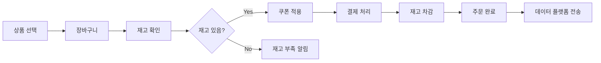

> 📌 참고: 이 문서의 모든 코드는 예시입니다. 정답이 아니며, 다양한 방식으로 구현할 수 있습니다.
> 

## 학습 목표

- 상품 카탈로그와 재고 관리 시스템을 설계할 수 있다
- 주문/결제 프로세스를 모델링할 수 있다
- 선착순 쿠폰 시스템을 설계할 수 있다
- 외부 데이터 플랫폼 연동을 고려한 설계를 할 수 있다

---

### 1.1 핵심 기능 요구사항

## Step 1: 요구사항 분석

```markdown
## 이커머스 핵심 기능
1. 상품 관리
   - 상품 정보 조회 (가격, 재고)
   - 재고 실시간 확인
   - 인기 상품 통계 (최근 3일, Top 5)

2. 주문/결제 시스템
   - 장바구니 기능
   - 재고 확인 및 차감
   - 잔액 기반 결제
   - 쿠폰 할인 적용

3. 쿠폰 시스템
   - 선착순 발급 (한정 수량)
   - 쿠폰 유효성 검증
   - 사용 이력 관리

4. 데이터 연동
   - 주문 데이터 외부 전송
   - 실패 시에도 주문은 정상 처리

```

### 1.2 주문 프로세스 플로우



### ✅ 체크포인트

- [ ]  재고 차감 시점을 명확히 정의했나요?
- [ ]  쿠폰 발급 정책을 정리했나요?
- [ ]  외부 시스템 연동 요구사항을 파악했나요?
    
    ---
    

## Step 2: API 설계

### 2.1 상품 관련 API (예시)

```yaml
# 상품 목록 조회
GET /api/products
Query:
  category: string (optional)
  sort: "price" | "popularity" | "newest"
Response:
  products: [
    {
      productId: string,
      name: string,
      price: number,
      stock: number,
      category: string
    }
  ]

# 인기 상품 조회
GET /api/products/top
Response:
  period: "3days",
  products: [
    {
      rank: number,
      productId: string,
      name: string,
      salesCount: number,
      revenue: number
    }
  ]

```

### 2.2 주문/결제 API (예시)

```yaml
# 주문 생성
POST /api/orders
Request:
  userId: string
  items: [
    {
      productId: string,
      quantity: number
    }
  ]
  couponId: string (optional)
Response:
  orderId: string
  items: [
    {
      productId: string,
      name: string,
      quantity: number,
      unitPrice: number,
      subtotal: number
    }
  ]
  subtotalAmount: number
  discountAmount: number
  totalAmount: number
  status: "PENDING" | "COMPLETED"

# 결제 처리
POST /api/orders/{orderId}/payment
Request:
  userId: string
Response:
  orderId: string
  paidAmount: number
  remainingBalance: number
  status: "SUCCESS" | "FAILED"
  dataTransmission: "SUCCESS" | "FAILED"

```

### 2.3 쿠폰 API (예시)

```yaml
# 쿠폰 발급 (선착순)
POST /api/coupons/{couponId}/issue
Request:
  userId: string
Response:
  userCouponId: string
  couponName: string
  discountRate: number
  expiresAt: string
  remainingQuantity: number

# 보유 쿠폰 조회
GET /api/users/{userId}/coupons
Response:
  coupons: [
    {
      userCouponId: string,
      couponName: string,
      discountRate: number,
      status: "AVAILABLE" | "USED" | "EXPIRED",
      expiresAt: string
    }
  ]

```

### 2.4 에러 코드 정의 (예시)

```jsx
const ErrorCodes = {
  // 상품 관련
  PRODUCT_NOT_FOUND: 'P001',
  INSUFFICIENT_STOCK: 'P002',

  // 주문 관련
  INVALID_QUANTITY: 'O001',
  ORDER_NOT_FOUND: 'O002',

  // 결제 관련
  INSUFFICIENT_BALANCE: 'PAY001',
  PAYMENT_FAILED: 'PAY002',

  // 쿠폰 관련
  COUPON_SOLD_OUT: 'C001',
  INVALID_COUPON: 'C002',
  EXPIRED_COUPON: 'C003',
  ALREADY_USED: 'C004'
}

```

```java
public class ErrorCodes {

    // 상품 관련
    public static final String PRODUCT_NOT_FOUND = "P001";
    public static final String INSUFFICIENT_STOCK = "P002";

    // 주문 관련
    public static final String INVALID_QUANTITY = "O001";
    public static final String ORDER_NOT_FOUND = "O002";

    // 결제 관련
    public static final String INSUFFICIENT_BALANCE = "PAY001";
    public static final String PAYMENT_FAILED = "PAY002";

    // 쿠폰 관련
    public static final String COUPON_SOLD_OUT = "C001";
    public static final String INVALID_COUPON = "C002";
    public static final String EXPIRED_COUPON = "C003";
    public static final String ALREADY_USED = "C004";
}
```

### ✅ 체크포인트

- [ ]  재고 확인 API가 실시간 정보를 제공하나요?
- [ ]  쿠폰 발급 시 수량 체크가 있나요?
- [ ]  외부 전송 실패가 주문을 막지 않나요?

---

## Step 3: 데이터베이스 설계

### 3.1 상품 및 주문 ERD (예시)

```sql
-- 상품 정보
Table products {
  id varchar [pk]
  name varchar
  description text
  price decimal(10,2)
  stock int
  category varchar
  created_at timestamp

  indexes {
    (category)
    (created_at)
  }
}

-- 주문 정보
Table orders {
  id varchar [pk]
  user_id varchar [ref: > users.id]
  total_amount decimal(10,2)
  discount_amount decimal(10,2)
  final_amount decimal(10,2)
  status varchar // PENDING, PAID, CANCELLED
  created_at timestamp
  paid_at timestamp

  indexes {
    (user_id, status)
    (created_at)
  }
}

-- 주문 상세
Table order_items {
  id varchar [pk]
  order_id varchar [ref: > orders.id]
  product_id varchar [ref: > products.id]
  quantity int
  unit_price decimal(10,2)
  subtotal decimal(10,2)

  indexes {
    (order_id)
    (product_id)
  }
}

-- 쿠폰 마스터
Table coupons {
  id varchar [pk]
  name varchar
  discount_rate int // 10, 20, 30 (%)
  total_quantity int
  issued_quantity int
  start_date datetime
  end_date datetime

  indexes {
    (start_date, end_date)
  }
}

-- 사용자 쿠폰
Table user_coupons {
  id varchar [pk]
  user_id varchar [ref: > users.id]
  coupon_id varchar [ref: > coupons.id]
  status varchar // AVAILABLE, USED, EXPIRED
  issued_at timestamp
  used_at timestamp
  expires_at timestamp

  indexes {
    (user_id, status)
    (coupon_id)
    (expires_at)
  }
}

-- 데이터 전송 로그 (Outbox Pattern)
Table data_transmissions {
  id varchar [pk]
  order_id varchar [ref: > orders.id]
  payload json
  status varchar // PENDING, SUCCESS, FAILED
  attempts int
  created_at timestamp
  sent_at timestamp

  indexes {
    (status, created_at)
    (order_id)
  }
}

```

### 3.2 통계 쿼리 (예시)

```sql
-- 최근 3일 인기 상품 Top 5
SELECT
  p.id,
  p.name,
  SUM(oi.quantity) as sales_count,
  SUM(oi.subtotal) as revenue
FROM products p
JOIN order_items oi ON p.id = oi.product_id
JOIN orders o ON oi.order_id = o.id
WHERE o.status = 'PAID'
  AND o.paid_at >= DATE_SUB(NOW(), INTERVAL 3 DAY)
GROUP BY p.id, p.name
ORDER BY sales_count DESC
LIMIT 5;

-- 재고 차감 (동시성 고려)
UPDATE products
SET stock = stock - :quantity
WHERE id = :productId
  AND stock >= :quantity;

```

### ✅ 체크포인트

- [ ]  재고 동시성 제어를 고려했나요?
- [ ]  쿠폰 발급 수량 관리 방법이 있나요?
- [ ]  통계 쿼리 성능을 위한 인덱스가 있나요?

---

## Step 4: Mock 서버 구현

### 4.1 JSON Server를 활용한 Mock API (예시)

```json
{
  "products": [
    {
      "id": "P001",
      "name": "노트북",
      "price": 890000,
      "stock": 10,
      "category": "전자제품"
    },
    {
      "id": "P002",
      "name": "키보드",
      "price": 120000,
      "stock": 50,
      "category": "주변기기"
    }
  ],
  "orders": [],
  "coupons": [
    {
      "id": "COUPON_10",
      "name": "10% 할인쿠폰",
      "discountRate": 10,
      "totalQuantity": 100,
      "issuedQuantity": 0
    }
  ],
  "users": [
    {
      "id": "user1",
      "balance": 1000000
    }
  ]
}

```

```bash
# JSON Server 실행
npx json-server --watch db.json --port 3000

# API 테스트
# GET <http://localhost:3000/products>
# POST <http://localhost:3000/orders>

```

💡 **Tip**: JSON Server는 POST, PUT, DELETE 요청 시 db.json을 자동으로 업데이트합니다.
단, 복잡한 비즈니스 로직(재고 차감, 쿠폰 수량 체크 등)은 구현할 수 없으므로 단순 CRUD만 테스트하세요.

### 4.2 간단한 Express Mock 서버 (예시)

```jsx
// mock-server.js
const express = require('express');
const app = express();
app.use(express.json());

// 간단한 데이터
const products = {
  'P001': { name: '노트북', price: 890000, stock: 10 }
};

// 상품 조회
app.get('/api/products', (req, res) => {
  res.json({
    products: Object.entries(products).map(([id, data]) => ({
      productId: id,
      ...data
    }))
  });
});

// 주문 생성
app.post('/api/orders', (req, res) => {
  res.json({
    orderId: 'ORDER-' + Date.now(),
    items: req.body.items,
    totalAmount: 890000,
    status: 'PENDING'
  });
});

// 쿠폰 발급
app.post('/api/coupons/:id/issue', (req, res) => {
  res.json({
    userCouponId: 'UC-' + Date.now(),
    couponName: '10% 할인',
    discountRate: 10,
    remainingQuantity: 95
  });
});

app.listen(3000, () => {
  console.log('Mock server running on <http://localhost:3000>');
});

```

### 4.2 간단한 Spring Boot Mock 서버 (예시)

```java
// ProductController.java
import org.springframework.web.bind.annotation.*;
import java.util.*;

@RestController
@RequestMapping("/api/products")
public class ProductController {

    // 간단한 메모리 데이터
    private static final Map<String, Map<String, Object>> PRODUCTS = Map.of(
        "P001", Map.of("name", "노트북", "price", 890000, "stock", 10, "category", "전자제품"),
        "P002", Map.of("name", "키보드", "price", 120000, "stock", 50, "category", "주변기기")
    );

    // 상품 목록 조회 (GET /api/products)
    @GetMapping
    public Map<String, Object> getProducts() {
        List<Map<String, Object>> list = new ArrayList<>();
        for (var entry : PRODUCTS.entrySet()) {
            Map<String, Object> product = new HashMap<>(entry.getValue());
            product.put("productId", entry.getKey());
            list.add(product);
        }
        return Map.of("products", list);
    }
}

// OrderController.java
import org.springframework.web.bind.annotation.*;
import java.util.*;

@RestController
@RequestMapping("/api/orders")
public class OrderController {

    // 주문 생성 (POST /api/orders)
    @PostMapping
    public Map<String, Object> createOrder(@RequestBody Map<String, Object> body) {
        Map<String, Object> response = new HashMap<>();
        response.put("orderId", "ORDER-" + System.currentTimeMillis());
        response.put("items", body.get("items"));
        response.put("totalAmount", 890000);
        response.put("status", "PENDING");
        return response;
    }
}
```

### ✅ 체크포인트

- [ ]  Mock API가 정상적으로 응답하나요?
- [ ]  Postman이나 curl로 API를 테스트했나요?
- [ ]  응답 형식이 API 명세와 일치하나요?

---

## 📋 최종 체크리스트

### 필수 과제

- [ ]  상품 카탈로그 API 설계
- [ ]  주문/결제 프로세스 정의
- [ ]  쿠폰 시스템 설계
- [ ]  재고 관리 방안 수립
- [ ]  ERD 다이어그램 (Outbox 포함)
- [ ]  Mock 서버 (재고/쿠폰 관리)

---

## 💡 이커머스 특화 팁

### 재고 관리 고려사항

1. **정확성**: 실시간 재고 반영
2. **동시성**: 동시 구매 시 재고 보장
3. **복구**: 결제 실패 시 재고 복원

### 쿠폰 시스템 주의점

1. **선착순**: 정확한 수량 제어
2. **중복 방지**: 1인 1매 제한
3. **유효성**: 만료/사용 체크

### 참고 자료

- [REST API Best Practices](https://restfulapi.net/rest-api-best-practices/)
- [API Design Guide - Microsoft](https://learn.microsoft.com/en-us/azure/architecture/best-practices/api-design)
- [Database Design Tutorial](https://www.sqltutorial.org/sql-database-design/)